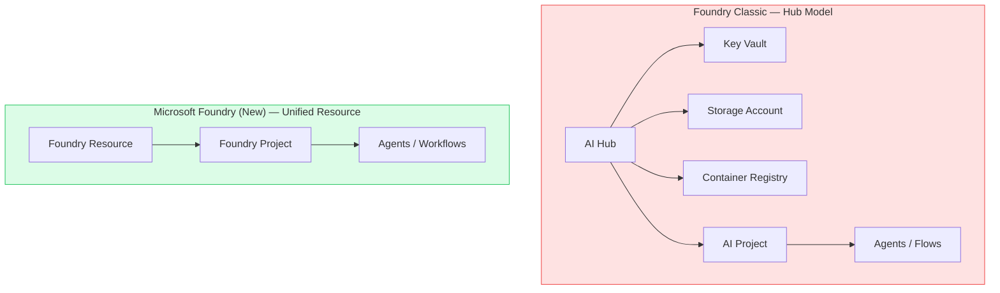
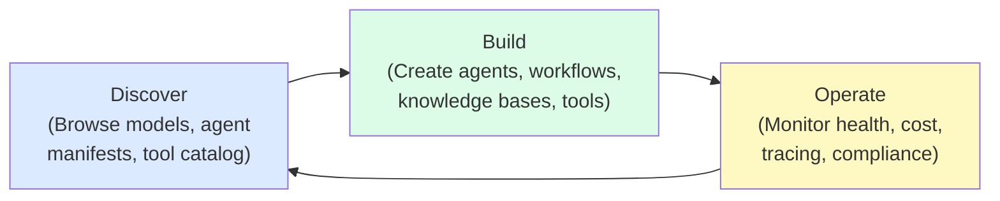
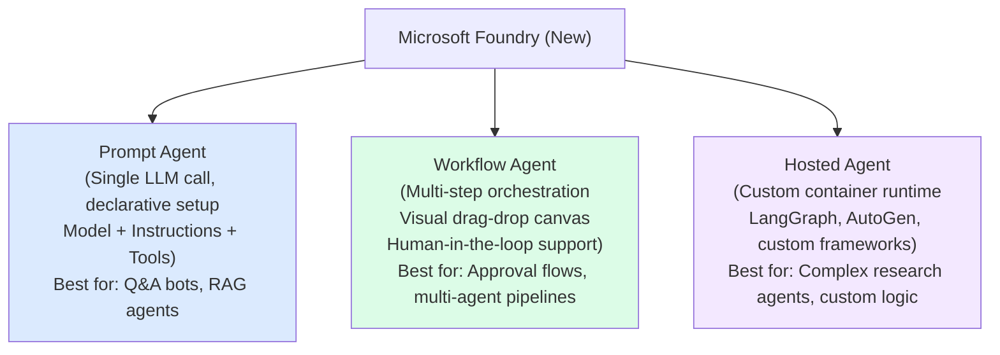
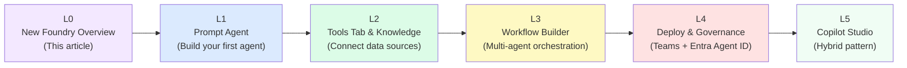

# L0: Microsoft Foundry (New) — What Changed and Why It Matters

## 📋 Agenda

**Estimated reading time:** ~15 minutes | Conceptual Overview

### Learning outcomes:

- ✅ **Distinguish** between Foundry Classic (Hub model) and Microsoft Foundry (New) architecturally
- ✅ **Navigate** the new portal correctly and activate the New Foundry experience
- ✅ **Identify** the three agent types in New Foundry and when to use each
- ✅ **Explain** why the platform shifted from Hub-and-Project to a unified resource model

### Prerequisites:

- Azure account with active subscription
- Basic familiarity with AI Agent concept (no prior Foundry experience required)

---

## 1. Problem Statement

### 1.1. Why the Old Model Had to Change

The previous platform (Azure AI Studio / Foundry Classic) was built on a **Hub-and-Project** hierarchy:

```
Azure Subscription
  └── AI Hub (governance boundary)
        ├── Key Vault (secrets management)
        ├── Storage Account (artifacts)
        ├── Container Registry (model images)
        └── AI Project (workspace)
              └── Agents, Deployments, Flows...
```

This created compounding friction:

- Creating one agent required provisioning 4–5 separate Azure resources before writing a single instruction.
- Developers across different teams managed fragmented SDKs (`azure-ai-ml`, `azure-ai-generative`, `azure-ai-inference`) with incompatible APIs.
- Multi-agent orchestration was unsupported natively — teams resorted to stitching Logic Apps, Azure Functions, and Power Automate into brittle pipelines.
- There was no governance layer: agents had no identity, no audit trail, and no lifecycle policy.

### 1.2. What Microsoft Foundry (New) Solves

Microsoft Foundry (New) consolidates the entire agentic lifecycle — build, evaluate, deploy, govern — into a **single unified resource** with an agent-first portal experience.

---

## 2. Architecture Comparison

### 2.1. Resource Model



| Dimension | Foundry Classic | Microsoft Foundry (New) |
|---|---|---|
| **Primary resource** | AI Hub (complex, many dependencies) | Foundry Resource (single, unified) |
| **Project model** | Hub-dependent AI Projects | Standalone Foundry Projects |
| **Agent capability** | Single-agent, limited tools | Multi-agent orchestration + Visual Workflow Builder |
| **SDK** | Multiple fragmented packages | Unified `azure-ai-projects` 2.x |
| **Identity/Governance** | No agent identity | Entra Agent ID for every agent |
| **Memory** | Session-only | Short-term + long-term persistent memory |
| **Tools/Connectors** | 4 basic tools in dropdown | Tools Tab — 1,400+ connectors, MCP native |

### 2.2. Portal Navigation — New Mental Model

The new portal (at `ai.azure.com`) organizes around three modes instead of resource-specific menus:



:::tip Bật "New Foundry" experience
Khi vào `ai.azure.com`, kiểm tra banner phía trên cùng. Nếu thấy toggle **"New Foundry"** — bật ON. Nếu không thấy, bạn đang ở Foundry Classic. Hai experience tồn tại song song, agents tạo ở Classic **không** hiển thị trong New Foundry và ngược lại.
:::

---

## 3. Three Agent Types in New Foundry

This is the most important conceptual shift. New Foundry classifies agents into three distinct types, each serving a different use case:



### 3.1. Definition Anatomy

**Prompt Agent** (*Agent Lời nhắc*):
- *Prompt* — a structured instruction to an LLM
- *Agent* — an entity that perceives input and takes action
- A Prompt Agent = the simplest form: one LLM, one set of instructions, one or more tools. No orchestration.

**Workflow Agent** (*Agent Luồng công việc*):
- *Workflow* — a defined sequence of steps
- Designed for multi-step, multi-agent processes — built visually in the portal
- Can include branching logic, human approval gates, variable passing between agents

**Hosted Agent** (*Agent Được lưu trữ*):
- *Hosted* — your custom code runs inside Foundry's managed infrastructure
- You bring the framework (LangGraph, AutoGen); Foundry provides the runtime, scaling, and monitoring
- This is the "pro-code escape hatch" for teams that outgrow the visual builder

---

## 4. Learning Path for This Series

This documentation series (L0–L5) covers the **Low-Code path** targeting Business Analysts, Product Managers, and IT Admins. No Python required.



:::info Note for Foundry Classic users
Nếu bạn đã có agents được tạo trên Foundry Classic (Hub model), chúng vẫn hoạt động bình thường. Không cần migrate ngay. Series này tập trung hướng dẫn xây dựng mới trên New Foundry — Microsoft khuyến nghị cho tất cả development mới từ Q3 2025 trở đi.
:::

---

## 5. Discussion

> **"Tại sao Microsoft không update in-place mà lại tạo experience mới chạy song song Classic?"**
>
> *Trade-off of backward compatibility.* Kiến trúc Classic (Hub model) quá khác biệt về resource topology so với Unified Foundry Resource. Việc migrate tự động có thể phá vỡ existing workloads của hàng ngàn enterprise customers đang chạy production. Microsoft chọn chiến lược **side-by-side coexistence**: Classic vẫn fully supported trong khi New Foundry nhận toàn bộ investment về features mới. Đây là pattern phổ biến trong platform evolution: Azure Classic VMs → Azure Resource Manager cũng đi theo con đường này.

---

**Next:** L1 — Building Your First Prompt Agent →

---

*Made by Anh Tu - Share to be shared*
