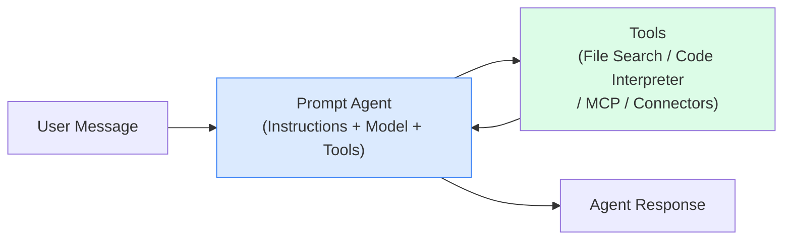
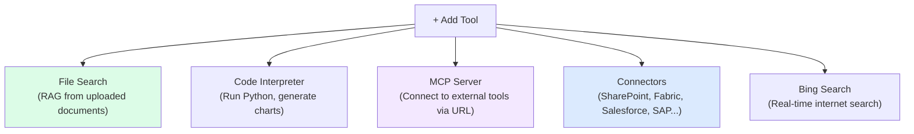
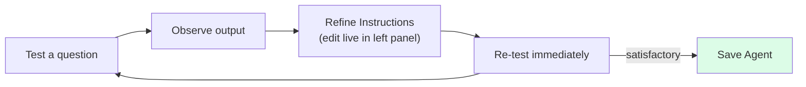

# L1: Building Your First Prompt Agent

## 📋 Agenda

**Estimated reading time:** ~20 minutes | Hands-on Portal Lab

### Learning outcomes:

- ✅ **Navigate** the New Foundry portal (Build → Agents section)
- ✅ **Create** a fully functional Prompt Agent using only the portal UI
- ✅ **Configure** Instructions, Model deployment, and basic Tools
- ✅ **Test** and iterate on agent behavior in the Playground

### Prerequisites:

- Azure account with active subscription
- Microsoft Foundry project created (see L0 for New Foundry toggle)
- A model deployed in your project (e.g., GPT-4o)
- No Python, no SDK required

:::info Who is this for?
Business Analysts, Product Managers, IT Admins, and Power Users who want to build and manage AI Agents without a programming background.
:::

---

## 1. Problem Statement

### 1.1. Gap between idea and implementation

Non-technical teams identify the most valuable AI use cases — customer support automation, internal HR Q&A, policy lookup — but have historically depended on developers to implement them. The cycle: business requirement → developer backlog → sprint planning → implementation creates weeks of delay for what is fundamentally a configuration problem.

### 1.2. Solution: Prompt Agent as Configuration

A Prompt Agent in Microsoft Foundry (New) is entirely defined by three configuration items:

- **Instructions** — the system prompt that defines agent behavior
- **Model** — the LLM that processes requests
- **Tools** — capabilities the agent can invoke (search, code execution, connectors)

No infrastructure provisioning. No SDK. No environment setup.

---

## 2. What Is a Prompt Agent?

### 2.1. Technical Definition

A **Prompt Agent** (*Agent Lời nhắc*) is a stateless, single-LLM agent declaratively defined by a model selection, a system prompt, and an optional set of tools. It processes one conversational turn at a time, invoking tools as needed, and returns a response.



### 2.2. Definition Anatomy

| Term | Vietnamese Meaning | Technical Role |
|---|---|---|
| **Prompt** | Lời nhắc, hướng dẫn | The system instruction that shapes agent behavior and persona |
| **Agent** | Tác nhân | An entity that takes action based on input — in this case, generates text and calls tools |
| **Declarative** | Khai báo | You define *what* the agent should do (in text), not *how* to implement it in code |
| **Stateless** | Không lưu trạng thái | Each conversation thread is isolated; no memory across sessions by default (unless Memory tool is added) |

---

## 3. Lab: Creating a Prompt Agent

### 3.1. Navigate to Agents

```
ai.azure.com
  → Verify "New Foundry" toggle is ON (portal banner)
  → Select your Foundry Project
  → Left navigation: Build section → "Agents"
  → Click "Create agent"
```

:::warning Toggle kiểm tra
Nếu bạn thấy menu "Hub", "Prompt Flow" hoặc "Deployments" ở sidebar bên trái — bạn đang ở Foundry Classic, không phải New Foundry. Tìm toggle ở top banner và bật ON.
:::

### 3.2. Configure Agent Identity

The **Create agent** panel displays these configuration areas:

```
┌─────────────────────────────────────────────────────────────┐
│  Agent Name       [Customer Support Bot              ]      │
│  Model            [gpt-4o ▼]                                │
│  Instructions     [Text area ─ system prompt         ]      │
│                                                             │
│  Tools & Knowledge     [+ Add ▼]                            │
│  Memory                [Off ▼]                              │
└─────────────────────────────────────────────────────────────┘
```

| Field | Sample Value | Notes |
|---|---|---|
| **Agent Name** | `Customer Support Bot` | Display name, editable later |
| **Model** | `gpt-4o` | Select from deployed models in your project |
| **Instructions** | *(see below)* | System prompt — defines agent identity and constraints |

**Sample Instructions — Customer Support Agent:**

```
You are a friendly customer support representative for ABC Technology.

Responsibilities:
- Answer questions about products and services
- Guide customers through return and warranty processes
- Escalate to a human agent for complex cases

Communication style:
- Professional, polite, and helpful
- Respond in Vietnamese when the customer writes in Vietnamese
- Keep responses under 200 words

Constraints:
- Do not provide specific financial or legal advice
- Do not make promises outside company policy
- If uncertain, ask the customer to call hotline 1800-xxxx
```

:::tip Instructions là System Prompt
Trong thuật ngữ kỹ thuật, Instructions chính là **System Prompt** — đoạn hướng dẫn được gửi đến LLM trước mỗi conversation để định hình persona và hành vi. Đây là "linh hồn" của agent — viết càng rõ ràng, agent càng hoạt động đúng ý.
:::

### 3.3. Add Tools

Click **"+ Add"** next to Tools & Knowledge. In New Foundry, this opens the **Tools Tab** — not a simple dropdown:



**For a Customer Support Bot → select "File Search":**

1. Click **"File Search"**
2. Panel expands: **"Knowledge"** section appears
3. Click **"+ Add a data source"**
4. Choose: **"Upload files"** (for quick start) or **"Azure AI Search"** (for production)
5. Upload your policy documents (PDF, Word, Markdown, TXT)
6. Wait for indexing to complete (30 seconds to 3 minutes)
7. Click **"Save"**

:::info Sự khác biệt với Classic
Trong Foundry Classic, bạn phải tạo Vector Store riêng rồi attach vào agent. Trong New Foundry, Knowledge management được tích hợp trực tiếp vào agent configuration — ít bước hơn, ít context-switching hơn.
:::

### 3.4. Test in Playground

Click **"Playground"** (top navigation, or inline button). The Playground in New Foundry:

```
┌─────────────────────────────────────────────────────────────┐
│  Agent Config (left panel)        Chat (right panel)        │
│  ─────────────────────────────    ─────────────────────     │
│  Instructions (editable live)     [Type a message...]       │
│                                                             │
│  Model: gpt-4o                    🔄 Clear chat             │
│  Temperature: 0.7                                           │
│  Max tokens: 4096                 Tool call trace ▼         │
│  Tools: [File Search ✓]                                     │
└─────────────────────────────────────────────────────────────┘
```

**Test the agent:**

| Input | Expected behavior |
|---|---|
| "Hello, what can you help me with?" | Greeting + service introduction |
| "What is your return policy?" | Answer from uploaded documents |
| "Can you predict stock prices?" | Polite refusal — outside scope |
| "I need to speak to a human" | Escalation response per instructions |

### 3.5. Iterating on Instructions

The test-refine cycle is the core workflow for non-technical builders:



**Common refinement patterns:**

```
Agent answers too long
  → Add to Instructions: "Keep responses under 100 words."

Agent fabricates information not in documents
  → Add: "Only answer based on provided knowledge documents."

Agent is off-topic
  → Add: "Only answer questions about [company] products and services."

Agent tone too formal
  → Add: "Use a conversational, friendly tone as if speaking to a friend."
```

### 3.6. Save and Retrieve Agent ID

Click **"Save"**. Your agent now has:

- A unique **Agent ID** in Entra Agent ID (new in New Foundry — see L4 for governance details)
- A REST API endpoint for programmatic access
- An entry in the Foundry Control Plane for monitoring

```
Build → Agents → [Your Agent] → Properties (right panel)
  → Agent ID: agt_xxxxxxxxxxxx
  → Endpoint: https://your-project.foundry.azure.com/agents/agt_xxxx
```

:::tip Agent ID format thay đổi
Trong Foundry Classic, Agent ID có dạng `asst_xxxxxxxxxx` (OpenAI Assistants format). Trong New Foundry, format mới là `agt_xxxxxxxxxxxx` với Entra Agent ID backing. Đây là sự thay đổi quan trọng nếu bạn có code cũ hardcode Agent ID.
:::

---

## 4. Configuration Parameters

| Parameter | Range | Effect | Recommended |
|---|---|---|---|
| **Temperature** | 0.0 – 2.0 | Low = consistent; High = creative | 0.7 for support bots |
| **Max tokens** | 256 – 16384 | Controls max response length | 500–1000 for chatbots |
| **Top P** | 0.0 – 1.0 | Diversity of word sampling | Leave at 0.95 |

---

## 5. Discussion

> **"Prompt Agent vs a ChatGPT Custom GPT — what is the actual difference?"**
>
> *Both solve the same surface problem but differ fundamentally in deployment context.* A Custom GPT runs inside OpenAI's infrastructure, limited to OpenAI's tool ecosystem, and governed by OpenAI's terms. A Foundry Prompt Agent runs inside your Azure subscription, governed by your organization's Conditional Access policies, authenticated via Microsoft Entra, and auditable via the Foundry Control Plane. For enterprise use cases — especially where data sovereignty, compliance, or integration with internal systems (SharePoint, SAP, Dynamics) matters — a Foundry agent is not equivalent to a Custom GPT. They are structurally different products at the same user experience surface.

---

**Next:** L2 — Tools Tab & Knowledge Management →

---

*Made by Anh Tu - Share to be shared*
