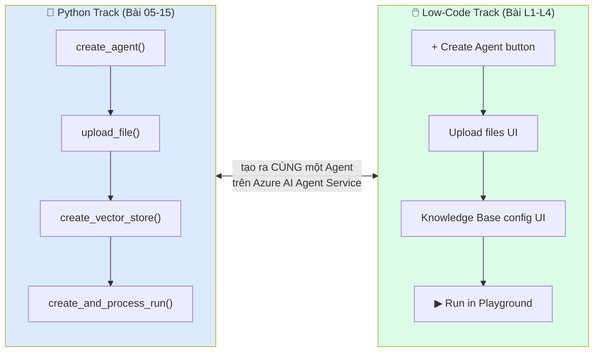
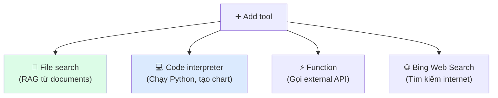
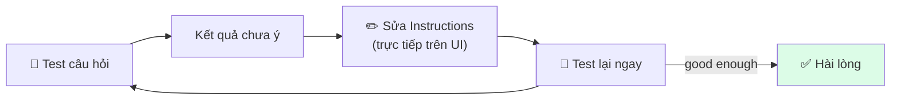

# Bài L1: Agent Builder Portal — Tạo Agent Không Cần Code

## 📋 Agenda

**Thời gian đọc ước tính:** ~20 phút | 🖱️ Thực hành trên Portal

### Sau bài này, bạn sẽ:
- ✅ **Điều hướng** được Azure AI Foundry Portal thành thạo
- ✅ **Tạo** AI Agent hoàn chỉnh chỉ bằng click và gõ text
- ✅ **Cấu hình** Instructions, chọn Model, gắn Tools qua UI
- ✅ **Test** agent trong Playground ngay trên trình duyệt

### Yêu cầu:
- 🔹 Có tài khoản Azure (bài Bài 02 đã hướng dẫn tạo)
- 🔹 Đã có Azure AI Foundry Hub + Project (Bài 02)
- 🔹 KHÔNG cần Python, KHÔNG cần SDK

:::info Dành cho ai?
Bài này dành cho học viên **Business Analyst, Product Manager, IT Admin, Power User** — những người muốn build và quản lý AI Agent mà không cần background lập trình. Nếu bạn đã học qua Bài 05 (Python), bài này sẽ giúp bạn thấy "hậu trường" của những gì code đã làm.
:::

---

## ❓ Vấn đề & Giải pháp

**Rào cản của Python track (Bài 05-15):**
- Cần biết Python, SDK, và cấu trúc code
- Cần setup môi trường (venv, .env, az login)
- Khó chia sẻ với team non-technical để test

**Low-Code Path giải quyết:**
- Tạo agent ngay trên trình duyệt — zero setup
- Chia sẻ knowledge base chỉ bằng upload file
- Deploy lên Teams chỉ bằng vài click

---

## 📖 So sánh: Python Track vs Low-Code Track



**Điểm mấu chốt:** Dù dùng Python hay Portal, kết quả đều là **cùng một Agent** chạy trên Azure AI Agent Service với cùng một REST API.

---

## 🖱️ Hướng dẫn từng bước: Tạo Agent trên Portal

### Bước 1: Vào Agents Section

```
🌐 Mở trình duyệt → https://ai.azure.com
  → Đăng nhập bằng tài khoản Azure
  → Chọn đúng Project (tạo ở Bài 02)
  → Menu trái → "Agents"
  → Click "➕ Create agent"
```

:::tip Không thấy menu "Agents"?
Kiểm tra: Project của bạn đã được kết nối với một Model Deployment chưa? Vào **Models + endpoints** → nếu chưa có GPT-4o → Deploy một deployment mới theo hướng dẫn Bài 02.
:::

---

### Bước 2: Cấu hình Agent Identity

Màn hình **"Create agent"** gồm 4 khu vực chính:

```
┌─────────────────────────────────────────────────────┐
│  [1] Agent Name    [Customer Support Bot]           │
│  [2] Deployment    [gpt-4o ▼]                       │
│  [3] Instructions  [Text area — system prompt]      │
│  [4] Tools         [+ Add tool ▼]                   │
└─────────────────────────────────────────────────────┘
```

**Điền thông tin:**

| Field | Giá trị mẫu | Ghi chú |
|---|---|---|
| **Agent Name** | `Customer Support Bot` | Tên hiển thị, có thể đổi sau |
| **Deployment** | `gpt-4o` | Chọn từ dropdown — model đã deploy ở Bài 02 |
| **Instructions** | *(xem bên dưới)* | System prompt — linh hồn của agent |

**Instructions mẫu — Customer Support Bot:**

```
Bạn là nhân viên hỗ trợ khách hàng thân thiện của công ty ABC Technology.

Nhiệm vụ:
- Trả lời câu hỏi về sản phẩm và dịch vụ
- Hướng dẫn quy trình đổi trả, bảo hành
- Chuyển tiếp đến bộ phận chuyên môn khi cần

Phong cách:
- Thân thiện, lịch sự, chuyên nghiệp
- Luôn xưng "bạn" với khách hàng
- Trả lời bằng tiếng Việt
- Tối đa 200 từ mỗi câu trả lời

Giới hạn:
- Không cung cấp thông tin tài chính hoặc pháp lý cụ thể
- Không hứa hẹn điều gì ngoài phạm vi chính sách công ty
- Nếu không chắc chắn → đề nghị khách gọi hotline 1800-xxxx
```

---

### Bước 3: Gắn Tools

Click **"+ Add tool"** để hiện menu dropdown:



**Với Customer Support Bot → chọn "File search":**

1. Click **"File search"**
2. Panel mới xuất hiện: **"Knowledge Base"**
3. Click **"+ New vector store"**
4. Đặt tên: `company-policies-kb`
5. Click **"Upload files"**
6. Chọn files từ máy tính (PDF, Word, Markdown, TXT)
7. Click **"Upload and index"** → đợi thanh progress hoàn thành
8. Click **"Save"**

:::info Indexing mất bao lâu?
Thường 30 giây đến 2 phút tùy kích thước file. Trong lúc đợi, màn hình hiển thị badge "In progress". Khi chuyển sang "Completed" → sẵn sàng dùng.
:::

---

### Bước 4: Test trong Playground

Click **"Open in playground"** ở góc trên phải.

Màn hình Playground gồm:

```
┌─────────────────────────────────────────────────────────┐
│  ⚙️ Configuration (trái)    │  💬 Chat (phải)           │
│  ─────────────────────────  │  ─────────────────────    │
│  Model: gpt-4o              │                           │
│  Temperature: 1.0 [─────]   │  [Send a message...]      │
│  Max tokens: 4096           │                           │
│  Instructions (editable)    │  🔄 Clear chat            │
└─────────────────────────────────────────────────────────┘
```

**Test thử:**

| Bạn gõ | Agent nên trả lời |
|---|---|
| "Xin chào, bạn có thể giúp gì cho tôi?" | Lời chào + giới thiệu |
| "Chính sách đổi trả của công ty là gì?" | Thông tin từ documents đã upload |
| "Phí ship bao nhiêu?" | Nội dung từ file chính sách vận chuyển |
| "Bạn có thể thăng cổ phiếu cho tôi không?" | Từ chối lịch sự, ngoài phạm vi |

---

### Bước 5: Tinh chỉnh Instructions

**Iteration cycle trong Playground — đây là superpower của low-code:**



**Tips tinh chỉnh phổ biến:**

```
Nếu agent trả lời quá dài:
  → Thêm vào Instructions: "Trả lời tối đa 100 từ"

Nếu agent hay bịa thông tin:
  → Thêm: "Chỉ trả lời dựa trên tài liệu đã được cung cấp"

Nếu agent quá cứng nhắc:
  → Điều chỉnh Temperature: tăng từ 1.0 lên 1.2

Nếu agent lạc chủ đề:
  → Thêm: "Chỉ trả lời câu hỏi liên quan đến sản phẩm và dịch vụ của công ty"
```

---

### Bước 6: Save Agent

Click **"Save"** ở góc trên. Agent của bạn giờ đã:
- Có một **Agent ID** duy nhất trên Azure
- Accessible qua **REST API**
- Sẵn sàng để Deploy (Bài L3)

:::tip Layy Agent ID ở đâu?
Agents → click vào agent vừa tạo → sidebar phải → **Properties** → copy **Agent ID**. ID này dùng để gọi agent qua API hoặc SDK Python (bài code track).
:::

---

## 📖 So sánh: Temperature & Tuning Params

| Parameter | Thấp | Cao | Khuyến nghị |
|---|---|---|---|
| **Temperature** (0-2) | Nhất quán, literal | Sáng tạo, đa dạng | 0.7-1.0 cho support bot |
| **Max Tokens** | Trả lời ngắn | Trả lời dài | 500-1000 cho chatbot |
| **Top P** (0-1) | Conservative | Diverse | Để mặc định 0.95 |

---

## 💬 Câu hỏi thảo luận

> **"Agent tạo qua Portal và agent tạo bằng Python SDK — cái nào 'thật' hơn?"**  
>
> *Cả hai đều như nhau!* Portal là giao diện đồ họa của **chính API** mà SDK đang gọi phía sau. Khi bạn click "Create agent" trên portal, thực chất Azure đang: tạo HTTP POST đến `agents/` endpoint với JSON body chứa model, instructions, tools — y hệt điều Python SDK làm trong `create_agent()`. Không có cái nào "thật hơn" — chỉ là cách tiếp cận khác nhau cho cùng kết quả.

---

**Bài tiếp theo:** Bài L2 — Knowledge Base UI →

---

*Made by Anh Tu - Share to be shared*
