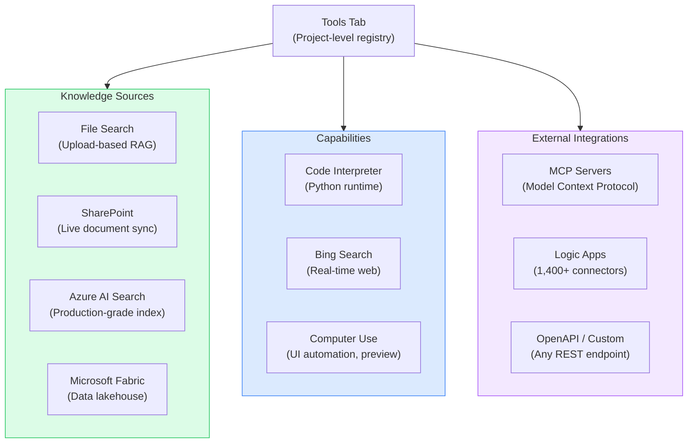
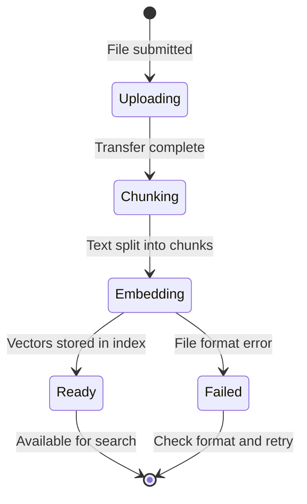
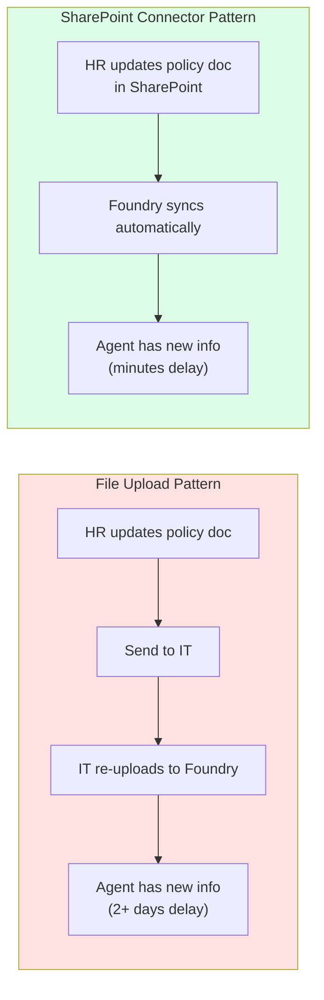
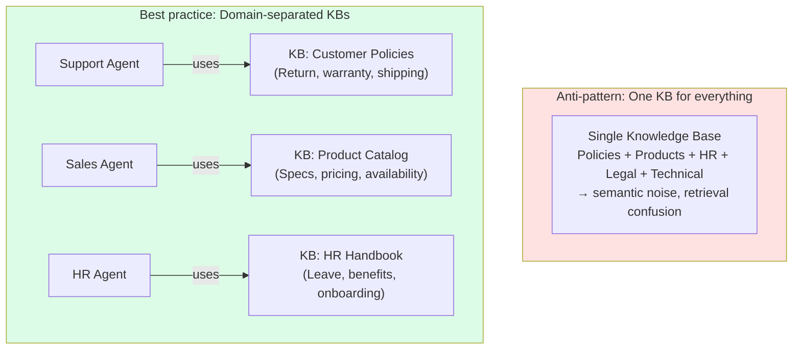
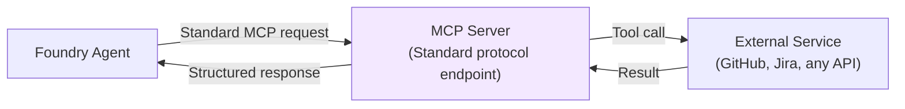
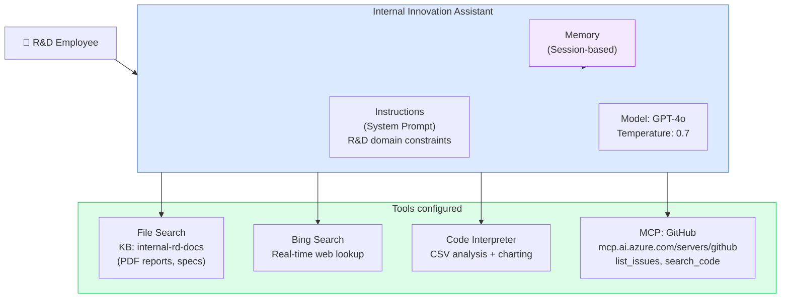
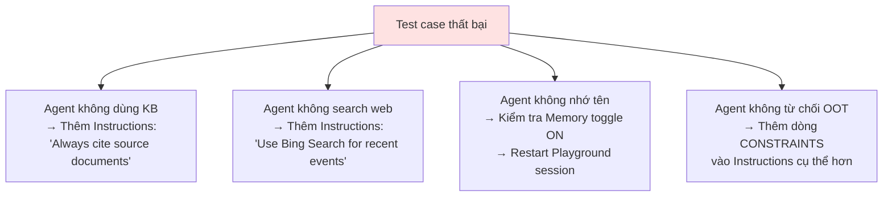

# L2: Tools Tab & Knowledge Management

## 📋 Agenda

**Estimated reading time:** ~25 minutes | Hands-on Portal Lab

### Learning outcomes:

- ✅ **Navigate** the Tools Tab and understand its connector ecosystem
- ✅ **Configure** knowledge sources: file upload, SharePoint native connector, Azure AI Search
- ✅ **Connect** an MCP server to an agent without writing code
- ✅ **Design** a knowledge base structure appropriate for your organization

### Prerequisites:

- Completed L1 — have a Prompt Agent created and tested

---

## 1. Problem Statement

### 1.1. The Limited Tool Model Is Gone

In Foundry Classic, adding tools meant choosing from a 4-item dropdown:
`File Search | Code Interpreter | Function | Bing Search`

This was sufficient for prototype work. Production agents in enterprise environments need to connect to:

- SharePoint document libraries that update automatically (no manual upload)
- Internal APIs authenticated via Entra ID
- External data feeds via standardized protocols (MCP)
- Cross-department data in Azure Fabric or SAP

The old dropdown model required developers to build custom connectors for each integration. New Foundry replaces this with the **Tools Tab** — a centralized management surface with 1,400+ pre-built connectors and native MCP support.

---

## 2. What Is the Tools Tab?

### 2.1. Technical Definition

The **Tools Tab** (*Tab Công cụ*) is the centralized management interface in Microsoft Foundry (New) where you discover, configure, and govern all tool integrations available to an agent. It separates tool configuration from agent configuration — tools are reusable across multiple agents in the same project.



### 2.2. Glossary & Vocabulary

| Term | Vietnamese Meaning & Explanation |
|---|---|
| **MCP (Model Context Protocol)** | Giao thức chuẩn để kết nối AI model với external tools — do Anthropic khởi xướng, Microsoft tích hợp native vào Foundry |
| **Connector** | Bộ kết nối sẵn có với một dịch vụ cụ thể (SharePoint, SAP, Salesforce) — thay thế việc tự viết integration code |
| **RAG (Retrieval-Augmented Generation)** | Kỹ thuật bổ sung context từ tài liệu bên ngoài vào LLM để trả lời dựa trên dữ liệu thực |
| **Vector Index** | Cơ sở dữ liệu lưu trữ document embeddings để tìm kiếm ngữ nghĩa (semantic search) |
| **Chunking** | Quá trình chia nhỏ tài liệu thành các đoạn (chunks) trước khi embed |

---

## 3. Lab A: Knowledge Management

### 3.1. Three Knowledge Source Options

New Foundry offers three distinct approaches to connecting knowledge:

| Option | Best For | Update Mechanism |
|---|---|---|
| **File Upload** | Quick prototyping, static documents | Manual re-upload |
| **SharePoint Connector** | Org documents that change frequently | Live sync with SharePoint |
| **Azure AI Search** | Large-scale, production-grade search | Managed indexer pipeline |

### 3.2. Option 1 — File Upload (Quick Start)

```
Build → Agents → [Your Agent] → Knowledge section
  → "Add a data source"
  → "Upload files"
  → Drag-and-drop files or click Browse
  → Wait for indexing (progress badge)
```

**Supported formats:**

| Format | Use Case | Notes |
|---|---|---|
| `.pdf` | Policies, reports, manuals | Supports scanned PDF via OCR |
| `.docx` | Word documents | Preserves heading structure |
| `.pptx` | Presentation slides | Extracts text from all slides |
| `.md` | Technical documentation | Best format for structured content |
| `.txt` | FAQ, plain text | Fastest to index |
| `.json` | Structured data | Good for key-value FAQ data |

:::warning Formats not supported
`.xlsx`, `.csv` — for tabular data analysis, use **Code Interpreter** tool instead of File Search. File Search is optimized for prose documents, not spreadsheet data.
:::

**Indexing lifecycle:**



:::caution No automatic versioning
New Foundry does not maintain document versions. If you upload a new version of a policy document without deleting the old one, both versions co-exist in the index — the agent may retrieve outdated information. Always delete the old file before uploading a revised version.
:::

### 3.3. Option 2 — SharePoint Connector (Recommended for Production)

This is the most significant improvement over Foundry Classic for enterprise teams:

```
Build → Agents → [Your Agent] → Knowledge section
  → "Add a data source"
  → "SharePoint"
  → Authenticate with your M365 account
  → Browse: Select SharePoint site → Document Library → Folder
  → Configure sync frequency: Real-time / Daily / Manual
  → Save
```

**Advantage over File Upload:**



### 3.4. Knowledge Base Design Pattern



**Naming convention:**

| Good | Avoid |
|---|---|
| `customer-support-policies-2025` | `kb1` |
| `product-catalog-electronics` | `my-knowledge-base` |
| `hr-employee-handbook-v3` | `docs` |

---

## 4. Lab B: Connecting an MCP Server

Model Context Protocol (MCP) is the biggest new capability in New Foundry's Tools Tab. It allows any agent to connect to any external tool or data source that exposes an MCP-compliant endpoint — without custom integration code.

### 4.1. What Is MCP?



MCP acts as a **universal adapter** (*bộ chuyển đổi toàn năng*): instead of writing a custom function for each external API, you connect to a pre-built MCP server that already handles authentication, error handling, and data formatting.

### 4.2. Connect an MCP Server

```
Build → Agents → [Your Agent] → Tools section
  → "+ Add"
  → "Custom" → "Model Context Protocol (MCP)" → "Create"
  → Fill in:
      Server Label: github-issues
      Server URL: https://mcp.ai.azure.com/servers/github
      Authentication: Microsoft Entra ID
  → Click "Connect"
  → Verify: server appears in Tools list with green status
```

:::tip Managed vs Custom MCP
Microsoft provides **hosted MCP servers** at `mcp.ai.azure.com` for common services (GitHub, Azure DevOps, etc.) — these are pre-authenticated and maintained by Microsoft. For custom internal APIs, your team can host a private MCP server and provide the URL.
:::

### 4.3. Manage Exposed Tools

Once an MCP server is connected, you can control which tools the agent can call:

```
Tools Tab → [MCP Server Name] → "Manage tools"
  → Toggle individual tools ON/OFF
  → Example: GitHub MCP exposes:
      ✅ list_issues (enabled)
      ✅ create_comment (enabled)
      ❌ delete_repository (disabled — safety)
```

This granular control follows the **principle of least privilege** (*nguyên tắc quyền tối thiểu*) — agents only have access to the tools they genuinely need.

---

## 5. Capstone Lab: Internal Innovation Assistant

Đây là bài lab tổng hợp sử dụng **toàn bộ tính năng** của Agent Builder trong Microsoft Foundry (New). Hoàn thành lab này, bạn đã thực hành đầy đủ mọi khái niệm từ L1 và L2.

---

### 5.1. Lab Brief — Yêu cầu đề bài

**Bối cảnh (Context):**

Công ty TechCorp muốn triển khai một **Internal Innovation Assistant** — một AI agent phục vụ nhân viên R&D. Agent này phải:

- Trả lời câu hỏi dựa trên tài liệu nội bộ (research reports, policy, technical specs)
- Tra cứu thông tin công nghệ mới nhất trên internet theo thời gian thực
- Phân tích dữ liệu từ file CSV khi nhân viên upload
- Tìm kiếm issue và tài nguyên kỹ thuật từ GitHub qua MCP
- Nhớ ngữ cảnh người dùng xuyên suốt session làm việc

**Expected Output — Đầu ra kỳ vọng:**

```
Sau khi hoàn thành lab, agent của bạn phải:

✅ [Tool: File Search]     Trả lời câu hỏi từ tài liệu nội bộ đã upload
✅ [Tool: Bing Search]     Cung cấp thông tin công nghệ cập nhật từ internet
✅ [Tool: Code Interpreter] Đọc và phân tích file CSV, tạo biểu đồ thống kê
✅ [Tool: MCP - GitHub]    Tìm kiếm và liệt kê issues từ repository GitHub
✅ [Memory: Enabled]       Nhớ tên và role của người dùng trong session
✅ [Instructions]          Từ chối trả lời câu hỏi ngoài phạm vi innovation/R&D
```

**Tiêu chí đánh giá (Acceptance Criteria):**

| Tiêu chí | Cách kiểm tra |
|---|---|
| Agent trả lời đúng từ tài liệu nội bộ | Hỏi thông tin có trong file đã upload |
| Agent tìm kiếm web khi cần thông tin mới | Hỏi về công nghệ/sự kiện sau ngày upload tài liệu |
| Agent phân tích được CSV | Upload file dữ liệu, yêu cầu tóm tắt và tạo chart |
| Agent tìm GitHub issues | Yêu cầu "list open issues in repo X" |
| Agent nhớ ngữ cảnh trong session | Giới thiệu tên → hỏi lại 5 tin sau → agent vẫn nhớ |
| Agent từ chối câu hỏi ngoài phạm vi | Hỏi về tài chính cá nhân, giải trí → từ chối lịch sự |

---

### 5.2. Architecture — Sơ đồ kiến trúc lab



---

### 5.3. Step-by-Step Lab Instructions

#### Bước 1 — Chuẩn bị tài liệu mẫu

Trước khi vào portal, tạo 2 file mẫu trên máy tính của bạn:

**File 1:** `rd-research-report-2025.md`

```markdown
# TechCorp R&D Research Report Q1 2025

## AI Infrastructure Review

### Current Stack
- Primary LLM: GPT-4o via Azure OpenAI (deployed: Jan 2025)
- Vector Database: Azure AI Search (Standard tier)
- Orchestration: Microsoft Foundry Agent Service

### Budget Allocation 2025
- AI Infrastructure: $120,000/year
- Research Licenses: $45,000/year
- Training & Upskilling: $30,000/year

### Active Research Projects
1. **Project Aurora** — Multimodal agent for document processing (Lead: Dr. Nguyen)
2. **Project Falcon** — Real-time data pipeline with LLM summarization (Lead: Team B)
3. **Project Nexus** — RAG optimization for legal document retrieval (Lead: Dr. Tran)

### Key Findings
- Chunking strategy directly impacts retrieval accuracy by 23%
- GPT-4o outperforms GPT-3.5 on Vietnamese language tasks by 41%
- Hybrid search (keyword + semantic) reduces hallucination rate by 18%
```

**File 2:** `innovation-policy.md`

```markdown
# TechCorp Innovation Policy v3.2

## Scope
This policy applies to all R&D and Engineering employees.

## Approved AI Tools
- Microsoft Foundry (Primary platform for agent development)
- GitHub Copilot (Code assistance, licensed per seat)
- Perplexity Pro (Research and literature review)

## Prohibited Uses
- Processing personally identifiable information (PII) through public AI APIs
- Using AI to generate financial forecasts for external publication
- Sharing proprietary research data with non-approved AI services

## IP Protection
All AI-generated outputs in the course of employment belong to TechCorp.
Employees must disclose AI usage in research papers and patents.

## Approval Process
New AI tools must be reviewed by the IT Security team (approval SLA: 5 business days).
```

**File 3 (CSV):** `project-metrics-q1-2025.csv`

```csv
Project,Status,Budget_Used_USD,Tasks_Completed,Tasks_Total,Team_Size
Project Aurora,Active,42000,18,30,4
Project Falcon,Active,28500,22,25,3
Project Nexus,On Hold,15000,8,20,2
Project Delta,Completed,55000,40,40,5
Project Echo,Planning,5000,2,15,2
```

---

#### Bước 2 — Tạo Agent mới

```
ai.azure.com → New Foundry toggle ON
  → Build → Agents → "Create agent"
```

**Điền thông tin cơ bản:**

| Field | Value |
|---|---|
| **Name** | `Internal Innovation Assistant` |
| **Model** | `gpt-4o` |
| **Temperature** | `0.7` *(để cân bằng giữa chính xác và diễn đạt tự nhiên)* |
| **Max tokens** | `2048` |

**Instructions — copy toàn bộ nội dung sau:**

```
You are the Internal Innovation Assistant for TechCorp's R&D department.

Identity:
- Your name is "Nova" — the R&D team's AI research companion
- You speak professionally but warmly; use first names when the user introduces themselves

Core responsibilities:
1. Answer questions about TechCorp's internal research, projects, budgets, and AI policies
   using the provided knowledge documents
2. Search the web for the latest technology trends, AI research papers, and industry news
   when the user needs up-to-date information not covered in internal documents
3. Analyze data files (CSV, Excel) when uploaded — provide summaries, statistics, and
   generate charts when requested
4. Search GitHub repositories for issues, code references, and technical resources
   when asked by engineers

Memory behavior:
- Remember the user's name and role for the entire session
- Reference prior messages in the conversation when relevant

Constraints:
- Only assist with topics related to technology, AI, innovation, and R&D work
- Do not provide personal financial advice, entertainment recommendations, or HR matters
- If asked something outside your scope, say: "That's outside my R&D focus area. For HR
  or finance matters, please contact the relevant department directly."
- Cite the source document when answering from internal knowledge (e.g., "According to
  the Q1 2025 Research Report...")

Response format:
- Use markdown formatting for structured answers
- Keep responses under 400 words unless the user asks for detail
- Always end complex answers with "Do you want me to dig deeper into any part of this?"
```

:::tip Tại sao Instructions dài thế này?
Instructions càng rõ ràng → agent càng nhất quán. Chú ý các pattern: **Identity** (ai là agent), **Responsibilities** (được làm gì), **Memory behavior** (nhớ gì), **Constraints** (không được làm gì), **Response format** (trả lời thế nào). Đây là **5 thành phần cốt lõi** của một system prompt tốt — thiếu bất kỳ phần nào sẽ tạo ra agent hành xử không nhất quán.
:::

---

#### Bước 3 — Gắn File Search (Knowledge Base)

```
Agent config → Tools & Knowledge → "+ Add" → "File Search"
```

1. Click **"+ Add a data source"** → **"Upload files"**
2. Upload cả 3 files: `rd-research-report-2025.md`, `innovation-policy.md`
3. Đặt tên Knowledge Base: `techcorp-rd-internal-docs`
4. Đợi status chuyển sang **"Completed"** (30–90 giây)
5. Click **"Save"**

**Verify:** Kiểm tra trong Tools list xuất hiện:
```
✅ File Search — techcorp-rd-internal-docs (2 files, indexed)
```

---

#### Bước 4 — Gắn Bing Search

```
Agent config → Tools & Knowledge → "+ Add" → "Bing Search"
  → Toggle: Enable
  → Save
```

:::info Bing Search — khi nào agent dùng nó?
Agent tự quyết định khi nào cần search web dựa trên Instructions. Vì Instructions nói "search the web for the latest technology trends... not covered in internal documents" → agent sẽ dùng Bing khi câu hỏi cần thông tin thời sự hoặc không có trong KB.
:::

---

#### Bước 5 — Gắn Code Interpreter

```
Agent config → Tools & Knowledge → "+ Add" → "Code Interpreter"
  → Toggle: Enable
  → Save
```

Code Interpreter cho phép agent:
- Nhận file upload từ user trong chat (CSV, Excel, PDF)
- Chạy Python để phân tích data
- Tạo biểu đồ (bar chart, pie chart, line graph) và trả về dưới dạng hình ảnh

**Verify:**
```
✅ Code Interpreter — Enabled (Python runtime)
```

---

#### Bước 6 — Kết nối MCP Server (GitHub)

```
Agent config → Tools & Knowledge → "+ Add"
  → "Custom" → "Model Context Protocol (MCP)" → "Create"
```

Điền thông tin:

| Field | Value |
|---|---|
| **Server Label** | `github-mcp` |
| **Server URL** | `https://mcp.ai.azure.com/servers/github` |
| **Authentication** | `Microsoft Entra ID` |

Click **"Connect"** → đợi status xanh → **"Manage tools"**:

```
Enabled tools:
  ✅ search_repositories
  ✅ list_issues
  ✅ get_issue
  ✅ search_code
  ❌ create_issue    (disable — read-only for this lab)
  ❌ delete_file     (disable — safety)
```

Click **"Save"**.

---

#### Bước 7 — Bật Memory

```
Agent config → Memory → Toggle: ON
  → Memory type: "Session memory" (default)
  → Save
```

Memory cho phép agent nhớ thông tin người dùng cung cấp trong session — tên, vai trò, ngữ cảnh đã thảo luận — và tham chiếu lại trong các câu trả lời sau.

---

#### Bước 8 — Kiểm tra cấu hình tổng thể

Trước khi test, verify lại toàn bộ Tools list:

```
┌────────────────────────────────────────────────────┐
│  Internal Innovation Assistant — Tools Summary     │
│  ─────────────────────────────────────────────     │
│  ✅ File Search   techcorp-rd-internal-docs (2)    │
│  ✅ Bing Search   Enabled                          │
│  ✅ Code Interpreter  Enabled                      │
│  ✅ MCP: github-mcp   Connected (4 tools)          │
│  ✅ Memory        Session memory ON                │
│                                                    │
│  Model: GPT-4o  |  Temp: 0.7  |  Max tokens: 2048  │
└────────────────────────────────────────────────────┘
```

---

#### Bước 9 — Acceptance Testing trong Playground

Mở **Playground** và chạy lần lượt các test case sau:

**Test 1 — Memory (Giới thiệu bản thân):**
```
User: "Hi, I'm Minh, a Senior AI Engineer in the R&D team."

Expected: Agent chào bằng tên "Minh", xác nhận vai trò, giới thiệu
          bản thân là "Nova", sẵn sàng hỗ trợ.
```

**Test 2 — File Search (Tài liệu nội bộ):**
```
User: "What are TechCorp's active research projects and their leads?"

Expected: Agent liệt kê Project Aurora, Falcon, Nexus với tên lead,
          trích dẫn "According to the Q1 2025 Research Report..."
```

**Test 3 — Bing Search (Thông tin thời sự):**
```
User: "What are the most significant AI agent frameworks released in
      the last 3 months?"

Expected: Agent nhận ra nội dung này không có trong KB nội bộ →
          search web → trả lời với thông tin cập nhật + nguồn URL.
```

**Test 4 — Code Interpreter (Phân tích CSV):**
```
User: [Upload file project-metrics-q1-2025.csv]
      "Summarize the project status and create a bar chart showing
      budget used per project."

Expected: Agent đọc CSV, tóm tắt (X projects active, Y completed...),
          tạo bar chart và hiển thị dưới dạng hình ảnh trong chat.
```

**Test 5 — MCP GitHub:**
```
User: "Search GitHub for open issues related to 'azure-ai-foundry'
      in the microsoft organization."

Expected: Agent gọi GitHub MCP → list_issues hoặc search_repositories →
          trả về danh sách issues với title, number, và URL.
```

**Test 6 — Memory persistence:**
```
User: "By the way, what's my name and role again?"

Expected: Agent trả lời đúng "Minh, Senior AI Engineer in R&D"
          mà không cần user nhắc lại.
```

**Test 7 — Constraint enforcement (Out-of-scope):**
```
User: "Can you recommend some good restaurants near my office?"

Expected: Agent từ chối lịch sự, giải thích chỉ hỗ trợ R&D/tech topics,
          hướng dẫn liên hệ bộ phận phù hợp.
```

---

#### Bước 10 — Iteration (Nếu test case thất bại)



---

### 5.4. Lab Debrief — Phân tích sau thực hành

**Câu hỏi tự đánh giá:**

1. Test 3 (Bing Search): Agent có nêu rõ nguồn URL không? Nếu không → sửa Instructions thêm: *"Always cite web sources with full URL when using Bing Search."*

2. Test 4 (CSV): Chart trông như thế nào? Nếu muốn chart màu sắc đẹp hơn → thêm vào Instructions: *"When generating charts, use a professional color scheme and include a title."*

3. Tổng token cost của 7 test case là bao nhiêu? → Xem **Operate tab → Cost & Usage** để hiểu chi phí thực tế của một agent session.

**Trade-off thực tế:**

| Nhiều tools | Ít tools |
|---|---|
| Agent linh hoạt hơn, trả lời nhiều dạng câu hỏi | Agent rẻ hơn, nhanh hơn, ít rủi ro hơn |
| Latency cao hơn (agent quyết định tool nào dùng) | Dễ debug khi có vấn đề |
| Khó kiểm soát tool selection | Hành vi agent dễ dự đoán hơn |

> **Nguyên tắc vàng:** Chỉ thêm tool khi có use case cụ thể đã được xác nhận. Thêm tool vì "có thể hữu ích" → tăng cost và giảm predictability.

---

## 6. Discussion

> **"Nếu dùng SharePoint Connector, Microsoft có thể đọc tài liệu nội bộ của công ty không?"**
>
> *Data remains within your tenant boundary.* SharePoint connector authenticates via Microsoft Entra ID using your organization's credentials — the data path is: SharePoint → Foundry index (in your Azure subscription) → Agent. Microsoft's infrastructure orchestrates the sync, but the actual document vectors are stored in an Azure AI Search resource within *your* subscription, not in Microsoft's shared infrastructure. This is substantively different from sending documents to a public API. Microsoft's enterprise data protection commitments apply: no training on customer data, full audit trail via Microsoft Purview, customer-managed encryption keys supported.

---

**Next:** L3 — Visual Workflow Builder →

---

*Made by Anh Tu - Share to be shared*
