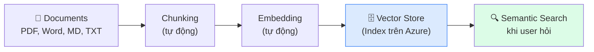
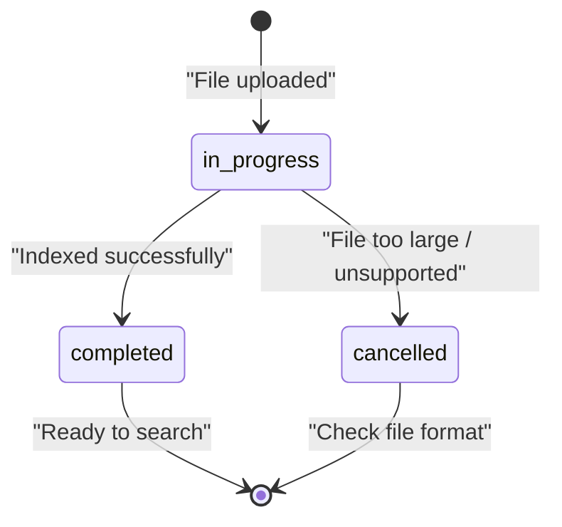
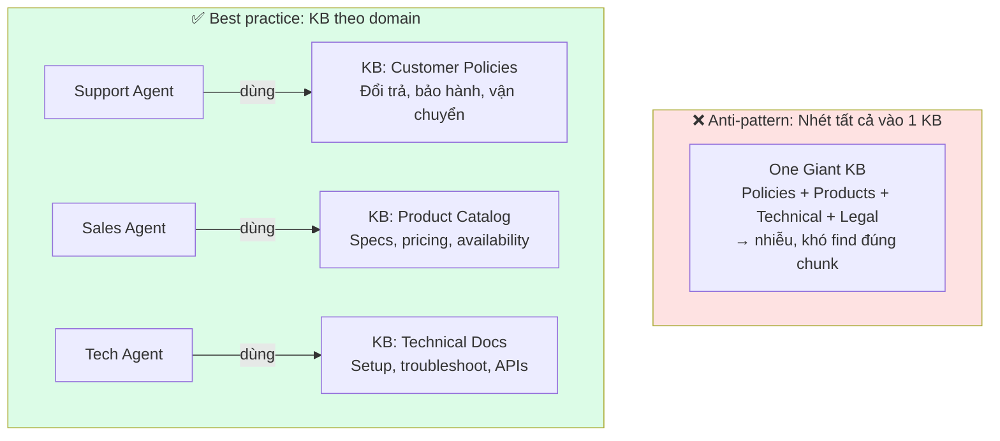

# Bài L2: Knowledge Base UI — Quản lý Tài liệu Không Cần Code

## 📋 Agenda

**Thời gian đọc ước tính:** ~20 phút | 🖱️ Thực hành trên Portal

### Sau bài này, bạn sẽ:
- ✅ **Quản lý** Vector Store hoàn toàn qua Portal (thêm/xoá/update)
- ✅ **Hiểu** vòng đời documents: Upload → Index → Search → Expire
- ✅ **Thiết kế** Knowledge Base structure phù hợp cho tổ chức
- ✅ **Xử lý** các format file khác nhau (PDF, Word, Markdown)

### Yêu cầu:
- 🔹 Đã hoàn thành Bài L1 — có agent với File Search tool

---

## ❓ Vấn đề & Giải pháp

**Sau khi tạo agent (Bài L1), bạn cần quản lý liên tục:**
- Chính sách công ty thay đổi → phải update tài liệu trong knowledge base
- Thêm sản phẩm mới → phải upload tài liệu mô tả sản phẩm
- Tài liệu cũ lỗi thời → phải xoá để agent không trả lời sai

**Knowledge Base UI** trong Azure AI Foundry cho phép làm tất cả điều này qua trình duyệt.

---

## 📖 Vector Store — Nhắc lại nhanh



**Bạn chỉ cần quan tâm bước đầu (upload) và bước cuối (search hoạt động đúng không)** — mọi thứ ở giữa Azure xử lý tự động.

---

## 🖱️ Lab L2: Quản lý Knowledge Base

### Bước 1: Vào Knowledge Base Manager

```
Azure AI Foundry Portal (ai.azure.com)
  → Project của bạn
  → Menu trái → "Knowledge bases"
  (Hoặc: Agents → chọn agent → tab "Knowledge bases")
```

Bạn sẽ thấy danh sách tất cả Vector Stores đang tồn tại trong project, kèm thông tin:

| Column | Ý nghĩa |
|---|---|
| **Name** | Tên Vector Store bạn đặt |
| **Status** | `completed` / `in_progress` / `expired` |
| **Files** | Số tài liệu đã index |
| **Created** | Ngày tạo |
| **Expires** | Ngày hết hạn (nếu có policy) |

---

### Bước 2: Upload Documents

Click vào Vector Store muốn quản lý → Tab **"Files"** → **"Upload files"**

**Các format được hỗ trợ:**

| Format | Loại nội dung | Ghi chú |
|---|---|---|
| `.pdf` | Chính sách, báo cáo, hướng dẫn | Hỗ trợ scanned PDF có OCR |
| `.docx` | Tài liệu Word | Giữ nguyên cấu trúc heading |
| `.pptx` | Slide thuyết trình | Extract text từ slides |
| `.md` | Tài liệu kỹ thuật, wiki | Format tốt nhất cho dev docs |
| `.txt` | FAQ, plain text | Nhẹ, index nhanh |
| `.html` | Web pages export | Strip HTML tags tự động |
| `.json` | Structured data | Tốt cho FAQ dạng key-value |

:::warning Format KHÔNG được hỗ trợ
`.xlsx` (Excel), `.csv` — với file data dạng bảng, dùng **Code Interpreter** (Bài 08) thay vì File Search.
:::

**Upload workflow:**

```
Click "Upload files"
  → Dialog "Upload files" mở ra
  → Kéo thả files vào vùng upload (drag & drop) HOẶC click "Browse"
  → Chọn nhiều files cùng lúc (Ctrl+Click)
  → Click "Upload"
  → Thanh progress hiển thị từng file
  → Khi tất cả hiện ✅ → Click "Done"
```

---

### Bước 3: Monitor Indexing Status

Sau upload, mỗi file sẽ qua các trạng thái:



| Status | Màu badge | Ý nghĩa |
|---|---|---|
| `in_progress` | 🟡 Yellow | Đang chunking và embedding |
| `completed` | 🟢 Green | Sẵn sàng search |
| `cancelled` | 🔴 Red | Lỗi — kiểm tra format |

**Indexing thường mất:**
- File nhỏ < 1MB: 15-30 giây
- File 1-10MB: 1-3 phút
- File > 10MB: 5-10 phút

---

### Bước 4: Cập nhật Tài liệu

**Khi chính sách thay đổi, bạn cần:**

1. **Xoá bản cũ:** Tick checkbox vào file cũ → **"Delete"** → Confirm
2. **Upload bản mới:** Click **"Upload files"** → chọn file mới
3. **Verify:** Test agent trong Playground với câu hỏi liên quan → kiểm tra agent trả lời đúng nội dung mới

:::caution Không có versioning tự động
Azure AI Foundry không có version control cho documents. Nếu bạn upload bản mới mà chưa xoá bản cũ → cả hai đều tồn tại trong Knowledge Base → agent có thể lấy thông tin từ bản cũ. **Luôn xoá bản cũ trước khi upload mới.**
:::

---

### Bước 5: Kiểm tra Chunking

Khi click vào một file đã index, bạn thấy:
- **Chunk count:** Số đoạn được chia
- **Size:** Kích thước từng chunk (tokens)

```
File: shipping-policy.pdf
  → 12 chunks
  → Avg chunk size: ~600 tokens
  → Status: completed
```

**Nếu chunk count quá ít** (< 5 cho file dài) → Chunking strategy có thể không hoạt động đúng với format đó. Thử chuyển file sang Markdown hoặc TXT.

---

## 📖 Thiết kế Knowledge Base Structure

### Pattern: Single KB vs Multi KB



### Naming Convention khuyến nghị

| Tốt | Không tốt |
|---|---|
| `customer-support-policies-2025` | `kb1` |
| `product-catalog-electronics` | `my-knowledge-base` |
| `hr-employee-handbook-v3` | `docs` |

---

## 📖 Expiration Policy — Quản lý vòng đời

Mặc định, Vector Stores tồn tại vĩnh viễn. Bạn có thể cấu hình expiration để tiết kiệm chi phí:

```
Vector Store → Settings → Expiration policy
  → "Expire after last active": 7 ngày (tốt cho testing)
  → "Never expire": Production knowledge bases
  → "Expire at specific date": Tài liệu có thời hạn (event, promotion)
```

**Chi phí lưu trữ:**
- $0.10/GB/ngày → 1GB documents = $3/tháng
- Không đáng kể cho hầu hết use cases
- Clean up Vector Stores không dùng để tiết kiệm

---

## 💬 Câu hỏi thảo luận

> **"Upload file lên Knowledge Base có nghĩa là Microsoft có thể đọc tài liệu nội bộ của công ty không?"**
>
> *Câu hỏi quan trọng về Data Privacy!* Dữ liệu của bạn được lưu trong **Azure Storage** thuộc subscription của công ty bạn — không phải storage của Microsoft. Documents được embed (chuyển thành vectors số) để search, nhưng bản gốc vẫn chỉ nằm trong tenant của bạn. Microsoft cam kết không dùng data của enterprise customers để train model. Xem thêm: [Azure AI Foundry Data Privacy](https://learn.microsoft.com/en-us/azure/ai-studio/concepts/data-privacy).

---

**Bài tiếp theo:** Bài L3 — Deploy to Teams →

---

*Made by Anh Tu - Share to be shared*
