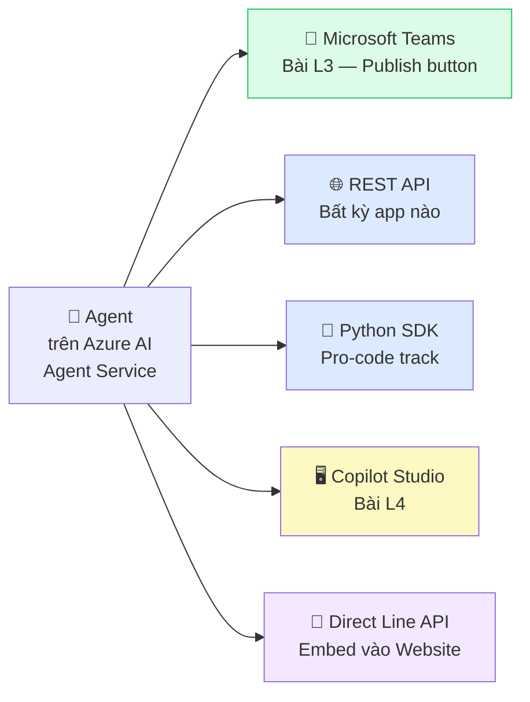
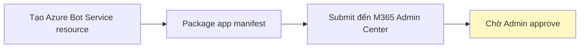
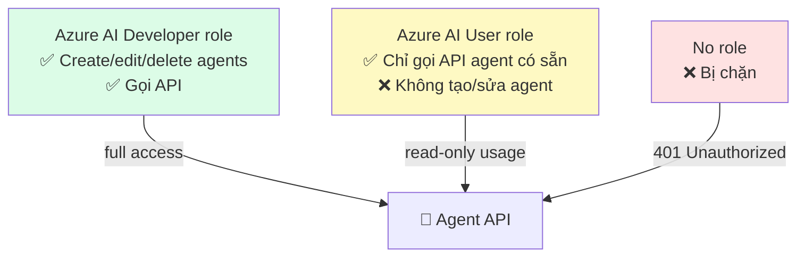

# Bài L3: Deploy to Teams — Đưa Agent vào Tầm Tay Nhân Viên

## 📋 Agenda

**Thời gian đọc ước tính:** ~25 phút | 🖱️ Thực hành trên Portal

### Sau bài này, bạn sẽ:
- ✅ **Publish** agent từ Foundry ra Microsoft Teams chỉ bằng click
- ✅ **Submit** agent package để IT Admin approve và phân phối toàn công ty
- ✅ **Test** agent trực tiếp trong Teams chat
- ✅ **Hiểu** cách gọi agent qua REST API cho local app

### Yêu cầu:
- 🔹 Đã hoàn thành Bài L1 — có agent đã tạo và test xong
- 🔹 Tài khoản Microsoft 365 doanh nghiệp
- 🔹 Quyền Contributor hoặc Owner trên Azure AI Foundry Project

---

## ❓ Bức tranh toàn cảnh — Nhiều cách dùng Agent

**Một agent đã publish có thể được dùng qua nhiều kênh:**



---

## 🖱️ Phần 1: Deploy to Teams

### Bước 1: Vào Publish Settings

```
Azure AI Foundry Portal (ai.azure.com)
  → Project → Agents
  → Click vào agent muốn deploy
  → Tab "Channels" HOẶC button "Publish" ở góc trên phải
```

### Bước 2: Chọn kênh Teams

Trong panel **Channels**, click **"Microsoft Teams"**:

```
┌─────────────────────────────────────────────────────┐
│  📋 Publish to                                      │
│  ─────────────────────────────────────────────────  │
│  ✅ Microsoft Teams & Microsoft 365                 │
│     Agent sẽ available trong Teams và M365 Copilot  │
│                                                     │
│  📌 App Name:     [Customer Support Bot      ]      │
│  📝 Description:  [Hỗ trợ khách hàng 24/7   ]      │
│  🖼️ App Icon:     [Upload Icon 192x192px     ]      │
│                                                     │
│                          [Cancel]  [Publish →]      │
└─────────────────────────────────────────────────────┘
```

**Điền thông tin:**

| Field | Ví dụ | Ghi chú |
|---|---|---|
| **App Name** | `Customer Support Bot` | Tên hiển thị trong Teams |
| **Description** | `Hỗ trợ khách hàng 24/7 về chính sách và sản phẩm` | Hiện trong Teams App Store |
| **App Icon** | *(upload file PNG 192×192)* | Logo công ty hoặc icon đặc trưng |

### Bước 3: Click Publish

Click **"Publish"**. Azure sẽ:



**Thông báo xuất hiện:**
```
✅ "Agent published successfully"
   Your agent has been submitted to your organization's
   Microsoft 365 admin center for review and approval.
   
   Once approved, team members can find it in Teams
   under Apps → Built for your org.
```

---

### Bước 4: IT Admin Approve (Dành cho Admin)

:::info Ai cần làm bước này?
Đây là việc của **IT Admin / Microsoft 365 Admin**. Nếu bạn không phải admin, chuyển hướng dẫn này cho IT.
:::

```
Microsoft 365 Admin Center (admin.microsoft.com)
  → Teams apps → Manage apps
  → Filter: "Status: Pending approval"
  → Tìm app "Customer Support Bot"
  → Review → Actions → "Allow"
  → Có thể chọn: "For all users" hoặc "Specific groups"
```

Sau khi approve, app xuất hiện trong Teams của nhân viên sau **5-30 phút** (cache invalidation).

---

### Bước 5: Dùng trong Teams

Nhân viên tìm agent trong Teams:

```
Teams Desktop App
  → Sidebar trái → "Apps" (biểu tượng ô vuông)
  → Search: "Customer Support Bot"
  → HOẶC: Apps → "Built for [Tên Công ty]"
  → Click agent → "Add"
  → Chat trực tiếp với agent!
```

Agent hoạt động như một Bot trong Teams:
- Chat 1-1 với agent
- Mention agent trong group chat: `@Customer Support Bot giá laptop là bao nhiêu?`

---

## 🌐 Phần 2: Dùng Agent từ Local App (REST API)

:::info Trả lời câu hỏi từ đầu bài
Đây là phần trả lời câu hỏi: **"Sau khi deploy có dùng ở app local không?"**
**Có** — hoàn toàn có thể! Agent trên Azure có REST API endpoint.
:::

### Lấy thông tin kết nối

```
AI Foundry Portal → Project → Settings
  → Project endpoint: "https://your-project.services.ai.azure.com"
  
Agents → Chọn agent → Properties
  → Agent ID: "asst_xxxxxxxxxx"
```

### Gọi Agent từ Python (không cần SDK phức tạp)

```python
# filename: call-my-portal-agent.py
"""
Gọi agent đã tạo trên Portal từ local Python app
Không cần create_agent() — agent đã tồn tại rồi!
"""

import os
import time
from dotenv import load_dotenv
from azure.ai.projects import AIProjectClient
from azure.identity import DefaultAzureCredential

load_dotenv()

# ─── Thông tin từ Portal ──────────────────────────────────────────
PROJECT_CONNECTION_STRING = os.environ["AZURE_AI_PROJECT_CONNECTION_STRING"]
AGENT_ID = "asst_xxxxxxxxxx"  # Lấy từ Portal → Agent → Properties

# ─── Kết nối và dùng agent đã tạo sẵn ────────────────────────────
client = AIProjectClient.from_connection_string(
    conn_str=PROJECT_CONNECTION_STRING,
    credential=DefaultAzureCredential()
)

# Tạo thread mới cho session này
thread = client.agents.create_thread()
print(f"Thread: {thread.id}")

# Gửi câu hỏi (không cần tạo agent mới — dùng AGENT_ID từ portal)
client.agents.create_message(
    thread_id=thread.id,
    role="user",
    content="Chính sách đổi trả của công ty là gì?"
)

run = client.agents.create_and_process_run(
    thread_id=thread.id,
    agent_id=AGENT_ID  # ID agent tạo trên portal
)

if run.status == "completed":
    messages = client.agents.list_messages(thread_id=thread.id)
    print(f"\nAgent: {messages.data[0].content[0].text.value}")
```

### Gọi Agent từ REST API (ngôn ngữ bất kỳ)

```bash
# Lấy access token
TOKEN=$(az account get-access-token \
  --resource "https://ai.azure.com" \
  --query accessToken -o tsv)

# 1. Tạo thread
THREAD=$(curl -s -X POST \
  "https://your-project.services.ai.azure.com/threads?api-version=2025-05-15-preview" \
  -H "Authorization: Bearer $TOKEN" \
  -H "Content-Type: application/json" \
  -d '{}')

THREAD_ID=$(echo $THREAD | python3 -c "import sys,json; print(json.load(sys.stdin)['id'])")

# 2. Gửi message
curl -s -X POST \
  "https://your-project.services.ai.azure.com/threads/$THREAD_ID/messages?api-version=2025-05-15-preview" \
  -H "Authorization: Bearer $TOKEN" \
  -H "Content-Type: application/json" \
  -d '{"role": "user", "content": "Chính sách đổi trả?"}'

# 3. Chạy agent
RUN=$(curl -s -X POST \
  "https://your-project.services.ai.azure.com/threads/$THREAD_ID/runs?api-version=2025-05-15-preview" \
  -H "Authorization: Bearer $TOKEN" \
  -H "Content-Type: application/json" \
  -d "{\"assistant_id\": \"$AGENT_ID\"}")
```

---

## 📖 Access Control & Permissions

**Ai có thể gọi agent qua API?**



**Phân quyền trong Portal:**

```
Azure Portal → Resource Group → IAM (Access control)
  → Add role assignment
  → Role: "Azure AI User"
  → Members: [email nhân viên hoặc Azure AD Group]
```

---

## 💬 Câu hỏi thảo luận

> **"Teams Bot và chatbot thông thường (như ChatGPT web) khác nhau ở điểm gì trong context của Agent này?"**
>
> *Về kỹ thuật:* Cả two đều gọi cùng LLM. Điểm khác biệt là **nơi chạy và ai quản lý**: Teams Bot chạy trong M365 tenant của công ty, được govern bởi IT admin, authenticated bằng Microsoft Entra ID (SSO). ChatGPT web là public service, không có corporate authentication. *Về business:* Teams Bot có thể truy cập data nội bộ qua Microsoft Graph API, tuân thủ DLP policy của công ty, và có audit log trong M365 Compliance Center.

---

**Bài tiếp theo:** Bài L4 — Copilot Studio →

---

*Made by Anh Tu - Share to be shared*
