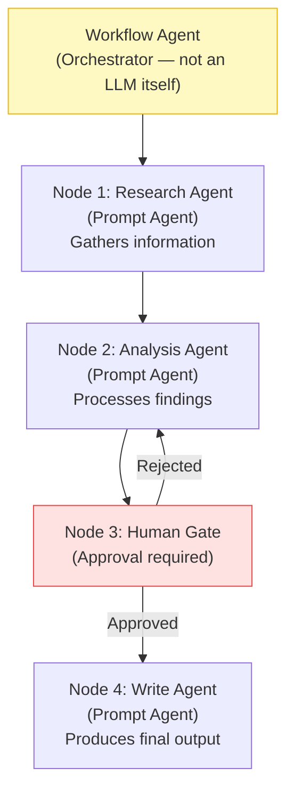
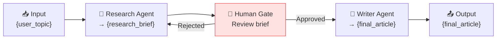
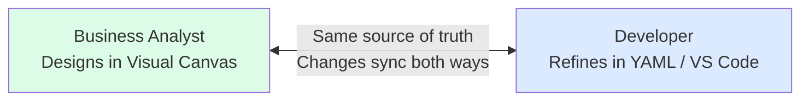

# L3: Visual Workflow Builder — Multi-Agent Orchestration

## 📋 Agenda

**Estimated reading time:** ~35 minutes | Hands-on Portal Lab

### Learning outcomes:

- ✅ **Distinguish** between a Prompt Agent and a Workflow Agent conceptually
- ✅ **Design** a sequential multi-agent workflow using the visual canvas
- ✅ **Configure** a Human-in-the-Loop approval gate within a workflow
- ✅ **Switch** between Visual and YAML views and understand the dual-view model

### Prerequisites:

- Completed L1 — have at least one Prompt Agent created
- Ideally, two specialized agents created for the lab (Researcher + Writer pattern)

:::info This is the most powerful new capability
Visual Workflow Builder is the defining feature of Microsoft Foundry (New). It does not exist in Foundry Classic. This article covers it as a dedicated topic because multi-agent orchestration fundamentally changes what non-technical teams can build.
:::

---

## 1. Problem Statement

### 1.1. What a Single Agent Cannot Do

A Prompt Agent (L1) excels at stateless Q&A: user asks, agent answers, end. Real business processes are not stateless transactions — they are multi-step pipelines:

- **Loan approval:** Collect application → Credit check → Risk analysis → Human review → Decision letter
- **Content pipeline:** Research brief → Draft article → Fact-check → Legal review → Publish
- **IT incident:** Alert detection → Root cause analysis → Remediation proposal → IT Manager approval → Execute fix

A single agent handling all of this runs into two hard limits:
1. **Context window overflow** — complex pipelines exceed LLM context capacity
2. **Specialization loss** — a generalist agent performs worse than specialized agents at each step

### 1.2. Workflow Agent as Orchestrator

A **Workflow Agent** (*Agent Luồng công việc*) is not itself an LLM — it is an **orchestrator** that coordinates multiple Prompt Agents (and other steps) in a defined sequence, passing outputs from one node as inputs to the next.

---

## 2. Core Concepts

### 2.1. Workflow Agent Architecture



### 2.2. Workflow Types

| Type | Definition | Use Case |
|---|---|---|
| **Sequential** (*Tuần tự*) | Agent A completes → passes output to Agent B → B completes → Agent C... | Report generation, content pipeline |
| **Human-in-the-Loop** (*Con người trong vòng lặp*) | Workflow pauses at a gate, waits for human approval/input | Approval flows, quality gates |
| **Group Chat** (*Hội thoại nhóm*) | Multiple agents collaborate dynamically; any agent can respond based on context | Brainstorming, multi-perspective analysis |

### 2.3. Glossary & Vocabulary

| Term | Vietnamese Meaning | Explanation |
|---|---|---|
| **Node** | Nút | A single step in the workflow canvas; can be an agent, a condition, or a human gate |
| **Edge** | Cạnh nối | The arrow connecting two nodes — defines data flow direction |
| **Variable** | Biến | A named container passing data between nodes (e.g., `{research_output}`) |
| **YAML** | Định dạng cấu hình văn bản | Human-readable serialization format; the underlying definition of a workflow |
| **Human-in-the-Loop** | Con người trong vòng lặp | A design pattern where a workflow pauses for human review before continuing |
| **Orchestrator** | Điều phối viên | The workflow agent itself — it does not answer questions; it manages which agent runs when |

---

## 3. Lab: Building a Content Generation Workflow

### 3.1. Prerequisite: Create Two Specialized Prompt Agents

Before building the workflow, create two agents in the Build → Agents section:

**Agent 1 — Research Agent:**
```
Name: Research Agent
Instructions:
  You are a research specialist. Given a topic, search available knowledge
  sources and produce a structured research brief with:
  - 3-5 key facts
  - Main perspectives (supporting and opposing)
  - Recommended angle for a 500-word article

Tools: Bing Search (enabled), File Search (if available)
```

**Agent 2 — Writer Agent:**
```
Name: Writer Agent
Instructions:
  You are a professional content writer. Given a research brief, produce
  a complete 500-word article with:
  - A compelling title
  - Introduction, 2-3 body sections, conclusion
  - Clear, jargon-free language suitable for a general audience

Tools: None required
```

### 3.2. Open the Workflow Builder

```
ai.azure.com → Build → Workflows
  → Click "Create workflow"
  → Choose template: "Sequential" (for this lab)
  → Name: "Content Generation Pipeline"
  → Save
```

### 3.3. Design the Workflow on Canvas

The Visual Workflow Builder opens with a blank canvas:

```
┌──────────────────────────────────────────────────────────────┐
│  Nodes Panel (left)    │  Canvas (center)  │  Config (right)  │
│  ─────────────────────  │  ─────────────────  │  ──────────────  │
│  🤖 Agent Node         │                   │  (Select node    │
│  👤 Human Gate         │  [Drop nodes here]  │   to configure)  │
│  🔀 Condition          │                   │                  │
│  📥 Input              │                   │                  │
│  📤 Output             │                   │                  │
│  ─────────────────────  │                   │                  │
│  [Visual ▾] [YAML]     │                   │                  │
└──────────────────────────────────────────────────────────────┘
```

**Step-by-step canvas design:**

**Step 1 — Add Input node:**
- Drag **Input** node to canvas
- Config panel: Define variable `{user_topic}` (string input)
- This is what the workflow receives from the user

**Step 2 — Add Research Agent node:**
- Drag **Agent** node onto canvas
- Connect Input → Research Agent node (drag arrow from Input's output port)
- Config panel:
  - Agent: select "Research Agent" (created above)
  - Input mapping: `{user_topic}` → agent's user message
  - Output variable: `{research_brief}`

**Step 3 — Add Human Gate:**
- Drag **Human Gate** node
- Connect Research Agent → Human Gate
- Config panel:
  - Title: "Review Research Brief"
  - Instructions: "Review the research brief and approve to proceed to writing, or reject to revise."
  - On approve → proceed to Writer Agent
  - On reject → loop back to Research Agent

**Step 4 — Add Writer Agent node:**
- Drag **Agent** node
- Connect Human Gate (Approved) → Writer Agent
- Config panel:
  - Agent: select "Writer Agent"
  - Input mapping: `{research_brief}` → agent's user message
  - Output variable: `{final_article}`

**Step 5 — Add Output node:**
- Connect Writer Agent → Output
- Output: `{final_article}`

The completed canvas looks like:



:::tip Save frequently
Workflows are NOT saved automatically. After every significant change, click "Save" in the top toolbar. Unsaved changes are lost if you navigate away.
:::

### 3.4. Test the Workflow

```
Top toolbar → "Run workflow"
  → Input field: "AI agents in healthcare"
  → Click "Run"
```

Observe the execution trace:
- Each node highlights as it activates
- Research Agent runs, produces output
- Workflow pauses at Human Gate — awaiting your approval
- Review the research brief in the approval panel
- Click "Approve" → Writer Agent activates
- Final article appears in Output

### 3.5. Observability — Trace View

Click **"Trace"** tab (after a run completes) to see the full execution log:

```
Run: Content Generation Pipeline
  ├── Input: "AI agents in healthcare" ✅ 0.1s
  ├── Research Agent ✅ 8.2s
  │     Input: "AI agents in healthcare"
  │     Output: "Key facts: 1. AI agents... 2. Clinical trials..."
  │     Tools called: Bing Search (3 queries)
  ├── Human Gate ⏸️ 142s (human review time)
  │     Decision: Approved
  ├── Writer Agent ✅ 12.4s
  │     Input: [research brief]
  │     Output: "Title: How AI Agents Are Transforming Healthcare..."
  └── Output ✅ 0.1s
Total: 163s | Tokens: 4,821 | Cost: ~$0.08
```

---

## 4. YAML Dual View

Every visual workflow has an equivalent YAML definition. You can switch between views at any time:

```
Canvas toolbar → Toggle: [Visual] [YAML]
```

The YAML for the Content Generation Pipeline:

```yaml
# filename: content-generation-pipeline.yaml
name: Content Generation Pipeline
description: Sequential research and writing workflow

inputs:
  user_topic:
    type: string
    description: The topic to research and write about

nodes:
  - id: research_node
    type: agent
    agent_id: agt_research_agent_xxxx
    input:
      message: ${inputs.user_topic}
    output:
      research_brief: ${outputs.content}

  - id: human_review
    type: human_gate
    title: Review Research Brief
    input: ${nodes.research_node.outputs.research_brief}
    on_approve: writer_node
    on_reject: research_node

  - id: writer_node
    type: agent
    agent_id: agt_writer_agent_xxxx
    input:
      message: ${nodes.research_node.outputs.research_brief}
    output:
      final_article: ${outputs.content}

outputs:
  final_article:
    type: string
    value: ${nodes.writer_node.outputs.final_article}
```

**Why does dual view matter?**



YAML is the handoff format: a Business Analyst builds the flow visually, a developer exports the YAML to add advanced logic, CI/CD integration, or unit tests.

---

## 5. Discussion

> **"A Workflow Agent orchestrates multiple LLMs — does this multiply cost proportionally?"**
>
> *Yes, with nuance.* Each agent node in a workflow makes independent LLM calls, so a 3-agent sequential workflow incurs approximately 3× the LLM token cost versus a single agent answering the same question. The trade-off justification is accuracy, not cost: specialized agents outperform generalist agents on complex tasks, which can reduce the number of retry cycles, reduce hallucinations requiring manual correction, and reduce the downstream cost of errors. The cost calculus for workflow agents should include the cost of *not* having good automation — not just raw token spend. For high-stakes workflows (approvals, legal review), the Human-in-the-Loop gate also provides a natural cost checkpoint where human judgment can short-circuit unnecessary LLM calls.

---

**Next:** L4 — Deploy & Governance →

---

*Made by Anh Tu - Share to be shared*
