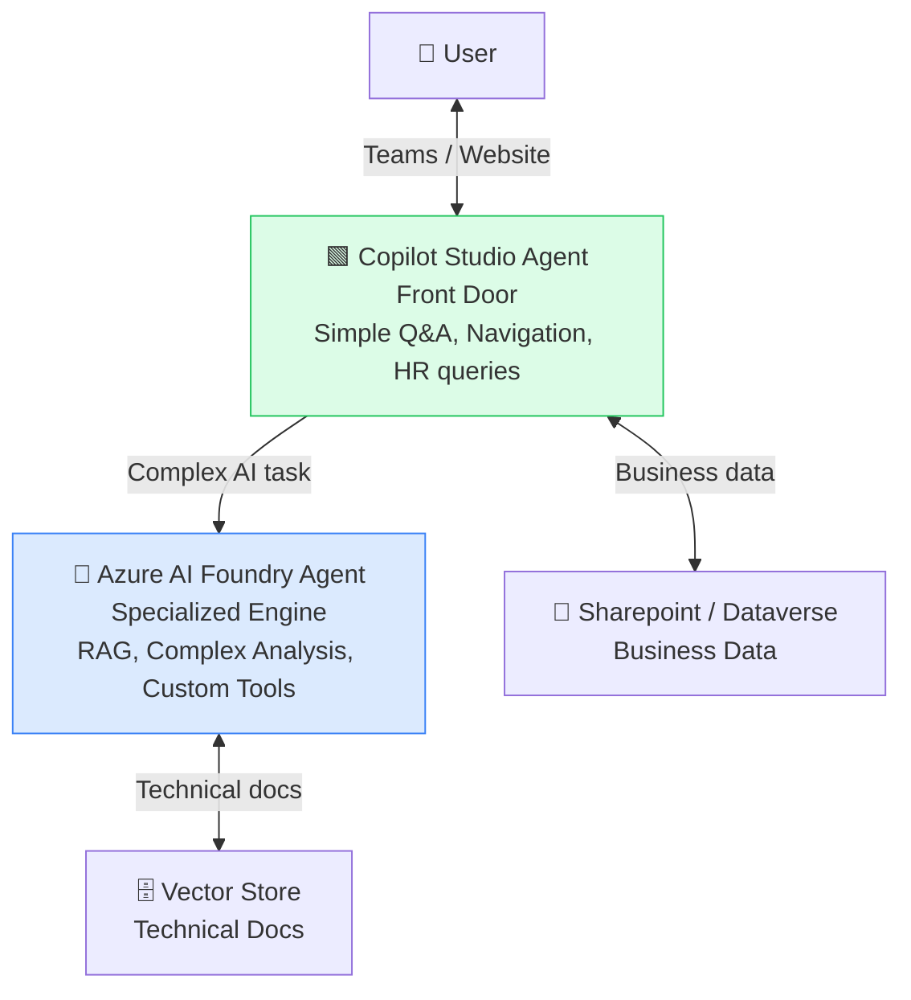
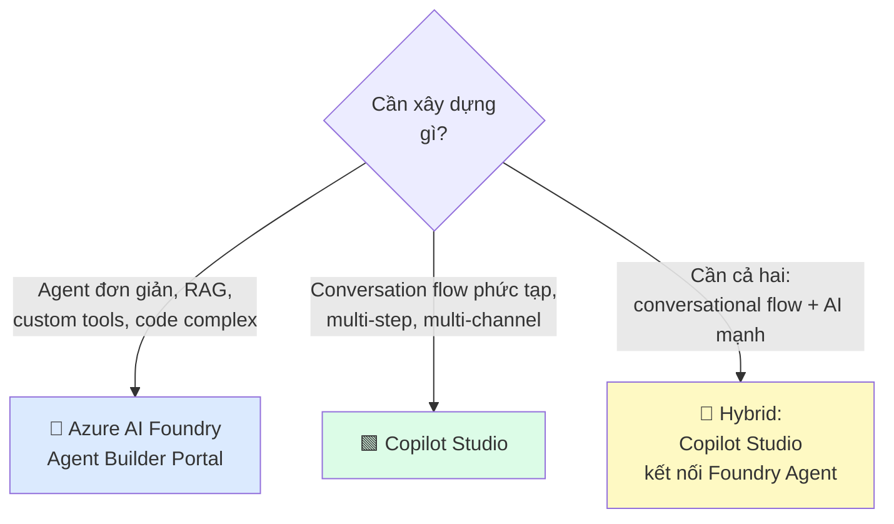
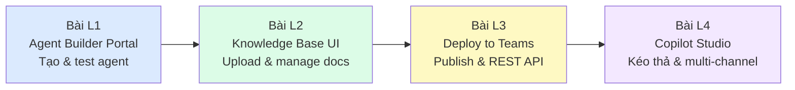

# Bài L4: Copilot Studio — Kéo Thả Workflow AI

## 📋 Agenda

**Thời gian đọc ước tính:** ~30 phút | 🖱️ Thực hành Copilot Studio

### Sau bài này, bạn sẽ:
- ✅ **Phân biệt** rõ Copilot Studio vs Agent Builder Portal (và khi nào dùng cái nào)
- ✅ **Build** conversational bot với Topic và Action kéo thả
- ✅ **Connect** Copilot Studio agent → Azure AI Foundry Agent (hybrid pattern)
- ✅ **Publish** bot lên Teams và Website widget với 1 click

### Yêu cầu:
- 🔹 Tài khoản Microsoft 365 doanh nghiệp với Copilot Studio license
- 🔹 Đã hoàn thành Bài L1-L3 (hiểu Azure AI Foundry Agent)

---

## ❓ Vấn đề & Giải pháp

**Giới hạn của Azure AI Foundry Agent Builder:**
- Chỉ có Playground để test — không có visual flow để design conversation
- Publish to Teams OK, nhưng không có multi-channel (Website, Slack, WhatsApp...)
- Không có built-in Power Platform connectors (Dynamics, SharePoint, ServiceNow)

**Copilot Studio giải quyết:**
- Visual topic builder — kéo thả nodes cuộc trò chuyện
- 1000+ connectors qua Power Platform
- Multi-channel: Teams, Website, Mobile, Slack...
- Kết nối được với Azure Foundry Agent như "specialized engine"

---

## 📖 Kiến trúc Hybrid (Best of Both Worlds)



**Pattern:** Copilot Studio là "tiếp tân" — xử lý câu hỏi đơn giản, menu navigation, tích hợp HR system. Khi gặp câu hỏi phức tạp cần AI → chuyển cho Foundry Agent xử lý.

---

## 🖱️ Phần 1: Bắt đầu với Copilot Studio

### Truy cập

```
🌐 https://copilotstudio.microsoft.com
  → Đăng nhập bằng tài khoản Microsoft 365
  → Chọn môi trường (Environment) của công ty
  → Click "+ Create" → "New agent"
```

### Tạo Agent mới

**Cách 1 — Describe bằng ngôn ngữ tự nhiên (AI-assisted):**

```
Copilot Studio sẽ hỏi:
"What should your agent do?"

Bạn gõ:
"Tôi muốn tạo bot hỗ trợ nhân viên nội bộ. Bot sẽ trả lời câu hỏi
về HR (phép nghỉ, bảo hiểm), IT helpdesk, và tìm kiếm tài liệu
chính sách công ty từ SharePoint."

→ AI tự generate Topics cơ bản dựa trên mô tả
→ Review và Edit thêm
```

**Cách 2 — Manual (Skip AI assist):**

```
Click "Skip to configure"
  → Name: "Internal Employee Bot"
  → Description: "HR & IT Support for employees"
  → Instructions (system-level prompt): [gõ trực tiếp]
  → Language: Vietnamese
```

---

## 🖱️ Phần 2: Topic Designer — Kéo Thả Conversation Flow

**Topic** trong Copilot Studio = một chủ đề / luồng hội thoại. Ví dụ: "Hỏi về phép nghỉ phép", "Reset mật khẩu IT", "Đăng ký đào tạo".

### Tạo Topic mới

```
Left sidebar → Topics → "+ New topic" → "From blank"
```

### Giao diện Topic Designer

```
┌────────────────────────────────────────────────────────┐
│  🧩 Nodes Panel (trái)    │  🎨 Canvas (giữa)          │
│  ─────────────────────   │  ─────────────────────────  │
│  📩 Trigger Phrases      │  [Trigger] → [Message node] │
│  💬 Message              │       ↓                     │
│  ❓ Question             │  [Question node]             │
│  ⚡ Action               │       ↓                     │
│  🔀 Condition            │  [Condition: Yes/No]         │
│  🤖 Generative AI        │    ↓           ↓             │
│  📞 Call external agent  │  [Path A]   [Path B]         │
└────────────────────────────────────────────────────────┘
```

### Ví dụ: Topic "Hỏi số ngày phép còn lại"

```
1. [Trigger Phrases node]
   Thêm phrases:
   - "Tôi còn bao nhiêu ngày phép?"
   - "Check phép nghỉ"
   - "Số ngày phép còn lại"
   
2. [Message node]
   "Tôi sẽ kiểm tra số ngày phép của bạn. Vui lòng cho biết mã nhân viên."
   
3. [Question node]
   Question: "Mã nhân viên của bạn là gì?"
   Save response to: {employee_id}
   
4. [Action node → Call Power Automate Flow]
   Flow: "Get-Leave-Balance" (Power Automate)
   Input: {employee_id}
   Output: {leave_days}
   
5. [Message node]
   "Bạn còn {leave_days} ngày phép trong năm nay."
   
6. [End of conversation]
```

**Kéo thả:** Kéo nodes từ panel trái → thả vào canvas → nối bằng cách kéo từ mũi tên → fill in content.

---

## 🖱️ Phần 3: Kết nối Azure AI Foundry Agent

Đây là **hybrid pattern** quan trọng nhất: Copilot Studio gặp câu hỏi phức tạp → delegate cho Foundry Agent.

### Bước 1: Lấy Foundry Project Endpoint

```
Azure AI Foundry Portal → Project → Settings
  → Project endpoint: "https://your-project.services.ai.azure.com"
```

### Bước 2: Thêm Foundry Agent vào Copilot Studio

```
Copilot Studio
  → Settings → AI capabilities → "Connected agents"
  → "+ Add" → "Microsoft Foundry"
  → Endpoint URL: "https://your-project.services.ai.azure.com"
  → Agent ID: "asst_xxxxxxxxxx" (từ Foundry Portal)
  → Save → Test connection
```

### Bước 3: Tạo Topic gọi Foundry Agent

```
Topics → New topic → "Complex Support Query"

Trigger Phrases:
- "câu hỏi kỹ thuật phức tạp"
- "phân tích dữ liệu"
- "tài liệu nội bộ"

Flow:
1. [Trigger]
2. [Question] "Bạn cần hỗ trợ gì?"
   → Save to: {user_query}
3. [Action → "Call a Foundry Agent"]
   Agent: your-foundry-agent
   Input: {user_query}
   Output: {agent_response}
4. [Message] "{agent_response}"
5. [End]
```

---

## 🖱️ Phần 4: Publish — Multi-channel Deployment

### Publish lên Teams

```
Copilot Studio → Publish → "Publish to Teams"
  → Điền App Name, Description, Icon
  → "Publish"
  → (IT Admin approve trong Teams Admin Center)
```

### Publish Website Widget

```
Copilot Studio → Channels → "Custom website"
  → Toggle: Enable
  → Copy embed code:

<iframe
  src="https://copilotstudio.microsoft.com/environments/.../bots/.../webchat"
  style="width: 400px; height: 600px"
  frameborder="0">
</iframe>
```

**Paste embed code vào bất kỳ website HTML nào** → chat widget xuất hiện góc phải màn hình.

---

## 📖 Khi nào dùng gì?



| Scenario | Chọn |
|---|---|
| RAG Agent trả lời từ tài liệu | Azure AI Foundry |
| Bot HR với nhiều bước (hỏi → check Dynamics → trả lời) | Copilot Studio |
| Customer support với RAG + integrate SharePoint | Hybrid |
| Chatbot trên website công ty | Copilot Studio (widget) |
| Agent phân tích CSV, tạo chart | Azure AI Foundry (Code Interpreter) |

---

## 💬 Câu hỏi thảo luận

> **"Copilot Studio tính phí như thế nào? Mỗi conversation trong Teams có tốn tiền không?"**  
>
> *Copilot Studio có 2 mô hình license:* (1) **Per-tenant license** — trả cố định/tháng, unlimited conversations trong tenant, phù hợp doanh nghiệp lớn; (2) **Pay-per-conversation** — ~$0.01/conversation, tốt cho pilot nhỏ. Ngoài ra, khi Copilot Studio gọi Azure AI Foundry Agent → vẫn tính token cost trên Azure subscription như thông thường. Ước tính total cost cần tính cả hai nguồn: Copilot Studio license + Azure AI token cost.

---

## 🏁 Tổng kết Part 5 — Low-Code Path



**Roadmap tiếp theo cho Low-Code learners:**
- Khám phá Power Automate để build automation workflows kết nối với agent
- Thử Microsoft Graph connector để agent đọc được email, calendar, SharePoint
- Explore Power BI embedded để agent phân tích và visualize data business

---

*Made by Anh Tu - Share to be shared*
