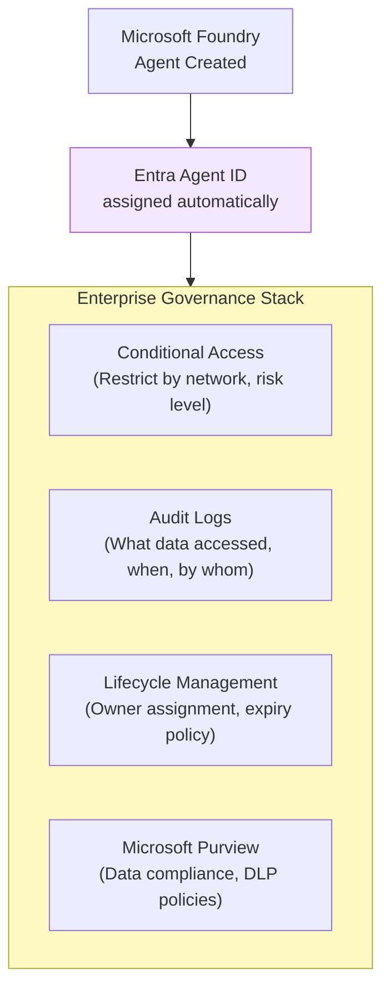
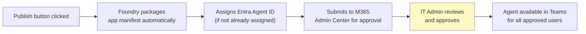
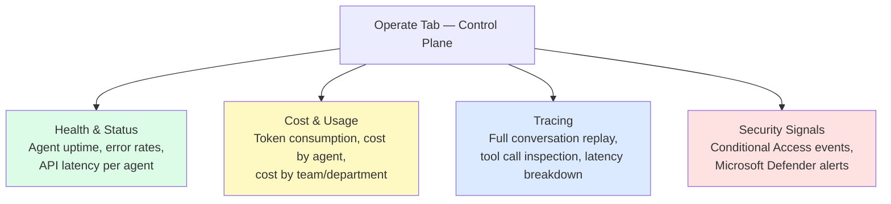
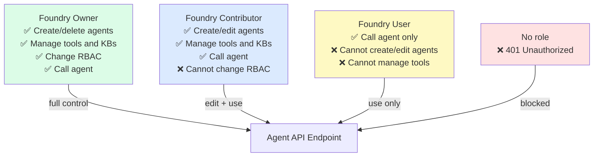

# L4: Deploy & Governance — Entra Agent ID and Teams Publishing

## 📋 Agenda

**Estimated reading time:** ~25 minutes | Hands-on Portal Lab

### Learning outcomes:

- ✅ **Publish** a Prompt Agent or Workflow Agent to Microsoft Teams with one click
- ✅ **Understand** Entra Agent ID and its role in enterprise governance
- ✅ **Monitor** agent health, cost, and usage via the Foundry Control Plane (Operate tab)
- ✅ **Apply** role-based access control (RBAC) for agents in your organization

### Prerequisites:

- Completed L1 — have a working Prompt Agent
- Microsoft 365 business account
- Contributor or Owner role on the Foundry Project

---

## 1. Problem Statement

### 1.1. The Governance Gap in Foundry Classic

In Foundry Classic, agents had no identity within the organization's identity system (Microsoft Entra). This created a governance blind spot:

- No centralized inventory of which agents existed across the org
- No audit trail for what data an agent accessed or what actions it took
- No lifecycle management — agents could exist indefinitely with no owner
- No Conditional Access — any user with the right Azure role could call any agent

This is what the industry calls **"Shadow AI"** (*AI bóng tối*) — AI systems running in an organization without IT oversight, policy enforcement, or visibility.

### 1.2. What New Foundry Adds

Microsoft Foundry (New) introduces two governance layers:

1. **Entra Agent ID** — every agent gets a unique identity in Microsoft Entra, treated like a service account
2. **Foundry Control Plane** — centralized dashboard (Operate tab) for fleet-wide visibility, cost, and compliance

---

## 2. Entra Agent ID — What and Why

### 2.1. Technical Definition

**Entra Agent ID** (*Định danh Agent Entra*) is an automatically assigned identity in Microsoft Entra (formerly Azure Active Directory) that represents an AI agent as a **service principal** — a non-human identity with its own security profile, permissions, and lifecycle.



### 2.2. Definition Anatomy

| Term | Vietnamese Meaning | Role |
|---|---|---|
| **Entra** | Microsoft Entra — hệ thống quản lý danh tính | Microsoft's identity and access management platform |
| **Service Principal** | Định danh dịch vụ | A non-human identity (like a user account, but for a service or app) |
| **Conditional Access** | Truy cập có điều kiện | Policies that restrict access based on conditions (network, device, risk score) |
| **Least Privilege** | Quyền tối thiểu | Security principle: agents only get access to what they strictly need |

### 2.3. Viewing an Agent's Entra Identity

```
Build → Agents → [Your Agent] → Properties
  → Agent ID: agt_xxxxxxxxxxxx
  → Entra Object ID: [GUID — links to Entra portal]

OR:

Microsoft Entra admin center (entra.microsoft.com)
  → Applications → Service principals
  → Filter: Type = "AI Agent"
  → See all Foundry agents across your tenant
```

---

## 3. Lab: Deploy to Microsoft Teams

### 3.1. One-Click Publishing

New Foundry significantly simplifies the Teams deployment process compared to Classic, which required manual Azure Bot Service configuration, manifest packaging, and admin center submission separately.

```
Build → Agents → [Your Agent]
  → Click "Publish" (top right button)
  → Select: "Microsoft Teams and Microsoft 365 Copilot"
```

### 3.2. Configure Publishing Details

```
┌─────────────────────────────────────────────────────────────┐
│  Publish to Microsoft Teams                                 │
│  ─────────────────────────────────────────────────────────  │
│  App Name:       [Customer Support Bot              ]       │
│  Short Desc:     [AI-powered customer support 24/7  ]       │
│  App Icon:       [Upload PNG 192×192 px             ]       │
│                                                             │
│  Publish to:                                                │
│  ✅ Microsoft Teams                                         │
│  ✅ Microsoft 365 Copilot (BizChat)                         │
│                                                             │
│                             [Cancel]  [Publish →]           │
└─────────────────────────────────────────────────────────────┘
```

| Field | Sample Value | Notes |
|---|---|---|
| **App Name** | `Customer Support Bot` | Display name in Teams App Store |
| **Short Description** | `AI support for product and policy questions` | Shown in Teams search results |
| **App Icon** | *(upload 192×192 PNG)* | Company logo or custom icon |

:::info New in New Foundry: BizChat support
In Foundry Classic, publishing to Teams required a separate Azure Bot Service resource. In New Foundry, a single publish action deploys to **Teams Chat, Microsoft 365 Copilot, and BizChat simultaneously** — one step instead of three. BizChat (*Microsoft 365 Copilot's chat interface in Teams*) gives the agent visibility to all M365 users in your tenant.
:::

### 3.3. What Happens After "Publish"



**Success notification:**
```
✅ Agent published successfully
   Submitted to your organization's M365 Admin Center.
   Once approved, users can find it in Teams:
   Apps → Built for [Your Org Name]
```

### 3.4. IT Admin Approval (Admin Tasks)

:::info For IT Admins only
This step is performed by the **Microsoft 365 Admin** in your organization. If you are not the admin, share these steps with your IT team.
:::

```
Microsoft 365 Admin Center (admin.microsoft.com)
  → Teams apps → Manage apps
  → Filter: Status = "Pending approval"
  → Find "Customer Support Bot"
  → Review app permissions
  → Actions → "Allow"
  → Assign to: "All users" OR "Specific groups/departments"
```

Agent appears in employees' Teams within **5–30 minutes** after approval (Entra cache propagation).

### 3.5. User Experience in Teams

```
Teams Desktop App
  → Apps (grid icon, left sidebar)
  → Search: "Customer Support Bot"
  OR: Apps → "Built for [Company Name]"
  → Click → "Add" → Chat directly

Available interactions:
  ✅ Direct 1-on-1 chat with agent
  ✅ Mention in group chat: @Customer Support Bot what is the return policy?
  ✅ Available in M365 Copilot BizChat
```

---

## 4. Foundry Control Plane — Operate Tab

The **Operate** tab is the operational command center. It replaces the practice of manually checking Azure Monitor metrics across scattered resources.

```
ai.azure.com → Operate tab
```

### 4.1. Dashboard Components



### 4.2. Key Metrics for Non-Technical Managers

| Metric | What It Tells You | Action Trigger |
|---|---|---|
| **Resolution Rate** | % of conversations resolved without human escalation | < 70% → Review agent instructions |
| **Average Latency** | Response time in seconds | > 10s → Check model deployment capacity |
| **Token Cost / Agent** | Monthly LLM spend per agent | Unexpected spikes → Check for prompt injection attempts |
| **Active Users** | Unique users interacting with agent per day | Low adoption → Check Teams availability |

---

## 5. Access Control (RBAC)

**Who can call an agent, create agents, or manage agents?**



**Assign roles in Azure Portal:**

```
Azure Portal (portal.azure.com)
  → Resource Group → IAM (Access control)
  → Add role assignment
  → Role: "Foundry User" (for end users who only call the agent)
  → Members: [User email, Azure AD Group, or Service Principal]
  → Save
```

---

## 6. Discussion

> **"Entra Agent ID treats AI agents like human identities — is this over-engineering for a chatbot?"**
>
> *The governance overhead is proportional to the agent's permissions.* A simple FAQ bot with read-only access to public documents warrants minimal governance overhead. But when an agent has: write access to SharePoint (it can modify documents), access to HR records, ability to send emails via Graph API, or permission to execute code — it is no longer "just a chatbot." It is a privileged service account. Applying the same identity governance that you apply to human service accounts is not over-engineering — it is **responsible automation**. The cost of not doing this is Shadow AI: agents with unchecked permissions causing data leakage, compliance violations, or unintended actions with no audit trail.

---

**Next:** L5 — Copilot Studio Integration →

---

*Made by Anh Tu - Share to be shared*
