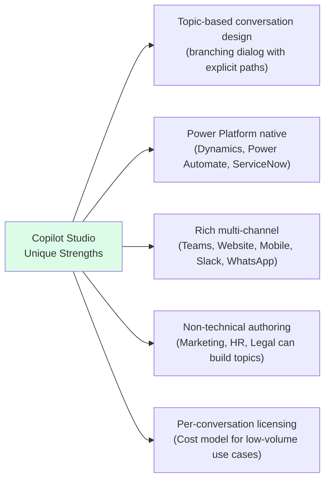
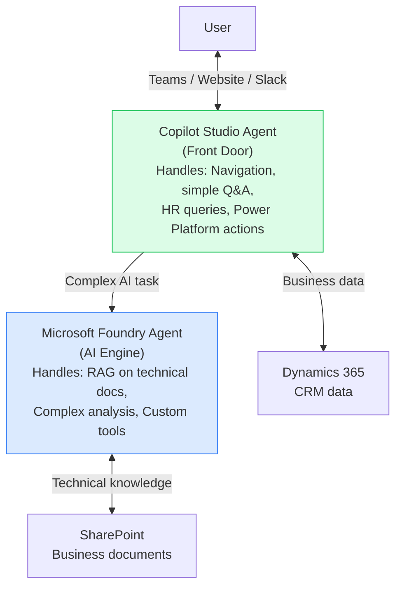
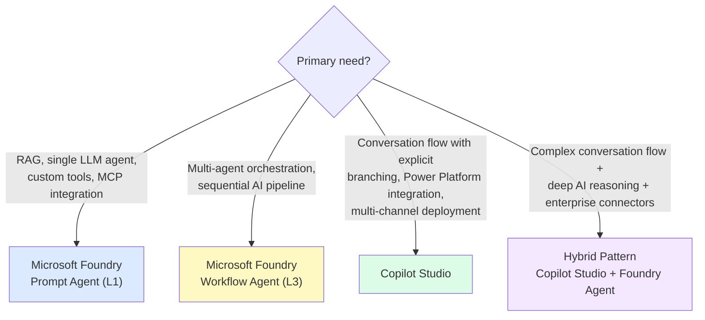
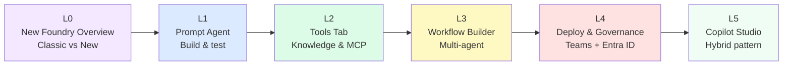

# L5: Copilot Studio — Hybrid Pattern with Microsoft Foundry

## 📋 Agenda

**Estimated reading time:** ~30 minutes | Hands-on Copilot Studio Lab

### Learning outcomes:

- ✅ **Distinguish** clearly between Copilot Studio and Foundry Workflow Builder (updated decision matrix for New Foundry)
- ✅ **Build** a conversational bot with Copilot Studio's Topic Designer
- ✅ **Connect** Copilot Studio to a Foundry agent using the hybrid pattern
- ✅ **Deploy** to Teams and website widget via multi-channel publishing

### Prerequisites:

- Microsoft 365 business account with Copilot Studio license
- Completed L1 — have a Foundry Prompt Agent with a known endpoint
- Copilot Studio license (per-tenant or per-conversation)

---

## 1. Problem Statement

### 1.1. A Clarified Landscape — New Foundry Changed the Boundaries

In Foundry Classic, the division was clear:
- **Foundry Classic** → single agent, no visual flow
- **Copilot Studio** → visual conversation flow, multi-channel, Power Platform connectors

New Foundry has shifted this boundary:
- **New Foundry Workflow Builder** → now also has visual orchestration, sequential flows, human gates
- **Copilot Studio** → retains its unique strengths that Foundry Workflow Builder does NOT yet have

The question "when to use which" requires an updated answer.

### 1.2. What Copilot Studio Still Does Uniquely



Foundry Workflow Builder excels at **AI-to-AI orchestration** (agents delegating to agents). Copilot Studio excels at **conversation flow design** (routing users through explicit dialog trees with business logic and Power Platform integration).

---

## 2. Architecture: Hybrid Pattern

The most powerful pattern combines both platforms: Copilot Studio as the **front door** for conversation management, Foundry as the **specialized AI engine** for complex tasks.



**Pattern description:** Copilot Studio acts as the receptionist — it handles greeting, navigation, simple form collection, and routing. When a user's request requires genuine AI reasoning (RAG on documents, multi-step analysis), Copilot Studio delegates to a Foundry agent and returns the response to the user.

---

## 3. Glossary & Vocabulary

| Term | Vietnamese Meaning | Explanation |
|---|---|---|
| **Topic** | Chủ đề hội thoại | A defined conversational path in Copilot Studio — triggered by specific phrases |
| **Trigger Phrases** | Câu kích hoạt | Phrases that cause a Topic to activate (e.g., "I want to check my leave balance") |
| **Node** | Nút (trong Topic) | A single step in a Topic: Message, Question, Condition, Action, or Agent call |
| **Power Automate** | Tự động hóa Power | Microsoft's workflow automation tool — connects to 1,000+ business apps |
| **Widget** | Tiện ích nhúng | A chat window that can be embedded in any website via `<iframe>` |

---

## 4. Lab A: Building a Topic in Copilot Studio

### 4.1. Access Copilot Studio

```
🌐 https://copilotstudio.microsoft.com
  → Sign in with Microsoft 365 account
  → Select your environment
  → Click "+ Create" → "New agent"
```

**Creation options:**

```
Option A — AI-Assisted (describe in natural language):
  "I want to build an internal employee support bot that handles
  HR questions about leave and benefits, IT helpdesk requests,
  and searches internal policy documents from SharePoint."
  → AI generates initial Topics based on your description

Option B — Manual:
  Click "Skip to configure"
  → Name: "Internal Employee Bot"
  → Instructions: [system-level prompt for fallback behavior]
  → Language: Vietnamese
```

### 4.2. Topic Designer Canvas

```
Left sidebar → Topics → "+ New topic" → "From blank"
```

The Topic Designer:

```
┌──────────────────────────────────────────────────────────────┐
│  Nodes Panel (left)      │  Canvas (center)                  │
│  ─────────────────────   │  ─────────────────────────────    │
│  Trigger Phrases         │  [Trigger Phrases node]           │
│  Message                 │          ↓                        │
│  Question                │  [Message node]                   │
│  Condition               │          ↓                        │
│  Action (Power Automate) │  [Question node]                  │
│  Call Agent (Foundry)    │       ↙     ↘                     │
│  End Conversation        │  [Path A]  [Path B]               │
└──────────────────────────────────────────────────────────────┘
```

**Lab: Leave Balance Topic**

```
1. [Trigger Phrases node]
   Add:
   - "How many leave days do I have left?"
   - "Check remaining leave"
   - "Leave balance"

2. [Message node]
   "I will check your leave balance. Please provide your employee ID."

3. [Question node]
   Question: "What is your employee ID?"
   Save response as: {employee_id}

4. [Action node → Power Automate]
   Flow: "Get-Leave-Balance"
   Input: {employee_id}
   Output: {leave_days_remaining}

5. [Message node]
   "You have {leave_days_remaining} leave days remaining this year."

6. [End Conversation]
```

---

## 5. Lab B: Connecting Copilot Studio to a Foundry Agent

This is the hybrid pattern — the most powerful integration between the two platforms.

### 5.1. Get Foundry Agent Endpoint

```
ai.azure.com → Build → Agents → [Your Agent] → Properties
  → Endpoint: https://your-project.foundry.azure.com/agents/agt_xxxx
  → Agent ID: agt_xxxxxxxxxxxx
```

### 5.2. Add Foundry Agent as a Connected Agent

```
Copilot Studio
  → Settings → Generative AI → "Connected agents"
  → "+ Add" → "Microsoft Foundry"
  → Endpoint URL: https://your-project.foundry.azure.com
  → Agent ID: agt_xxxxxxxxxxxx
  → Test connection → Save
```

### 5.3. Create a Topic That Delegates to Foundry

```
Topics → "+ New topic" → "Complex Technical Query"

Trigger Phrases:
  - "I have a technical question"
  - "Search policy documents"
  - "I need detailed analysis"

Flow:
1. [Trigger]
2. [Question] "What do you need help with?"
   → Save to: {user_query}
3. [Call Agent — Foundry]
   Agent: your-foundry-agent
   Input: {user_query}
   Output: {agent_response}
4. [Message] "{agent_response}"
5. [End]
```

**Result:** Copilot Studio handles simple topics natively (HR, IT navigation, Power Automate actions). For complex AI reasoning, it seamlessly delegates to the Foundry agent and returns the AI-generated response to the user — all within the same Teams or website chat interface.

---

## 6. Multi-Channel Publishing

### 6.1. Publish to Teams

```
Copilot Studio → Publish → "Microsoft Teams"
  → Fill: App Name, Description, Icon
  → Click "Publish"
  → IT Admin approves in Teams Admin Center (same process as L4)
```

### 6.2. Publish Website Widget

```
Copilot Studio → Channels → "Custom website"
  → Enable: Toggle ON
  → Copy embed code:

<iframe
  src="https://copilotstudio.microsoft.com/environments/.../bots/.../webchat"
  style="width: 400px; height: 600px; border: 0"
  title="Support Bot">
</iframe>
```

Paste this code into any HTML page — the chat widget appears in the bottom-right corner.

---

## 7. Updated Decision Matrix — When to Use What



| Scenario | Recommendation |
|---|---|
| RAG bot answering from uploaded documents | Foundry Prompt Agent |
| Content pipeline: research → review → write | Foundry Workflow Agent |
| HR bot with leave form + Dynamics 365 integration | Copilot Studio |
| Customer support with RAG + SharePoint + website chat | Hybrid |
| Chatbot embedded on company website | Copilot Studio (widget) |
| Agent that analyzes uploaded CSV and generates charts | Foundry Prompt Agent (Code Interpreter) |

---

## 8. Discussion

> **"New Foundry now has its own visual workflow builder — does Copilot Studio still have a future?"**
>
> *Different products solving different problems, despite surface-level similarity.* Foundry Workflow Builder is optimized for **AI-to-AI orchestration**: connecting agents that produce structured outputs for each other, with a technical audience in mind (YAML export, VS Code integration, CI/CD). Copilot Studio is optimized for **dialog-driven UX authoring**: non-technical business users (HR, marketing, operations) designing explicit conversation paths, collecting user input at specific steps, and connecting to Power Platform — a 1,000+ connector ecosystem that has no equivalent in Foundry today. The technical overlap is narrow; the intended user and use case differ substantially. The hybrid pattern described in this article represents the practical answer: use each platform for what it is uniquely good at.

---

## 9. Series Summary — Part 5: Low-Code Path



**Next steps for Low-Code learners:**

- Explore **Power Automate** to build automation workflows connecting your Copilot Studio agent to business systems
- Try **Microsoft Graph connectors** to let Foundry agents read from email, calendar, and SharePoint automatically
- Investigate **Foundry Hosted Agents** (L0 concept) for cases where you need custom Python code but want Foundry's managed infrastructure

---

*Made by Anh Tu - Share to be shared*
