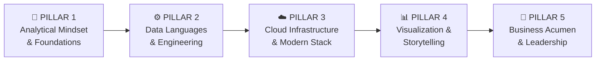

# 🎓 Master Curriculum: Data Analytics

### From Junior to Senior — A Complete Learning Roadmap

> **Scope:** Data Analyst (core) + DE literacy (Middle/Senior) + DS bridge (Senior)
> **Structure:** 5 Pillars × 3 Levels (Junior → Middle → Senior)
> **Philosophy:** Tools change, thinking lasts forever.

---

## 🗺️ Overview: The 5 Pillars



| Pillar                             | Vai trò                             | Metaphor         |
| ---------------------------------- | ------------------------------------ | ---------------- |
| **P1** Analytical Mindset    | Tư duy & nền tảng khoa học       | *Bộ não*     |
| **P2** Data Languages        | Ngôn ngữ & kỹ thuật xử lý      | *Đôi tay*    |
| **P3** Cloud Infrastructure  | Môi trường & hạ tầng vận hành | *Nhà xưởng* |
| **P4** Visualization         | Giao tiếp & trình bày insight     | *Giọng nói*  |
| **P5** Business & Leadership | Tạo ra giá trị kinh doanh         | *Trái tim*    |

---

## Level Definitions

| Level            | Kinh nghiệm | Kỳ vọng đầu ra                               |
| ---------------- | ------------ | ------------------------------------------------ |
| **Junior** | 0–2 năm    | Làm được task độc lập, cần mentor review |
| **Middle** | 2–5 năm    | Tự dẫn dắt project, bridge DA ↔ DE/DS        |
| **Senior** | 5+ năm      | Define strategy, lead team, drive culture        |

---

---

# 🧠 PILLAR 1: Analytical Mindset & Foundations

> *Gốc rễ của nghề. Công cụ thay đổi, tư duy tồn tại mãi mãi.*

---

## Junior Level

### 1.1 Types of Analytics — 4 Cấp độ Phân tích

| Type                   | Câu hỏi                 | Ví dụ thực tế                                |
| ---------------------- | ------------------------- | ------------------------------------------------ |
| **Descriptive**  | Chuyện gì đã xảy ra? | Doanh thu tháng 5 là bao nhiêu?               |
| **Diagnostic**   | Tại sao nó xảy ra?     | Tại sao doanh thu tháng 5 giảm 15%?           |
| **Predictive**   | Chuyện gì sắp xảy ra? | Tháng 6 doanh thu có khả năng bao nhiêu?    |
| **Prescriptive** | Chúng ta nên làm gì?  | Nên tăng ngân sách kênh nào để tối ưu? |

### 1.2 Descriptive Statistics — Thống kê Mô tả

- Measures of central tendency: Mean, Median, Mode
- Measures of spread: Variance, Standard Deviation, IQR, Percentiles
- Distribution: Normal, Skewed (left/right), Bimodal
- Outlier detection: Z-score, IQR method

### 1.3 Probability Basics — Xác suất Nền tảng

- Xác suất cơ bản, Xác suất có điều kiện
- Bayes' Theorem (hiểu khái niệm, không cần tính tay nâng cao)
- Expected Value

### 1.4 Cognitive Biases — Thiên kiến Nhận thức

- **Survivorship Bias** — chỉ nhìn thấy "người sống sót"
- **Confirmation Bias** — tìm bằng chứng ủng hộ quan điểm sẵn có
- **Sampling Bias** — mẫu không đại diện cho tổng thể
- **Simpson's Paradox** — xu hướng đảo ngược khi gộp nhóm

### 1.5 Problem Framing — Đặt vấn đề đúng

- SMART Questions framework
- 5 Whys technique

---

## Middle Level

### 1.6 Hypothesis Testing — Kiểm định Giả thuyết

- Null hypothesis (H₀) vs Alternative hypothesis (H₁)
- p-value, significance level (α), statistical power (β)
- Type I Error (False Positive) vs Type II Error (False Negative)
- t-test (one-sample, two-sample, paired)
- Chi-square test (categorical data)
- ANOVA (so sánh nhiều nhóm)

### 1.7 A/B Testing Statistics

- Sample size calculation (effect size, power analysis)
- Multiple testing problem (Bonferroni correction)
- Sequential testing vs fixed-horizon testing
- Peeking problem (early stopping bias)

### 1.8 Correlation vs Causation

- Pearson, Spearman correlation
- Confounding variables
- Spurious correlations
- Introduction to causal diagrams (DAGs)

### 1.9 Root Cause Analysis — Phân tích Nguyên nhân Gốc rễ

- Fishbone Diagram (Ishikawa)
- Pareto Analysis (80/20 rule)
- Drill-down analysis methodology
- First-Principle Thinking

---

## Senior Level

### 1.10 Causal Inference — Suy luận Nhân quả

- Difference-in-Differences (DiD)
- Regression Discontinuity Design (RDD)
- Instrumental Variables (IV)
- Synthetic Control Method
- Causal Impact (Google's framework)

### 1.11 Advanced Experimental Design

- Factorial design & interaction effects
- Multi-armed bandit algorithms (Thompson Sampling, UCB)
- Quasi-experiments
- Network effects in experiments (interference/SUTVA violations)

### 1.12 Time Series Analysis

- Decomposition (Trend, Seasonality, Residual)
- Stationarity & ADF test
- ARIMA, SARIMA
- Facebook Prophet cho business forecasting

### 1.13 Bayesian Thinking

- Bayesian vs Frequentist mindset
- Prior, Likelihood, Posterior
- Bayesian A/B testing
- Credible intervals vs Confidence intervals

---

---

# ⚙️ PILLAR 2: Data Languages & Engineering Literacy

> *Ngôn ngữ nói chuyện với dữ liệu và tư duy kỹ nghệ phần mềm.*

---

## Junior Level

### 2.1 SQL — Foundations

- SELECT, FROM, WHERE, ORDER BY, LIMIT
- JOIN types: INNER, LEFT, RIGHT, FULL OUTER, CROSS
- GROUP BY, HAVING, aggregate functions (COUNT, SUM, AVG, MIN, MAX)
- Subqueries (correlated vs non-correlated)
- UNION vs UNION ALL

### 2.2 SQL — Intermediate

- **Window Functions:** ROW_NUMBER, RANK, DENSE_RANK, LAG, LEAD, FIRST_VALUE, LAST_VALUE
- **Window clauses:** PARTITION BY, ORDER BY, ROWS/RANGE BETWEEN
- **CTEs:** WITH clause, chaining multiple CTEs
- CASE WHEN expressions
- Date/time functions
- String functions & pattern matching (LIKE, REGEXP)
- NULL handling (COALESCE, NULLIF, IS NULL)

### 2.3 Python — Basics

- Data types: int, float, str, bool, list, dict, tuple, set
- Control flow: if/else, for/while loops
- Functions, lambda functions
- List comprehensions
- Error handling: try/except
- File I/O: đọc/ghi CSV, JSON

### 2.4 Python — Pandas

- Series và DataFrame
- Data loading: read_csv, read_excel, read_json
- Data exploration: head, tail, info, describe, shape, dtypes
- Data selection: loc, iloc, boolean indexing
- Data cleaning: dropna, fillna, drop_duplicates, replace
- Data transformation: apply, map, groupby + agg
- Merging: merge, join, concat
- Reshaping: pivot_table, melt, stack/unstack

### 2.5 Python — NumPy

- Array creation & operations
- Broadcasting
- Statistical functions

### 2.6 Data Formats & Types

- Structured vs Semi-structured vs Unstructured data
- CSV, JSON, Parquet, Avro — khi nào dùng cái nào
- Schema design basics

### 2.7 Git — Basics

- git init, clone, add, commit, push, pull
- Branching: branch, checkout, merge
- .gitignore
- GitHub: Repository, Issues, Pull Requests cơ bản

---

## Middle Level

### 2.8 SQL — Advanced

- Query optimization: EXPLAIN, EXPLAIN ANALYZE
- Execution plans & query cost
- Index strategies (B-tree, Hash, Composite index)
- Recursive CTEs
- Materialized Views vs Regular Views
- Stored Procedures & Functions (hiểu khái niệm)
- Transactions (ACID properties)

### 2.9 Python — Advanced

- Advanced Pandas: MultiIndex, memory optimization, categorical dtype
- Performance: vectorization thay vì loops
- Polars (alternative hiệu năng cao hơn Pandas)
- Regular Expressions với Python
- Environment management: venv, conda, pyenv

### 2.10 Python — Visualization

- Matplotlib: figure, axes, subplots
- Seaborn: statistical plots
- Plotly: interactive charts
- Streamlit: quick data apps & prototypes

### 2.11 Data Modeling

- **Dimensional Modeling (Kimball):** Facts vs Dimensions
- **Star Schema:** Fact table + Dimension tables
- **Snowflake Schema:** Normalized dimensions
- Grain definition — bước quan trọng nhất trong data modeling
- SCD Type 1, 2, 3 (Slowly Changing Dimensions)
- Late-arriving facts & dimensions

### 2.12 dbt — Foundations

- dbt project structure (models, sources, seeds, tests, docs)
- Materializations: table, view, incremental, ephemeral
- `ref()` và `source()` macros
- Schema testing: not_null, unique, accepted_values, relationships
- Documentation: `description`, `meta`, `tags`
- dbt run, test, docs generate

### 2.13 ETL vs ELT Patterns

- ETL: Extract → Transform → Load (traditional)
- ELT: Extract → Load → Transform (modern, cloud-native)
- Trade-offs của từng approach

### 2.14 API Consumption

- REST API concepts (GET, POST, PUT, DELETE)
- Python requests library
- Authentication: API Key, OAuth 2.0 basics
- Pagination & rate limiting
- Parsing JSON responses thành DataFrame

### 2.15 Data Quality

- Dimensions of data quality: Accuracy, Completeness, Consistency, Timeliness, Uniqueness
- Data validation rules
- Anomaly detection basics (Z-score, IQR trên production data)
- Great Expectations framework

### 2.16 Git — Intermediate

- Branching strategies: GitHub Flow, Gitflow
- Pull Request workflow & Code Review
- Merge vs Rebase
- Cherry-pick, stash, reset

---

## Senior Level

### 2.17 dbt — Advanced

- Jinja templating & dbt macros
- dbt packages (dbt-utils, dbt-expectations)
- Exposures (downstream dependencies)
- Metrics layer (dbt Semantic Layer)
- dbt CI/CD với GitHub Actions
- dbt Mesh & cross-project refs

### 2.18 Data Governance

- **Data Lineage:** Truy xuất nguồn gốc dữ liệu end-to-end
- **Data Catalog:** OpenMetadata, Apache Atlas, Datahub
- **Data Contracts:** Schema agreements giữa producer & consumer
- **Data Mesh:** Distributed data ownership principles
- DAMA-DMBOK framework overview
- GDPR & data privacy compliance

### 2.19 Orchestration Basics (DE Bridge)

- Directed Acyclic Graphs (DAGs) — khái niệm cốt lõi
- Apache Airflow: DAG structure, operators, sensors, XComs
- Prefect / Dagster (modern alternatives)
- Schedule-based vs event-based triggers
- Monitoring & alerting pipelines

### 2.20 Batch vs Streaming Architecture

- Batch processing: Lambda architecture, khi nào dùng
- Streaming concepts: event-time vs processing-time, watermarks
- Kafka basics: topics, partitions, producers, consumers
- Flink / Spark Streaming awareness
- Khi nào cần streaming vs batch trong business context

### 2.21 Testing Strategy for Data

- Unit tests cho dbt models
- Data contract testing
- End-to-end pipeline testing
- Monitoring & observability (Monte Carlo, Soda)

---

---

# ☁️ PILLAR 3: Cloud Infrastructure & Modern Data Stack

> *Nhà xưởng vận hành toàn bộ hệ thống dữ liệu hiện đại.*

---

## Junior Level

### 3.1 Cloud Fundamentals

- Cloud computing models: IaaS, PaaS, SaaS — hiểu khi nào dùng gì
- Chọn 1 cloud provider để học sâu: **AWS** / **GCP** / **Azure**
- Regions, Availability Zones, Edge Locations

### 3.2 Cloud Storage

- Object storage: S3 (AWS), GCS (GCP), ADLS Gen2 (Azure)
- Đọc/ghi data từ cloud storage với Python & SQL
- Storage classes & lifecycle policies (cost basics)
- Blob vs File vs Queue storage

### 3.3 Cloud Data Warehouse — Querying

- **Google BigQuery:** Serverless, columnar, partition/cluster basics
- **Snowflake:** Virtual warehouses, databases, schemas
- **Amazon Redshift:** Distribution keys, sort keys
- **Microsoft Fabric / Synapse:** End-to-end analytics platform
- Kết nối BI tools vào cloud warehouse

### 3.4 IAM & Security Basics

- Identity & Access Management (IAM)
- Least privilege principle
- Service accounts vs user accounts
- Roles & permissions management

---

## Middle Level

### 3.5 Cloud Architecture Patterns

- **Data Lake:** Raw data storage, schema-on-read
- **Data Warehouse:** Structured, schema-on-write, optimized for analytics
- **Data Lakehouse:** Kết hợp tốt nhất của cả hai (Delta Lake, Iceberg, Hudi)
- Lambda Architecture vs Kappa Architecture
- Medallion Architecture (Bronze → Silver → Gold)

### 3.6 Modern Data Stack Architecture

```
Ingestion → Storage → Transform → Semantic → Visualization
(Fivetran)  (BigQuery)  (dbt)    (Metrics Layer) (Power BI)
```

- Data ingestion tools: **Fivetran**, **Airbyte**, **Stitch**
- Reverse ETL: **Census**, **Hightouch** (data về operational systems)

### 3.7 Cloud Data Warehouse — Advanced

- **BigQuery:** Partitioning, Clustering, Materialized Views, BI Engine, Slots
- **Snowflake:** Multi-cluster warehouses, Snowpipe, Time Travel, Data Sharing
- Query cost optimization strategies
- Caching mechanisms

### 3.8 Lakehouse Formats

- **Apache Iceberg:** ACID transactions trên data lake, time travel
- **Delta Lake:** Databricks ecosystem, Delta tables
- **Apache Hudi:** Upserts, incremental processing
- So sánh: khi nào chọn format nào

### 3.9 Compute & Serverless

- Cloud Functions (Lambda/Cloud Functions/Azure Functions)
- Containerization basics: Docker cho data engineers
- Managed Spark: Databricks, EMR, Dataproc
- Cost model: on-demand vs reserved vs spot

### 3.10 Microsoft Fabric (End-to-End)

- OneLake architecture
- Lakehouse trong Fabric
- Data Factory, Dataflow Gen2
- Semantic Model & Power BI tích hợp

---

## Senior Level

### 3.11 Data Platform Engineering

- Platform thinking: data platform như một internal product
- Self-serve analytics platform design
- Data developer experience (DX)
- Internal tooling & automation

### 3.12 Infrastructure as Code (IaC)

- Terraform basics: providers, resources, state, modules
- Managing cloud resources as code
- CI/CD cho infrastructure

### 3.13 Streaming Architecture

- **Apache Kafka:** Architecture sâu (replication, consumer groups, compaction)
- **Google Pub/Sub / AWS Kinesis / Azure Event Hubs**
- Stream processing: Flink, Spark Structured Streaming
- Exactly-once semantics
- Change Data Capture (CDC): Debezium

### 3.14 Data Mesh Implementation

- Domain-oriented decentralized data ownership
- Data as a product
- Self-serve data infrastructure as a platform
- Federated computational governance
- Implementing data mesh trên cloud

### 3.15 Cloud Security & Compliance

- Data encryption (at rest, in transit)
- VPC, Private networking cho data platforms
- Data residency & sovereignty
- GDPR, SOC2, ISO27001 awareness
- Audit logging & monitoring

### 3.16 FinOps for Data

- Cloud cost attribution
- Reserved capacity vs on-demand optimization
- Cost anomaly detection
- Showback/Chargeback models cho data teams
- BigQuery / Snowflake cost optimization patterns

---

---

# 📊 PILLAR 4: Visualization & Data Storytelling

> *Dữ liệu chỉ có giá trị khi người khác hiểu được nó.*

---

## Junior Level

### 4.1 Visual Perception Principles

- Pre-attentive attributes: màu sắc, hình dạng, kích thước, vị trí
- Gestalt principles: proximity, similarity, closure, continuity
- Working memory limitations (Miller's Law — 7±2)
- Eye-tracking patterns: F-pattern, Z-pattern

### 4.2 Chart Selection Guide

| Mục đích                | Chart phù hợp                     |
| -------------------------- | ----------------------------------- |
| So sánh giữa các nhóm  | Bar chart, Grouped bar              |
| Xu hướng theo thời gian | Line chart, Area chart              |
| Phân phối                | Histogram, Box plot, Violin         |
| Tương quan               | Scatter plot, Bubble chart          |
| Tỷ lệ/Cơ cấu           | Pie (≤5 phần), Treemap, Waterfall |
| Địa lý                  | Choropleth map, Bubble map          |
| Nhiều biến               | Heatmap, Parallel coordinates       |

> ⚠️ **Anti-patterns:** Tránh 3D charts, Dual-axis (nếu không cần thiết), Pie chart >5 slices

### 4.3 Decluttering Principles (Edward Tufte)

- Data-ink ratio: maximize data, minimize non-data ink
- Chartjunk: xóa gridlines thừa, borders, backgrounds
- Direct labeling thay vì legends khi có thể
- Consistent color usage

### 4.4 Color Theory for Data

- Categorical palettes: phân biệt nhóm (ColorBrewer)
- Sequential palettes: low → high (magnitude)
- Diverging palettes: có điểm trung tính (positive/negative)
- Accessibility: Color blindness considerations (Deuteranopia)

### 4.5 BI Tools — Basics (Power BI hoặc Tableau)

**Power BI:**

- Power BI Desktop: Data model, Report, Service
- Connecting data sources
- Basic visuals: Bar, Line, Pie, Map, Table, Matrix, Card
- Filters: Visual-level, Page-level, Report-level
- Slicers & Cross-filtering

**Tableau (alternative):**

- Connecting data, Data pane, Marks card
- Dimensions vs Measures
- Basic chart types, Filters, Parameters

### 4.6 Dashboard Design Principles

- Layout hierarchy: most important → top left
- White space as a design element
- Consistent color & typography
- Mobile responsiveness awareness
- Loading performance considerations

---

## Middle Level

### 4.7 Power BI — DAX & Data Modeling

- DAX fundamentals: calculated columns vs measures
- Context: row context vs filter context
- Core functions: CALCULATE, FILTER, ALL, ALLEXCEPT, RELATED
- Time intelligence: DATEADD, SAMEPERIODLASTYEAR, DATESYTD
- Iterator functions: SUMX, AVERAGEX, RANKX
- Variables trong DAX: VAR...RETURN

### 4.8 Power BI — Advanced Features

- Star schema trong Power BI data model
- Bidirectional relationships (khi nào nên/không nên)
- Row Level Security (RLS)
- Composite models & DirectQuery vs Import
- Bookmarks, Buttons, Tooltips, Drill-through
- Performance Analyzer & query diagnostics

### 4.9 Data Storytelling Framework

- **SCR Structure:** Situation → Complication → Resolution
- **Pyramid Principle:** Conclusion first, evidence later
- Insight vs Finding: "Doanh thu giảm 15%" là Finding, "Vì kênh Facebook CPC tăng 40% làm CAC vượt LTV" là Insight
- Actionable Insights: mỗi insight phải có recommendation đi kèm

### 4.10 Executive Reporting

- 1-3-10 rule: 1 trang executive summary, 3 trang detail, 10 trang appendix
- Single-page dashboard: 1 key message rõ ràng
- KPI cards với context (vs target, vs previous period)
- Traffic light system cho status reporting

### 4.11 AI-Assisted BI

- Copilot trong Power BI: natural language queries
- Gemini trong Looker Studio
- Auto-insights & anomaly detection
- Q&A visual trong Power BI
- AI Narratives: automated insight text generation

### 4.12 Python Visualization (Advanced)

- Plotly Dash: interactive web apps for data
- Streamlit: rapid prototyping cho internal tools
- Altair: declarative visualization
- Bokeh: web-ready interactive charts

---

## Senior Level

### 4.13 Data Product Thinking

- Dashboard-as-a-product: user research cho BI consumers
- User interviews: hiểu decision-making process của stakeholders
- Usability testing cho dashboards
- Product roadmap cho analytics platforms
- SLA cho data products (freshness, accuracy SLAs)

### 4.14 Custom & Embedded Analytics

- Custom visuals trong Power BI (Power BI SDK)
- Embedded analytics: Power BI Embedded, Tableau Embedded
- D3.js basics: SVG, scales, axes (awareness level)
- Looker Explores & LookML

### 4.15 Data Journalism Techniques

- Annotation-driven storytelling
- Scrollytelling concepts
- Information hierarchy for complex narratives
- When to use static vs interactive

### 4.16 C-Suite Presentation Skills

- Structuring a board-level data presentation
- Communicating uncertainty to non-technical audience
- Pre-mortem & scenario analysis presentation
- Managing tough questions on data methodology

---

---

# 💼 PILLAR 5: Business Acumen, Advanced Analytics & Leadership

> *Trụ cột tạo ra tiền cho doanh nghiệp và phân biệt DA xuất sắc với DA thông thường.*

---

## Junior Level

### 5.1 Business Fundamentals

- Business model canvas: 9 building blocks
- Revenue streams & cost structures
- P&L (Profit & Loss) basics: Revenue, COGS, Gross Margin, EBITDA
- Unit economics: LTV, CAC, Payback Period

### 5.2 Universal Business Metrics

| Metric               | Ý nghĩa                                |
| -------------------- | ---------------------------------------- |
| **CAC**        | Customer Acquisition Cost                |
| **LTV / CLV**  | (Customer) Lifetime Value                |
| **Churn Rate** | Tỷ lệ rời bỏ khách hàng            |
| **NPS**        | Net Promoter Score                       |
| **GMV**        | Gross Merchandise Value                  |
| **ARR / MRR**  | Annual/Monthly Recurring Revenue         |
| **DAU/MAU**    | Daily/Monthly Active Users               |
| **MoM / YoY**  | Month-over-Month / Year-over-Year growth |

### 5.3 Domain Knowledge — Pick 1 Industry

Chọn 1 trong các ngành sau để học sâu metric và business model:

- **E-commerce / Retail:** Conversion rate, AOV, Cart abandonment, Inventory turnover
- **Finance / Fintech:** NPL ratio, Net Interest Margin, RAROC
- **SaaS / Tech:** MRR, ARR, Churn, Expansion Revenue, NRR
- **Healthcare:** ALOS, Readmission rate, Cost per patient
- **Logistics:** OTP (On-Time Performance), Cost per kg, Fill rate

### 5.4 Requirement Gathering — Basics

- Biết đặt câu hỏi TRƯỚC khi phân tích
- Clarifying questions framework: Who, What, When, Why, How
- Distinguishing: stakeholder muốn gì ↔ stakeholder thực sự cần gì
- Documentation: ghi lại assumptions rõ ràng

### 5.5 Communication — Analysis Writing

- Structure: Context → Finding → Implication → Recommendation
- Quantify everything: tránh "tăng nhiều", dùng "tăng 23% MoM"
- Know your audience: viết khác nhau cho technical vs non-technical

---

## Middle Level

### 5.6 KPIs & OKRs Framework

- KPIs vs OKRs: sự khác biệt và cách phối hợp
- North Star Metric: chọn 1 metric phản ánh core value của product
- Metric trees: phân rã North Star xuống leading indicators
- Counter-metrics: tránh optimize 1 chiều
- Goodhart's Law: "Khi một measure trở thành target, nó không còn là good measure"

### 5.7 Product Analytics

- User Journey Mapping: awareness → acquisition → activation → retention → revenue → referral (AARRR)
- Funnel Analysis: conversion rate tại mỗi step, drop-off points
- Cohort Analysis: retention curves, behavioral cohorts
- Session analysis, pageview analysis
- Heatmaps & session recordings (Hotjar, FullStory awareness)

### 5.8 A/B Testing — End-to-End

- Hypothesis formulation (cụ thể, measurable)
- Treatment & control group design
- Sample size & duration calculation
- Randomization & assignment strategies
- Analysis: statistical significance + practical significance
- Decision framework: khi nào ship, khi nào iterate

### 5.9 Advanced Business Analysis

- RFM Analysis (E-commerce): Recency, Frequency, Monetary
- Customer Segmentation strategies
- Market Basket Analysis (Association Rules)
- Price elasticity analysis
- Churn prediction fundamentals

### 5.10 Applied Machine Learning (No-code-from-scratch)

**Supervised Learning:**

- Linear Regression: predicting continuous values
- Logistic Regression: binary classification
- Decision Trees & Random Forests: interpretable models
- Gradient Boosting (XGBoost, LightGBM): production-grade

**Unsupervised Learning:**

- K-Means Clustering: customer segmentation
- DBSCAN: density-based clustering
- PCA: dimensionality reduction

**Practical workflow với scikit-learn:**

- Feature selection & engineering
- Train/Validation/Test split
- Cross-validation
- Model evaluation: MAE, RMSE, R² (regression) / Accuracy, Precision, Recall, F1, AUC-ROC (classification)
- Hyperparameter tuning: GridSearchCV, RandomizedSearchCV

### 5.11 Stakeholder Management

- Managing up: báo cáo với manager/C-suite
- Managing sideways: phối hợp với product, engineering, marketing
- Managing conflict: khi data contradicts stakeholder's belief
- Expectation setting: timeline, data availability, model limitations
- "No" với data: cách từ chối request không có giá trị

---

## Senior Level

### 5.12 Advanced ML & DS Bridge

- Feature engineering nâng cao: encoding strategies, feature interactions
- Model interpretability: SHAP values, LIME, Partial Dependence Plots
- MLOps awareness: model versioning, model registry, drift detection
- Collaborate với Data Scientists: review model design, evaluate business fit
- Experimentation với ML models: champion/challenger framework

### 5.13 Causal ML & Advanced Experimentation

- Uplift Modeling: identify who benefits from an intervention
- Treatment Effect Estimation (ATE, ATT, HTE)
- Causal Impact (Bayesian structural time series)
- Switchback experiments (cho marketplace/logistics)
- Long-term effects: handling novelty effects, user learning

### 5.14 AI/LLM for Analytics

- Prompt engineering cho data analysis tasks
- Text-to-SQL tools: integration & limitations
- LLM-assisted insight generation
- Building internal analytics chatbots (awareness)
- Analyzing unstructured data với LLMs: sentiment, topic modeling, classification
- Vector databases & semantic search basics

### 5.15 Data Strategy & Roadmap

- Định nghĩa data vision cho tổ chức
- Data maturity assessment (Gartner Data & Analytics Maturity Model)
- Build vs Buy decisions cho data tools
- Data platform roadmap: 6-month, 1-year, 3-year
- ROI calculation cho data initiatives
- Building business case cho data investments

### 5.16 Data Culture & Organization

- Types of data teams: centralized, federated, hybrid
- Embedded analytics model
- Data literacy programs cho non-technical teams
- Creating self-serve analytics culture
- OKRs cho data teams

### 5.17 Leadership & People Management

- Technical mentoring: structured 1:1s, code/analysis reviews
- Hiring: designing take-home challenges, interview rubrics
- Onboarding new DA team members
- Managing performance & career development
- Cross-functional influence without authority

### 5.18 Ethics & Responsible Analytics

- Algorithmic bias: types, detection, mitigation
- Fairness metrics cho ML models
- Privacy by design
- Data ethics frameworks
- Communicating model limitations & uncertainty

---

---

## 📋 Curriculum Summary Matrix

| Topic Area                  | Junior | Middle |    Senior    |
| --------------------------- | :----: | :----: | :-----------: |
| Descriptive Statistics      |   ✅   |   ✅   |      ✅      |
| Hypothesis Testing          |   -   |   ✅   |      ✅      |
| Causal Inference            |   -   |   🔰   |      ✅      |
| SQL Basics & Window Funcs   |   ✅   |   ✅   |      ✅      |
| SQL Advanced & Optimization |   -   |   ✅   |      ✅      |
| Python / Pandas             |   ✅   |   ✅   |      ✅      |
| dbt                         |   -   |   ✅   | ✅ (Advanced) |
| Data Modeling               |   -   |   ✅   |      ✅      |
| Data Governance             |   -   |   -   |      ✅      |
| Cloud Querying              |   ✅   |   ✅   |      ✅      |
| Cloud Architecture          |   -   |   ✅   |      ✅      |
| Cloud Platform Engineering  |   -   |   -   |      ✅      |
| Streaming / Kafka           |   -   |   🔰   |      ✅      |
| BI Tool (Power BI/Tableau)  |   ✅   |   ✅   |      ✅      |
| DAX / Advanced BI           |   -   |   ✅   |      ✅      |
| Data Storytelling           |   ✅   |   ✅   |      ✅      |
| Business Metrics            |   ✅   |   ✅   |      ✅      |
| A/B Testing                 |   -   |   ✅   |      ✅      |
| Applied ML                  |   -   |   ✅   |      ✅      |
| Causal ML / LLM             |   -   |   -   |      ✅      |
| People Leadership           |   -   |   -   |      ✅      |

> ✅ Core requirement | 🔰 Awareness/Intro | - Not required yet

---

## 🗓️ Estimated Learning Timeline

| Level            | Duration      | Key Milestones                                                        |
| ---------------- | ------------- | --------------------------------------------------------------------- |
| **Junior** | 3–6 months   | SQL Window Functions + Pandas + 1 BI Tool + Dashboard project         |
| **Middle** | 6–12 months  | dbt project + Cloud Warehouse + ML model + A/B test end-to-end        |
| **Senior** | 12–24 months | Data strategy doc + Lead a cross-functional project + Causal analysis |

---

*Made by Anh Tu - Share to be share*
