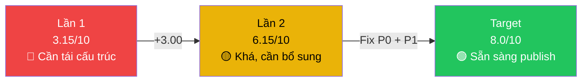

# 📋 Báo cáo Đánh giá Roadmap Data Analyst 2026 — Lần 2

> **Đối tượng đánh giá:** [da_roadmap_2026.md](file:///Users/anhtus/Documents/Development/Documentary/vuanhtu1993.github.io/docs/data-analyst/da_roadmap_2026.md) (bản cập nhật)
> **Benchmark:** [da_master_curriculum.md](file:///Users/anhtus/Documents/Development/Documentary/vuanhtu1993.github.io/docs/data-analyst/da_master_curriculum.md)
> **Ngày đánh giá:** 2026-08-06 (Re-evaluation)
> **Phạm vi:** So sánh với đánh giá lần 1, phân tích cải thiện và gaps còn lại

---

## 1. Executive Summary — So sánh 2 lần đánh giá

| Tiêu chí | Lần 1 | Lần 2 | Thay đổi |
|---|:---:|:---:|:---:|
| Detailed Syllabus | Chỉ Month 1 | Tất cả 6 tháng | 🟢 **+5 months** |
| Resources | Chỉ Month 1 | Tất cả 6 tháng | 🟢 **Cải thiện lớn** |
| Mini Projects | 1 project | 8+ projects | 🟢 **Cải thiện lớn** |
| Soft Skills | Không có | 3 blocks (M1-2, M3-4, M5-6) | 🟢 **Mới thêm** |
| Project Portfolio | Không có | 9 projects (3 domains × 3 levels) | 🟢 **Mới thêm** |
| Practice Datasets | Không có | 4 datasets với links | 🟢 **Mới thêm** |
| Pillar Coverage (vs Curriculum) | ~30% | ~50% | 🟡 **Tăng nhưng chưa đủ** |
| Progression Logic | 2 lỗi Critical | 1 lỗi Major còn lại | 🟡 **Cải thiện 1 phần** |

> **Verdict:** Roadmap đã **cải thiện đáng kể** về chiều sâu nội dung và tính hoàn thiện. Tuy nhiên, **3 vấn đề cốt lõi** vẫn tồn tại — xem chi tiết bên dưới.

---

## 2. Phân tích những cải thiện đáng ghi nhận ✅

### 2.1 Content Depth — Từ skeleton thành full syllabus

Bản cập nhật đã giải quyết **vấn đề #3 từ đánh giá lần 1** (detail không đồng đều):

| Month | Lần 1 | Lần 2 | Nhận xét |
|---|---|---|---|
| Month 1 | ⭐⭐⭐⭐⭐ | ⭐⭐⭐⭐⭐ | Giữ nguyên, vẫn tốt |
| Month 2 | ⭐⭐ | ⭐⭐⭐⭐ | Topics cụ thể, resources tốt, có mini project |
| Month 3 | ⭐⭐ | ⭐⭐⭐⭐ | Analytical Thinking topics chi tiết, resources rõ ràng |
| Month 4 | ⭐⭐ | ⭐⭐⭐⭐ | Pandas topics cụ thể, có sách Wes McKinney |
| Month 5 | ⭐⭐ | ⭐⭐⭐⭐ | ML algorithms liệt kê rõ, có AutoML section |
| Month 6 | ⭐ | ⭐⭐⭐⭐⭐ | Domain apps chi tiết (Marketing/Sales/Risk), capstone rõ |

### 2.2 Soft Skills — Bổ sung quan trọng

Roadmap giờ có **3 blocks Soft Skills** phân bổ hợp lý:

| Block | Nội dung | Mapping tới Curriculum |
|---|---|---|
| M1-2 | Critical thinking, business communication, asking questions | P5.4 Requirement Gathering ✅ |
| M3-4 | Data storytelling, presentation, translating insights | P4.9 Data Storytelling ✅ |
| M5-6 | Executive presentations, stakeholder management, ethics | P5.11 Stakeholder Management ✅ |

> [!TIP]
> Đây là cải thiện **rất tốt** — Soft Skills thường bị bỏ qua trong các roadmap technical, nhưng thực tế đây là yếu tố phân biệt DA giỏi với DA trung bình.

### 2.3 Project Portfolio & Datasets — Giá trị thực tế cao

Phần mới thêm cuối file (**9 projects × 3 domains** + **4 practice datasets**) là điểm cộng lớn:

- **Progressive difficulty:** Beginner → Intermediate → Advanced cho mỗi domain
- **Skills mapping rõ ràng:** Mỗi project ghi rõ "Skills: Excel, Python, SQL..."
- **3 domains thực tế:** Marketing, Sales, Risk — đúng nhu cầu thị trường
- **Datasets có link cụ thể** — learner không phải tự tìm

### 2.4 Analytical Thinking — Đã chi tiết hóa

Week 9-10 giờ có topics cụ thể:
- Problem Framing & Business Context Mastery
- Hypothesis-Driven Thinking
- MECE & Structured Problem Decomposition
- Analytical Strategy Design
- Storytelling & Persuasive Problem Solving

Đây cover một phần **P1.5 Problem Framing** và **P4.9 Data Storytelling** từ Curriculum.

---

## 3. Coverage Analysis — Cập nhật

### 3.1 Phân tích theo 5 Pillars (Updated)

#### 🧠 Pillar 1: Analytical Mindset & Foundations — Coverage: ~40% → ~55%

| Curriculum Topic (Junior) | Lần 1 | Lần 2 | Ghi chú |
|---|:---:|:---:|---|
| 1.1 Types of Analytics | ✅ | ✅ | Week 1-2 |
| 1.2 Descriptive Statistics | ✅ | ✅ | Week 1-2 |
| 1.3 Probability Basics | ⚠️ | ⚠️ | Vẫn chỉ nhắc "Probability" chung — thiếu Bayes', Expected Value |
| 1.4 Cognitive Biases | ❌ | ❌ | **Vẫn thiếu** |
| 1.5 Problem Framing | ❌ | ✅ | **Đã thêm** — Week 9-10 (MECE, Hypothesis-Driven) |

**Thay đổi:** Problem Framing đã được bổ sung ở Month 3. Tuy nhiên:

> [!WARNING]
> **Cognitive Biases (1.4) vẫn hoàn toàn thiếu.** Survivorship Bias, Confirmation Bias, Sampling Bias — đây là "antibodies" bảo vệ DA khỏi kết luận sai. Chi phí thêm vào chỉ ~2 giờ nội dung nhưng giá trị rất lớn.

#### ⚙️ Pillar 2: Data Languages & Engineering — Coverage: ~45% → ~55%

| Curriculum Topic (Junior) | Lần 1 | Lần 2 | Ghi chú |
|---|:---:|:---:|---|
| 2.1 SQL Foundations | ✅ | ✅ | Week 5-6, chi tiết hơn |
| 2.2 SQL Intermediate | ✅ | ✅ | Week 7-8 |
| 2.3 Python Basics | ⚠️ | ⚠️ | **Vẫn thiếu** — nhảy thẳng vào Pandas |
| 2.4 Python Pandas | ✅ | ✅ | Week 13-14, chi tiết tốt |
| 2.5 Python NumPy | ✅ | ✅ | Week 13-14 |
| 2.6 Data Formats & Types | ❌ | ❌ | **Vẫn thiếu** |
| 2.7 Git Basics | ❌ | ⚠️ | Week 23-24 nhắc "GitHub" nhưng không dạy Git |

**Vấn đề tồn tại:**

> [!IMPORTANT]
> **Python Basics (2.3) vẫn bị skip.** Week 13-14 title là "Advanced Python - Pandas & NumPy" nhưng learner lúc này mới chỉ biết Excel + SQL. Gọi là "Advanced Python" khi chưa dạy Python basics là **mâu thuẫn naming** và learner sẽ gặp khó với data types, functions, control flow.

#### ☁️ Pillar 3: Cloud Infrastructure — Coverage: 0% → ~0%

| Curriculum Topic (Junior) | Lần 1 | Lần 2 |
|---|:---:|:---:|
| 3.1 Cloud Fundamentals | ❌ | ❌ |
| 3.2 Cloud Storage | ❌ | ❌ |
| 3.3 Cloud Data Warehouse | ❌ | ❌ |
| 3.4 IAM & Security Basics | ❌ | ❌ |

> [!CAUTION]
> **Pillar 3 vẫn hoàn toàn vắng mặt — đây là gap nghiêm trọng nhất.** Năm 2026, ~90% Junior DA job descriptions yêu cầu BigQuery hoặc Snowflake. Không cần dạy sâu Cloud Architecture (Middle), nhưng **querying trên Cloud DW** (3.3) là must-have ở Junior level. Chỉ cần thêm 1 tuần giới thiệu BigQuery/Snowflake vào Month 2 hoặc 3 là đủ awareness.

#### 📊 Pillar 4: Visualization & Data Storytelling — Coverage: ~25% → ~45%

| Curriculum Topic (Junior) | Lần 1 | Lần 2 | Ghi chú |
|---|:---:|:---:|---|
| 4.1 Visual Perception Principles | ❌ | ❌ | **Vẫn thiếu** — Gestalt, Pre-attentive |
| 4.2 Chart Selection Guide | ⚠️ | ⚠️ | "Choosing the right chart" nhắc qua nhưng không chi tiết |
| 4.3 Decluttering Principles | ❌ | ❌ | **Vẫn thiếu** |
| 4.4 Color Theory for Data | ❌ | ❌ | **Vẫn thiếu** |
| 4.5 BI Tools (Power BI/Tableau) | ✅ | ✅ | Week 11-12, chi tiết tốt hơn |
| 4.6 Dashboard Design Principles | ⚠️ | ✅ | "Dashboard design best practices" — **Đã thêm** |

**Thay đổi:** Dashboard design đã được bổ sung. Soft Skills block M3-4 cover Data Storytelling.

> [!NOTE]
> Visualization theory (4.1-4.4) vẫn thiếu nhưng ở mức ít critical hơn vì "Storytelling with Data" (sách) đã nằm trong resources Week 3-4 — sách này cover khá nhiều visual principles. Có thể chấp nhận nếu learner đọc sách.

#### 💼 Pillar 5: Business Acumen — Coverage: ~15% → ~40%

| Curriculum Topic (Junior) | Lần 1 | Lần 2 | Ghi chú |
|---|:---:|:---:|---|
| 5.1 Business Fundamentals | ❌ | ❌ | P&L, Unit economics — **Vẫn thiếu** |
| 5.2 Universal Business Metrics | ❌ | ⚠️ | Month 6 nhắc RFM, CLV nhưng không dạy CAC, Churn Rate, ARR hệ thống |
| 5.3 Domain Knowledge | ⚠️ | ✅ | **Cải thiện lớn** — 3 domains chi tiết (Marketing/Sales/Risk) |
| 5.4 Requirement Gathering | ❌ | ✅ | Soft Skills M1-2: "Understanding stakeholder needs" |
| 5.5 Communication | ❌ | ✅ | Soft Skills M3-4: "Translating insights into business recommendations" |

**Thay đổi:** Domain Knowledge (5.3) cải thiện rất nhiều với 3 domains chi tiết. Communication và Requirement Gathering đã được thêm qua Soft Skills blocks.

---

### 3.2 Bảng tổng hợp Coverage — Lần 1 vs Lần 2

| Pillar | Lần 1 | Lần 2 | Δ |
|---|:---:|:---:|:---:|
| P1: Analytical Mindset | ~40% | ~55% | +15% |
| P2: Data Languages | ~45% | ~55% | +10% |
| P3: Cloud Infrastructure | 0% | **0%** | — |
| P4: Visualization | ~25% | ~45% | +20% |
| P5: Business Acumen | ~15% | ~40% | +25% |
| **Trung bình** | **~30%** | **~50%** | **+20%** |

---

## 4. Progression Logic Review — Cập nhật

### 4.1 Các vấn đề đã được giải quyết ✅

| Vấn đề (Lần 1) | Status Lần 2 |
|---|---|
| Detail syllabus thiếu Month 2-6 | ✅ **Đã giải quyết** |
| Thiếu resources Month 2-6 | ✅ **Đã giải quyết** |
| Thiếu mini projects | ✅ **Đã giải quyết** — Mỗi block 2 tuần đều có project |
| Thiếu Soft Skills | ✅ **Đã giải quyết** — 3 blocks phân bổ tốt |

### 4.2 Các vấn đề vẫn tồn tại ⚠️

#### 🟡 Vấn đề 1: Python Basics vẫn bị skip (giảm từ 🔴 → 🟡)

```
Week 11-12: Power BI/Tableau (BI Tools)
    ↓
Week 13-14: "Advanced Python - Pandas & NumPy"  ← ⚠️ Nhảy cóc
```

Learner từ nền Excel + SQL + BI Tools nhảy thẳng vào Pandas mà chưa biết:
- Python data types (`int`, `float`, `str`, `list`, `dict`)
- Control flow (`if/else`, `for/while`)
- Functions, lambda functions
- Error handling (`try/except`)

**Đề xuất:** Đổi Week 13 thành "Python Fundamentals" (1 tuần), Week 14-16 cho Pandas + Viz.

#### 🟡 Vấn đề 2: "Analytical Thinking" vẫn ở Month 3 thay vì Month 1

Mặc dù nội dung đã chi tiết hơn (MECE, Hypothesis-Driven Thinking), vị trí vẫn **sau** Excel và SQL. Trong Master Curriculum, P1 Analytical Mindset là **Pillar đầu tiên** — nền tảng tư duy phải có trước khi chạm tool.

**Mức độ:** Giảm từ 🔴 Critical → 🟡 Major vì:
- Soft Skills M1-2 đã bổ sung "Critical thinking" và "Problem-solving frameworks" → phần nào cover tư duy ở giai đoạn đầu
- Tuy nhiên, Problem Framing cụ thể (MECE, Hypothesis) vẫn nằm ở Month 3

#### 🟡 Vấn đề 3: ML progression — Cải thiện nhưng vẫn aggressive

**Cải thiện:**
- Week 15-16 đã thêm "Introduction to ML concepts" + Linear Regression → tạo bridge tốt hơn
- Week 17-18 ML algorithms giờ liệt kê cụ thể (Logistic Regression, Decision Trees, Random Forest...)
- Week 19-20 chuyển sang AutoML — hướng tiếp cận thực tế hơn "mastery"

**Vấn đề còn lại:**
- Từ "Introduction to ML" (Week 15-16) đến "Classification, Clustering, Model evaluation, Cross-validation, Hyperparameter tuning" (Week 17-18) chỉ **2 tuần** — vẫn quá nhanh
- Thiếu **Hypothesis Testing** và **A/B Testing** foundation trước ML (Curriculum 1.6, 1.7)
- Title "Machine Learning Mastery" vẫn overstate cho 4 tuần học

#### 🟢 Vấn đề 4 (Mới): Week 7-8 quá tham vọng

Week 7-8 "Advanced SQL" bao gồm:
- Performance Optimization & Query Tuning
- Database Design & Management
- Data Transformation & ETL with SQL
- SQL for BI & Dashboarding

Trong Master Curriculum, **Query Optimization** (2.8) và **ETL patterns** (2.13) thuộc **Middle Level** — không nên dạy ở tuần thứ 7-8 cho beginner. Nên giữ Window Functions + Views là đủ cho Junior.

---

## 5. Phân tích nội dung mới: Project Portfolio & Datasets

### 5.1 Project Portfolio — Đánh giá tốt

| Tiêu chí | Đánh giá | Chi tiết |
|---|:---:|---|
| Progressive difficulty | ⭐⭐⭐⭐⭐ | Beginner → Intermediate → Advanced cho mỗi domain |
| Skills mapping | ⭐⭐⭐⭐ | Rõ ràng, nhưng thiếu mapping ngược về "Week nào đã dạy skill này" |
| Domain relevance | ⭐⭐⭐⭐⭐ | Marketing, Sales, Risk — 3 domains hot nhất cho DA |
| Deliverable clarity | ⭐⭐⭐⭐ | Mô tả đủ rõ để learner biết phải làm gì |

### 5.2 Practice Datasets — Có vấn đề nhỏ

> [!NOTE]
> Tất cả 4 datasets đều link về cùng 1 URL (`madzynguyen.com/tong-hop-database...`). Nên đa dạng nguồn hơn — ví dụ thêm Kaggle datasets cụ thể cho từng project, hoặc Google Dataset Search.

---

## 6. Phân tích Resources Quality

### 6.1 Điểm mạnh

| Aspect | Đánh giá |
|---|---|
| **Sách chọn lọc tốt** | Naked Statistics, Storytelling with Data, Python for Data Analysis, Hands-On ML — đều là kinh điển |
| **YouTube channels phù hợp** | StatQuest, Keith Galli, Krish Naik — uy tín trong cộng đồng |
| **Courses phong phú** | Mix Coursera (free audit) + madzynguyen.com (Vietnamese) + Kaggle Learn (free) |
| **Practice platforms** | SQLZoo, LeetCode, Kaggle — đúng chuẩn industry |

### 6.2 Điểm cần cải thiện

| Vấn đề | Mức độ | Chi tiết |
|---|:---:|---|
| **Malformed URLs** | 🟡 | Nhiều link Coursera/Udemy vẫn là Google Search URL thay vì direct link |
| **Broken link format** | 🟡 | URL sách "Weapons of Math Destruction" dùng `<>` wrapper — có thể gây lỗi rendering |
| **Thiếu free alternatives** | 🟢 | Một số courses là paid (Udemy, madzynguyen) — nên ghi rõ `(Paid)` vs `(Free)` |
| **Duplicate YouTube links** | 🟢 | StatQuest playlist link xuất hiện 2 lần (Month 1 và Month 4) |

---

## 7. Scorecard Tổng hợp — Lần 2

| Tiêu chí | Trọng số | Lần 1 | Lần 2 | Δ | Ghi chú |
|---|:---:|:---:|:---:|:---:|---|
| **Coverage** | 25% | 3 | **5** | +2 | Tăng ~30% → ~50%, vẫn thiếu Cloud |
| **Progression** | 20% | 4 | **5.5** | +1.5 | ML bridge tốt hơn, nhưng Python basics skip |
| **Depth** | 20% | 3 | **7.5** | +4.5 | **Cải thiện lớn nhất** — tất cả months có detail |
| **Practicality** | 15% | 4 | **8** | +4 | 8+ mini projects + 9 portfolio projects + datasets |
| **Resources** | 10% | 2 | **7** | +5 | Books, YouTube, Courses cho mọi month |
| **Job-Readiness** | 10% | 2 | **5** | +3 | Có portfolio section, nhưng thiếu Cloud DW |
| **TỔNG** | **100%** | **3.15** | **6.15 / 10** | **+3.00** | |

```
Lần 1: ██████░░░░░░░░░░░░░░ 3.15/10 — Cần tái cấu trúc
Lần 2: ████████████░░░░░░░░ 6.15/10 — Khá, cần bổ sung gaps
Target: ████████████████░░░░ 8.00/10 — Đủ để publish
```

---

## 8. Remaining Gaps — Checklist ưu tiên

### 🔴 Priority 0 — Must Fix (Ảnh hưởng tới job-readiness)

- [ ] **Cloud DW Querying** — Thêm ít nhất 1 tuần BigQuery hoặc Snowflake (Curriculum 3.3). Gợi ý: đưa vào Week 7-8 thay thế "Performance Optimization" (topic này quá advanced cho beginner)
- [ ] **Python Basics** — Thêm 1 tuần Python fundamentals trước Pandas (data types, functions, control flow). Gợi ý: tách Week 13 thành Python Basics, dồn Pandas + Viz vào Week 14-16

### 🟡 Priority 1 — Should Fix (Ảnh hưởng tới chất lượng phân tích)

- [ ] **Cognitive Biases** (Curriculum 1.4) — Thêm vào Week 1-2 hoặc Week 9-10 (Survivorship, Confirmation, Sampling Bias, Simpson's Paradox)
- [ ] **Universal Business Metrics** (Curriculum 5.2) — Thêm bảng CAC, LTV, Churn Rate, NPS, ARR vào trước Domain Apps (Week 20 hoặc 21)
- [ ] **Git Basics** (Curriculum 2.7) — Dạy Git trước khi yêu cầu "GitHub portfolio" ở Week 23-24. Gợi ý: thêm Git vào Soft Skills M3-4 hoặc đầu Month 4
- [ ] **Đổi tên** "Machine Learning Mastery" → "Applied ML for Data Analysts" hoặc "Predictive Analytics Foundations"

### 🟢 Priority 2 — Nice to Have

- [ ] **Fix malformed URLs** — Chuyển Google Search URLs thành direct links
- [ ] **Data Formats** (Curriculum 2.6) — CSV, JSON, Parquet awareness
- [ ] **Visualization Theory** (Curriculum 4.1-4.4) — Pre-attentive attributes, Color Theory
- [ ] **Business Fundamentals** (Curriculum 5.1) — P&L basics, Unit Economics
- [ ] **Ghi rõ `(Free)` vs `(Paid)`** cho mỗi resource
- [ ] **Đa dạng hóa dataset links** — Không nên 4 datasets cùng 1 URL
- [ ] **Fix "Advanced Python" naming** ở Week 13-14 — Learner chưa biết Python basics mà gọi "Advanced" là confusing

---

## 9. Đề xuất cấu trúc tối ưu (Minimal Changes)

Thay vì tái cấu trúc toàn bộ, đây là **thay đổi tối thiểu** để đưa điểm từ 6.15 → 8.0:

| Tuần | Hiện tại | Đề xuất thay đổi | Lý do |
|---|---|---|---|
| W1-2 | Stats & Excel | **Thêm:** Cognitive Biases (2h) | Cover P1.4, chi phí thấp |
| W7-8 | Advanced SQL (quá rộng) | **Đổi:** Window Functions + CTEs + **Intro Cloud DW** (BigQuery) | Bỏ Query Tuning (Middle level), thêm Cloud |
| W13 | "Advanced Python" Pandas | **Đổi:** Python Basics (1 tuần) | Prerequisite cho Pandas |
| W14-15 | (gộp) | Pandas & NumPy + Data Cleaning | Dồn lại sau khi có Python basics |
| W16 | Viz (Matplotlib/Seaborn) | Giữ nguyên + **thêm:** Git Basics (3h) | Prerequisite cho portfolio |
| W17-18 | "ML Mastery" | **Đổi tên:** "Applied ML for DA" | Honest naming |
| W20 | AutoML | **Thêm:** Business Metrics overview (CAC, LTV, Churn) trước Domain Apps | Bridge P5.2 |

> [!TIP]
> Những thay đổi trên **không cần thêm tháng** — chỉ cần swap content trong các tuần hiện có. Đổi Query Tuning (Middle) → Cloud DW (Junior) là ví dụ: cùng thời lượng nhưng đúng level hơn.

---

## 10. Kết luận

### Progress Summary



### Tóm lại

**Đã làm tốt:**
- ✅ Full detailed syllabus cho 6 tháng
- ✅ Resources chất lượng (sách kinh điển + courses + YouTube)
- ✅ Mini projects cho mỗi block
- ✅ Portfolio section với 9 projects + 3 domains
- ✅ Soft Skills integration
- ✅ Analytical Thinking chi tiết (MECE, Hypothesis-Driven)

**Cần làm thêm (ưu tiên cao):**
- 🔴 Thêm Cloud DW (BigQuery/Snowflake) — swap Week 7-8 content
- 🔴 Thêm Python Basics trước Pandas — tách Week 13
- 🟡 Thêm Cognitive Biases vào Week 1-2
- 🟡 Thêm Business Metrics (CAC, LTV) trước Domain Apps
- 🟡 Dạy Git trước khi yêu cầu GitHub portfolio
- 🟡 Honest naming: "Applied ML" thay vì "ML Mastery"

---

*Made by Anh Tu - Share to be share*
