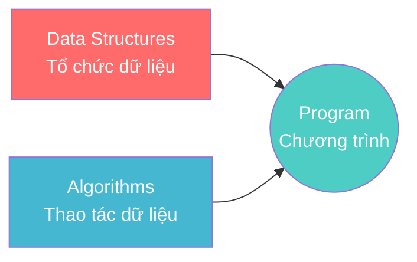

# Data Structures & Algorithms với TypeScript

Chào mừng bạn đến với chuỗi bài học **Cấu trúc Dữ liệu và Thuật toán (DSA)**.

Nếu bạn là một Junior Developer đã quen thuộc với việc "gọi API, render UI" bằng TypeScript, nhưng thỉnh thoảng vẫn thấy lúng túng khi thao tác với mảng dữ liệu lớn, hay không tự tin về độ tối ưu của đoạn code mình vừa viết — thì đây là chuỗi bài viết dành cho bạn.

## 📋 Agenda

**Thời gian đọc ước tính:** ~5 phút

### Sau bài này, bạn sẽ:
- ✅ **Hiểu** được giá trị thực sự của DSA đối với một kỹ sư phần mềm
- ✅ **Phân biệt** được cấu trúc dữ liệu (Data Structure) và thuật toán (Algorithm)
- ✅ **Nắm bắt** được lộ trình học tập của toàn bộ chuỗi bài viết

### Yêu cầu đầu vào (Prerequisites):
- 🔹 Nắm vững cơ bản về cú pháp TypeScript/JavaScript.
- 🔹 Có khái niệm cơ bản về Interface, Class và Type trong TypeScript.

---

## ❓ Tại sao lại phải học DSA?

**Vấn đề (Problem Statement):**
- Code chạy được với dữ liệu nhỏ (100 records), nhưng "treo" trình duyệt/server khi dữ liệu lớn lên (10,000+ records).
- Không biết nên chọn `Array`, `Map`, hay `Set` để lưu trữ dữ liệu sao cho việc tìm kiếm sau này là nhanh nhất.
- Khó vượt qua các vòng phỏng vấn kỹ thuật (Technical Interview) tại các công ty lớn.

**Giải pháp (Solution):**
Nắm vững **DSA** trang bị cho bạn tư duy phân tích hiệu năng và công cụ để tổ chức dữ liệu. Nó giúp bạn chuyển từ việc viết *"code chạy được"* sang viết *"code chạy nhanh, tiết kiệm bộ nhớ và dễ bảo trì"*. DSA không phải là những bài toán đố mẹo, mà là tập hợp các giải pháp kinh điển cho các vấn đề lập trình lặp đi lặp lại.

---

## 📖 Thế nào là Cấu trúc dữ liệu và Thuật toán?

### 1. Data Structure (Cấu trúc dữ liệu)
**Định nghĩa:** Là cách chúng ta tổ chức, quản lý và lưu trữ dữ liệu trong máy tính để có thể truy xuất và sửa đổi một cách hiệu quả.

Bạn có thể ví Data Structure như các vật dụng lưu trữ trong đời sống:
- `Array` giống như **khay đựng trứng**, mỗi quả trứng có vị trí cố định.
- `Stack` giống như **chồng đĩa**, bạn chỉ có thể lấy đĩa ở trên cùng.
- `Queue` giống như **dòng người xếp hàng**, ai đến trước phục vụ trước.

### 2. Algorithm (Thuật toán)
**Định nghĩa:** Là một tập hợp các bước hữu hạn, được định nghĩa rõ ràng để giải quyết một bài toán cụ thể.

Thuật toán giống như **công thức nấu ăn**:
- Cấu trúc dữ liệu là *nguyên liệu* (trịt, rau, gia vị).
- Thuật toán là *các bước* xào nấu nguyên liệu đó để tạo thành món ăn hoàn chỉnh.

### Mối quan hệ giữa chúng:
Chương trình máy tính (Program) được tạo ra từ sự kết hợp của cả hai:



> *"Algorithms + Data Structures = Programs"* — Niklaus Wirth

---

## 🚀 Lộ trình khóa học

Khóa học này được thiết kế theo 5 phần, đi từ nền tảng đánh giá hiệu năng đến các mẫu thuật toán nâng cao:

**Phần 1: Nền tảng (Complexity Analysis)**
Trang bị "kính lúp" `Big-O Notation` để đánh giá xem thuật toán nhanh/chậm ra sao mà không cần chạy thử code.

**Phần 2: Cấu trúc dữ liệu tuyến tính (Linear DS)**
Khám phá `Array`, `Linked List`, `Stack`, `Queue`. Đây là nền tảng cốt lõi được sử dụng hàng ngày trong lập trình web.

**Phần 3: Cấu trúc dữ liệu phi tuyến (Non-linear DS)**
Tiến sâu vào `Hash Table`, `Tree` (BST, Heap, Trie) và `Graph`. Hiểu cách database indexing và hệ thống file hoạt động dưới nền.

**Phần 4: Thuật toán sắp xếp (Sorting Algorithms)**
Implement và phân tích Trade-off của các thuật toán xếp từ chậm (`Bubble`, `Selection`) đến siêu tốc (`Merge`, `Quick`).

**Phần 5: Thuật toán tìm kiếm & Các pattern nâng cao**
Trang bị các vũ khí hạng nặng cho phỏng vấn và thực tế: `Two Pointers`, `Sliding Window`, `Dynamic Programming`.

---

## 🔨 Điểm khác biệt: Thực hành bằng TypeScript

Không giống như các giáo trình đại học thường dùng C++ hay Java, toàn bộ chuỗi này sử dụng **TypeScript**. Chúng ta sẽ áp dụng triết lý "Interface-first" (Định nghĩa hợp đồng trước, code sau) kết hợp với **Generic Types** để mô phỏng lại các thư viện chuẩn.

**Ví dụ, chúng ta sẽ định hình tư duy trước bằng Interface:**
```typescript
// Định nghĩa "Hợp đồng" cho cấu trúc Stack
interface IStack<T> {
  push(item: T): void;      // Thêm phần tử
  pop(): T | undefined;     // Lấy phần tử
  peek(): T | undefined;    // Xem phần tử trên cùng
  isEmpty(): boolean;       // Kiểm tra rỗng
}
```

---

## 💬 Câu hỏi mở đầu

Hãy thử nhớ lại: Trong dự án gần nhất của bạn, khi cần tìm một phần tử trong một danh sách gồm hàng ngàn item, bạn đã sử dụng phương pháp nào? `Array.find()`, dùng vòng lặp `for`, hay chuyển nó thành một `Object/Map`? Bạn có biết sự khác biệt về hiệu năng giữa các lựa chọn đó không?

Nếu câu trả lời là chưa rõ, hãy bắt đầu ngay với bài đầu tiên: **Big-O Notation — Ngôn ngữ của hiệu năng**.

---
*Made by Anh Tu - Share to be share*
