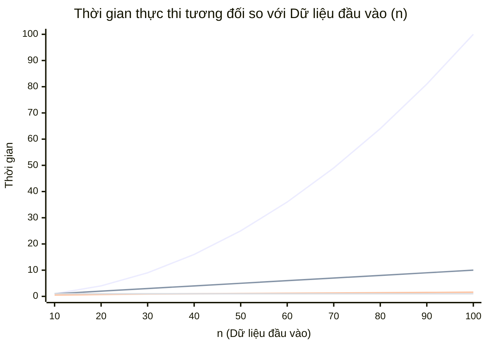

# Big-O Notation — Ngôn ngữ của hiệu năng

Là một Junior Developer, bạn có thể viết được một hàm tính toán trả về kết quả đúng. Nhưng làm sao để biết hàm đó có "đủ tốt" để đưa lên Production hay không? 

Chào mừng bạn đến với **Big-O Notation** — công cụ đánh giá hiệu năng kinh điển trong Khoa học máy tính.

## 📋 Agenda

**Thời gian đọc ước tính:** ~8 phút

### Sau bài này, bạn sẽ:
- ✅ **Hiểu** được Big-O Notation là gì và tại sao nó lại quan trọng hơn cả tốc độ CPU máy tính của bạn.
- ✅ **Giải thích** được các độ phức tạp thời gian cơ bản: `O(1)`, `O(n)`, `O(n^2)` và `O(log n)`.
- ✅ **Tự tay** đánh giá độ phức tạp của một hàm TypeScript bất kỳ.
- ✅ **Phân biệt** được lúc nào một vòng lặp lồng nhau là xấu, lúc nào là bình thường.

### Yêu cầu đầu vào:
- 🔹 Có kiến thức cơ bản về vòng lặp `for` và mảng (`Array`) trong JavaScript/TypeScript.

---

## ❓ Tại sao chúng ta cần Big-O?

**Vấn đề (Problem Statement):**
- Bạn và đồng nghiệp cùng viết một hàm đếm số lượt view. Hàm của bạn chạy mất 2 giây, hàm của đồng nghiệp chạy mất 1.5 giây trên cùng một máy tính.
- Vậy hàm của đồng nghiệp tốt hơn hàm của bạn? 
- Không chắc! Khi số lượng lượt view tăng từ 1.000 lên 1.000.000, hàm của bạn chỉ chạy mất 3 giây, trong khi hàm của đồng nghiệp bị treo và văng lỗi `Out of Memory`.

**Giải pháp (Solution):**
Đo lường bằng thời gian (giây/phút) là không đáng tin cậy vì nó phụ thuộc vào tốc độ CPU, ngôn ngữ lập trình và các ứng dụng chạy ngầm. **Big-O Notation** ra đời để giải quyết vấn đề này. Nó cung cấp một "ngôn ngữ chuẩn" để mô tả cách mà thời gian chạy (hoặc bộ nhớ sử dụng) tăng lên tỉ lệ thuận với lượng dữ liệu đầu vào.

---

## 📖 Big-O Notation là gì?

**Định nghĩa:** Big-O Notation (Ký hiệu O-lớn) là một công cụ toán học dùng để mô tả **trường hợp xấu nhất (worst-case scenario)** của một thuật toán. Nó trả lời câu hỏi: *"Khi dữ liệu đầu vào (n) tăng lên đến vô cực, tốc độ thực thi của hàm sẽ chậm đi như thế nào?"*

### Biểu đồ các độ phức tạp phổ biến



### Giải nghĩa từng loại Big-O (Time Complexity)

- `O(1)` **(Constant Time):** Dữ liệu tăng bao nhiêu thì thời gian chạy vẫn không đổi. Chớp mắt là xong.
- `O(log n)` **(Logarithmic Time):** Dữ liệu tăng theo cấp số nhân, nhưng thời gian chỉ tăng thêm 1 bước. Đây là độ phức tạp đáng mơ ước (điển hình là Binary Search).
- `O(n)` **(Linear Time):** Dữ liệu tăng gấp đôi, thời gian chạy tăng gấp đôi. Đơn giản, dễ hiểu.
- `O(n^2)` **(Quadratic Time):** Dữ liệu tăng gấp đôi, thời gian chạy tăng gấp 4. Khi dữ liệu lớn, đây là một thảm họa hiệu năng.

---

## 🔨 Đọc Big-O qua TypeScript Code

Hãy cùng nhìn vào các ví dụ thực tế, gạt bỏ những boilerplate rườm rà.

### 1. O(1) — Hằng số (Constant Time)

Bất kể mảng `items` có 1 phần tử hay 1 tỷ phần tử, việc lấy phần tử đầu tiên luôn mất cùng một thời lượng.

```typescript
// filename: big-o.ts

function getFirstItem<T>(items: T[]): T | undefined {
  // 💡 Lấy trực tiếp thông qua index trong mảng là hành động truy xuất O(1)
  return items[0]; 
}
```

### 2. O(n) — Tuyến tính (Linear Time)

Với mảng có `n` phần tử, vòng lặp `for` sẽ phải chạy đúng `n` lần.

```typescript
// filename: big-o.ts

function printAllItems<T>(items: T[]): void {
  // 💡 Nếu mảng có 100 phần tử, ta có 100 thao tác in. 
  // O(n) vì thời gian phụ thuộc 1:1 vào kích thước mảng.
  for (let i = 0; i < items.length; i++) {
    console.log(items[i]);
  }
}
```

### 3. O(n^2) — Đa thức (Quadratic Time)

Thường xuất hiện khi có 2 vòng lặp lồng nhau (nested loops).

```typescript
// filename: big-o.ts

function printAllPairs<T>(items: T[]): void {
  // 💡 Vòng lặp ngoài chạy n lần
  for (let i = 0; i < items.length; i++) {
    // 💡 Với mỗi vòng lặp ngoài, vòng lặp trong lại chạy n lần
    // Tổng số thao tác: n * n = n^2
    for (let j = 0; j < items.length; j++) {
      console.log(`Pair: ${items[i]} và ${items[j]}`);
    }
  }
}
```

### 4. Quy tắc "Bỏ Hằng Số" (Drop Constants)

Khi tính Big-O, chúng ta chỉ quan tâm đến *xu hướng* khi `n` tiến tới vô cực. Các hằng số sẽ bị bỏ qua.

```typescript
function printItemsTwice<T>(items: T[]): void {
  // Vòng 1: O(n)
  for (let i = 0; i < items.length; i++) {
    console.log(items[i]);
  }
  
  // Vòng 2: O(n)
  for (let j = 0; j < items.length; j++) {
    console.log(items[j]);
  }
}
```

**Phân tích:** Thuật toán trên có tổng số bước là `n + n = 2n`. Tuy nhiên, theo quy tắc của Big-O, ta loại bỏ hằng số `2` và gọi đây là **O(n)**.

---

## 🚀 WHAT IF — Khi nào O(n²) lại "không quá tệ"?

Là Junior Dev, bạn có thể được dạy là "Hãy tránh xa 2 vòng lặp lồng nhau O(n²)". Điều này đúng nhưng chưa đủ. Hãy xem xét các Trade-off và Pitfall sau:

| Tình huống | Nên lo lắng? | Lý do |
|---|---|---|
| Dữ liệu đầu vào luôn nhỏ (n < 100) | ❌ Không | O(n²) của 100 chỉ là 10.000 thao tác, CPU hiện đại xử lý trong chớp mắt. Viết mã dễ đọc (O(n²)) đôi khi tốt hơn mã phức tạp hóa để đạt O(n). |
| Dữ liệu có thể đạt mức `n > 10,000` | ✅ Rất nên | O(n²) lúc này là 100.000.000 thao tác, sẽ làm đơ trình duyệt client hoặc nghẽn server. Bạn BẮT BUỘC phải tối ưu. |

### ⚠️ Pitfalls hay gặp

**1. "Hàm built-in là O(1)?"**
Rất nhiều bạn dùng `Array.prototype.indexOf()` hay `.splice()` và nghĩ nó là `O(1)` vì "nó chỉ là 1 dòng code". 
Thực tế, `indexOf()` chạy một vòng lặp ngầm dưới nền, vì vậy nó là **O(n)**. `splice()` phải di dời các phần tử phía sau, nó cũng là **O(n)**.

**2. Vòng lặp lồng nhau với 2 input khác nhau**
```typescript
function printBoth(arrA: string[], arrB: string[]) {
  for (let a of arrA) {
    for (let b of arrB) {
      console.log(a, b);
    }
  }
}
```
**Sai lầm:** Nhiều người gọi nó là `O(n^2)`.
**Thực tế:** Đây là `O(a * b)` (với a là độ dài arrA, b là độ dài arrB). Nếu `a` rất nhỏ và `b` rất lớn, thì ảnh hưởng hiệu năng hoàn toàn khác một mảng `n^2` khổng lồ.

---

## 💬 Kết thúc bài

Giờ bạn đã nắm được Big-O Notation để đánh giá tốc độ chạy của code (Time Complexity). Nhưng nếu code chạy rất nhanh, mà lại ngốn sạch RAM (bộ nhớ) của máy chủ thì sao?

Đó chính là câu chuyện của **Space Complexity**, điều chúng ta sẽ khám phá trong bài tiếp theo.

---
*Made by Anh Tu - Share to be share*
