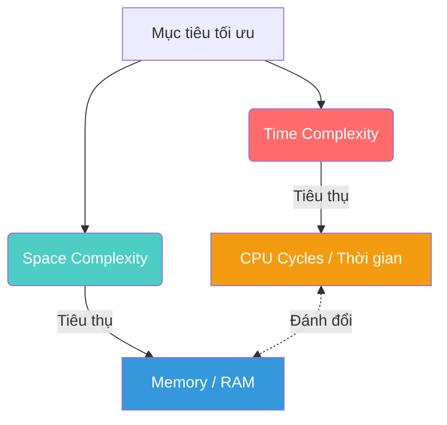

# Time vs Space Complexity — Cuộc chiến giữa Tốc độ và Bộ nhớ

Ở bài trước, chúng ta đã dùng Big-O Notation để đo lường **thời gian chạy** (Time Complexity). Nhưng nếu bạn cố tình tạo ra một mảng khổng lồ vài triệu phần tử để truy xuất O(1) cho nhanh, ứng dụng của bạn có thể sẽ sập vì quá tải RAM.

Chào mừng bạn đến với mặt kia của đồng xu: **Space Complexity (Độ phức tạp Không gian/Bộ nhớ)**.

## 📋 Agenda

**Thời gian đọc ước tính:** ~6 phút

### Sau bài này, bạn sẽ:
- ✅ **Hiểu** được khái niệm Space Complexity là gì.
- ✅ **Giải thích** được sự đánh đổi (Trade-off) kinh điển giữa Tốc độ (Time) và Bộ nhớ (Space).
- ✅ **Tự tay** tối ưu hóa bộ nhớ cho một đoạn mã TypeScript.
- ✅ **Phân biệt** được lúc nào nên hy sinh bộ nhớ để đổi lấy tốc độ và ngược lại.

### Yêu cầu đầu vào:
- 🔹 Đã đọc và hiểu bài trước về [Big-O Notation](./01-big-o-notation.md).

---

## ❓ Tại sao Code nhanh thôi là chưa đủ?

**Vấn đề (Problem Statement):**
- Bạn có một hàm tra cứu thông tin người dùng từ một mảng 100,000 user. Tốc độ tra cứu quá chậm vì phải dùng vòng lặp O(n).
- Để khắc phục, bạn quyết định lưu tất cả 100,000 user này vào một biến `Map` (Hash Map) để tra cứu O(1). Tốc độ nhanh lên đáng kinh ngạc!
- Vài ngày sau, Server NodeJS của bạn văng lỗi `FATAL ERROR: Ineffective mark-compacts near heap limit Allocation failed - JavaScript heap out of memory`. Cả hệ thống sập.

**Giải pháp (Solution):**
Bạn đã mắc bẫy khi chỉ tối ưu Time Complexity mà bỏ qua **Space Complexity**. Không gian bộ nhớ (RAM) là hữu hạn. Một kỹ sư giỏi phải biết cân bằng (Trade-off) giữa việc dùng bao nhiêu thời gian và bao nhiêu bộ nhớ để giải bài toán.

---

## 📖 Space Complexity là gì?

**Định nghĩa:** Space Complexity đo lường lượng **bộ nhớ bổ sung (extra memory)** mà thuật toán cần sử dụng khi kích thước dữ liệu đầu vào `n` tăng lên.

> 💡 **Lưu ý:** Chúng ta KHÔNG tính bộ nhớ của chính dữ liệu đầu vào. Chúng ta chỉ tính bộ nhớ mà **thuật toán tạo thêm** (biến tạm, mảng mới, hash map mới, call stack).

### Sơ đồ so sánh Time vs Space



### Các mức Space Complexity phổ biến:
- **O(1):** Thuật toán chỉ dùng một vài biến cục bộ (ví dụ: `let sum = 0`). Không phụ thuộc vào `n`.
- **O(n):** Thuật toán tạo ra một mảng/đối tượng mới có kích thước tỉ lệ thuận với `n`.

---

## 🔨 Phân tích qua TypeScript Code

Hãy cùng xem hai cách giải quyết cùng một bài toán: **Cộng tất cả các phần tử trong một mảng**.

### Cách 1: O(1) Space (Tuyệt vời)

Bạn chỉ cần tạo ĐÚNG MỘT biến `total` để lưu trữ tổng. Dù mảng có 10 phần tử hay 1 triệu phần tử, bạn vẫn chỉ tốn bộ nhớ cho 1 biến `total`.

```typescript
// filename: space-complexity.ts

function sumItems(items: number[]): number {
  let total = 0; // 💡 O(1) Space - Chỉ khởi tạo 1 biến duy nhất
  
  for (let i = 0; i < items.length; i++) {
    total += items[i];
  }
  
  return total;
}
```
- **Time Complexity:** `O(n)` (Vì phải lặp qua `n` phần tử)
- **Space Complexity:** `O(1)` (Chỉ tốn thêm dung lượng cho 1 biến số)

### Cách 2: O(n) Space (Ngốn RAM)

Giả sử bạn muốn nhân đôi các giá trị và trả về mảng mới. 

```typescript
// filename: space-complexity.ts

function doubleItems(items: number[]): number[] {
  // 💡 O(n) Space - Tạo ra một mảng MỚI có độ dài đúng bằng mảng đầu vào
  let newArray: number[] = []; 
  
  for (let i = 0; i < items.length; i++) {
    newArray.push(items[i] * 2);
  }
  
  return newArray;
}
```
- **Time Complexity:** `O(n)`
- **Space Complexity:** `O(n)` (Vì `newArray` phình to theo kích thước `n`)

---

## 🚀 WHAT IF — Cuộc chiến Trade-off (Đánh đổi)

Trong thực tế, bạn hiếm khi đạt được cả hai mục tiêu O(1) Time và O(1) Space. Bạn thường phải **hy sinh một cái để lấy cái kia**.

### Khi nào ưu tiên Tốc độ (Hy sinh Bộ nhớ)?
**Scenario:** Bạn đang làm tính năng Cache cho Website để load dữ liệu cực nhanh.
**Chiến lược:** Lưu sẵn các dữ liệu thường truy xuất vào Redis hoặc RAM của Node.js (Space: `O(n)` hoặc lớn hơn). Đổi lại, tốc độ truy xuất là O(1) Time. Người dùng sẽ thấy web siêu mượt.
**Điều kiện:** Server phải có dư dả RAM.

### Khi nào ưu tiên Bộ nhớ (Hy sinh Tốc độ)?
**Scenario:** Bạn đang code cho một thiết bị IoT (Internet of Things) hoặc một con Raspberry Pi chỉ có 512MB RAM.
**Chiến lược:** Thay vì lưu tất cả vào mảng/hash map, bạn xử lý dữ liệu từng dòng một thông qua `Streams` hoặc dùng vòng lặp O(n^2). Tốc độ có thể chậm hơn vài mili-giây, nhưng thiết bị không bị sập vì hết RAM (Space: O(1)).

### ⚠️ Pitfalls hay gặp của Junior

**Lạm dụng các phương thức Array tạo mảng mới trong JavaScript:**
Rất nhiều bạn lạm dụng `.map()`, `.filter()` liên tục mà không nhận ra nó đang "ăn" dần Space Complexity.

```typescript
// ❌ Đoạn code ngốn O(3n) Space vì mỗi hàm map/filter sinh ra một mảng MỚI
const result = items
  .filter(x => x > 10)     // Tạo mảng mới #1
  .map(x => x * 2)         // Tạo mảng mới #2
  .filter(x => x < 100);   // Tạo mảng mới #3
```

Nếu `items` là 1 mảng có 1 triệu phần tử, đoạn code trên sẽ nhanh chóng làm tràn bộ nhớ heap (Heap Out of Memory). Trong những trường hợp cực đoan đó, một vòng lặp `for` hoặc `reduce` truyền thống lại cứu rỗi sinh mạng server của bạn!

---

## 💬 Kết thúc phần Nền tảng

Xin chúc mừng! Bạn đã hoàn thành Sprint 1 và sở hữu "kính lúp" Big-O Notation để soi xét hiệu năng mọi đoạn code bạn viết.

Từ bài tiếp theo, chúng ta sẽ bước vào **Phần 2: Cấu trúc dữ liệu tuyến tính (Linear Data Structures)**. Và chúng ta sẽ bắt đầu với cấu trúc gần gũi nhất, nguyên thủy nhất nhưng ẩn chứa vô vàn bí mật: **Array (Mảng)**.

---
*Made by Anh Tu - Share to be share*
