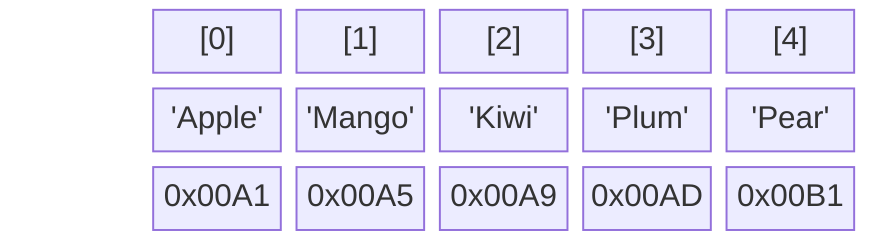

# Array — Cấu trúc dữ liệu nguyên thủy nhất

Bạn đã dùng `[]` không biết bao nhiêu lần trong TypeScript. Array (Mảng) là cấu trúc dữ liệu quen thuộc nhất, có mặt ở mọi ngôn ngữ lập trình. Nhưng bạn đã bao giờ thắc mắc tại sao `push()` thì chạy rất nhanh, còn `unshift()` (thêm vào đầu mảng) lại khiến hiệu năng ứng dụng tụt dốc không phanh?

Chào mừng bạn đến với **Phần 2: Linear Data Structures**. Và chúng ta sẽ bắt đầu bằng việc "giải phẫu" Array.

## 📋 Agenda

**Thời gian đọc ước tính:** ~7 phút

### Sau bài này, bạn sẽ:
- ✅ **Hiểu** được Array thực sự được lưu trữ như thế nào dưới RAM (Bộ nhớ vật lý).
- ✅ **Giải thích** được tại sao truy xuất Array qua index `arr[5]` lại luôn mất `O(1)` thời gian.
- ✅ **Phân biệt** được mảng tĩnh (Static Array) và mảng động (Dynamic Array).
- ✅ **Nắm bắt** được hiệu năng Time Complexity của các thao tác thêm, xóa, sửa trên Array.

### Yêu cầu đầu vào:
- 🔹 Đã đọc và hiểu về [Big-O Notation](../01-complexity/01-big-o-notation.md).

---

## ❓ Tại sao Array tồn tại?

**Vấn đề (Problem Statement):**
Giả sử bạn cần lưu trữ điểm thi của 5 học sinh. Nếu không có Array, bạn phải làm thế này:
```typescript
let score1 = 8;
let score2 = 9;
let score3 = 7;
// ... và nếu có 10,000 học sinh, bạn phải khai báo 10,000 biến!
```
Hơn nữa, nếu bạn muốn tính điểm trung bình, bạn phải cộng tay từng biến một vì chúng nằm rải rác không liên quan gì đến nhau trong bộ nhớ.

**Giải pháp (Solution):**
Array ra đời để giải quyết vấn đề **nhóm dữ liệu**. Nó yêu cầu hệ điều hành cấp phát một **khối lượng bộ nhớ liên tiếp nhau**. Nhờ đó, bạn chỉ cần giữ một biến duy nhất (con trỏ chỉ vào đầu khối bộ nhớ) và duyệt qua hàng vạn dữ liệu bằng một vòng lặp đơn giản.

---

## 📖 Array dưới góc nhìn của Hệ Điều Hành

**Định nghĩa:** Array là một cấu trúc dữ liệu lưu trữ một tập hợp các phần tử có cùng kiểu dữ liệu, được sắp xếp **liên tiếp nhau** (contiguous) trong bộ nhớ máy tính.

### Trực quan hóa bộ nhớ (RAM)

Hãy tưởng tượng RAM như một dãy tủ đồ khóa số liền kề nhau:



- **Index:** `0, 1, 2, 3...` — Số thứ tự (Mảng luôn bắt đầu từ 0).
- **Value:** Dữ liệu thực tế.
- **Memory Address:** Địa chỉ ô nhớ (Ví dụ: cách nhau 4 bytes mỗi ô).

### Tại sao truy xuất arr[2] lại cực nhanh (O(1))?
Bởi vì Array nằm liên tiếp, máy tính chỉ cần dùng một công thức toán học cực đơn giản:
> `Địa chỉ phần tử [i] = Địa chỉ ô đầu tiên + (i * Kích thước 1 phần tử)`

Ví dụ, muốn tìm `arr[2]` khi biết ô đầu tiên ở `0x00A1` (và mỗi phần tử chiếm 4 bytes):
`0x00A1 + (2 * 4) = 0x00A9`. Máy tính phi thẳng đến `0x00A9` lấy dữ liệu. Chớp mắt, **O(1)**.

---

## 🔨 Time Complexity của Array

Bây giờ hãy phân tích các thao tác quen thuộc trong TypeScript dưới lăng kính Big-O.

### 1. Thêm vào cuối mảng — `push()`
Đây là hành động lý tưởng nhất. Máy tính chỉ cần đến ô nhớ trống tiếp theo ở đuôi và nhét dữ liệu vào.
- **Time Complexity:** `O(1)`

```typescript
const arr = ['A', 'B', 'C'];
arr.push('D'); // O(1) - Rất nhanh
```

### 2. Thêm vào đầu mảng — `unshift()`
Đây là "cơn ác mộng" hiệu năng. Mảng là một khối bộ nhớ cố định. Nếu bạn muốn nhét thêm người vào đầu hàng, BẮT BUỘC toàn bộ những người phía sau phải lùi lại 1 bước để nhường chỗ.
- **Time Complexity:** `O(n)`

```typescript
const arr = ['A', 'B', 'C'];
// Để nhét 'X' vào vị trí 0:
// 1. Dời 'C' từ index 2 sang 3
// 2. Dời 'B' từ index 1 sang 2
// 3. Dời 'A' từ index 0 sang 1
// 4. Nhét 'X' vào index 0
arr.unshift('X'); // O(n) - Rất chậm nếu n lớn
```

### 3. Xóa ở giữa mảng — `splice()`
Tương tự như `unshift`, nếu bạn rút 1 người ở giữa hàng ra, tất cả những người đứng sau phải bước lên 1 bước để lấp đầy khoảng trống.
- **Time Complexity:** `O(n)`

```typescript
const arr = ['A', 'B', 'C', 'D'];
arr.splice(1, 1); // Xóa 'B'
// 'C' và 'D' phải dịch chuyển lên trước
// O(n)
```

---

## 🚀 WHAT IF — JavaScript/TypeScript Array có phải là Array "xịn"?

Nếu bạn từng học C++ hay Java, bạn sẽ biết mảng "truyền thống" (Static Array) **không thể thay đổi kích thước**. Bạn khai báo mảng 5 phần tử, nó mãi mãi là 5 phần tử.

**"Thế sao trong TypeScript tôi cứ push() tẹt ga đến hàng triệu phần tử cũng không lỗi?"**

Bởi vì JavaScript/TypeScript Array thực chất là **Dynamic Array (Mảng động)**, và dưới tầng sâu hơn của V8 Engine (Node.js/Chrome), nó hoạt động cực kỳ thú vị.

### Cách Dynamic Array hoạt động ngầm:
1. Khi bạn tạo mảng mới, TS cấp cho bạn một bộ nhớ cỡ nhỏ (vd: chứa được 5 phần tử).
2. Bạn dùng `push()` liên tục cho đến khi đầy 5 slot.
3. Khi bạn push phần tử thứ 6, TS nhận ra hết chỗ. Nó sẽ:
   - Bí mật xin hệ điều hành một khối bộ nhớ mới **to gấp đôi** (10 phần tử).
   - Copy 5 phần tử cũ sang nhà mới.
   - Xóa bỏ nhà cũ.
   - Nhét phần tử thứ 6 vào nhà mới.

> 💡 **Trade-off:** Sự linh hoạt của Dynamic Array đổi lấy việc thỉnh thoảng thao tác `push()` sẽ mất `O(n)` thay vì `O(1)` (khi chạm đến giới hạn và phải copy toàn bộ sang bộ nhớ mới). May mắn thay, cơ chế này không xảy ra liên tục nên trung bình (Amortized) thì `push()` vẫn được tính là **O(1)**.

### ⚠️ Pitfalls hay gặp với Array trong TS

**1. Tạo "Lỗ hổng" bộ nhớ (Sparse Array)**
Nếu bạn khởi tạo mảng và gán vào một index quá xa:
```typescript
const arr = [];
arr[1000] = 'Hello';
```
V8 Engine nhận ra "Ôi không, thằng này đang tạo mảng rỗng lỗ rỗ (Sparse Array)". Để tiết kiệm RAM, V8 sẽ từ bỏ việc lưu trữ bộ nhớ liên tiếp. Nó biến mảng của bạn thành một Hash Dictionary ngầm định (như Object). Hậu quả? **Tốc độ truy xuất tụt dốc, vòng lặp chạy chậm hơn hẳn.**

**2. Dùng Array để tìm kiếm nhiều lần `includes()`**
Nếu bạn có mảng 10,000 ID và phải gọi `arr.includes(id)` liên tục trong 1 vòng lặp khác.
`includes()` trên mảng là **O(n)**. Nên tổng thể sẽ thành **O(n²)**.
*Giải pháp:* Chuyển Array thành `Set` (sẽ học ở phần Non-linear DS), `set.has(id)` chỉ mất **O(1)**.

---

## 💬 Thảo luận

Array truy xuất cực nhanh (O(1)), nhưng điểm yếu chí mạng của nó là việc **Thêm/Xóa ở đầu hoặc giữa mảng mất tới O(n)** (vì phải dịch chuyển hàng loạt).

Nếu ứng dụng của bạn yêu cầu việc chèn và xóa dữ liệu liên tục ở giữa danh sách (như tính năng Undo/Redo, hoặc quản lý Playlist nhạc), Array có còn là lựa chọn tốt?

Đó là lý do chúng ta cần đến một "người anh em" linh hoạt hơn: **Linked List (Danh sách liên kết)** trong bài tiếp theo!

---
*Made by Anh Tu - Share to be share*
