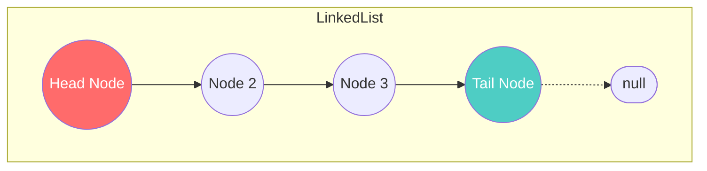

# Linked List — Khi Array không đủ linh hoạt

Ở bài trước, chúng ta đã thấy điểm yếu chí mạng của Array: **Chèn và xóa ở giữa mảng cực kỳ tốn kém (O(n))**. Nếu bạn đang làm một ứng dụng yêu cầu thay đổi thứ tự dữ liệu liên tục, Array sẽ bóp nghẹt hiệu năng của hệ thống.

Chào mừng bạn đến với cấu trúc dữ liệu khắc phục trực tiếp nhược điểm đó: **Linked List (Danh sách liên kết)**.

## 📋 Agenda

**Thời gian đọc ước tính:** ~10 phút

### Sau bài này, bạn sẽ:
- ✅ **Hiểu** được cơ chế hoạt động của Linked List dưới bộ nhớ.
- ✅ **Tự tay** implement một Singly Linked List hoàn chỉnh từ đầu bằng TypeScript.
- ✅ **Giải thích** được tại sao thêm/xóa trong Linked List chỉ tốn `O(1)`.
- ✅ **Phân biệt** được lúc nào nên dùng Array, lúc nào nên dùng Linked List.

### Yêu cầu đầu vào:
- 🔹 Có kiến thức cơ bản về Class và Generics trong TypeScript.

---

## ❓ Tại sao lại cần Linked List?

**Vấn đề (Problem Statement):**
Mảng (Array) đòi hỏi một **khối lượng bộ nhớ liên tiếp**. Khi máy chủ của bạn phân mảnh bộ nhớ (có nhiều vùng trống nhỏ nhưng không có vùng trống nào đủ lớn liền mạch), hệ điều hành sẽ từ chối cấp phát bộ nhớ cho một Array khổng lồ, dẫn đến lỗi "Out of Memory".
Hơn nữa, mỗi lần `unshift()` hoặc `splice()` trên Array, hàng ngàn phần tử phải dịch chuyển vị trí rất tốn CPU.

**Giải pháp (Solution):**
**Linked List** giải quyết bài toán này bằng cách phân tán dữ liệu. Mỗi phần tử (Node) nằm ở bất kỳ đâu trong bộ nhớ. Để chúng không bị lạc mất nhau, Node hiện tại sẽ cầm một "sợi dây" trỏ thẳng đến vị trí của Node tiếp theo. Việc chèn thêm một phần tử mới giờ đây chỉ đơn giản là... cắt đứt sợi dây và nối lại vào người mới. Không ai phải dịch chuyển cả!

---

## 📖 Linked List hoạt động thế nào?

**Định nghĩa:** Linked List là một tập hợp các nút (Nodes). Mỗi Node chứa hai thông tin: **Dữ liệu (Value)** và **Tham chiếu (Pointer/Next)** trỏ tới Node tiếp theo trong danh sách.

### Trực quan hóa kiến trúc



- **Head:** Điểm bắt đầu. Mất Head là mất toàn bộ danh sách.
- **Tail:** Nút cuối cùng, con trỏ `next` của nó luôn là `null`.
- **Node:** Viên gạch cấu trúc cơ bản gồm `value` và `next`.

### So sánh Time Complexity với Array

| Thao tác | Array | Linked List | Lý do của Linked List |
|---|---|---|---|
| Đọc (Read) | **O(1)** 🏆 | O(n) | Không có index, phải duyệt từ Head |
| Thêm/Xóa cuối | O(1) | O(1) | Có con trỏ Tail trỏ sẵn về cuối |
| Thêm/Xóa đầu | O(n) | **O(1)** 🏆 | Chỉ cần nối lại con trỏ ở Head |
| Thêm/Xóa giữa | O(n) | O(n) tìm kiếm + **O(1)** chèn | Phải tìm đến vị trí cần chèn (O(n)), nhưng thao tác chèn chỉ là đổi tham chiếu (O(1)) |

---

## 🔨 Tự tay implement bằng TypeScript

Chúng ta sẽ không dùng thư viện. Áp dụng chuẩn "Interface-first", hãy cùng định nghĩa hợp đồng trước:

### Bước 1: Khởi tạo Interface & Class Node

```typescript
// filename: linked-list.ts

// 💡 1. Khởi tạo một "Viên gạch" (Node)
class ListNode<T> {
  value: T;
  next: ListNode<T> | null;

  constructor(value: T) {
    this.value = value;
    this.next = null; // Mặc định chưa trỏ đi đâu cả
  }
}

// 💡 2. Hợp đồng quy định các thao tác có thể làm với List
interface ILinkedList<T> {
  append(value: T): void;       // Thêm vào cuối
  prepend(value: T): void;      // Thêm vào đầu
  find(value: T): ListNode<T> | null; // Tìm kiếm
  delete(value: T): void;       // Xóa một giá trị
}
```

### Bước 2: Implement Logic

```typescript
// filename: linked-list.ts

class LinkedList<T> implements ILinkedList<T> {
  private head: ListNode<T> | null = null;
  private tail: ListNode<T> | null = null; // Theo dõi Tail để append O(1)

  // 1. Thêm vào cuối (Append) - O(1)
  append(value: T): void {
    const newNode = new ListNode(value);

    // Nếu list trống, Node mới là Head và Tail
    if (!this.head || !this.tail) {
      this.head = newNode;
      this.tail = newNode;
      return;
    }

    // Nếu đã có Tail, trỏ Tail hiện tại sang Node mới
    this.tail.next = newNode;
    // Cập nhật lại Tail chính là Node mới
    this.tail = newNode;
  }

  // 2. Thêm vào đầu (Prepend) - O(1) 🏆 (Thứ mà Array thèm khát)
  prepend(value: T): void {
    const newNode = new ListNode(value);
    
    // Nối Node mới với Head cũ
    newNode.next = this.head;
    // Cập nhật Head mới
    this.head = newNode;

    if (!this.tail) {
      this.tail = newNode;
    }
  }

  // 3. Xóa một Node (Delete)
  delete(value: T): void {
    if (!this.head) return;

    // Trường hợp cần xóa chính là Head
    if (this.head.value === value) {
      this.head = this.head.next; // Dịch Head sang Node thứ 2
      // Nếu danh sách vừa xóa xong thành rỗng
      if (this.head === null) this.tail = null; 
      return;
    }

    // Duyệt tìm Node chứa giá trị
    let current = this.head;
    // 💡 Logic chèn/xóa: current.next === Node cần xóa
    while (current.next) {
      if (current.next.value === value) {
        // Cắt đứt liên kết, trỏ vượt qua Node cần xóa
        current.next = current.next.next;
        
        // Nếu vừa xóa trúng Tail, phải cập nhật lại Tail
        if (current.next === null) {
          this.tail = current;
        }
        return;
      }
      current = current.next;
    }
  }
}
```

### Ví dụ sử dụng:
```typescript
const playlists = new LinkedList<string>();
playlists.append("Song A");
playlists.append("Song B");
playlists.prepend("Sponsor Ad"); // Chèn quảng cáo vào đầu (O(1)) siêu nhanh!
playlists.delete("Song A"); // Người dùng skip bài hát
```

---

## 🚀 WHAT IF — Khi nào DÙNG và KHÔNG DÙNG Linked List?

Là Junior Dev, đừng vội ném bỏ Array để dùng Linked List cho mọi thứ. Mọi cấu trúc đều có cái giá của nó.

| ✅ NÊN DÙNG Linked List | ❌ KHÔNG NÊN DÙNG |
|---|---|
| Khi bạn phải **chèn/xóa liên tục** ở đầu hoặc giữa danh sách (VD: Tính năng Undo/Redo, Hàng đợi server). | Khi bạn phải **truy cập ngẫu nhiên (Random Access)** (VD: Lấy phần tử thứ 500 ra xem). Array làm O(1), LL làm O(n). |
| Khi bạn không biết trước kích thước dữ liệu sẽ lớn đến mức nào. | Khi bạn cần duyệt mảng thật nhanh (Iteration). Cache của CPU thích cấu trúc bộ nhớ liên tiếp của Array hơn là các Node nằm rải rác của Linked List. |

### ⚠️ Pitfalls hay gặp

**1. Memory Overhead (Lãng phí bộ nhớ)**
Một Array chứa số `[1, 2, 3]` cực kỳ nhẹ. Nhưng một Linked List chứa `[1, 2, 3]` sẽ cần thêm bộ nhớ cho cái `next pointer` (con trỏ). Mỗi Node phải gánh thêm dung lượng thừa này (Space Complexity lớn hơn Array tĩnh một chút).

**2. Mất Head là mất tất cả (Garbage Collection)**
Trong TypeScript/JavaScript, nếu bạn vô tình gán `this.head = null` và làm mất biến tham chiếu tới Node đầu tiên, Garbage Collector (Bộ thu gom rác) sẽ dọn dẹp toàn bộ danh sách của bạn biến mất vĩnh viễn! Luôn cẩn thận khi thao tác với biến `head`.

**3. Rơi vào vòng lặp vô tận (Infinite Loop)**
Khi thao tác nối `next`, nếu bạn sơ ý cho `Node3.next = Node2`, bạn sẽ tạo ra một chu kỳ tròn (Cycle). Vòng lặp `while(current.next)` của bạn sẽ chạy đến khi sập server!

---

## 💬 Thảo luận

Trong cấu trúc Singly Linked List (liên kết đơn) ở trên, `Node2` có thể trỏ tới `Node3`, nhưng `Node3` lại mù tịt không biết ai đứng ngay sau lưng mình (`Node2`). 

Điều này khiến việc duyệt danh sách từ dưới lên trên (Reverse Traversal) hoặc xóa một Node từ vị trí Tail trở nên rất khó khăn (phải chạy lại từ đầu Head). 

Làm thế nào để giải quyết vấn đề này? Câu trả lời nằm ở "bản nâng cấp" tiếp theo: **Doubly Linked List (Danh sách liên kết đôi)**.

---
*Made by Anh Tu - Share to be share*
