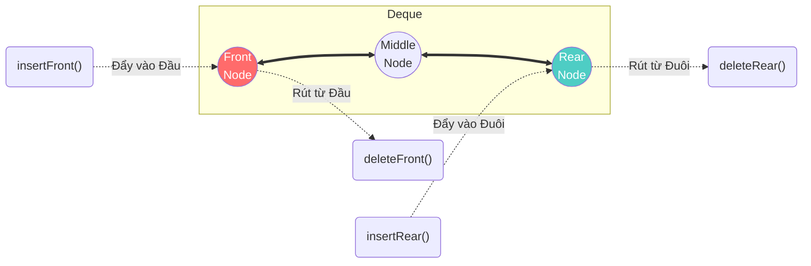

# Deque — Sự lai tạo giữa Stack và Queue

Bạn đã biết **Stack** giới hạn thao tác ở một đầu (LIFO), và **Queue** giới hạn thao tác theo luồng một chiều (FIFO). 
Nhưng trong một số bài toán kỹ thuật thực tế, sự giới hạn cứng nhắc đó lại gây ra cản trở. Có những lúc chúng ta cần một cấu trúc linh hoạt để có thể thêm/rút ở **bất kỳ đầu nào**, nhưng vẫn phải giữ tốc độ **O(1)** siêu tốc.

Chào mừng bạn đến với bài cuối cùng của phần Cấu trúc dữ liệu tuyến tính: **Deque (Double-Ended Queue - Hàng đợi hai đầu)**.

## 📋 Agenda

**Thời gian đọc ước tính:** ~6 phút

### Sau bài này, bạn sẽ:
- ✅ **Hiểu** được khái niệm và cơ chế của Deque.
- ✅ **Nhận diện** được sự liên kết mật thiết giữa Deque và Doubly Linked List.
- ✅ **Phân tích** được bài toán thực tế "Sliding Window Maximum" cần đến sức mạnh của Deque.

### Yêu cầu đầu vào:
- 🔹 Đã nắm vững [Stack](./04-stack.md), [Queue](./05-queue.md) và [Doubly Linked List](./03-doubly-linked-list.md).

---

## ❓ Giới hạn của Stack và Queue

**Vấn đề (Problem Statement):**
Hãy tưởng tượng bạn đang viết thuật toán duyệt Lịch sử duyệt Web của một tab trình duyệt, nhưng bộ nhớ RAM rất giới hạn, bạn chỉ được lưu tối đa 50 trang web gần nhất.
- Nếu dùng **Stack**: Khi đạt trang 51, bạn muốn đẩy trang mới vào đỉnh, và phải xóa đi trang CŨ NHẤT nằm ở đáy Stack. Nhưng Stack KHÔNG cho phép xóa ở đáy!
- Nếu dùng **Queue**: Bạn có thể dễ dàng đẩy trang mới vào đuôi, rút trang cũ ra ở đầu. Rất tốt! Tuy nhiên, khi người dùng bấm nút `Back`, bạn lại cần rút trang mới nhất ra khỏi Đuôi Queue. Queue KHÔNG cho phép rút ở Đuôi!

**Giải pháp (Solution):**
Chúng ta cần một cấu trúc cho phép:
1. Đẩy vào đỉnh (giống Stack)
2. Rút ra đỉnh (giống Stack)
3. Đẩy vào đáy (giống Queue)
4. Rút ra đáy (giống Queue)

Cấu trúc đó chính là **Deque** (Phát âm là "Deck", giống từ *deck of cards* - bộ bài).

---

## 📖 Deque là gì?

**Định nghĩa:** Deque (Double-Ended Queue) là một hàng đợi hai đầu. Nó là phiên bản tổng quát hóa của cả Stack và Queue, cho phép thao tác chèn và xóa phần tử diễn ra ở **cả đầu (Front) và đuôi (Rear)** với độ phức tạp thời gian **O(1)**.

### Trực quan hóa cấu trúc



*Nhìn sơ đồ trên, bạn thấy nó giống cấu trúc nào đã học?*
Đúng vậy, bản chất **Deque chính là một Doubly Linked List (Danh sách liên kết đôi)**, nhưng được giới hạn API để người lập trình không thể thao tác ngẫu nhiên ở giữa danh sách (nhằm bảo vệ tính toàn vẹn thứ tự dữ liệu).

---

## 🔨 Hiện thực hóa Deque bằng TypeScript

Để tiết kiệm thời gian, chúng ta sẽ không viết lại class DoublyNode từ đầu. Dưới đây là cách bạn định nghĩa interface cho Deque để ép buộc việc chỉ thao tác ở 2 đầu:

```typescript
// filename: deque.ts

interface IDeque<T> {
  // --- Các hành động ở phía Đầu (Front) ---
  addFront(item: T): void;
  removeFront(): T | undefined;
  peekFront(): T | undefined;

  // --- Các hành động ở phía Đuôi (Rear) ---
  addRear(item: T): void;
  removeRear(): T | undefined;
  peekRear(): T | undefined;

  isEmpty(): boolean;
  readonly size: number;
}
```

Nếu muốn triển khai thực tế, bạn chỉ cần tạo class `Deque<T>` và sử dụng các logic thay đổi con trỏ `prev`/`next` tương tự như bài [Doubly Linked List](./03-doubly-linked-list.md).

---

## 🚀 WHAT IF — Sức mạnh thực chiến của Deque

Đừng nghĩ Deque chỉ là một thứ lai tạo học thuật. Nó là một vũ khí hạng nặng trong các thuật toán phức tạp.

### Bài toán Sliding Window Maximum (Cửa sổ trượt)
Giả sử bạn có mảng biểu đồ chứng khoán `[1, 3, -1, -3, 5, 3, 6, 7]`. Một khung cửa sổ (Window) có độ lớn k=3 sẽ trượt từ trái sang phải, mỗi lần trượt 1 nấc. Bạn phải in ra con số lớn nhất trong cửa sổ đó.

- Nếu dùng 2 vòng lặp (Brute Force): Đi tìm Max mỗi khi cửa sổ trượt -> `O(n * k)`. Rất chậm nếu k lớn.
- **Nếu dùng Deque:** Ta lưu các Index vào Deque. Khi cửa sổ trượt, ta:
  1. Loại bỏ các Index nằm ngoài cửa sổ (Rút từ **Đầu**).
  2. Loại bỏ tất cả các con số NHỎ HƠN con số mới đến (Rút từ **Đuôi**), vì chúng không bao giờ có cơ hội trở thành Max được nữa.
  3. Nhét con số mới đến vào **Đuôi**.
  4. Số lớn nhất luôn nằm ở **Đầu** Deque.
  -> Thời gian xử lý: **O(n)** kinh ngạc!

*(Chúng ta sẽ đi sâu vào kỹ thuật này ở Phần 5 của khóa học: Advanced Patterns).*

### ⚠️ Pitfalls hay gặp

**1. "Array trong TypeScript đã là Deque rồi mà?"**
Trong TypeScript, Array có đầy đủ 4 hàm: `unshift()` (thêm đầu), `shift()` (xóa đầu), `push()` (thêm đuôi), `pop()` (xóa đuôi). Vậy tại sao không dùng luôn Array?

**Câu trả lời:** Lại là cái bẫy O(n)! Hàm `push` và `pop` ở đuôi thì `O(1)`, nhưng `unshift` và `shift` ở đầu sẽ bắt toàn bộ mảng phải dịch chuyển, gây ra **O(n)**. Dùng Array làm Deque là một sai lầm chết người về hiệu năng nếu dữ liệu lớn.

---

## 💬 Tổng kết Phần 2

Chúc mừng bạn đã hoàn thành chặng đường chinh phục **Linear Data Structures (Cấu trúc dữ liệu Tuyến tính)**!

Hãy cùng nhìn lại mối quan hệ của chúng:
1. **Array:** Dữ liệu liền kề, truy cập O(1), thêm/xóa bị chậm O(n).
2. **Linked List:** Dữ liệu phân tán, truy cập O(n), thêm/xóa O(1).
3. **Stack:** Khóa chặt 1 đầu, dùng Linked List hoặc Array, Vào sau Ra trước (LIFO).
4. **Queue:** Vào đuôi Ra đầu, bắt buộc dùng Linked List để đạt O(1) (FIFO).
5. **Deque:** Cho phép Vào/Ra ở cả 2 đầu siêu nhanh bằng Doubly Linked List.

Đặc điểm chung của toàn bộ cấu trúc trên là: Dữ liệu được sắp xếp thành **một đường thẳng**.

Thế nhưng, thế giới thực không phải lúc nào cũng thẳng băng như vậy. Mối quan hệ giữa Sếp - Nhân viên - Thực tập sinh, hay Bản đồ đường đi giữa các thành phố... đòi hỏi chúng ta phải rẽ nhánh dữ liệu. 

Chào mừng bạn đến với phần tiếp theo: **Cấu trúc dữ liệu phi tuyến tính (Non-linear Data Structures)**.

---
*Made by Anh Tu - Share to be share*
