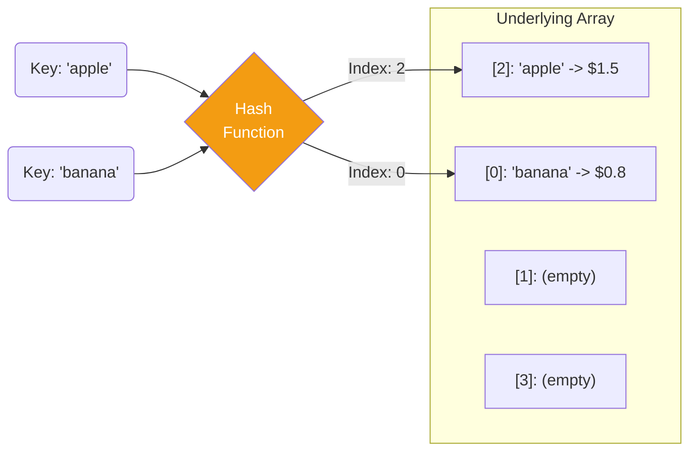
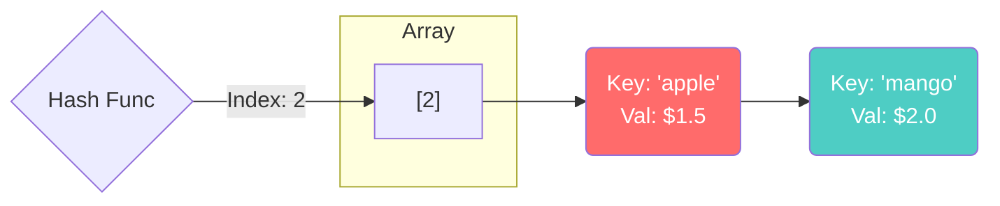

# Hash Table — Bí quyết tìm kiếm O(1)

Bạn có bao giờ tự hỏi: Tại sao tra cứu một từ trong cuốn từ điển Oxford 3000 trang lại nhanh đến thế? Bạn không lật từng trang từ đầu đến cuối (Array O(n)). Bạn nhảy thẳng đến phần chữ cái đầu tiên của từ đó.

Chào mừng bạn đến với **Phần 3: Non-linear Data Structures (Cấu trúc dữ liệu phi tuyến)**. Cấu trúc đầu tiên và cũng là cấu trúc mạnh mẽ nhất trong việc tìm kiếm dữ liệu: **Hash Table (Bảng băm)**.

## 📋 Agenda

**Thời gian đọc ước tính:** ~8 phút

### Sau bài này, bạn sẽ:
- ✅ **Hiểu** được cơ chế hoạt động của Hash Table dưới bộ nhớ.
- ✅ **Giải thích** được Hash Function (Hàm băm) là gì và tại sao nó lại kỳ diệu.
- ✅ **Tự tay** implement một Hash Table đơn giản và xử lý đụng độ (Collision) bằng TypeScript.
- ✅ **Phân biệt** được sự khác nhau giữa `Object` và `Map` trong JavaScript/TypeScript.

### Yêu cầu đầu vào:
- 🔹 Có kiến thức cơ bản về [Array](../02-linear-ds/01-array.md) và [Linked List](../02-linear-ds/02-linked-list.md).

---

## ❓ Tại sao Array và Linked List là chưa đủ?

**Vấn đề (Problem Statement):**
Bạn đang làm chức năng giỏ hàng. Bạn cần kiểm tra xem sản phẩm có mã `SKU-9999` đã nằm trong giỏ hàng (chứa 10,000 sản phẩm) hay chưa.
- Dùng **Array**: Bạn phải dùng vòng lặp `for` chạy qua từng phần tử để kiểm tra. Mất **O(n)**.
- Dùng **Linked List**: Lại phải chạy từ `Head` đến phần tử cần tìm. Vẫn mất **O(n)**.

**Giải pháp (Solution):**
Chúng ta cần một "phép thuật" để từ mã `SKU-9999`, máy tính tính toán ngay lập tức ra được **vị trí bộ nhớ chính xác** đang cất giữ thông tin món hàng đó và lôi nó ra trong chớp mắt — **O(1)**.
Phép thuật đó có tên là **Hash Table**.

---

## 📖 Hash Table hoạt động như thế nào?

**Định nghĩa:** Hash Table (Bảng băm) là một cấu trúc dữ liệu lưu trữ theo cặp **Key - Value** (Khóa - Giá trị). Nó sử dụng một hàm toán học gọi là `Hash Function` để biến đổi `Key` thành một con số (Index). Con số này chính là vị trí trong một Array ẩn bên dưới.

### Trực quan hóa cơ chế Hashing



### 3 Bước của một thao tác Lưu (Set):
1. Bạn đưa Key `"apple"`.
2. Hash Function chạy và trả về số `2` (Rất nhanh, O(1)).
3. Dữ liệu được lưu vào `Array[2]`.

### 3 Bước của một thao tác Lấy (Get):
1. Bạn hỏi giá của Key `"apple"`.
2. Hash Function chạy, lại tính ra số `2`.
3. Nhảy thẳng vào `Array[2]` để lấy giá. Xong! (O(1)).

---

## 🔨 Cơn ác mộng: Đụng độ (Collision)

Mọi chuyện sẽ hoàn hảo nếu Hash Function luôn sinh ra các số Index khác nhau cho các Key khác nhau. Nhưng thực tế, mảng ẩn (Underlying Array) có giới hạn kích thước (vd: 100 ô). Sẽ có lúc Key `"apple"` sinh ra Index `2`, và Key `"mango"` CŨNG sinh ra Index `2`.

Lúc này, hai trái cây tranh nhau một ô nhớ. Hiện tượng này gọi là **Collision (Đụng độ/Va chạm)**.

### Giải pháp: Separate Chaining (Xâu chuỗi tách biệt)
Khi có đụng độ tại Index `2`, thay vì đè dữ liệu lên nhau, ta biến ô `Array[2]` thành một **Linked List** (hoặc mảng phụ). 


Nếu bạn tìm `"mango"`, máy nhảy đến ô `2`, sau đó duyệt qua cái Linked List ngắn xíu này để lấy đúng xoài.

---

## 🔨 Implement Hash Table bằng TypeScript

Chúng ta sẽ mô phỏng lại cách một Hash Table hoạt động ngầm.

```typescript
// filename: hash-table.ts

class HashTable<T> {
  // Mảng ẩn bên dưới (Kích thước giới hạn là 50 để dễ thấy va chạm)
  private table: Array<Array<[string, T]>>;

  constructor(size = 50) {
    this.table = new Array(size);
  }

  // 💡 Hash Function đơn giản: Biến chuỗi thành số
  private _hash(key: string): number {
    let hash = 0;
    for (let i = 0; i < key.length; i++) {
      hash += key.charCodeAt(i);
    }
    // Dùng phép chia lấy dư (%) để đảm bảo index luôn < size
    return hash % this.table.length; 
  }

  // Lưu dữ liệu (Set) - O(1)
  set(key: string, value: T): void {
    const index = this._hash(key);

    // Nếu ô nhớ chưa có ai, khởi tạo 1 mảng rỗng (đóng vai trò Linked List)
    if (!this.table[index]) {
      this.table[index] = [];
    }

    // Kiểm tra xem Key này đã tồn tại chưa để Update thay vì Thêm mới
    for (let i = 0; i < this.table[index].length; i++) {
      if (this.table[index][i][0] === key) {
        this.table[index][i][1] = value; // Update
        return;
      }
    }

    // Nếu chưa có, đẩy vào cuối mảng phụ (Xử lý Collision)
    this.table[index].push([key, value]);
  }

  // Lấy dữ liệu (Get) - O(1)
  get(key: string): T | undefined {
    const index = this._hash(key);
    const bucket = this.table[index];

    // Nhảy trúng ô trống
    if (!bucket) return undefined;

    // Duyệt mảng phụ để tìm đúng Key
    for (let i = 0; i < bucket.length; i++) {
      if (bucket[i][0] === key) {
        return bucket[i][1];
      }
    }

    return undefined;
  }
}
```

---

## 🚀 WHAT IF — Trong JavaScript/TypeScript đã có sẵn rồi!

Là Junior Dev, bạn không bao giờ phải viết tay class HashTable như trên (trừ khi đi phỏng vấn). JavaScript đã cung cấp sẵn cho bạn **Object (`{}`)** và **Map**.

Cả Object và Map đều được V8 Engine implement bên dưới dưới dạng Hash Table (hoặc tương đương) với tốc độ tra cứu **O(1)**.

### Vậy khi nào dùng `Object`, khi nào dùng `Map`?

Nhiều người có thói quen dùng `Object` cho mọi thứ. Nhưng nếu bạn đang giải toán thuật toán (LeetCode) hoặc quản lý hàng chục ngàn ID, hãy đổi sang dùng `Map`. Đây là Trade-off:

| Tính năng | `Object {}` | `Map` |
|---|---|---|
| **Kiểu của Key** | Chỉ được dùng `string` hoặc `symbol`. | **Bất kỳ kiểu gì!** (`number`, `Object`, `Array`...). Rất mạnh! |
| **Thứ tự Key** | Không đảm bảo thứ tự thêm vào. | **Đảm bảo đúng thứ tự** (Bảo toàn thứ tự chèn). |
| **Kích thước** | Khó lấy (phải dùng `Object.keys(obj).length`). | Lấy dễ dàng qua thuộc tính `map.size` (O(1)). |
| **Hiệu năng thêm/xóa** | Chậm hơn khi thêm/xóa liên tục. | **Tối ưu hóa cực tốt** cho việc chèn/xóa liên tục. |

### ⚠️ Pitfall: Bẫy O(n) ẩn trong Hash Table
Nhớ lại đoạn xử lý Collision (Separate Chaining). Nếu Hash Function của bạn quá "ngu ngốc" (ví dụ: hàm băm luôn trả về số `0`), thì MỌI dữ liệu bạn thêm vào đều dồn cục tại ô `Array[0]`. 
Lúc này, ô `0` biến thành một cái Linked List khổng lồ. Việc tìm kiếm (Get) một phần tử sẽ bị suy thoái từ **O(1) xuống thành O(n)**!

*(May mắn là các Hash Function tích hợp sẵn trong V8 của JS cực kỳ thông minh và phân bổ đều, nên bạn hiếm khi gặp tình trạng này).*

---

## 💬 Thảo luận

Hash Table là "vua" trong việc tìm kiếm dữ liệu khi bạn đã biết trước **Key**.
Tuy nhiên, nếu ứng dụng yêu cầu bạn: *"Hãy in ra tất cả các giá trị theo thứ tự từ nhỏ đến lớn"*, hoặc *"Tìm tất cả các sản phẩm có giá nằm trong khoảng $10 - $50"*, Hash Table sẽ "bó tay" vì dữ liệu của nó được rải rác một cách lộn xộn.

Để lưu trữ dữ liệu nhưng vẫn giữ được **Thứ tự phân cấp**, chúng ta phải bước vào một mô hình dữ liệu phi tuyến đẹp đẽ nhất trong Khoa học máy tính: **Tree (Cây)**.

---
*Made by Anh Tu - Share to be share*
