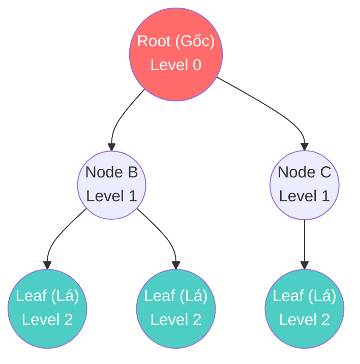

# Binary Tree — Khái niệm cây nhị phân

Từ đầu đến giờ, chúng ta toàn làm việc với cấu trúc "Tuyến tính" (Đường thẳng) — nơi mỗi phần tử chỉ có thể đứng trước hoặc đứng sau một phần tử khác. Nhưng thế giới thực thì phức tạp hơn.

Cấu trúc công ty có Giám đốc -> Trưởng phòng -> Nhân viên.
Cấu trúc thư mục máy tính có Ổ C -> Thư mục Windows -> Thư mục System32 -> File DLL.
Trang web bạn đang xem có thẻ `<html>` -> `<body>` -> `<div>` -> `<p>`.

Tất cả những cấu trúc phân cấp (Hierarchical) đó không thể biểu diễn tốt bằng đường thẳng. Chào mừng bạn đến với cấu trúc mô phỏng tự nhiên nhất: **Tree (Cây)**.

## 📋 Agenda

**Thời gian đọc ước tính:** ~6 phút

### Sau bài này, bạn sẽ:
- ✅ **Hiểu** được khái niệm và các thuật ngữ cốt lõi của Tree (Cây).
- ✅ **Phân biệt** được Tree thông thường và Binary Tree (Cây nhị phân).
- ✅ **Trực quan hóa** được cấu trúc cây dưới bộ nhớ.
- ✅ **Nhận diện** được các biến thể của Cây nhị phân (Full, Complete, Perfect).

### Yêu cầu đầu vào:
- 🔹 Có kiến thức cơ bản về [Linked List](../02-linear-ds/02-linked-list.md) (Vì Tree được xây dựng dựa trên Node và Con trỏ).

---

## ❓ Tại sao lại phải vẽ Cây?

**Vấn đề (Problem Statement):**
Bạn đang làm một ứng dụng lưu trữ File tĩnh (giống Google Drive). Bạn có 1 triệu file. Nếu bạn lưu bằng Array hay Hash Table, bạn có thể tìm kiếm rất nhanh tên một file. 
NHƯNG, nếu người dùng muốn biết: "Thư mục `Hình ảnh` có chứa những thư mục con nào?", hay "Xóa toàn bộ thư mục `Tài liệu` và mọi file bên trong nó" — Array hay Hash Table sẽ bó tay, vì chúng không lưu trữ **mối quan hệ Cha-Con**.

**Giải pháp (Solution):**
**Tree (Cây)**. Bằng cách lưu trữ dữ liệu dưới dạng các Nút (Node) liên kết theo mô hình Cha-Con, bạn bảo toàn được cấp bậc của dữ liệu. Việc "Xóa thư mục `Tài liệu`" đơn giản chỉ là chặt đứt sợi dây liên kết giữa `Gốc` và `Tài liệu`, toàn bộ cành lá phía dưới sẽ tự động bị Garbage Collector dọn dẹp.

---

## 📖 Cây và Cây nhị phân là gì?

**Định nghĩa Tree:** Là một cấu trúc dữ liệu gồm nhiều Nút (Node) liên kết với nhau theo mô hình phân cấp, bắt đầu từ một nút gốc (Root) duy nhất. Không có vòng lặp (Cycle) nào được phép tồn tại trong cây (Nếu có vòng lặp, nó trở thành Đồ thị - Graph).

### Các thuật ngữ "Lâm nghiệp" cần nhớ



- **Root (Gốc):** Nút trên cùng, không có Cha. Mọi nút khác đều rẽ nhánh từ đây.
- **Node (Nút):** Chứa dữ liệu (Value) và liên kết tới các Nút con.
- **Leaf (Lá):** Nút tận cùng, không có con.
- **Parent/Child/Sibling:** Mối quan hệ Cha/Con/Anh em (cùng chung một Cha).
- **Edge (Cạnh):** Đường liên kết nối 2 nút.
- **Depth/Level (Độ sâu/Tầng):** Nút Gốc là Level 0. Con của nó là Level 1...

### Sự ra đời của Binary Tree (Cây nhị phân)
Cây thông thường (General Tree) như cấu trúc HTML thì một Cha có thể có bao nhiêu Con tùy thích. Nhưng trong lập trình tối ưu thuật toán, việc để số lượng Con tự do sẽ khiến việc viết code cực kỳ khó kiểm soát.

Do đó, người ta đẻ ra một quy tắc: **"Mỗi Cha được phép có TỐI ĐA 2 Con"**. Cấu trúc đó gọi là **Cây nhị phân (Binary Tree)**.
Hai đứa con này được đặt tên rõ ràng là **Left Child (Con Trái)** và **Right Child (Con Phải)**.

---

## 🔨 Cấu trúc TypeScript của Binary Tree

Nếu bạn còn nhớ Singly Linked List có cấu trúc `[Value, Next]`, thì Binary Tree là bản nâng cấp có 2 ngã rẽ: `[Value, Left, Right]`.

```typescript
// filename: binary-tree.ts

// 💡 Định nghĩa một Nút của Cây nhị phân
class TreeNode<T> {
  value: T;
  left: TreeNode<T> | null;
  right: TreeNode<T> | null;

  constructor(value: T) {
    this.value = value;
    this.left = null;   // Trỏ sang con Trái
    this.right = null;  // Trỏ sang con Phải
  }
}

// Cách "trồng" một cái cây thủ công:
const root = new TreeNode("Giám Đốc");
const nodeLeft = new TreeNode("Trưởng phòng IT");
const nodeRight = new TreeNode("Trưởng phòng HR");

root.left = nodeLeft;
root.right = nodeRight;
```

---

## 🚀 WHAT IF — Các biến thể của Binary Tree

Khi thao tác với Cây nhị phân, hiệu năng (Time Complexity) phụ thuộc hoàn toàn vào **Hình dáng (Shape)** của cái cây đó. Dưới đây là 3 hình dáng kinh điển mà bạn sẽ bị hỏi khi phỏng vấn:

### 1. Full Binary Tree (Cây nhị phân Đầy đủ)
**Quy tắc:** Mỗi Nút hoặc là **Không có con (Lá)**, hoặc là phải có **Đủ 2 con**. Tuyệt đối không được đẻ "Con 1 bề" (chỉ có 1 con trái/phải).

### 2. Complete Binary Tree (Cây nhị phân Hoàn chỉnh)
**Quy tắc:** Mọi Tầng (Level) phải được lấp đầy, TRỪ tầng cuối cùng. Nhưng nếu tầng cuối cùng bị khuyết, thì phải khuyết từ Phải sang Trái (Tức là các Nút phải mọc dồn hết về bên Trái).
*(Cấu trúc này là nền tảng cốt lõi để xây dựng tính năng Priority Queue bằng Heap - sẽ học ở bài sau).*

### 3. Perfect Binary Tree (Cây nhị phân Hoàn hảo)
**Quy tắc:** Sự kết hợp của cả Full và Complete. Mọi Nút bên trong đều có 2 con, và mọi Lá đều nằm cùng một Tầng tận cùng. Hình dáng của nó là một tam giác cân hoàn hảo.

### ⚠️ Pitfall: Cây biến dạng thành Linked List (Degenerate Tree)
Nếu bạn "trồng cây" theo cách: Node A chỉ có con Trái là B, B chỉ có con Trái là C, C chỉ có con Trái là D...
Cái cây của bạn đã biến dạng thành một đường thẳng (Linked List). Khi đó, lợi thế chia để trị của Tree bị phá vỡ, hiệu năng tìm kiếm rơi tự do từ **O(log n)** xuống **O(n)**.

---

## 💬 Thảo luận

Bản thân Binary Tree thông thường chỉ là một mô hình phân cấp, nó chưa giúp ích nhiều cho việc **Tối ưu Tốc độ Tìm kiếm**. 

Sức mạnh thực sự của Cây nhị phân chỉ được bộc lộ khi chúng ta áp dụng một **Quy tắc Sắp xếp giá trị** lên các Nút của nó. Nếu chúng ta quy định *"Trái nhỏ hơn Cha, Phải lớn hơn Cha"*, phép màu tìm kiếm O(log n) sẽ xuất hiện.

Mời bạn đến với kiến trúc đỉnh cao được dùng trong mọi Database Indexing: **Binary Search Tree (BST - Cây nhị phân tìm kiếm)**.

---
*Made by Anh Tu - Share to be share*
