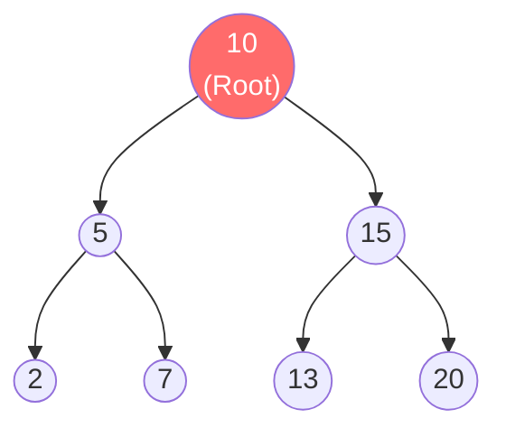
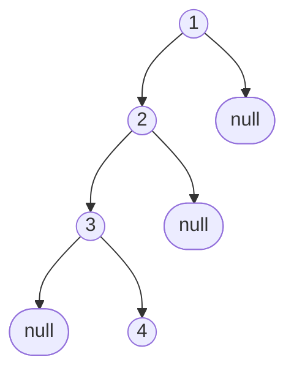

# Binary Search Tree (BST) — Phép màu của sự sắp xếp

Hash Table cho phép tìm kiếm cực nhanh `O(1)`, nhưng dữ liệu của nó bị xáo trộn. Nếu người dùng muốn lọc các sản phẩm có giá từ $10 đến $50, Hash Table trở nên vô dụng.
Array cho phép lưu dữ liệu có thứ tự, nhưng nếu bạn muốn chèn thêm một sản phẩm giá $25 vào giữa mảng đang sắp xếp, Array bắt các phần tử khác phải lùi lại, tốn `O(n)`.

Làm sao để có một cấu trúc vừa hỗ trợ **Tìm kiếm theo khoảng (Range Search)** cực nhanh, lại vừa hỗ trợ **Thêm/Xóa** mà không bắt ai phải nhường chỗ? Chào mừng bạn đến với cấu trúc nền tảng của mọi Database: **Binary Search Tree (BST)**.

## 📋 Agenda

**Thời gian đọc ước tính:** ~10 phút

### Sau bài này, bạn sẽ:
- ✅ **Hiểu** được quy tắc cốt lõi giúp BST có tốc độ cực khủng.
- ✅ **Giải thích** được sức mạnh của độ phức tạp `O(log n)`.
- ✅ **Tự tay** implement các thao tác Insert và Search trên BST bằng TypeScript.
- ✅ **Nhận diện** được điểm yếu chí mạng khiến BST bị suy thoái.

### Yêu cầu đầu vào:
- 🔹 Đã nắm vững khái niệm [Binary Tree](./02-binary-tree.md).

---

## ❓ Bí quyết Tìm kiếm của BST

**Vấn đề (Problem Statement):**
Cho một Array chứa 1 tỷ con số đã được sắp xếp từ nhỏ đến lớn. Bạn cần tìm số `999,999,999`. Nếu dùng vòng lặp tuyến tính (Linear Search), CPU phải chạy 1 tỷ bước. Quá chậm!

**Giải pháp (Solution):**
**Binary Search Tree**. Bằng cách áp đặt một quy tắc sắp xếp nghiêm ngặt lên các Nút (Node) của cây nhị phân, chúng ta mô phỏng lại trò chơi "Đoán số". 
- Tôi nghĩ một số từ 1-100.
- Bạn đoán 50. Tôi bảo "Lớn hơn".
- Bạn loại bỏ lập tức một nửa (1-50), và đoán tiếp ở đoạn (51-100).
- Chỉ mất tối đa 7 bước để tìm ra kết quả trong 100 số. Đó chính là sức mạnh của BST.

---

## 📖 Quy tắc vàng của BST

**Định nghĩa:** Binary Search Tree (BST) là một cây nhị phân phải tuân thủ nghiêm ngặt quy tắc sau tại MỌI Nút:
1. Tất cả các nút con ở nhánh **TRÁI** phải có giá trị **NHỎ HƠN** Nút Cha.
2. Tất cả các nút con ở nhánh **PHẢI** phải có giá trị **LỚN HƠN** Nút Cha.
3. Mỗi nhánh con (Sub-tree) cũng phải là một BST hợp lệ.

### Trực quan hóa quy tắc BST



**Thử nghiệm tìm số 7:**
1. Bắt đầu từ Root (10). 7 < 10 -> Đi sang TRÁI.
2. Gặp Node (5). 7 > 5 -> Đi sang PHẢI.
3. Bùm! Tìm thấy Node (7). Chỉ mất 3 bước!

### Quyền năng O(log n)
Mỗi lần bạn rẽ Trái hoặc rẽ Phải, bạn đang **Loại bỏ đi MỘT NỬA** số lượng Nút còn lại của cây. 
- 1 tỷ Node -> rẽ 1 lần còn 500 triệu.
- Rẽ 30 lần -> Chỉ còn 1 Node.
Tốc độ chia đôi này trong Toán học gọi là **Logarit cơ số 2**, ký hiệu là `O(log n)`. Rất sát với `O(1)`.

---

## 🔨 Implement BST bằng TypeScript

Chúng ta sẽ tận dụng lại `TreeNode` từ bài trước.

### 1. Hàm Thêm phần tử (Insert)

Để thêm 1 số, ta so sánh nó với Root. Nếu nhỏ hơn rẽ Trái, lớn hơn rẽ Phải. Lặp lại đến khi gặp ô trống (null) thì nhét vào.

```typescript
// filename: bst.ts

class TreeNode {
  constructor(public value: number, public left: TreeNode | null = null, public right: TreeNode | null = null) {}
}

class BinarySearchTree {
  root: TreeNode | null = null;

  // Thêm một Nút mới - O(log n)
  insert(value: number): void {
    const newNode = new TreeNode(value);
    
    // Nếu cây trống, trồng thẳng vào Root
    if (!this.root) {
      this.root = newNode;
      return;
    }

    let current = this.root;
    // Dùng vòng lặp while để đi xuống cây (Có thể dùng Đệ quy nhưng while tốn ít bộ nhớ Call Stack hơn)
    while (true) {
      // Bỏ qua giá trị trùng lặp (BST thường không cho phép duplicate)
      if (value === current.value) return undefined;

      if (value < current.value) {
        // Rẽ Trái
        if (!current.left) {
          current.left = newNode; // Thấy chỗ trống, nhét vào!
          return;
        }
        current = current.left; // Tiếp tục đi xuống Trái
      } else {
        // Rẽ Phải
        if (!current.right) {
          current.right = newNode; // Thấy chỗ trống, nhét vào!
          return;
        }
        current = current.right; // Tiếp tục đi xuống Phải
      }
    }
  }
}
```

### 2. Hàm Tìm kiếm (Search)

Tương tự Insert, nhưng ta không thêm Node mà chỉ so sánh để trả về.

```typescript
// filename: bst.ts

  // Tìm kiếm một Nút - O(log n)
  search(value: number): TreeNode | null {
    if (!this.root) return null;

    let current: TreeNode | null = this.root;

    // Lặp đến khi tìm thấy hoặc hết đường (current === null)
    while (current) {
      if (value < current.value) {
        current = current.left; // Nhỏ hơn -> rẽ Trái
      } else if (value > current.value) {
        current = current.right; // Lớn hơn -> rẽ Phải
      } else {
        return current; // Bằng nhau -> Đã tìm thấy!
      }
    }

    return null; // Không tìm thấy
  }
```

---

## 🚀 WHAT IF — Đánh đổi và Điểm yếu chí mạng

### Tại sao Database (MySQL, PostgreSQL) dùng BST?
Chính xác hơn, Database sử dụng **B-Tree** (Một bản nâng cấp của BST cho phép nhiều hơn 2 con).
Nó giải quyết được bài toán: *"Dữ liệu luôn được lưu trữ có thứ tự (Order)*, hỗ trợ tìm kiếm khoảng cực tốt (vd: `WHERE price BETWEEN 10 AND 50`). Hash Table không làm được điều này.

### ⚠️ Pitfall: Điểm yếu chí mạng (Unbalanced Tree)
Sức mạnh `O(log n)` của BST CHỈ ĐÚNG khi cái cây được **Cân bằng (Balanced)** — tức là số lượng con bên trái xấp xỉ bên phải.

Nếu dữ liệu bạn đưa vào là một mảng đã được sắp xếp sẵn: `insert(1), insert(2), insert(3), insert(4)`...
Mọi giá trị mới đều lớn hơn Root, nó sẽ mọc rễ Đơn Độc Về Bên Phải. Cái cây của bạn biến dạng thành một đường thẳng (Linked List).



Lúc này, tốc độ tìm kiếm suy thoái từ **O(log n)** thảm hại rơi xuống **O(n)**.

**Cách khắc phục:**
Các nhà Khoa học Máy tính đã phát minh ra các thuật toán Tự cân bằng (Self-Balancing BST) như **AVL Tree** hay **Red-Black Tree**. Khi cây có dấu hiệu lệch, nó sẽ tự động "Xoay (Rotate)" các Nút để đưa hình dáng tam giác cân bằng trở lại, đảm bảo O(log n) luôn được giữ vững.

---

## 💬 Thảo luận

BST là một cấu trúc tuyệt vời cho việc lưu trữ và tìm kiếm dữ liệu lớn. Nhưng nếu bài toán của bạn KHÔNG PHẢI là "Tìm một phần tử bất kỳ", mà là **"Luôn luôn phải lấy ra phần tử LỚN NHẤT (hoặc Nhỏ Nhất) nhanh nhất có thể"** thì sao?

Ví dụ: Bệnh viện muốn luôn gọi bệnh nhân Cấp cứu nặng nhất (Priority) vào trước, thay vì người đến trước.

Để giải quyết bài toán Ưu tiên này, chúng ta cần thay đổi Quy tắc của Cây nhị phân. Mời bạn đến với kiến trúc siêu việt: **Heap & Priority Queue**.

---
*Made by Anh Tu - Share to be share*
