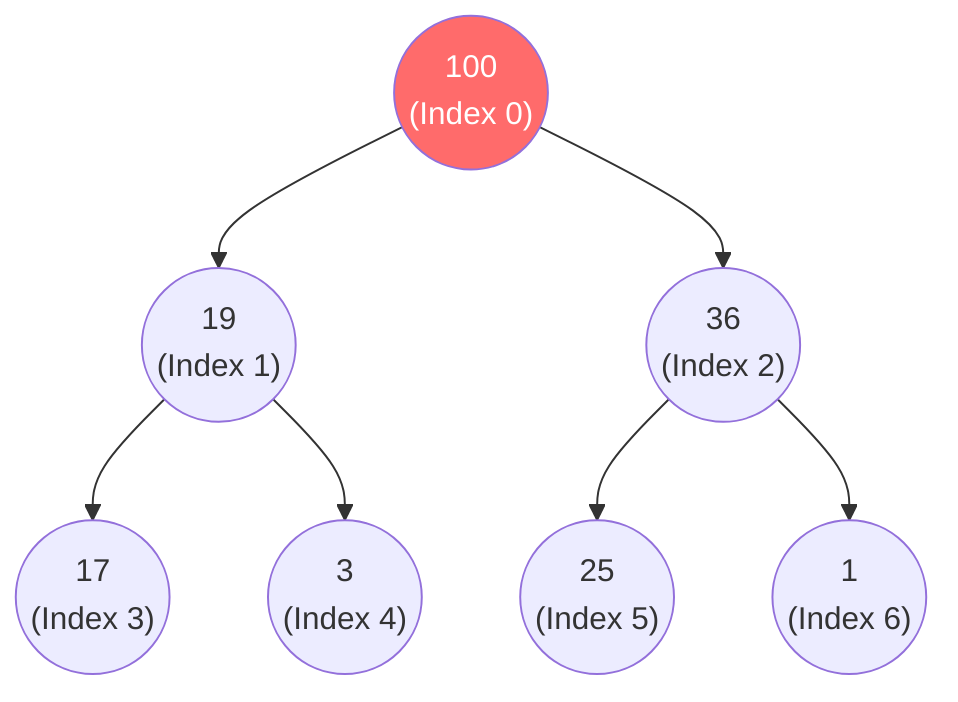

# Heap & Priority Queue — Cấp cứu và Sự ưu tiên

Ở bài [Queue (Hàng đợi)](../02-linear-ds/05-queue.md), chúng ta đã học nguyên lý FIFO (Vào trước ra trước) để đảm bảo sự công bằng. Nhưng thế giới không phải lúc nào cũng công bằng. 

Trong phòng cấp cứu, người đến sau nhưng bị đau tim (Priority cao) phải được bác sĩ khám trước người đến trước nhưng chỉ bị xước tay (Priority thấp). Hệ điều hành của máy tính cũng vậy, tiến trình xử lý chuột/bàn phím luôn được ưu tiên (chạy trước) so với tiến trình tải file ngầm.

Làm sao để giải bài toán **Hàng đợi ưu tiên (Priority Queue)** này? 
Chào mừng bạn đến với cấu trúc dữ liệu thanh lịch nhất: **Heap**.

## 📋 Agenda

**Thời gian đọc ước tính:** ~10 phút

### Sau bài này, bạn sẽ:
- ✅ **Hiểu** được khái niệm và quy tắc của Heap (Max Heap / Min Heap).
- ✅ **Giải thích** được cách một cái Cây nhị phân lại có thể được nhét gọn gàng vào trong một cái mảng (Array).
- ✅ **Nắm bắt** được cơ chế "Bọt nổi lên" (Swim/Bubble up) và "Chìm xuống" (Sink/Sink down) để duy trì cấu trúc Heap.
- ✅ **Nhận diện** được khi nào dùng BST, khi nào dùng Heap.

### Yêu cầu đầu vào:
- 🔹 Đã nắm vững [Binary Tree](./02-binary-tree.md) và [Array](../02-linear-ds/01-array.md).

---

## ❓ Tại sao BST là chưa đủ?

**Vấn đề (Problem Statement):**
Để giải bài toán Priority Queue, bạn cần một cấu trúc giúp bạn **luôn lấy ra được Phần tử lớn nhất (hoặc nhỏ nhất) cực nhanh**.
- Nếu dùng Array thường: Bạn mất **O(n)** để tìm thằng lớn nhất.
- Nếu dùng Array đã sort: Lấy lớn nhất mất O(1), nhưng khi nhét một người mới vào đúng thứ tự lại mất **O(n)**.
- Nếu dùng Binary Search Tree (BST): Phần tử lớn nhất nằm ở tận cùng bên phải, tìm mất **O(log n)**. Nhét người mới vào cũng mất **O(log n)**. Có vẻ ổn! Nhưng... việc cài đặt cây BST với class `TreeNode` phức tạp, chiếm bộ nhớ (con trỏ left/right) và dễ bị suy thoái thành O(n) nếu không cân bằng (Balanced).

**Giải pháp (Solution):**
**Heap**. Heap là một cây nhị phân, nhưng nó áp dụng một quy tắc "chuyên biệt" giúp phần tử Lớn Nhất (hoặc Nhỏ Nhất) LUÔN NẰM Ở ROOT. Và phép màu nằm ở chỗ: **Heap không dùng Node, nó dùng Array để giả lập một cái Cây!** Không cần class, không tốn con trỏ bộ nhớ. Tốc độ thực thi thực tế bằng Array cực kỳ khủng khiếp nhờ Cache của CPU.

---

## 📖 Quy tắc của Heap

Có 2 loại: **Max Heap** (Root luôn là to nhất) và **Min Heap** (Root luôn là nhỏ nhất). Chúng ta sẽ nói về Max Heap.

**Định nghĩa Max Heap:** 
1. Phải là một **Complete Binary Tree** (Cây nhị phân hoàn chỉnh - lấp đầy từ Trái sang Phải).
2. **Giá trị của Cha LUÔN lớn hơn (hoặc bằng) giá trị của Con.**

> 💡 **Khác biệt cốt lõi với BST:** BST quy định Trái < Cha < Phải. Còn Heap KHÔNG QUAN TÂM trái/phải ai lớn hơn, nó chỉ quan tâm **Cha phải lớn hơn cả hai con**. Do đó, thằng to nhất auto trồi lên Root.

### Phép màu: Biểu diễn Cây bằng Mảng (Array)
Vì Heap luôn lấp đầy từ trái sang phải (Complete Tree), ta có thể đánh số thứ tự từ trên xuống dưới, trái sang phải, và nhét nó vào một cái Array.


Mảng tương ứng: `[100, 19, 36, 17, 3, 25, 1]`

**Toán học kì diệu:** Nếu bạn đang đứng ở phần tử có Index `i` trong mảng:
- Con trái của bạn ở index: `2i + 1`
- Con phải của bạn ở index: `2i + 2`
- Cha của bạn ở index: `Math.floor((i - 1) / 2)`

Chỉ bằng những phép nhân chia mảng đơn giản, bạn di chuyển trên cái cây này với tốc độ ánh sáng!

---

## 🔨 Cơ chế Thêm/Xóa của Heap

### 1. Hàm Insert — Bọt nổi lên (Bubble Up / Swim) — O(log n)
Khi có bệnh nhân mới (hoặc con số mới) vào Heap:
1. Nhét vào đuôi mảng (Vị trí trống cuối cùng của lá bên trái).
2. Kiểm tra: Số này có LỚN HƠN cha của nó không?
3. Nếu lớn hơn -> Hoán đổi vị trí (Swap) với Cha.
4. Lặp lại bước 2-3 cho đến khi nó gặp người Cha to hơn nó (hoặc nó trở thành Root). Hiện tượng này giống viên bọt khí trồi dần lên mặt nước.

### 2. Hàm Extract Max — Chìm xuống (Sink Down) — O(log n)
Khi bác sĩ gọi bệnh nhân nguy cấp nhất (Lấy Root ra khỏi mảng):
1. Lấy Root ra (100) -> Trả về cho hệ thống.
2. Lúc này Root bị trống. Lấy đứa ở **Đuôi mảng** (số 1) thế chỗ vào Root để giữ form cái cây.
3. Số 1 ở Root quá nhỏ, vi phạm quy tắc Heap. Nó phải "chìm xuống".
4. So sánh số 1 với 2 đứa con của nó (19 và 36). Đứa con nào TO NHẤT (36) sẽ được Swap thế chỗ cho số 1.
5. Số 1 tiếp tục chìm xuống đến khi nó lớn hơn các con của nó.

### TypeScript Code (Logic Cốt lõi)

```typescript
// filename: max-heap.ts

class MaxHeap {
  private values: number[] = []; // Dùng Array giả lập cây

  // Lấy ra phần tử lớn nhất - O(log n)
  extractMax(): number | undefined {
    const max = this.values[0];
    const end = this.values.pop();
    
    // Nếu mảng còn phần tử sau khi pop
    if (this.values.length > 0 && end !== undefined) {
      this.values[0] = end; // Lấy thằng đuôi đội lên đầu
      this.sinkDown(0); // Bắt nó chìm xuống đúng vị trí
    }
    
    return max;
  }

  // Thuật toán chìm (Sink down)
  private sinkDown(index: number): void {
    const length = this.values.length;
    const element = this.values[index];
    
    while (true) {
      let leftChildIdx = 2 * index + 1;
      let rightChildIdx = 2 * index + 2;
      let leftChild, rightChild;
      let swapIdx = null;

      // Ktra con Trái
      if (leftChildIdx < length) {
        leftChild = this.values[leftChildIdx];
        if (leftChild > element) {
          swapIdx = leftChildIdx;
        }
      }

      // Ktra con Phải
      if (rightChildIdx < length) {
        rightChild = this.values[rightChildIdx];
        // Nếu phải đổi chỗ, chọn thằng TO HƠN giữa Trái và Phải
        if ((swapIdx === null && rightChild > element) || 
            (swapIdx !== null && leftChild !== undefined && rightChild > leftChild)) {
          swapIdx = rightChildIdx;
        }
      }

      // Nếu không cần đổi chỗ nữa -> Thoát vòng lặp
      if (swapIdx === null) break;

      // Swap
      this.values[index] = this.values[swapIdx];
      this.values[swapIdx] = element;
      index = swapIdx; // Tiếp tục chìm xuống
    }
  }
}
```

---

## 🚀 WHAT IF — Heap vs BST

Đều là Tree, đều có tốc độ `O(log n)`, vậy khi nào dùng cái nào? Là Junior Dev, bạn PHẢI phân biệt được:

| Tính năng | Binary Search Tree (BST) | Heap (Priority Queue) |
|---|---|---|
| **Lấy giá trị Max/Min** | `O(log n)` (Phải đi tận cùng trái/phải) | **`O(1)`** (Nó nằm ngay vị trí `array[0]`) 🏆 |
| **Tìm một giá trị X bất kỳ** | `O(log n)` (Đi rẽ theo hướng lớn/nhỏ) 🏆 | **`O(n)`** (Heap bị xáo trộn, phải duyệt cả mảng Array) |
| **Duyệt danh sách theo thứ tự** | Rất tốt (In-order traversal ra ngay ds đã sort) 🏆 | Rất tệ (Dữ liệu không hoàn toàn sort) |
| **Bộ nhớ (Space Overhead)** | Tốn RAM do Class Node và con trỏ left/right | Siêu nhẹ vì dùng Array gốc 🏆 |

**Kết luận:** 
- Nếu bài toán đòi hỏi Tìm Kiếm Nhanh bất kỳ thứ gì -> Dùng **BST / Hash Table**.
- Nếu bài toán CHỈ xoay quanh việc "Ai lớn nhất/nhỏ nhất xử lý trước" -> Dùng **Heap / Priority Queue**.

### ⚠️ Pitfall
JavaScript/TypeScript (cho đến ECMAScript hiện tại) **KHÔNG có sẵn thư viện Priority Queue (Heap)** tích hợp như Java hay C++. Nếu bạn làm LeetCode liên quan đến Heap bằng JS/TS, bạn bắt buộc phải tự implement class `MinHeap`/`MaxHeap` như trên, hoặc dùng thư viện bên thứ 3 (như `@datastructures-js/priority-queue`).

---

## 💬 Thảo luận

Heap giúp chúng ta tìm ra "Đứa con ưu tú nhất" siêu nhanh. 
Nhưng nếu chúng ta không làm việc với Con số, mà làm việc với **Chuỗi văn bản (String)** thì sao?

Làm sao bộ máy tìm kiếm của Google có thể hiển thị hàng loạt kết quả Gợi ý (Autocomplete) chỉ vài mili-giây sau khi bạn vừa gõ chữ `"How to..."`? Họ không dùng BST hay Heap.

Họ dùng một cấu trúc cây chuyên biệt cho Text. Mời bạn đến với kiến trúc siêu tốc của Autocomplete: **Trie (Prefix Tree)**.

---
*Made by Anh Tu - Share to be share*
