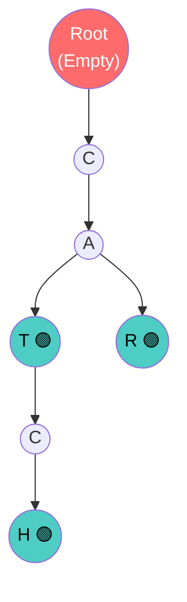

# Trie — Cỗ máy Autocomplete siêu tốc

Mỗi khi bạn gõ "How to t..." lên thanh tìm kiếm Google, hàng chục gợi ý như "How to tie a tie", "How to train your dragon" lập tức hiện ra. Sự kiện hiển thị này diễn ra chỉ trong vài mili-giây, ngay cả khi Google đang phải tìm kiếm trên hàng tỷ cụm từ trong Database.

Nếu Google lưu các cụm từ này trong một Array, họ phải duyệt O(n). Nếu dùng Hash Table, Hash Table chỉ tìm được khi có từ khóa CHÍNH XÁC, không thể tìm một phần của từ (Prefix).

Vậy họ dùng công nghệ ngoài hành tinh gì? Chào mừng bạn đến với **Trie (Prefix Tree)**.

## 📋 Agenda

**Thời gian đọc ước tính:** ~7 phút

### Sau bài này, bạn sẽ:
- ✅ **Hiểu** được tại sao Trie lại là vua của thao tác xử lý chuỗi văn bản (String).
- ✅ **Giải thích** được cấu trúc lưu trữ tiết kiệm bộ nhớ khi các từ có chung tiền tố (Prefix).
- ✅ **Tự tay** implement một Trie bằng TypeScript.
- ✅ **Phân biệt** được Time Complexity giữa Hash Table và Trie.

### Yêu cầu đầu vào:
- 🔹 Đã nắm vững khái niệm [Hash Table](./01-hash-table.md) và [Tree](./02-binary-tree.md).

---

## ❓ Tại sao BST hay Hash Table bó tay?

**Vấn đề (Problem Statement):**
Bạn muốn làm chức năng Gợi ý tìm kiếm (Autocomplete) cho ứng dụng từ điển. Bạn đang có 1 triệu từ tiếng Anh.
Khi người dùng gõ chữ `C`, `A`, `T`. Bạn phải lôi ra toàn bộ các từ bắt đầu bằng chữ "cat" như `cat`, `catch`, `catastrophe`.
- **Dùng BST:** Mất O(log n) để tìm. Nhưng tìm chữ "cat" không giúp bạn lấy ra TẤT CẢ các từ bắt đầu bằng "cat" một cách dễ dàng.
- **Dùng Hash Table:** Phải gõ chữ "catch" thì Hash Table mới băm ra được Index để lấy dữ liệu. Mới gõ "cat" thì không ra được "catch".

**Giải pháp (Solution):**
**Trie (Phát âm là "Try")**. Thay vì lưu nguyên một từ vào một Node, Trie sẽ "chặt" từ đó ra thành từng chữ cái. Mỗi chữ cái là một Node. Những từ nào bắt đầu giống nhau (ví dụ: `cat` và `catch`) sẽ dùng **CHUNG** một đoạn thân cây `C -> A -> T`. Nhờ đó, việc tìm tiền tố (Prefix) nhanh chóng một cách khó tin.

---

## 📖 Cấu trúc của Cây Tiền Tố (Prefix Tree)

**Định nghĩa:** Trie (hay Prefix Tree) là một dạng cấu trúc dữ liệu dạng cây chuyên dùng để lưu trữ một tập dữ liệu động (dynamic set) hoặc mảng kết hợp mà khóa (Key) của nó là **Chuỗi văn bản (String)**.

### Trực quan hóa cấu trúc

Lưu 3 từ: `CAT`, `CATCH`, `CAR`


*(Các nút có dấu 🟢 đánh dấu sự KẾT THÚC của một từ hợp lệ có ý nghĩa)*

- Nhìn vào cây, ta thấy có 3 từ hợp lệ (3 dấu xanh): `CAT`, `CAR`, `CATCH`.
- Dù có 3 từ (11 chữ cái), nhưng chúng ta chỉ tốn **7 Nodes** (Tiết kiệm bộ nhớ nhờ dùng chung tiền tố).

### Sức mạnh Time Complexity: O(L)
Trong đó `L` là chiều dài của chuỗi văn bản (Length of word).
Nếu bạn tìm từ "catch", bạn chỉ việc đi 5 bước (c -> a -> t -> c -> h) xuống cây. **Dù từ điển có 1 tỷ từ, bạn vẫn chỉ đi đúng 5 bước.** Nó không phụ thuộc vào `n` (Số lượng từ trong từ điển)!

---

## 🔨 Implement Trie bằng TypeScript

Mỗi Node của Trie không giới hạn ở 2 con (như Binary Tree). Nó có thể có 26 con (nếu là chữ cái tiếng Anh). Do đó, tốt nhất là dùng `Map` hoặc `Object` để lưu trữ tập hợp các nhánh con.

### 1. Khởi tạo Trie Node
```typescript
// filename: trie.ts

class TrieNode {
  // Thay vì dùng left/right, ta dùng Hash Map để lưu các ngã rẽ chữ cái
  public children: Map<string, TrieNode> = new Map();
  // Đánh dấu đây có phải là ký tự kết thúc của một từ có nghĩa không?
  public isEndOfWord: boolean = false; 
}
```

### 2. Triển khai Class Trie
```typescript
// filename: trie.ts

class Trie {
  private root: TrieNode = new TrieNode();

  // Thêm từ mới (Insert) - O(L)
  insert(word: string): void {
    let current = this.root;

    // Duyệt qua từng chữ cái của từ truyền vào
    for (const char of word) {
      // Nếu chưa có nhánh chữ cái này, thì mọc nhánh mới
      if (!current.children.has(char)) {
        current.children.set(char, new TrieNode());
      }
      // Đi tiếp xuống nhánh đó
      current = current.children.get(char)!;
    }
    
    // Hết từ, cắm cờ đánh dấu từ hợp lệ ở Nút cuối cùng
    current.isEndOfWord = true;
  }

  // Khám phá Autocomplete: Kiểm tra có từ nào Bắt Đầu bằng tiền tố này không?
  startsWith(prefix: string): boolean {
    let current = this.root;

    for (const char of prefix) {
      // Nếu đang đi mà đứt đường (không tìm thấy nhánh chữ cái)
      if (!current.children.has(char)) {
        return false; // Tiền tố không tồn tại
      }
      current = current.children.get(char)!;
    }

    return true; // Nếu đi được đến cuối tiền tố mà không đứt đường -> Có tồn tại
  }
}
```

### Ví dụ sử dụng:
```typescript
const autocomplete = new Trie();
autocomplete.insert("apple");
autocomplete.insert("application");

console.log(autocomplete.startsWith("app")); // true (Google sẽ hiển thị gợi ý!)
console.log(autocomplete.startsWith("ban")); // false (Người dùng gõ sai, hoặc không có kết quả)
```

---

## 🚀 WHAT IF — Đánh đổi và Ứng dụng thực tế

### Ứng dụng đỉnh cao
- **Autocomplete (Gợi ý tìm kiếm):** Như đã phân tích.
- **Spell Checker (Kiểm tra chính tả):** Máy chạy qua Trie, nếu trả về `false` -> Gạch chân màu đỏ chữ bị viết sai.
- **Mạng định tuyến (Network Routing):** Dùng IP Routing (Trie lưu các dải địa chỉ IP dài loằng ngoằng cực kỳ tiết kiệm bộ nhớ).

### ⚠️ Đánh đổi (Trade-off): Sát thủ Bộ nhớ (Space Complexity)
Trie đổi Không gian (Space) lấy Tốc độ (Time). 
- Dù tiết kiệm được những từ chung tiền tố, nhưng mỗi `TrieNode` lại chứa một Hash Map để chứa 26 chữ cái. 
- Nếu từ vựng đa dạng, không trùng lặp nhiều, Trie sẽ "phình to" theo cấp số nhân và ăn một lượng RAM khổng lồ so với lưu trữ bằng mảng Array thông thường.

*(Đó là lý do nhiều lúc thay vì dùng bộ nhớ RAM, các ứng dụng như Elasticsearch sẽ cấu trúc Trie dưới dạng file nhị phân trên ổ cứng).*

---

## 💬 Thảo luận

Từ đầu chương trình, chúng ta đã được chiêm ngưỡng sức mạnh của Tree (Cây) trong việc phân cấp, tìm kiếm, lưu trữ chuỗi. 

Nhưng, đặc điểm của Tree là: **Nó chỉ rẽ xuống, không bao giờ quay ngược lên tạo thành vòng tròn.** 

Thế giới tự nhiên không đơn giản thế. Bạn có bao giờ tự hỏi: *"Làm sao Google Maps tìm được đường đi ngắn nhất giữa 2 điểm trên đường phố đan xen nhằng nhịt?"* hay *"Làm sao Facebook biết bạn và người kia có chung 15 bạn chung?"*.

Mạng lưới quan hệ phức tạp, đa chiều, có vòng lặp đó không thể biểu diễn bằng Cây. Chúng ta cần Cấu trúc dữ liệu Tối thượng nhất. Chào mừng bạn đến với **Graph (Đồ thị)**.

---
*Made by Anh Tu - Share to be share*
