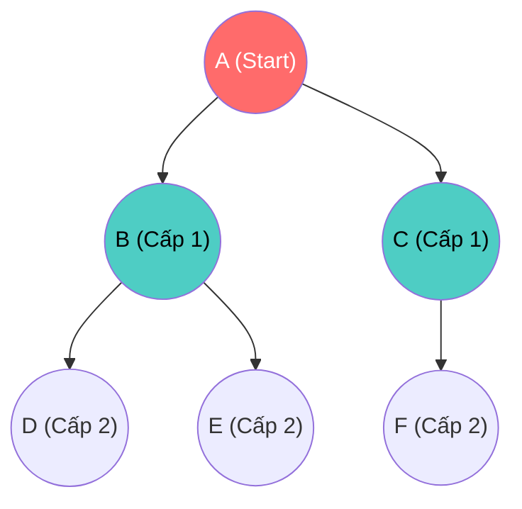

# BFS & DFS — Nghệ thuật Lạc trong Mê Cung

Nếu bạn bị thả vào giữa một mê cung tăm tối (Đồ thị), bạn sẽ tìm đường ra bằng cách nào?
- Sẽ phân thân ra để kiểm tra TẤT CẢ các ngã rẽ xung quanh mình cùng lúc? (Vết dầu loang).
- Hay cắm đầu chạy thẳng một mạch theo một hướng, cho đến khi đụng ngõ cụt thì mới quay lại rẽ hướng khác?

Đó chính là tư tưởng của 2 thuật toán nổi tiếng nhất dùng để duyệt mọi điểm trên Đồ thị (Graph Traversal): **Breadth-First Search (BFS)** và **Depth-First Search (DFS)**.

## 📋 Agenda

**Thời gian đọc ước tính:** ~8 phút

### Sau bài này, bạn sẽ:
- ✅ **Hiểu** được triết lý khác biệt giữa tìm kiếm Chiều rộng (BFS) và Chiều sâu (DFS).
- ✅ **Giải thích** được tại sao BFS bắt buộc dùng Queue, còn DFS dùng Stack.
- ✅ **Tự tay** implement cả 2 thuật toán duyệt Graph bằng TypeScript.
- ✅ **Phân biệt** được khi nào nên áp dụng BFS và khi nào áp dụng DFS cho bài toán thực tế.

### Yêu cầu đầu vào:
- 🔹 Đã nắm vững [Stack](../02-linear-ds/04-stack.md), [Queue](../02-linear-ds/05-queue.md) và [Graph Concept](./06-graph.md).

---

## ❓ Vấn đề của sự mất phương hướng

**Vấn đề (Problem Statement):**
Cho một mạng lưới bạn bè trên Facebook. Làm sao để hệ thống in ra danh sách tất cả những người trong mạng lưới kết nối của bạn?
Graph không có Root, không có Left/Right. Nó rẽ nhánh vô tội vạ và vòng vèo. Nếu bạn dùng đệ quy ngây thơ, bạn sẽ bị kẹt trong một vòng lặp vô tận giữa A và B.

**Giải pháp (Solution):**
Thuật toán Duyệt Đồ Thị (Graph Traversal). Cốt lõi của nó là một danh sách **`Visited`** (Những người đã thăm) để không bao giờ đi lại đường cũ. Và để quyết định sẽ "đi thăm ai tiếp theo", chúng ta cần một **cấu trúc dữ liệu tuyến tính (Stack hoặc Queue)** làm hoa tiêu dẫn đường.

---

## 📖 Trực quan hóa BFS và DFS

Hãy tưởng tượng một đồ thị: `A nối với [B, C]`. `B nối với [D, E]`. `C nối với [F]`.

### 1. BFS (Breadth-First Search) — Lan tỏa như vết dầu
**Triết lý:** Khám phá theo "vòng tròn quan hệ". Xong hết bạn bè cấp 1 rồi mới đến bạn bè cấp 2.
**Vũ khí:** `Queue` (Hàng đợi - FIFO). Người gần nhất vào xếp hàng trước, sẽ được khám phá trước.


- **Thứ tự duyệt BFS:** `A -> B -> C -> D -> E -> F` (Quét sạch theo tầng ngang).

### 2. DFS (Depth-First Search) — Đào sâu tới cùng
**Triết lý:** Tìm thấy một đường đi? Cắm đầu đi sâu nhất có thể. Đụng ngõ cụt? Lùi lại (Backtrack) 1 bước và thử rẽ hướng khác.
**Vũ khí:** `Stack` (Ngăn xếp - LIFO) hoặc dùng Đệ quy (bản chất cũng là Call Stack).

- **Thứ tự duyệt DFS:** `A -> B -> D -> E -> C -> F` (Đi dọc hết nhánh trái rồi mới sang nhánh phải).

---

## 🔨 Implement bằng TypeScript

Giả sử ta đã có class Graph với `adjacencyList` (Danh sách kề) từ bài trước. Bây giờ ta thêm 2 hàm duyệt.

### 1. DFS bằng Đệ Quy (Dễ viết nhất)

```typescript
// filename: graph-traversal.ts

  // DFS Đệ quy - Bắt đầu từ 1 đỉnh
  depthFirstRecursive(startVertex: string): string[] {
    const result: string[] = [];
    const visited: Record<string, boolean> = {}; // 💡 Bí kíp chống vòng lặp vô tận
    const adjacencyList = this.adjacencyList; // Lưu context để dùng trong hàm con

    // Hàm đệ quy con
    function dfs(vertex: string) {
      if (!vertex) return null;

      visited[vertex] = true; // Đánh dấu đã thăm
      result.push(vertex);    // Ghi nhận vào kết quả

      // Duyệt tất cả "hàng xóm" của đỉnh hiện tại
      adjacencyList.get(vertex)?.forEach(neighbor => {
        // Nếu người này chưa được thăm, ĐI SÂU VÀO LUÔN!
        if (!visited[neighbor]) {
          dfs(neighbor); // Gọi đệ quy lồng vào trong
        }
      });
    }

    dfs(startVertex);
    return result;
  }
```

### 2. BFS bằng Queue (Không dùng đệ quy)

TypeScript/JavaScript không có sẵn Queue chuẩn O(1), để minh họa nhanh ta tạm dùng mảng `Array` với lệnh `shift()` (Nhưng trong Production, bạn PHẢI dùng class Queue tự viết bằng Linked List nhé).

```typescript
// filename: graph-traversal.ts

  // BFS vòng lặp - Bắt đầu từ 1 đỉnh
  breadthFirst(startVertex: string): string[] {
    const result: string[] = [];
    const visited: Record<string, boolean> = {};
    const queue: string[] = [startVertex]; // 💡 Vũ khí của BFS: Hàng đợi

    visited[startVertex] = true; // Đánh dấu Start đã thăm

    // Chạy vòng lặp đến khi Hàng đợi trống không
    while (queue.length > 0) {
      const currentVertex = queue.shift()!; // Lấy người ĐẦU TIÊN ra khỏi hàng (FIFO)
      result.push(currentVertex);

      // Thêm tất cả "hàng xóm" của người đó vào Hàng đợi
      this.adjacencyList.get(currentVertex)?.forEach(neighbor => {
        if (!visited[neighbor]) {
          visited[neighbor] = true; // Phải đánh dấu NGAY LÚC NÀY để khỏi bị vào Queue 2 lần
          queue.push(neighbor);     // Xếp hàng chờ đến lượt
        }
      });
    }

    return result;
  }
```

---

## 🚀 WHAT IF — Cuộc chiến Lựa Chọn (Trade-off)

Với một Đồ thị siêu lớn, cả BFS và DFS đều tốn `O(V + E)` thời gian (Số đỉnh + Số cạnh). Sự khác biệt nằm ở Ứng dụng thực tế và Không gian bộ nhớ (Space Complexity).

| Bài toán | Chọn thuật toán nào? | Lý do |
|---|---|---|
| **Tìm đường đi NGẮN NHẤT (Shortest Path)** trong Đồ thị không trọng số. | ✅ **BFS** | BFS loan tỏa theo từng vòng (cấp 1, cấp 2). Nên người đầu tiên bạn tìm thấy chắn chắn là người gần nhất. Nếu dùng DFS, bạn có thể đi lòng vòng nửa vòng trái đất mới mò tới nơi. |
| **Giải Mê Cung (Maze) / Sudoku** | ✅ **DFS** | Khi cần tìm 1 đường đi khả thi (có thể không phải ngắn nhất). DFS dũng cảm đi thẳng, nếu sai thì Backtrack (lùi lại) rất gọn gàng. |
| **Bộ nhớ (Memory Limit)** khi Đồ thị rất RỘNG (Ví dụ: Facebook). | ✅ **DFS** | Nếu 1 người có 5000 bạn, BFS phải lưu cả 5000 người đó vào Queue cùng lúc -> Nổ RAM! DFS chỉ lưu 1 đường dây mỏng thẳng xuống dưới nên tốn ít bộ nhớ hơn cho Đồ thị phẳng và rộng. |
| **Bộ nhớ** khi Cây rất SÂU. | ✅ **BFS** | Ngược lại, nếu đồ thị dài ngoằng như 1 đường thẳng (Deep), DFS sẽ gọi Đệ quy rất sâu làm tràn Call Stack (Stack Overflow). BFS dùng mảng lưu nên không bị lỗi này. |

### ⚠️ Pitfall của Junior: Gọi Đệ quy DFS cho đồ thị quá LỚN
Rất nhiều Dev thích viết DFS bằng đệ quy vì code quá đẹp, quá ngắn. Nhưng Call Stack của Node.js giới hạn khoảng ~10,000 frames. Nếu đồ thị của bạn có 1 triệu Đỉnh và kéo dài liên tục, chương trình sẽ sập (Fatal Error). Trong Production, nếu không chắc chắn về độ sâu của Graph, hãy đổi DFS Đệ quy thành **DFS Vòng Lặp (Dùng Array Stack)** để an toàn tuyệt đối.

---

## 💬 Thảo luận

Bạn đã biết cách dùng BFS để tìm **"Đường đi ngắn nhất"** (Ít trạm trung chuyển nhất). Ví dụ: Từ A đến C mất 2 chặng (A->B, B->C).

NHƯNG, đời không như mơ. Nếu đoạn đường A->B dài 100km, B->C dài 100km (Tổng 200km). Trong khi có 1 đường tắt đi qua 5 trạm khác nhưng mỗi trạm chỉ dài 10km (Tổng 50km).
BFS sẽ chỉ chọn đường 2 chặng và bỏ qua đường 5 chặng, vì nó đếm số Nút chứ không đếm ĐỘ DÀI quãng đường. Nó bất lực trước **Đồ thị có trọng số (Weighted Graph)**.

Đó là lúc chúng ta cần đến Vị vua của thuật toán chỉ đường trên Google Maps: **Dijkstra**. Hãy cùng khám phá ở bài cuối cùng của Sprint 3!

---
*Made by Anh Tu - Share to be share*
