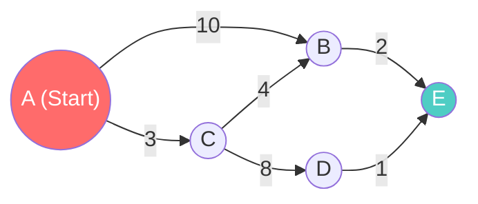

# Dijkstra & Bellman-Ford — Định tuyến Google Maps

Ở bài trước, thuật toán BFS giúp bạn tìm được số trạm ít nhất từ A đến B (đồ thị không trọng số). Tuy nhiên, trên thực tế, không có hai con đường nào dài bằng nhau. Đi quốc lộ 10km chắc chắn tốn xăng và thời gian hơn đi hẻm tắt 2km.

Làm thế nào để Google Maps hay các bộ Router mạng lưới tính toán ra được **Lộ trình có tổng chi phí (khoảng cách/thời gian) thấp nhất** trong hàng tỉ ngã rẽ? Chào mừng bạn đến với hai siêu thuật toán của hệ Đồ thị có trọng số: **Dijkstra** và **Bellman-Ford**.

## 📋 Agenda

**Thời gian đọc ước tính:** ~10 phút

### Sau bài này, bạn sẽ:
- ✅ **Hiểu** được triết lý "Tham lam" (Greedy) đằng sau thuật toán Dijkstra.
- ✅ **Giải thích** được sự kết hợp thần thánh giữa Graph và Priority Queue (Heap).
- ✅ **Tự tay** vẽ lại cơ chế cập nhật bảng khoảng cách (Distance Table).
- ✅ **Phân biệt** được khi nào Dijkstra vô dụng và phải nhờ cậy đến Bellman-Ford (Cạnh âm).

### Yêu cầu đầu vào:
- 🔹 Đã nắm vững [Priority Queue (Heap)](./04-heap.md), [Graph](./06-graph.md), và [BFS](./07-graph-traversal.md).

---

## ❓ Vấn đề Đường đi ngắn nhất

**Vấn đề (Problem Statement):**
Bạn đang ở Thành phố `A` và muốn đi đến Thành phố `E`.
Đường đi có các trạm trung chuyển và khoảng cách (trọng số) như sau:
- A -> B: 10km
- A -> C: 3km
- C -> B: 4km
- B -> E: 2km

Nếu dùng BFS, nó sẽ chọn đường đi 1 chặng `A -> B` (Mất 10km) -> Tới nơi E mất tổng 12km.
Nhưng nếu con người nhìn vào, ta thấy đi vòng `A -> C -> B` chỉ mất 3 + 4 = 7km. Dù tốn nhiều chặng (Nhiều Node) hơn, nhưng TỔNG chiều dài lại ngắn hơn!

**Giải pháp (Solution):**
Thuật toán **Dijkstra** (Phát âm là /'daɪkstrə/). Tư tưởng của Dijkstra rất đơn giản:
1. Ghi chú khoảng cách từ Điểm bắt đầu đến MỌI ĐIỂM khác là Vô cực (`Infinity`).
2. Từ điểm đang đứng, luôn ưu tiên chọn con đường **ngắn nhất có thể**.
3. Khi đến một điểm mới, thử tính xem: *"Đi đường này có ngắn hơn đường cũ từng ghi trong sổ không?"* Nếu ngắn hơn, Cập nhật lại sổ và tiếp tục đi tới.

---

## 📖 Trực quan hóa Dijkstra

Để thuật toán luôn biết "ngã rẽ nào đang là ngắn nhất để ưu tiên đi trước", Dijkstra bắt buộc phải kết hợp với cấu trúc **Priority Queue** (Thứ mà chúng ta đã học ở bài Heap).



**Mô phỏng bằng giấy nháp:**
1. Khởi tạo sổ tay (Distances): `A:0, B:∞, C:∞, D:∞, E:∞`.
2. Bỏ `A(0)` vào hàng đợi ưu tiên. Lấy `A` ra khám phá:
   - A -> C giá 3. So với sổ tay (3 < ∞) -> Cập nhật sổ: `C:3`. Bỏ `C(3)` vào hàng đợi.
   - A -> B giá 10. So với sổ tay (10 < ∞) -> Cập nhật sổ: `B:10`. Bỏ `B(10)` vào hàng đợi.
3. Hàng đợi lúc này có `C(3)` và `B(10)`. Do ưu tiên rẻ nhất, ta lấy `C(3)` ra khám phá tiếp:
   - C -> B giá 4. Tổng quãng đường A->C->B là `3 + 4 = 7`.
   - Lật sổ tay xem: Đang ghi B giá `10`. Mà 7 < 10. -> Xóa sổ, cập nhật lại: `B:7`. Lại đẩy `B(7)` vào hàng đợi!
   - C -> D giá 8. Tổng A->C->D là `3 + 8 = 11`. Cập nhật sổ `D:11`.
4. ... Tiếp tục cho đến khi khám phá hết Đồ thị. Cầm cuốn sổ lên xem kết quả!

---

## 🔨 Implement Dijkstra bằng TypeScript

Để tinh gọn, ta giả định bạn đã có một class `PriorityQueue` (Min Heap).

```typescript
// filename: dijkstra.ts

// Priority Queue đơn giản (Min-based). Trong thực tế nên dùng Min-Heap O(log n)
class SimplePriorityQueue {
  values: { val: string; priority: number }[] = [];
  enqueue(val: string, priority: number) {
    this.values.push({ val, priority });
    this.values.sort((a, b) => a.priority - b.priority); // O(n log n) - Kém, nhưng dễ minh họa
  }
  dequeue() { return this.values.shift(); }
  isEmpty() { return this.values.length === 0; }
}

class WeightedGraph {
  // Thay vì mảng string, giờ đây ta lưu mảng Object chứa node và trọng số
  adjacencyList: Map<string, { node: string; weight: number }[]> = new Map();

  // ... (Code addVertex, addEdge tựa như bài trước) ...

  // 💡 Trọng tâm: Thuật toán Dijkstra
  dijkstra(start: string, finish: string): string[] {
    const nodes = new SimplePriorityQueue();
    const distances: Record<string, number> = {};
    const previous: Record<string, string | null> = {}; // Lưu dấu chân để truy ngược đường đi
    let path: string[] = []; // Kết quả trả về
    let smallest: string;

    // 1. Khởi tạo ban đầu
    this.adjacencyList.forEach((_, vertex) => {
      if (vertex === start) {
        distances[vertex] = 0;
        nodes.enqueue(vertex, 0);
      } else {
        distances[vertex] = Infinity;
        nodes.enqueue(vertex, Infinity);
      }
      previous[vertex] = null;
    });

    // 2. Vòng lặp khám phá
    while (!nodes.isEmpty()) {
      smallest = nodes.dequeue()!.val; // LUÔN lấy đỉnh có khoảng cách ngắn nhất hiện tại ra

      // Nếu đã đến đích -> Lần ngược lại con đường bằng biến previous
      if (smallest === finish) {
        while (previous[smallest]) {
          path.push(smallest);
          smallest = previous[smallest]!;
        }
        break; // Hoàn thành!
      }

      // 3. Khám phá hàng xóm của đỉnh vừa lấy ra
      if (smallest || distances[smallest] !== Infinity) {
        this.adjacencyList.get(smallest)?.forEach(neighbor => {
          // Tính quãng đường: Tổng từ Start tới đỉnh Hiện tại + Độ dài đoạn đường tiếp theo
          const candidate = distances[smallest] + neighbor.weight;
          const nextNeighbor = neighbor.node;

          // So sánh với cuốn sổ: Nếu rẻ hơn thì Cập nhật!
          if (candidate < distances[nextNeighbor]) {
            distances[nextNeighbor] = candidate;   // Sửa sổ
            previous[nextNeighbor] = smallest;     // Ghi nhớ "Tao vừa đi qua mài"
            nodes.enqueue(nextNeighbor, candidate);// Xếp hàng để được ưu tiên khám phá tiếp
          }
        });
      }
    }

    return path.concat(start).reverse(); // Đảo ngược mảng để in từ Start -> Finish
  }
}
```

---

## 🚀 WHAT IF — Kẻ thù của Dijkstra: Trọng số Âm

Thuật toán Dijkstra vô cùng xuất sắc (Time Complexity: `O((V + E) * log V)` nếu dùng Min-Heap chuẩn).
Nhưng nó dựa trên một triết lý Tham lam: **Đường đi qua càng nhiều trạm, thì tổng độ dài phải TĂNG LÊN**. Nó giả định mọi khoảng cách đều là số DƯƠNG.

Điều gì xảy ra nếu đồ thị có **Trọng số Âm (Negative Weight)**?
*(Ví dụ thực tế: Cước phí đi Uber. Nhưng đến trạm C bạn vớt được mã Voucher giảm thẳng 50k, làm cho đoạn đường đó mang giá trị là `-50`).*

Lúc này, Dijkstra sẽ trở nên bối rối và tính toán SAi LỆCH. Vì nó đã "chốt" khoảng cách ngắn nhất đến 1 điểm rồi, nó không thèm nhìn lại điểm đó nữa, dù có mã giảm giá phía sau.

### Cứu tinh: Bellman-Ford
Khi có cạnh mang trọng số âm, ta buộc phải vứt Dijkstra đi và dùng **Bellman-Ford**.
Thay vì dùng Hàng đợi Ưu tiên, thuật toán này dùng tư tưởng "Cày nát bản đồ" (Dynamic Programming).
- Nó quét qua TOÀN BỘ CÁC CẠNH (Edge) của đồ thị.
- Không chỉ 1 lần, mà quét đi quét lại đúng `V - 1` lần (V là số đỉnh).
- Ở mỗi lần quét, nó liên tục cập nhật bảng khoảng cách nếu thấy rẻ hơn.

**Trade-off (Đánh đổi):**
- **Dijkstra:** Cực kỳ thông minh, đánh hơi đường đi nhanh (Thích hợp Google Maps).
- **Bellman-Ford:** Khá ngu ngốc, cày bừa tốn sức. Time Complexity lên tới **`O(V * E)`** (Rất chậm với Đồ thị lớn). Nhưng bù lại nó là thứ **duy nhất** có thể phát hiện ra Vòng lặp Âm (Negative Cycle) trong mạng lưới tài chính (Arbitrage trading).

---

## 💬 Tổng kết Phần 3

Chúc mừng! Bạn đã tốt nghiệp phần cấu trúc dữ liệu khó nhất: **Non-linear Data Structures**.

Bạn đã đi từ sự tối giản truy xuất `O(1)` của **Hash Table**, đến khả năng phân cấp chia để trị `O(log n)` của **Tree/BST**, cho đến sự rắc rối nhưng đầy mạnh mẽ của **Graph**. Mọi thứ bạn thao tác với Database hay Mạng Internet giờ đây đều mang bóng dáng của các cấu trúc này.

Nhưng khoan đã, làm sao để đưa các tập dữ liệu lộn xộn vào BST hay Binary Search để được hưởng sức mạnh `O(log n)`? Chìa khóa là: **Dữ liệu phải được SẮP XẾP TRƯỚC (Sorted)**.

Ở Sprint tiếp theo, chúng ta sẽ bước vào thế giới thuần túy của Lập trình: **Phần 4 - Các Thuật toán Sắp xếp (Sorting Algorithms)**. Từ những cách "ngây ngô" nhất đến những tinh hoa được dùng trong hàm `Array.prototype.sort()` của JavaScript.

---
*Made by Anh Tu - Share to be share*
