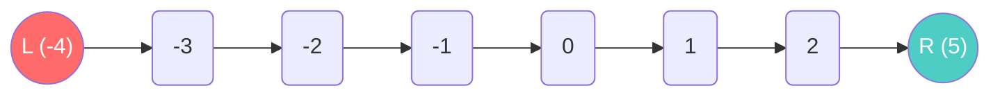

# Two Pointers — Kẹp chặt mục tiêu

Khi làm việc với Mảng (Array) hay Chuỗi (String), một lỗi phổ biến nhất của các bạn Junior là: *"Đụng chuyện gì cũng viết 2 vòng lặp `for` lồng nhau (O(n²))"*. 
Chưa cần biết đúng hay sai, chỉ cần nhìn thấy vòng lặp lồng nhau trong bài test thuật toán, người phỏng vấn sẽ lập tức nhíu mày.

Vậy làm sao để đối chiếu các phần tử trong mảng với nhau mà chỉ tốn đúng **O(n)** (1 vòng lặp duy nhất)?
Chào mừng bạn đến với Mẫu thiết kế (Pattern) đầu tiên và phổ biến nhất trong giới thuật toán: **Two Pointers (Hai con trỏ)**.

## 📋 Agenda

**Thời gian đọc ước tính:** ~7 phút

### Sau bài này, bạn sẽ:
- ✅ **Hiểu** được triết lý "Mỗi người một đầu" của Two Pointers.
- ✅ **Giải thích** được sức mạnh giảm độ phức tạp từ O(n²) xuống O(n).
- ✅ **Tự tay** giải quyết bài toán kinh điển `Sum Zero` bằng TypeScript.
- ✅ **Nhận diện** được điều kiện tiên quyết để áp dụng Pattern này.

### Yêu cầu đầu vào:
- 🔹 Có kiến thức về [Binary Search](./01-linear-vs-binary-search.md) (hiểu khái niệm con trỏ Left/Right).
- 🔹 Nắm vững [Time Complexity](../01-complexity/02-time-vs-space.md).

---

## ❓ Vòng lặp lồng nhau: Sự bất lực của O(n²)

**Bài toán (Problem Statement):**
Viết hàm `sumZero` nhận vào một **Mảng Đã Được Sắp Xếp** chứa các số nguyên. Hàm phải tìm ra "Cặp số đầu tiên có tổng bằng 0". Trả về mảng chứa 2 số đó. Nếu không có cặp nào, trả về `undefined`.

Ví dụ: `sumZero([-3, -2, -1, 0, 1, 2, 3])` -> Trả về `[-3, 3]`.

**Cách giải ngây ngô (Naive Solution):**
Bạn cầm số `-3`. Sau đó bạn chạy vòng lặp thứ hai quét qua TOÀN BỘ các số còn lại (`-2`, `-1`, `0`...) xem có thằng nào cộng lại bằng 0 không. Không có? Lại nhích lên `-2`, quét lại từ đầu.
Với mảng dài 100,000 số, bạn tốn hàng tỉ phép tính O(n²). Rất chậm!

---

## 📖 Trực quan hóa "Hai con trỏ"

**Giải pháp (Solution):** 
**Two Pointers Pattern**. Ta tạo ra 2 biến đếm (con trỏ). Một con trỏ đứng ở Đầu mảng (`left`), một con trỏ đứng ở Cuối mảng (`right`).
Bởi vì **mảng đã được sắp xếp từ bé đến lớn**, ta có một logic cực kỳ chặt chẽ sau:
- Nếu lấy số Nhỏ Nhất (`left`) cộng với số Lớn Nhất (`right`) mà ra số **DƯƠNG (>0)**. Tức là số `right` quá béo. Ta phải bắt con trỏ `right` lùi lại một bước để giảm tổng xuống.
- Nếu lấy số `left` cộng số `right` mà ra số **ÂM (`<0`)**. Tức là số `left` quá còi cọc. Ta phải bắt con trỏ `left` tiến lên một bước để tăng tổng lên.
- Nếu bằng 0? Đã tìm thấy!



**Mô phỏng bằng nháp:** Mảng `[-4, -3, -2, -1, 0, 1, 2, 5]`
1. Left là `-4`, Right là `5`. Tổng `-4 + 5 = 1` (Dương). R lùi 1 bước.
2. Left là `-4`, Right là `2`. Tổng `-4 + 2 = -2` (Âm). L tiến 1 bước.
3. Left là `-3`, Right là `2`. Tổng `-3 + 2 = -1` (Âm). L tiến 1 bước.
4. Left là `-2`, Right là `2`. Tổng `-2 + 2 = 0` (Bằng 0). **TÌM THẤY!**

Mọi thứ hoàn thành trong đúng 1 vòng chạy! O(n)!

---

## 🔨 Implement Two Pointers bằng TypeScript

```typescript
// filename: two-pointers.ts

// ❌ Phiên bản Tệ (O(n^2))
function sumZeroNaive(arr: number[]): number[] | undefined {
  for (let i = 0; i < arr.length; i++) {
    for (let j = i + 1; j < arr.length; j++) {
      if (arr[i] + arr[j] === 0) {
        return [arr[i], arr[j]];
      }
    }
  }
}

// ✅ Phiên bản xịn sò: Two Pointers (O(n))
function sumZeroOptimized(arr: number[]): number[] | undefined {
  let left = 0; // Con trỏ bắt đầu từ Index 0
  let right = arr.length - 1; // Con trỏ bắt đầu từ Index cuối

  // Chừng nào 2 con trỏ chưa đụng nhau (Nếu đụng nhau tức là mảng ko có kết quả)
  while (left < right) {
    let sum = arr[left] + arr[right];
    
    // Nếu tìm thấy
    if (sum === 0) {
      return [arr[left], arr[right]];
    } 
    // Nếu tổng dương -> Lớn quá -> Cần giảm xuống bằng cách dịch Right qua trái
    else if (sum > 0) {
      right--;
    } 
    // Nếu tổng âm -> Nhỏ quá -> Cần tăng lên bằng cách dịch Left qua phải
    else {
      left++;
    }
  }
  return undefined; // Không tìm thấy
}
```

---

## 🚀 WHAT IF — Biến thể của Two Pointers

Mẫu Two Pointers cực kỳ linh hoạt. Nó không chỉ dùng cấu trúc `Left - Right` (kẹp từ 2 đầu), mà còn có cấu trúc `Slow - Fast` (2 con trỏ cùng chạy từ 1 đầu, nhưng đứa chạy nhanh đứa chạy chậm).

### Bài toán: Đếm số phần tử khác nhau (Count Unique Values)
Cho một mảng ĐÃ SẮP XẾP. Đếm xem có bao nhiêu số khác biệt trong mảng (ví dụ mảng `[1, 1, 1, 2, 3]` -> Có 3 số khác biệt là 1, 2, 3).
*Yêu cầu: Không dùng Hash Set (Set).*

**Giải pháp (Slow - Fast Pointer):**
Ta đặt con trỏ `i` (Chậm) ở Index 0. Con trỏ `j` (Nhanh) ở Index 1.
- Hai đứa cùng số? `j` chạy tiếp bỏ lại `i`.
- Nếu hai đứa mang số khác nhau? Kéo `i` nhích lên 1 bước, xong ghi đè số mới của `j` vào vị trí của `i` (gom các số khác nhau về gom tụ ở đầu mảng).
- Cuối cùng, độ dài của đoạn số khác nhau chính là `i + 1`.

```typescript
// filename: two-pointers.ts

function countUniqueValues(arr: number[]): number {
  if (arr.length === 0) return 0;
  
  let i = 0; // Con trỏ Chậm
  
  // Con trỏ j là con trỏ Nhanh (Dùng luôn vòng lặp for)
  for (let j = 1; j < arr.length; j++) {
    // Nếu thấy khác biệt
    if (arr[i] !== arr[j]) {
      i++; // i nhích lên
      arr[i] = arr[j]; // Gom số mới tìm được nhét sát vào cạnh i
    }
    // Nếu giống nhau, i đứng im, j tự động chạy tiếp nhờ vòng for
  }
  
  // Mảng gốc bị thay đổi đoạn đầu, nhưng ta chỉ quan tâm biến i
  return i + 1; 
}
```

---

## 💬 Thảo luận

**Điểm yếu chết người của Two Pointers:** Giống như Binary Search, sức mạnh thao túng phép cộng trừ của con trỏ Trái/Phải chỉ được phát huy nếu **Mảng đã được Sắp Xếp (Sorted)**. Nếu mảng lộn xộn, bạn ép Right lùi lại chưa chắc đã giảm được Tổng của mảng.

Tuy nhiên, nếu bạn đối mặt với bài toán: *"Cho mảng số LỘN XỘN. Hãy tính Tổng lớn nhất của N số nằm cạnh nhau liên tiếp"* (Ví dụ: Doanh thu 3 ngày cao nhất trong tháng).
Rõ ràng mảng không được sắp xếp, Two Pointers bó tay, và Vòng lặp lồng nhau sẽ phung phí O(n²) để cứ 3 ngày cộng lại 1 lần từ đầu tới cuối.

Làm sao để chỉ cộng duy nhất 1 lần đầu tiên mà quét hết cả tháng?
Chào mừng bạn đến với kỹ thuật mạnh nhất trong giới Mảng con (Sub-array): **Sliding Window (Cửa sổ trượt)**.

---
*Made by Anh Tu - Share to be share*
