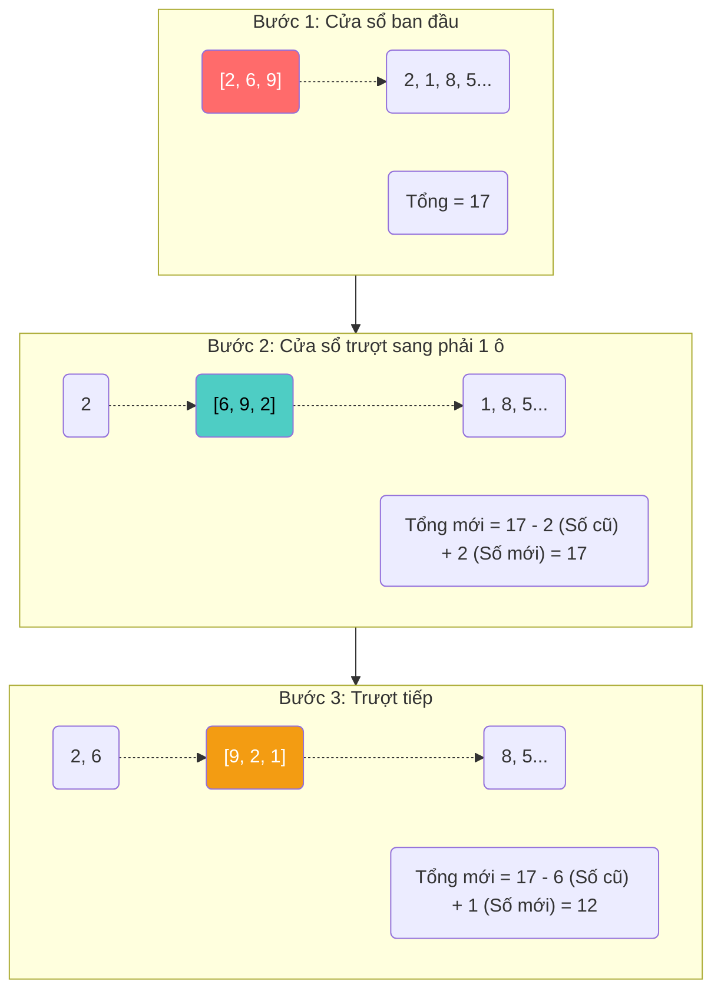

# Sliding Window — Kỹ nghệ Cửa sổ trượt

Khi đối mặt với mảng lộn xộn (Unsorted Array) mà Two Pointers bó tay, các Junior Developer thường nhanh chóng đầu hàng và quay lại với công thức O(n²): Lồng 2 vòng lặp `for` vào nhau.
Đặc biệt, lỗi này cực kỳ phổ biến trong những bài toán yêu cầu tìm kiếm một đoạn mảng con liên tiếp (Sub-array hoặc Sub-string). 

Làm thế nào để tính tổng, tính trung bình, hay đếm ký tự của một đoạn mảng con chỉ bằng **một lần quét duy nhất**?
Chào mừng bạn đến với Mẫu thiết kế tinh tế nhất dành cho Mảng lộn xộn: **Sliding Window (Cửa sổ trượt)**.

## 📋 Agenda

**Thời gian đọc ước tính:** ~7 phút

### Sau bài này, bạn sẽ:
- ✅ **Hiểu** được sự lãng phí của việc tính toán lại từ đầu (Recalculation).
- ✅ **Giải thích** được cơ chế "Trượt" và "Cộng thêm - Trừ đi" của Cửa sổ.
- ✅ **Tự tay** áp dụng Sliding Window để giải quyết bài toán tính Tổng mảng con lớn nhất bằng TypeScript.
- ✅ **Nhận diện** được các "Keyword" từ phỏng vấn viên để biết lúc nào dùng Pattern này.

### Yêu cầu đầu vào:
- 🔹 Có kiến thức về [Time Complexity (Big O)](../01-complexity/02-time-vs-space.md).

---

## ❓ Tại sao lại phải tính đi tính lại?

**Bài toán (Problem Statement):**
Viết hàm `maxSubarraySum` nhận vào một mảng các số nguyên (Lộn xộn) và một con số `n`. Tính **Tổng lớn nhất** của `n` phần tử nằm liên tiếp nhau.

Ví dụ: `maxSubarraySum([2, 6, 9, 2, 1, 8, 5, 6, 3], 3)`
Yêu cầu: Tìm 3 ngày liên tiếp có doanh thu cao nhất. Trả về Tổng số đó. (Nhìn bằng mắt thường ta thấy `[6, 9, 2]` là 17, hoặc `[8, 5, 6]` là 19. Vậy đáp án là 19).

**Cách giải ngây ngô (Naive Solution - O(n²)):**
Bạn tính tổng 3 ngày đầu tiên: `2 + 6 + 9 = 17`.
Sau đó bạn nhích lên 1 ngày, tính tổng 3 ngày tiếp theo: `6 + 9 + 2 = 17`.
Lại nhích lên 1 ngày, tính tiếp: `9 + 2 + 1 = 12`.
...
**Bạn có thấy sự vô lý không?** 
Khi tính `6 + 9 + 2`, máy tính phải thực hiện lại phép cộng `6 + 9`. Trong khi ở phép tính trước, nó đã biết `6 + 9` là gì rồi cơ mà! Nếu `n = 100`, máy tính phải lặp lại 99 phép cộng vô ích mỗi lần nó nhích lên 1 bước.

---

## 📖 Trực quan hóa "Cửa sổ trượt"

**Giải pháp (Solution):** 
**Sliding Window**. Chúng ta tạo ra một "Cửa sổ" (Window) có kích thước là `n`. 
- Lúc đầu, cửa sổ bao trọn `n` phần tử đầu tiên. Chúng ta tính Tổng của cửa sổ này ĐÚNG 1 LẦN.
- Khi cửa sổ trượt sang phải 1 bước, thay vì tính lại từ đầu, chúng ta chỉ việc **CỘNG THÊM phần tử mới vừa lọt vào cửa sổ, và TRỪ ĐI phần tử cũ vừa bị rơi ra khỏi cửa sổ**.



Bằng cách này, dù kích thước cửa sổ `n` là 3 hay 3 triệu, mỗi lần trượt chúng ta chỉ tốn đúng 2 phép tính (1 phép Trừ, 1 phép Cộng). Tổng thời gian từ `O(n * m)` rút xuống cực hạn chỉ còn **`O(N)`** (Chạy đúng 1 vòng lặp for dọc mảng).

---

## 🔨 Implement Sliding Window bằng TypeScript

```typescript
// filename: sliding-window.ts

function maxSubarraySum(arr: number[], num: number): number | null {
  // Edge case: Mảng ngắn hơn cả độ rộng cửa sổ
  if (arr.length < num) return null;

  let maxSum = 0;
  let tempSum = 0; // Biến lưu Tổng tạm thời của Cửa sổ hiện tại

  // 1. Tạo Cửa sổ đầu tiên: Cộng tổng của `num` phần tử đầu
  for (let i = 0; i < num; i++) {
    maxSum += arr[i];
  }
  
  // Gán tạm thời bằng max
  tempSum = maxSum;

  // 2. Trượt cửa sổ: Bắt đầu từ vị trí `num` (Ngay sát vách phải của cửa sổ cũ)
  for (let i = num; i < arr.length; i++) {
    // 💡 LÕI THUẬT TOÁN:
    // Tổng mới = Tổng cũ - Phần tử bị rớt ra đuôi + Phần tử mới lọt vào đầu
    // Phần tử rớt đuôi nằm ở vị trí (i - num)
    tempSum = tempSum - arr[i - num] + arr[i];
    
    // Cập nhật lại kỷ lục Max nếu tổng mới to hơn
    maxSum = Math.max(maxSum, tempSum);
  }

  return maxSum;
}

// Chạy thử
console.log(maxSubarraySum([2, 6, 9, 2, 1, 8, 5, 6, 3], 3)); // Output: 19
```

---

## 🚀 WHAT IF — Biến thể Cửa sổ Co dãn (Dynamic Window)

Pattern trên sử dụng Cửa sổ có Kích thước Cố định (Fixed size). Nhưng sức mạnh thật sự của Sliding Window là ở các bài toán Cửa sổ Co dãn.

**Bài toán (Dynamic):** Cho một mảng `[2, 3, 1, 2, 4, 3]`. Tìm **Độ dài Mảng con ngắn nhất** có Tổng Lớn Hơn hoặc Bằng `7`.

Lúc này bạn không biết cửa sổ rộng bao nhiêu. Bạn phải thiết kế một cái cửa sổ:
- Liên tục mở rộng (Cộng thêm) cho đến khi Tổng >= 7. Mở rộng bằng cách trượt vách phải (`right`).
- Khi Tổng đã >= 7, bạn "ghi nhận" kỷ lục chiều dài, sau đó bắt đầu **Co hẹp** cửa sổ lại để xem nó có thể NGẮN HƠN NỮA MÀ VẪN ĐẠT CHỈ TIÊU không. Co hẹp bằng cách dịch vách trái (`left`) lên, và trừ bớt số ở vách trái ra khỏi Tổng.

Kỹ thuật co dãn này (đẩy Right ra, thu Left vào) giúp bạn tìm được các chuỗi văn bản con dài nhất (Longest Substring) mà không chứa ký tự lặp lại — một trong những câu hỏi phỏng vấn LeetCode được hỏi nhiều nhất thế giới.

### Cách nhận diện Keyword
Khi đi phỏng vấn, nếu bạn nghe đề bài có các Keyword sau, 90% là phải dùng Sliding Window:
- Tác động lên Mảng, Chuỗi lộn xộn.
- **"Liên tiếp"** (Consecutive, Contiguous, Substring, Subarray).
- **"Dài nhất / Ngắn nhất"** (Longest, Shortest, Minimum, Maximum).
- **"Có tổng bằng / Cấu trúc giống"** (Sum, Target, Anagram).

---

## 💬 Thảo luận

Từ Two Pointers đến Sliding Window, bạn đã chứng kiến kỹ thuật triệt tiêu vòng lặp lồng nhau O(n²) để đưa tốc độ về O(n). Mọi thứ thao tác qua lại bằng việc dịch chuyển `index` (con trỏ).

Nhưng, nếu bài toán phức tạp đến mức không thể tư duy trên một đường thẳng mảng? Nếu bạn phải xử lý dữ liệu phân cấp, duyệt thư mục máy tính, hoặc đơn giản là tạo hiệu ứng Domino (việc nảy sinh việc)?

Bạn không thể dùng vòng lặp `for` để duyệt một cái cây không biết trước độ sâu. Chào mừng bạn đến với tư duy hack não nhất của Lập trình: **Recursion (Đệ quy) & Backtracking**.

---
*Made by Anh Tu - Share to be share*
