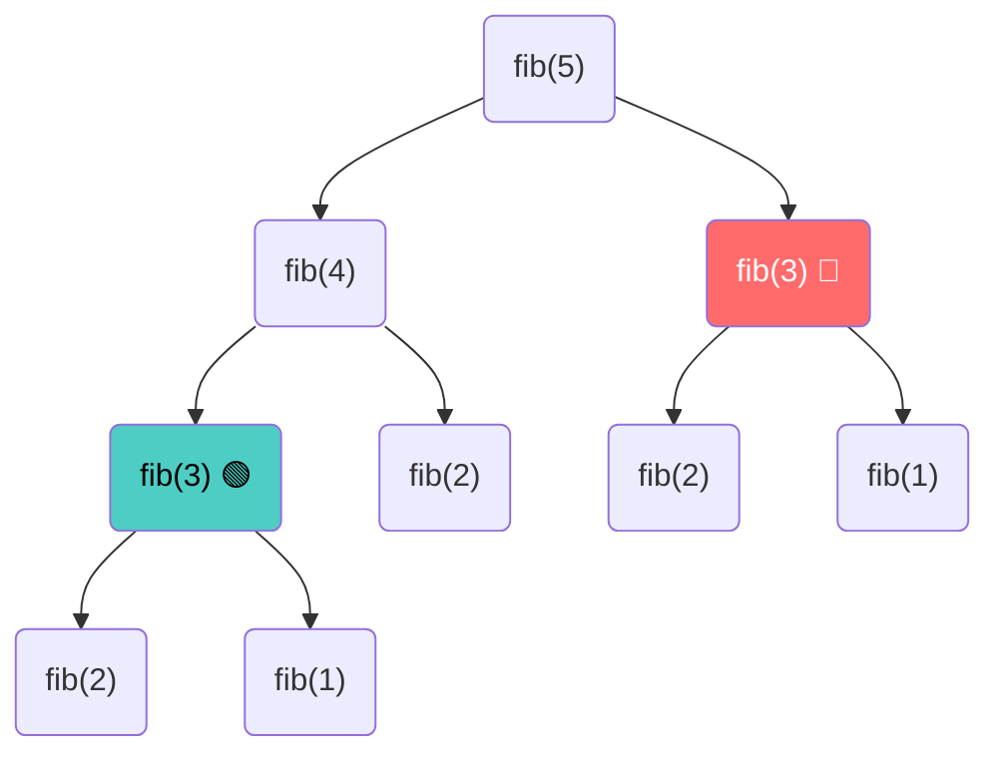

# Dynamic Programming — Cảnh giới của Sự ghi nhớ

"Những ai không nhớ được quá khứ thì sẽ bị kết án phải lặp lại nó". Triết lý kinh điển này không chỉ đúng trong lịch sử nhân loại, mà còn là trái tim của thuật toán khó nhất, phức tạp nhất, nhưng cũng mang lại hiệu năng khủng khiếp nhất: **Dynamic Programming (Quy hoạch động)**.

Ở bài trước, [Đệ quy (Recursion)](./04-recursion.md) đã bộc lộ một sự ngây ngô chết người: Nó rất chăm chỉ chia bài toán lớn thành nhiều bài toán nhỏ, nhưng lại không có Trí Nhớ. Cứ mỗi lần gặp lại một bài toán nhỏ mà nó vừa giải xong, nó lại cặm cụi tính lại từ đầu.

Làm thế nào để ban phát cho Máy tính một Trí Nhớ, để xóa sổ hoàn toàn sự lãng phí đó? 

## 📋 Agenda

**Thời gian đọc ước tính:** ~10 phút

### Sau bài này, bạn sẽ:
- ✅ **Hiểu** được bản chất Đệ quy chồng chéo (Overlapping Subproblems) hủy diệt CPU như thế nào.
- ✅ **Giải thích** được sức mạnh của kỹ thuật "Cuốn sổ nháp" (Memoization - Top Down).
- ✅ **Trực quan hóa** cách lật ngược bài toán bằng Kỹ thuật Bảng (Tabulation - Bottom Up).
- ✅ **Phân biệt** được khi nào dùng Memoization, khi nào dùng Tabulation.

### Yêu cầu đầu vào:
- 🔹 Đã nắm vững [Recursion (Đệ quy)](./04-recursion.md).

---

## ❓ Sự ngây ngô của Đệ quy

**Bài toán (Problem Statement):**
In ra số Fibonacci thứ `n` (Dãy Fibonacci bắt đầu từ 1, 1, 2, 3, 5, 8... Số phía sau luôn bằng tổng 2 số liền trước).
Công thức đệ quy kinh điển: `fib(n) = fib(n-1) + fib(n-2)`.

**Cách giải ngây ngô:**
```typescript
function fib(n: number): number {
  if (n <= 2) return 1; // Base case
  return fib(n - 1) + fib(n - 2);
}
```

Hãy xem Call Stack chạy khi ta tính `fib(5)`:

Nhìn vào sơ đồ, nhánh bên trái `fib(4)` đã tốn công sức gọi một đống hàm con để tính ra `fib(3)`. 
Sau khi xong nhánh trái, nó sang nhánh phải và lại GỌI LẠI TOÀN BỘ nhánh `fib(3)` một lần nữa! Lặp lại y hệt 100%.
Time Complexity của thuật toán này là **`O(2^n)`**. Nếu bạn chạy `fib(45)`, máy tính của bạn sẽ treo hoàn toàn (Mất hàng tỉ phép tính).

**Giải pháp (Solution):**
**Dynamic Programming (Quy hoạch động)**. Bất cứ khi nào bạn có 1 bài toán lớn, có thể cắt thành các Bài toán nhỏ **chồng chéo lên nhau (Overlapping)**, bạn có thể áp dụng DP.

---

## 📖 Trực quan hóa DP — Cách 1: Memoization (Top-Down)

Memoization (Không phải Memorization) có nghĩa là "Ghi chép vào sổ nháp". 

**Cơ chế:** Chúng ta chuẩn bị một cuốn sổ (thường là Array hoặc Object/Hash Map). 
- Khi gọi hàm `fib(3)`, việc ĐẦU TIÊN là MỞ SỔ RA XEM `fib(3)` đã tính bao giờ chưa.
- Nếu CÓ rồi -> Trả về kết quả ngay lập tức (Chỉ tốn O(1) để tra sổ).
- Nếu CHƯA CÓ -> Mới bắt đầu chạy Đệ quy. Chạy ra kết quả xong thì **Ghi ngay vào sổ** để lần sau có mà xài!

```typescript
// filename: dp-fibonacci.ts

// memo là cuốn sổ, ta lưu tham chiếu trong hàm đệ quy
function fibMemo(n: number, memo: number[] = []): number {
  // Tra sổ (Nếu sổ có ghi nhận kết quả cho số n rồi thì lấy ra dùng luôn)
  if (memo[n] !== undefined) return memo[n];

  // Base case
  if (n <= 2) return 1;

  // Tính toán (Vì tra sổ không có)
  const result = fibMemo(n - 1, memo) + fibMemo(n - 2, memo);

  // 💡 GHI VÀO SỔ NGAY SAU KHI TÍNH XONG
  memo[n] = result;
  
  return result;
}
```

Với chỉ 2 dòng lệnh "Tra sổ" và "Ghi sổ", Time Complexity từ **`O(2^n)`** khủng khiếp lập tức rơi thẳng đứng xuống còn **`O(n)`**. Quá kinh khủng!

---

## 📖 Trực quan hóa DP — Cách 2: Tabulation (Bottom-Up)

**Vấn đề của Memoization:** Vì nó vẫn dùng Đệ quy, nên nó vẫn nhét liên tục các hàm vào Call Stack. Nếu bạn tính `fib(10000)`, cuốn sổ của bạn tra rất nhanh, nhưng cái Call Stack vẫn bị đầy và báo lỗi **Stack Overflow**.

**Giải pháp Bottom-Up (Tabulation):**
Đừng đi từ Top (fib(10000)) rồi chẻ nhánh dần xuống Base Case nữa. Hãy bắt đầu từ ĐÁY (Base Case) rồi Xây ngược lên trên.
Thay vì dùng Đệ quy, Tabulation **dùng Vòng Lặp (For-loop) thuần túy** kết hợp với Array (Bảng tra cứu).

```typescript
// filename: dp-fibonacci.ts

function fibTable(n: number): number {
  if (n <= 2) return 1;

  // Xây dựng Bảng dữ liệu từ ĐÁY (Base case)
  const fibNums: number[] = [0, 1, 1]; // Index 0 vô dụng, Index 1 là 1, Index 2 là 1

  // Bắt đầu vòng lặp xây gạch từ dưới lên
  for (let i = 3; i <= n; i++) {
    // Giá trị hiện tại = Tổng 2 ô liền trước mặt nó trong bảng
    fibNums[i] = fibNums[i - 1] + fibNums[i - 2];
  }

  // Chạy hết vòng for là bảng đã đầy đủ số liệu tới đích
  return fibNums[n];
}
```

### So sánh Memoization vs Tabulation

| Tiêu chí | Memoization (Top-Down) | Tabulation (Bottom-Up) |
|---|---|---|
| **Cơ chế** | Đệ quy từ trên xuống + Nháp | Vòng lặp từ dưới lên + Bảng |
| **Call Stack** | CÓ. Rủi ro tràn Stack (Overflow). | KHÔNG. An toàn tuyệt đối. 🏆 |
| **Logic** | Dễ viết hơn (Giữ nguyên tư duy Đệ quy cũ). 🏆 | Khó tư duy hơn (Phải đảo ngược vấn đề từ Base Case lên). |

---

## 🏁 Tổng kết Toàn bộ Series Data Structure & Algorithms

Hành trình từ một mảng Array đơn giản cho đến đỉnh cao Dynamic Programming đã khép lại.
Khi đứng trước một hệ thống hoặc một bài phỏng vấn, tư duy của bạn bây giờ không còn là *"Cứ for loop là xong"* nữa. 

Bạn đã được trang bị một hệ tư duy (Mental Model) hoàn chỉnh:

1. **Hiểu cái giá phải trả:** (Big O Notation). Không đánh đổi O(n^2) cho dữ liệu lớn.
2. **Chọn Vũ khí (Data Structures):**
   - Cần truy cập siêu tốc, theo Key? -> **Hash Table / Object**.
   - Cần đảm bảo thứ tự thực thi? -> **Stack / Queue**.
   - Cần Cấp cứu cái bự nhất/nhỏ nhất? -> **Heap (Priority Queue)**.
   - Cần tìm theo Khoảng, sắp xếp cấu trúc? -> **Binary Search Tree**.
   - Cần gợi ý từ khóa (Autocomplete)? -> **Trie**.
   - Mạng lưới vô định, Google Maps? -> **Graph**.
3. **Triển khai Chiêu thức (Algorithms):**
   - Mảng lộn xộn tìm tổng mảng con? -> **Sliding Window**.
   - Tránh vòng lặp lồng nhau? -> **Two Pointers**.
   - Mảng đã sắp xếp đi tìm 1 số? -> **Binary Search**.
   - Bài toán chia được nhiều bài toán nhỏ lặp lại? -> **Dynamic Programming**.

Hệ thống Khoa học máy tính là những mảnh ghép Lego có quy luật. Khi bạn thuộc lòng các Pattern này, không một bài toán Leetcode hay bài toán hệ thống lớn nào có thể làm khó bạn.

Cảm ơn bạn đã đi cùng Anh Tú đến bài học cuối cùng. Hãy bắt đầu đưa những Pattern này vào codebase dự án hiện tại của bạn ngay hôm nay!

---
*Made by Anh Tu - Share to be share*
