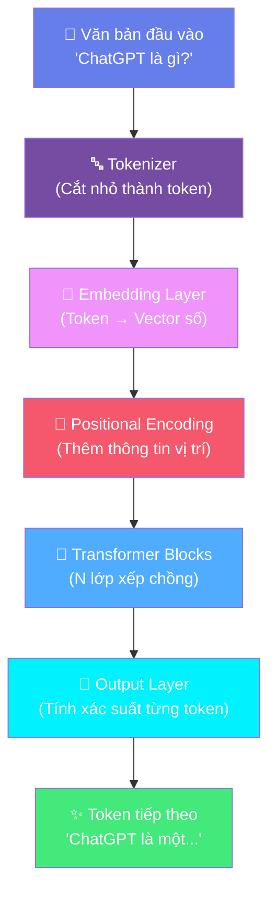
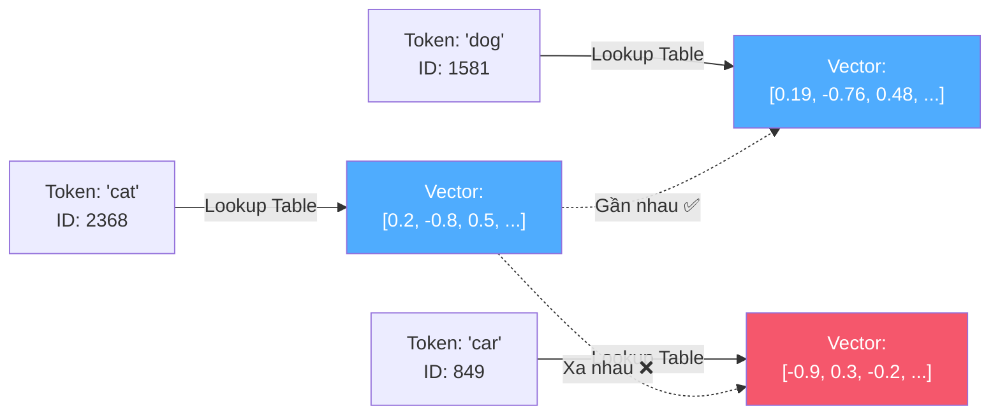
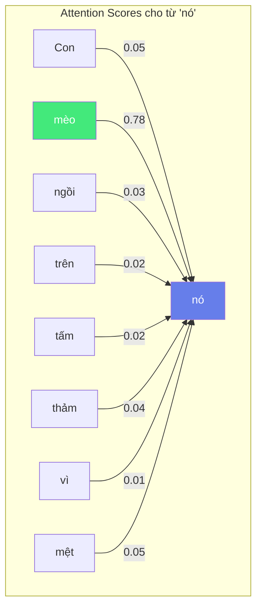
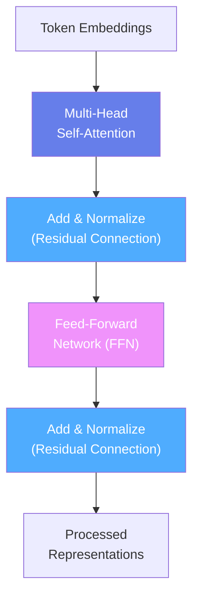

# 🧠 Bài 1: Cơ Sở Lý Thuyết LLM — Máy Dự Đoán Từ Thông Minh

## 📋 Agenda

**Thời gian đọc ước tính:** ~25 phút

### Sau bài này, bạn sẽ:
- ✅ **Giải thích** được bản chất thực sự của LLM (không phải AI có ý thức!)
- ✅ **Hiểu** được cơ chế hoạt động của Transformer Architecture từ A→Z
- ✅ **Phân biệt** được Tokenization, Embedding, và Attention đóng vai trò gì
- ✅ **Nhận ra** tại sao LLM có thể làm thơ, dịch thuật, giải code — dù chỉ học cách "điền từ vào chỗ trống"

### Yêu cầu đầu vào (Prerequisites):
- 🔹 Biết cơ bản về lập trình (bất kỳ ngôn ngữ nào)
- 🔹 Đã từng dùng ChatGPT hoặc một AI Chatbot ít nhất một lần

---

## ❓ Vấn đề & Giải pháp

**Vấn đề (Problem Statement):**
- Hầu hết người dùng AI đang rơi vào hai thái cực: **thần thánh hóa** AI như một thực thể có ý thức, hoặc **hoài nghi phủ nhận** sức mạnh của nó.
- Cả hai đều dẫn đến cách dùng AI thiếu hiệu quả và thiếu an toàn.
- Tại sao ChatGPT trả lời xuất sắc bài toán này, nhưng lại "bịa" sự kiện lịch sử ở bài toán kia?

**Giải pháp (Solution):**
Hiểu rõ bản chất kỹ thuật của LLM giúp bạn dùng nó như một **công cụ khoa học**, không phải phép thuật. Bài này sẽ bóc tách lớp bí ẩn đó.

---

## 📖 WHAT — LLM là gì, thực sự?

### Định nghĩa kỹ thuật

> **Large Language Model (LLM)** là một mạng nơ-ron nhân tạo quy mô lớn (hàng tỷ tham số), được xây dựng trên kiến trúc **Autoregressive Transformer**, được huấn luyện trên kho dữ liệu văn bản khổng lồ để thực hiện một nhiệm vụ duy nhất: **dự đoán token (đơn vị văn bản) tiếp theo** với xác suất cao nhất dựa trên ngữ cảnh đã cho.

**Giải phẫu từ khóa:**
- **Large** — Hàng tỷ parameters (GPT-3: 175B, GPT-4: ước tính 1T+)
- **Language Model** — Mô hình xác suất phân phối trên không gian văn bản
- **Autoregressive** — Tự hồi quy: dùng output trước làm input tiếp theo
- **Transformer** — Kiến trúc mạng nơ-ron dựa trên cơ chế Attention (2017)

### Kiến trúc tổng quan



---

## 🔍 Giải phẫu 4 thành phần cốt lõi

### 1️⃣ Tokenization — Ngôn ngữ thành con số

**Khái niệm:** Tokenization là quá trình phân tách văn bản thành các đơn vị nhỏ hơn (token) và ánh xạ chúng thành số nguyên (ID).

**Tại sao không dùng từng ký tự hoặc từng từ nguyên?**

| Phương pháp | Vấn đề |
|-------------|--------|
| Ký tự đơn | Chuỗi quá dài, mất ngữ nghĩa |
| Từ nguyên | Từ mới/hiếm gặp bị bỏ sót |
| **Subword (BPE)** | ✅ Cân bằng tốt, xử lý được từ mới |

**BPE (Byte Pair Encoding)** — thuật toán phổ biến nhất:

```
Input:  "ChatGPT"
Tokens: ["Chat", "G", "PT"]   → IDs: [9419, 38, 2898]

Input:  "Tokenization"
Tokens: ["Token", "ization"]  → IDs: [3, 1634]
```

> 💡 **Insight:** Cùng một đoạn văn 500 từ có thể cho ra ~700 tokens (do subword splitting). Đây là lý do xuất hiện khái niệm "context window" — giới hạn số token mô hình có thể xử lý trong 1 lần.

---

### 2️⃣ Embedding — Token thành không gian ý nghĩa

**Khái niệm:** Embedding là bảng tra cứu (lookup table) ánh xạ mỗi token ID thành một **vector chiều cao** (high-dimensional vector), nơi các từ có ngữ nghĩa tương đồng sẽ ở gần nhau trong không gian đó.



**Đặc tính nổi tiếng của Word2Vec (2013):**
```
Vector("King") - Vector("Man") + Vector("Woman") ≈ Vector("Queen")
```

> **Kích thước vector điển hình:** GPT-2: 768 chiều | GPT-3: 12,288 chiều

---

### 3️⃣ Positional Encoding — Thêm thông tin "vị trí"

**Vấn đề:** Transformer xử lý toàn bộ tokens song song (không tuần tự như RNN), nên mô hình không biết từ nào đứng trước từ nào.

**Cách giải quyết:** Thêm một vector encoding vị trí vào embedding của từng token:

```
Final_Token_Representation = Token_Embedding + Position_Embedding
```

Ví dụ: "Con mèo ăn cá" vs "Cá ăn con mèo" — cùng từ, khác ý nghĩa hoàn toàn. Positional Encoding giúp mô hình phân biệt điều này.

---

### 4️⃣ Self-Attention — "Tập trung" vào ngữ cảnh

**Đây là trái tim của Transformer và là lý do nó vượt trội mọi kiến trúc trước.**

**Khái niệm:** Self-Attention cho phép mỗi token "nhìn" và tính toán mức độ liên quan với tất cả các tokens khác trong câu, **cùng lúc** (parallel).

**Ví dụ trực quan:**

> *"Con mèo ngồi trên tấm thảm vì **nó** mệt."*

Khi xử lý từ "**nó**", cơ chế Attention sẽ:
- Gán điểm cao → "**con mèo**" (đây là chủ thể đúng)
- Gán điểm thấp → "**thảm**" (không phải chủ thể)



**Multi-Head Attention:** Thay vì dùng một attention đơn, Transformer dùng nhiều "head" song song (ví dụ: 12 head trong GPT-2), mỗi head học các mối quan hệ khác nhau (cú pháp, ngữ nghĩa, thực thể).

---

### 🔑 Transformer Block — Lắp ráp



**Một mô hình GPT-3 có 96 Transformer Blocks xếp chồng lên nhau.** Mỗi layer học các đặc trưng ngày càng trừu tượng hơn:

- **Layer thấp:** Syntax (cú pháp), từ loại
- **Layer giữa:** Ngữ nghĩa, quan hệ giữa thực thể
- **Layer cao:** Lý luận, kiến thức thế giới

---

## 🔨 HOW — LLM tạo ra văn bản như thế nào?

### Quá trình Autoregressive Generation

```
Bước 1: Input: "ChatGPT là"
        → Top-5 predictions: ["một"(0.42), "cái"(0.18), "hệ"(0.15), "AI"(0.12), ...]
        → Chọn: "một"

Bước 2: Input: "ChatGPT là một"
        → Top-5 predictions: ["mô"(0.38), "chatbot"(0.22), "trợ"(0.19), ...]
        → Chọn: "mô"

Bước 3: Input: "ChatGPT là một mô"
        → Tiếp tục...
```

### Temperature — Kiểm soát độ "sáng tạo"

```python
# Temperature = 0.0 → Luôn chọn token xác suất cao nhất (Conservative)
# Temperature = 1.0 → Lấy mẫu theo phân phối gốc (Balanced)  
# Temperature = 2.0 → Tăng entropy, câu trả lời đa dạng hơn (Creative)

# High temp → Thơ sáng tạo ✅
# Low temp  → Code chính xác ✅
```

---

## 🚀 WHAT IF — Trade-off & Pitfalls

### Khi nào LLM giỏi? Khi nào không?

| ✅ LLM làm tốt | ❌ LLM làm kém |
|----------------|----------------|
| Sinh văn bản, tóm tắt | Tính toán số học chính xác |
| Dịch thuật, giải thích | Nhớ sự kiện cụ thể sau cutoff date |
| Viết code (phổ biến) | Suy luận nhiều bước liên tiếp |
| Brainstorming | Tra cứu thông tin real-time |
| Trả lời câu hỏi ngữ cảnh | Thực hiện hành động vật lý |

### ⚠️ Hallucination — Lý do kỹ thuật

**Hallucination không phải lỗi, đây là đặc tính bản chất của xác suất:**

```
Mô hình học: "Tác giả của Truyện Kiều là [xác suất cao] Nguyễn Du"
Nhưng cũng có: "Trích dẫn khoa học [tên nghe có vẻ đúng, do mô hình tổng hợp]"
```

> Yann LeCun (Meta AI): *"Sai số tích lũy qua từng token. Không có cơ chế tự kiểm tra tính thật-giả."*

**Nguyên tắc sống sót: Trust but Verify** — Dùng AI như Co-pilot, không phải Oracle.

### Context Window — Giới hạn "bộ nhớ"

| Model | Context Window |
|-------|----------------|
| GPT-3.5 | 4K tokens (~3,000 từ) |
| GPT-4 | 128K tokens (~100,000 từ) |
| Claude 3.5 | 200K tokens |
| Gemini 1.5 | 1M tokens |

💡 Vượt quá context window → Mô hình "quên" nội dung đầu.

---

## 💡 Câu hỏi thảo luận

1. **Nếu LLM chỉ là "máy dự đoán từ"**, tại sao nó lại có thể "suy luận" và giải quyết vấn đề logic? Điều gì xảy ra bên trong?

2. **Emergent Abilities** (Khả năng nổi bật): Tại sao chỉ cần tăng kích thước mô hình đủ lớn, những khả năng mà không ai lập trình lại tự xuất hiện?

3. Bạn nghĩ sao về nhận định: *"LIMA (2023) chứng minh chỉ cần 1,000 ví dụ chất lượng cao là đủ để alignment — kiến thức thực sự đến từ Pretraining, không phải Fine-tuning"*?

---

*Made by Anh Tu - Share to be share*
