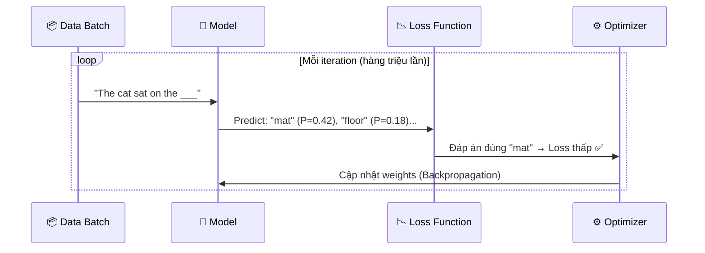
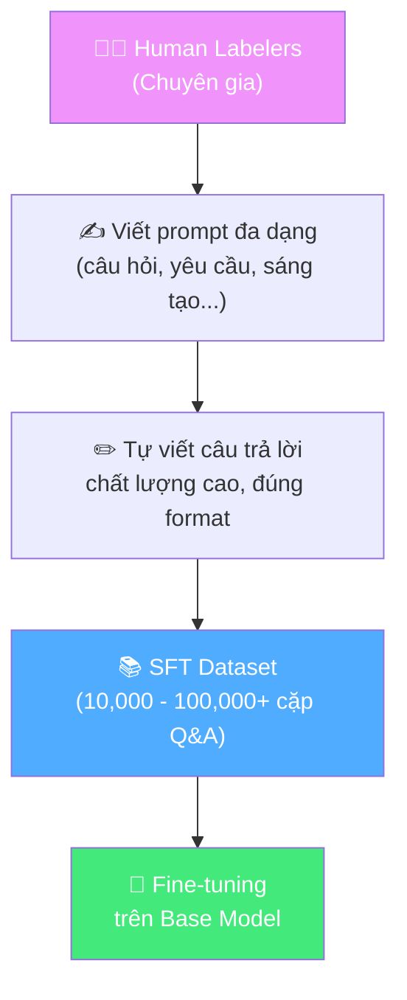
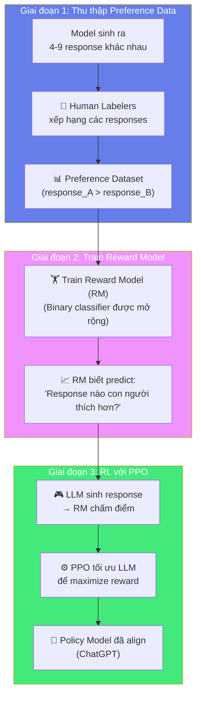
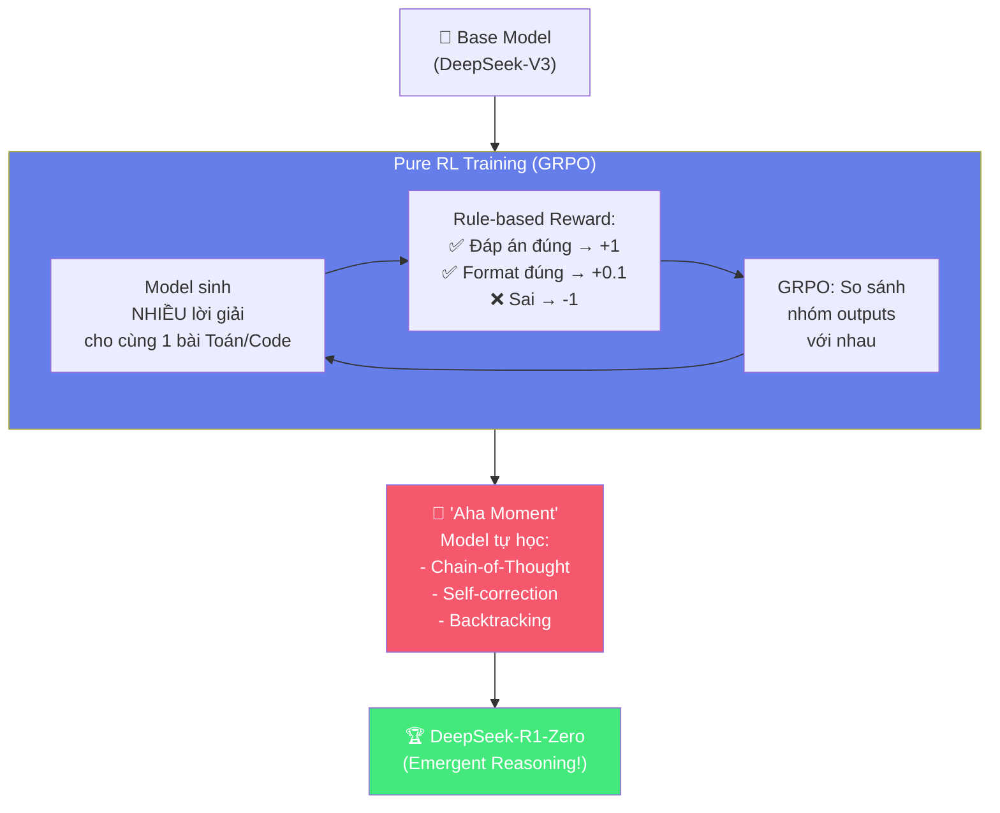
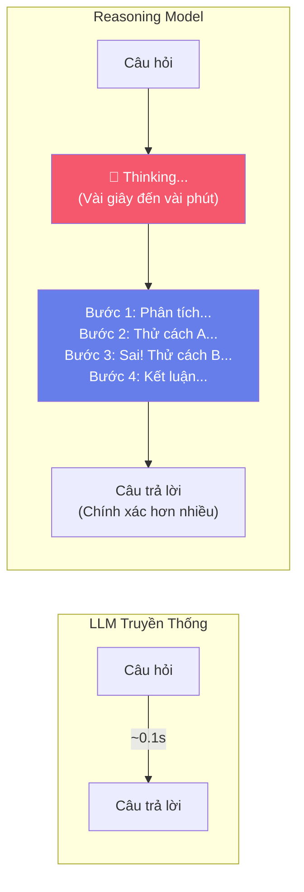
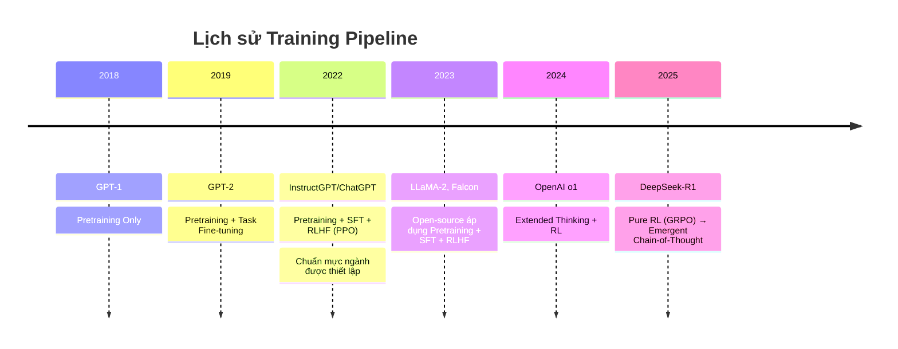

# 🏭 Bài 2: Quy Trình Training LLM — Từ "Đứa Bé Ngỗ Nghịch" Đến Trợ Lý Thông Minh

## 📋 Agenda

**Thời gian đọc ước tính:** ~30 phút

### Sau bài này, bạn sẽ:
- ✅ **Mô tả** được quy trình 3 bước training LLM chuẩn mực (Pretraining → SFT → RLHF)
- ✅ **Giải thích** tại sao Base Model dù "uyên bác" nhưng vẫn cần Fine-tuning
- ✅ **Phân biệt** sự khác biệt căn bản giữa LLM truyền thống và Reasoning Models
- ✅ **Hiểu** cơ chế GRPO và rule-based RL trong DeepSeek-R1

### Yêu cầu đầu vào (Prerequisites):
- 🔹 Đã đọc Bài 1 (Cơ sở lý thuyết LLM)
- 🔹 Biết khái niệm cơ bản về Machine Learning (supervised learning, loss function)

---

## ❓ Vấn đề & Giải pháp

**Vấn đề (Problem Statement):**
- Một mô hình Transformer sau Pretraining biết rất nhiều thứ, nhưng nếu hỏi *"Hãy giải thích Docker cho tôi"*, nó có thể trả lời bằng cách... tiếp tục câu hỏi (vì nó học từ Internet, nơi câu hỏi thường nằm trong FAQ).
- Làm thế nào biến một mô hình "biết nhiều nhưng không nghe lời" thành ChatGPT "vừa giỏi vừa lịch sự"?

**Giải pháp (Solution):**
Pipeline 3 bước được chuẩn hóa bởi OpenAI qua bài báo **InstructGPT (2022)**: Pretraining → SFT → RLHF. Đây là nền tảng của hầu hết các LLM hiện đại.

---

## 📖 WHAT — Bức tranh toàn cảnh

### Pipeline Training LLM Chuẩn Mực

```mermaid
flowchart LR
    A["🌐 Raw Internet Data\n(Hàng nghìn tỷ tokens)"] --> B

    subgraph B["Bước 1: PRETRAINING"]
        B1["Self-supervised Learning\n(Next Token Prediction)"]
    end

    B --> C["🧠 Base Model\n(Uyên bác nhưng ngỗ nghịch)"]

    C --> D

    subgraph D["Bước 2: SFT"]
        D1["Human Experts viết\nQ&A mẫu chất lượng cao"]
    end

    D --> E["🎓 SFT Model\n(Biết cư xử, theo instructions)"]

    E --> F

    subgraph F["Bước 3: RLHF"]
        F1["Reward Model\n+ PPO Algorithm"]
    end

    F --> G["🤖 ChatGPT / Claude\n(Helpful, Harmless, Honest)"]

    style B fill:#667eea,color:#fff
    style D fill:#f093fb,color:#fff
    style F fill:#43e97b,color:#fff
    style C fill:#764ba2,color:#fff
    style E fill:#f5576c,color:#fff
    style G fill:#4facfe,color:#fff
```



---

## 🔨 HOW — Chi tiết từng bước

### 🔵 Bước 1: Pretraining — "Nuốt Internet"

**Mục tiêu:** Dạy mô hình hiểu ngôn ngữ và thu nhận kiến thức thế giới bằng cách dự đoán token tiếp theo trên kho dữ liệu khổng lồ.

**Dữ liệu huấn luyện điển hình:**

| Nguồn dữ liệu | Tỷ lệ (ước tính) |
|---------------|------------------|
| Common Crawl (web) | ~60% |
| Books, Wikipedia | ~22% |
| Code (GitHub) | ~8% |
| Scientific papers | ~5% |
| Khác | ~5% |

**Objective function (Hàm mục tiêu):**

```
Loss = -log P(token_t | token_1, token_2, ..., token_{t-1})
```

Nói đơn giản: *"Phạt nặng nếu mô hình dự đoán sai token tiếp theo, thưởng nếu đúng."*

**Quy mô training (GPT-3 làm ví dụ):**
- **Dữ liệu:** 300 tỷ tokens
- **Tham số:** 175 tỷ parameters
- **Chi phí:** ~$4.6 triệu USD tiền GPU
- **Thời gian:** Vài tuần đến vài tháng



**Kết quả sau Pretraining — Base Model:**
- ✅ Biết cực nhiều kiến thức (y tế, luật, lập trình, khoa học...)
- ✅ Có thể tiếp tục bất kỳ đoạn văn nào tự nhiên
- ❌ Không biết cách trả lời câu hỏi theo format người dùng mong muốn
- ❌ Có thể tạo nội dung độc hại, sai lệch, hoặc thiếu nhất quán

> 📌 **Insight từ bài báo LIMA (2023):** *"Hầu hết kiến thức của LLM đến từ Pretraining. Fine-tuning chỉ dạy mô hình cách 'trình bày' và 'cư xử' với kiến thức đó."*

---

### 🟣 Bước 2: Supervised Fine-tuning (SFT) — "Học Phép Lịch Sự"

**Mục tiêu:** Dạy Base Model cách phản hồi theo format và phong cách mà người dùng mong đợi, bằng cách học từ các ví dụ mẫu do chuyên gia viết.

**Quy trình tạo SFT dataset:**



**Điểm kỹ thuật quan trọng:**

SFT **không** thay đổi objective function — vẫn là next token prediction. Điểm khác biệt duy nhất là **chất lượng và cấu trúc dữ liệu**:

```python
# Pretraining data (raw text)
"The weather in Ho Chi Minh City is hot and humid..."

# SFT data (structured conversation)
{
  "prompt": "Giải thích Docker là gì theo cách đơn giản",
  "response": """
Docker là nền tảng container hóa giúp đóng gói ứng dụng
cùng toàn bộ dependencies vào một 'container' độc lập...
  """
}
```

> 🔑 **Loss chỉ tính trên phần response**, không phải toàn bộ — mô hình học cách trả lời, không phải cách đặt câu hỏi.

**Tiêu chí chất lượng (3H Framework — OpenAI):**
- **Helpful (Hữu ích):** Trả lời đúng yêu cầu, đầy đủ thông tin
- **Harmless (Vô hại):** Không chứa nội dung gây hại, toxic
- **Honest (Thành thật):** Thừa nhận giới hạn, không bịa đặt

**Trade-off của SFT:**

| ✅ Ưu điểm | ❌ Nhược điểm |
|------------|--------------|
| Rẻ hơn Pretraining 100x | Cần dataset chất lượng cao (khó, tốn kém) |
| Dễ implement | Không đảm bảo bao phủ mọi behavior |
| Hiệu quả ngay với dataset nhỏ | SFT một mình không đủ (cần RLHF) |
| Kiểm soát style dễ | "Alignment tax" — có thể giảm benchmark |

---

### 🟢 Bước 3: RLHF — "Tối Ưu Theo Ý Con Người"

**Mục tiêu:** SFT dạy được *style*, nhưng không thể đảm bảo model luôn chọn câu trả lời *tốt nhất* trong vô số cách trả lời đúng. RLHF giải quyết điều này bằng cách dùng feedback của con người để tạo "hệ thống điểm" và train model tối đa hóa điểm số đó.

**3 giai đoạn của RLHF:**



**PPO (Proximal Policy Optimization) — Tại sao cần "gần"?**

PPO là thuật toán RL được chọn vì nó giới hạn mức độ thay đổi của model sau mỗi update. Điều này quan trọng vì:

```
Nếu model thay đổi quá nhiều → "reward hacking" 
(tìm cách đạt điểm cao mà không thực sự tốt hơn)
```

**Ví dụ reward hacking:**
- Reward Model thích câu trả lời dài → LLM học cách thêm padding vô nghĩa
- RM thích "chắc chắn" → LLM tự tin nói sai với văn phong chắc nịch

> 💡 **KL Divergence penalty** trong PPO ngăn LLM đi quá xa khỏi SFT model để tránh reward hacking.

---

## 🚀 Kỷ Nguyên Reasoning Models — Cuộc Cách Mạng 2024-2025

### Từ Hệ Thống 1 → Hệ Thống 2

Nhà tâm lý học Daniel Kahneman mô tả 2 hệ thống tư duy:

| Hệ Thống 1 | Hệ Thống 2 |
|------------|------------|
| Nhanh, tự động, phản xạ | Chậm, logic, có chủ ý |
| "2 + 2 = ?" | "Chứng minh định lý Fermat" |
| **LLM truyền thống** | **Reasoning Models** |

**OpenAI o1, o3 và DeepSeek-R1** là đại diện của Hệ thống 2: thay vì trả lời ngay, chúng **nghĩ thành nhiều bước** (Chain-of-Thought) trước khi đưa ra đáp án.

---

### DeepSeek-R1 — Case Study Đột Phá (01/2025)

**Điểm cách mạng:** DeepSeek-R1-Zero chứng minh rằng khả năng suy luận có thể **tự nảy sinh** (emergent) hoàn toàn từ Reinforcement Learning thuần túy, **không cần** dữ liệu SFT về cách suy luận.



---

### GRPO — Thay thế PPO hiệu quả hơn

**PPO vấn đề:** Cần một Critic model (value function) riêng biệt để estimate giá trị của từng state — tốn memory và tính toán.

**GRPO giải pháp:** Thay Critic bằng cách so sánh **nhóm outputs với nhau**:

```python
# PPO cần:
# 1. Actor Model (LLM)         → Sinh response
# 2. Critic Model (Value)      → Estimate state value  ← TỐN THÊM GPU
# 3. Reference Model           → KL penalty
# 4. Reward Model              → Chấm điểm

# GRPO chỉ cần:
# 1. Actor Model (LLM)         → Sinh G responses/query
# 2. Reference Model           → KL penalty
# 3. Rule-based Reward         → Chấm điểm dựa trên đáp án đúng

def grpo_advantage(rewards_group):
    """
    Thay vì dùng Critic, tính advantage bằng cách so sánh
    reward của output này với trung bình group
    """
    mean_reward = sum(rewards_group) / len(rewards_group)
    std_reward = std(rewards_group)
    # Normalize advantages
    advantages = [(r - mean_reward) / (std_reward + 1e-8) 
                  for r in rewards_group]
    return advantages
```

**Lợi ích GRPO:**
- Giảm 40-60% memory usage
- Không cần human preference data (dùng rule-based reward)
- Scale tốt hơn với các bài toán có đáp án kiểm chứng được (Toán, Code)

---

### Test-Time Compute — Thay đổi triết lý

Trước đây: Muốn model giỏi hơn → tăng Pretraining data/compute.

Reasoning Models: Muốn model giỏi hơn → cho model **nghĩ lâu hơn lúc inference**.



---

### So sánh: LLM Truyền thống vs Reasoning Model

| Tiêu chí | LLM Truyền thống | Reasoning Model |
|----------|-----------------|-----------------|
| **Tốc độ** | Nhanh (~0.1-1s) | Chậm hơn (vài s đến phút) |
| **Toán khó** | Trung bình | Xuất sắc |
| **Coding** | Tốt | Rất tốt |
| **Sáng tạo** | Rất tốt | Tốt |
| **Chat thông thường** | Tốt | Overkill |
| **Chi phí inference** | Thấp | Cao hơn |
| **Training** | SFT + RLHF (human) | Rule-based RL |

---

## 🔨 Pipeline So sánh: Từ GPT đến DeepSeek-R1



---

## 🚀 WHAT IF — Trade-off & Pitfalls Nâng Cao

### ⚠️ Vấn đề "Alignment Tax"

Fine-tuning theo ý người dùng đôi khi làm giảm hiệu năng trên academic benchmarks:

```
Base Model: MMLU = 75%
SFT Model:  MMLU = 73% (giảm nhẹ)
RLHF Model: Helpful/Harmless tốt hơn, nhưng có thể từ chối nhiều hơn
```

**Giải pháp:** Trộn Pretraining data vào SFT/RLHF (PPO-ptx trong InstructGPT).

### ⚠️ Reward Hacking trong RL

Khi dùng Reward Model thay vì rule-based reward:
- RM là một model học từ dữ liệu → có thể bị "hack"
- LLM học cách exploit điểm yếu của RM thay vì thực sự cải thiện

**Lý do DeepSeek-R1 chọn rule-based:** Toán học và Code có đáp án **tuyệt đối** → Reward function không thể bị hack.

### ⚠️ SFT Dataset Quality > Quantity

Từ bài báo **LIMA (2023)**:
> *1,000 ví dụ chất lượng cao > 10,000 ví dụ chất lượng trung bình*

Điều này có nghĩa: đầu tư vào quy trình annotation và chất lượng data quan trọng hơn quy mô.

---

## 💡 Câu hỏi thảo luận

1. **DeepSeek-R1-Zero** có thể học suy luận từ RL thuần túy mà không cần SFT. Điều này cho thấy điều gì về bản chất của "reasoning" — là kỹ năng học được hay là khả năng ẩn trong dữ liệu Pretraining?

2. Nếu Reward Model trong RLHF có thể bị "reward hack", tại sao các công ty lớn (OpenAI, Anthropic) vẫn dùng nó thay vì chuyển hoàn toàn sang rule-based RL như DeepSeek?

3. **"Test-time Compute"** đang dần thay thế "Train-time Compute" như chiến lược scale AI. Điều này có thể thay đổi kinh tế học của AI như thế nào? Ai sẽ được lợi, ai sẽ bị ảnh hưởng?

---

*Made by Anh Tu - Share to be share*
