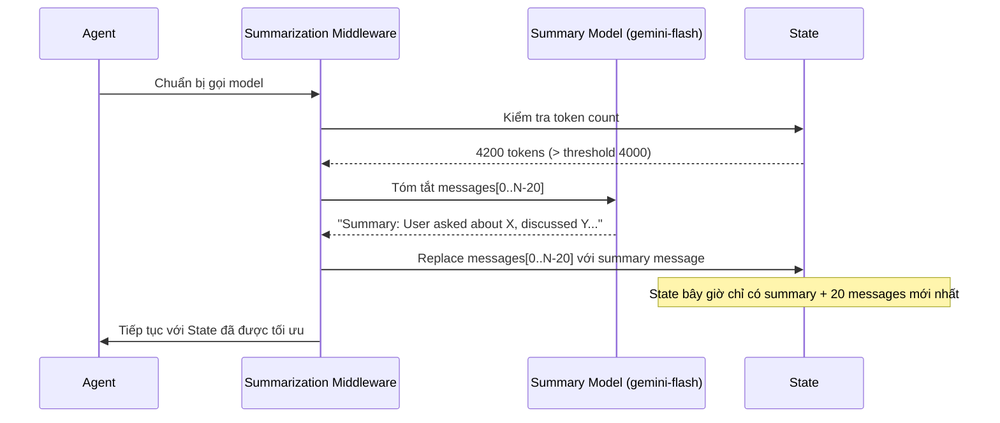
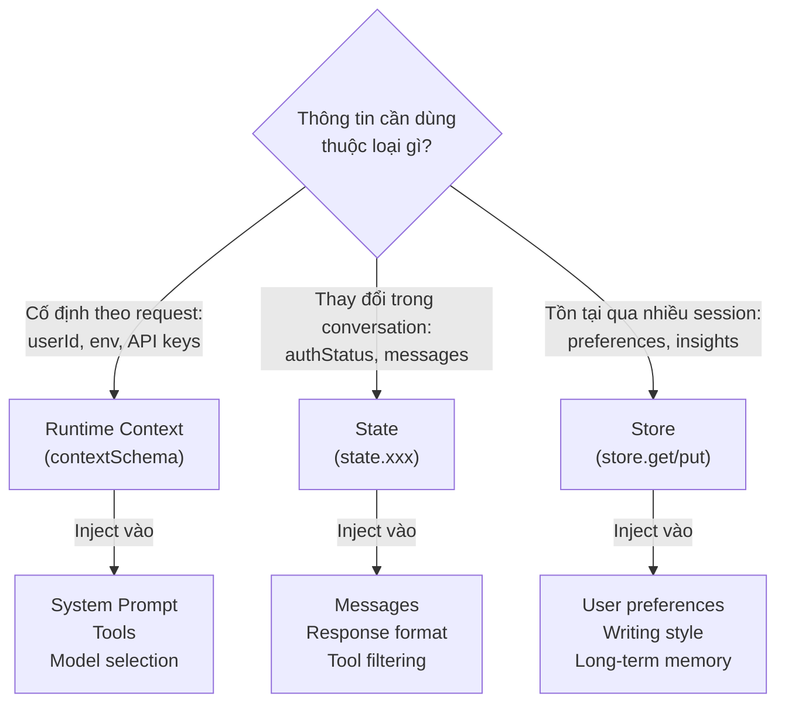

# 2.4. Context Engineering: Tối Ưu Thông Tin Cho Agent

## Agenda

**Thời gian đọc ước tính:** ~25 phút

### Learning outcome:

- Giải thích được **Context Engineering** là gì và tại sao đây là kỹ năng số một của AI Engineer.
- Phân biệt được 3 loại context: **Model Context**, **Tool Context**, **Life-cycle Context** — và phạm vi tác động của từng loại.
- Phân biệt được 3 nguồn dữ liệu: **Runtime Context**, **State**, **Store** — và chọn đúng nguồn cho từng tình huống.
- Implement được Dynamic System Prompt, Dynamic Tool Selection, và Summarization Middleware với `gemini-2.5-flash`.

---

## Glossary & Vocabulary

**1. Technical Terms (Thuật ngữ kỹ thuật):**

| Term | Vietnamese Meaning & Quick Explain |
| :--- | :--- |
| **Context Engineering** | Kỹ thuật tối ưu ngữ cảnh — nghệ thuật cung cấp đúng thông tin và công cụ, đúng định dạng, đúng lúc cho LLM để nó hoàn thành nhiệm vụ chính xác nhất. |
| **Model Context** | Ngữ cảnh model — tất cả thông tin đưa vào mỗi lần gọi LLM: system prompt, messages, tools, response format. Có tính *tạm thời* (transient) — chỉ tồn tại trong lần gọi đó. |
| **Tool Context** | Ngữ cảnh tool — thông tin mà tool đọc vào (userId, API key, session state) và kết quả mà tool ghi lại (state updates, store writes). |
| **Life-cycle Context** | Ngữ cảnh vòng đời — những gì xảy ra *giữa* các bước của agent loop: summarization, guardrails, logging. Có tính *bền vững* (persistent). |
| **Runtime Context** | Ngữ cảnh tĩnh — cấu hình cố định trong toàn bộ conversation: userId, API keys, permissions, environment. Không thay đổi giữa các bước. |
| **State** | Short-term memory — bộ nhớ trong phạm vi một conversation: messages hiện tại, kết quả tool, trạng thái xác thực. |
| **Store** | Long-term memory — bộ nhớ vượt qua conversation: user preferences, extracted insights, lịch sử dài hạn. |
| **Middleware** | Lớp trung gian — hook vào bất kỳ bước nào trong agent lifecycle để đọc/ghi context hoặc chuyển hướng luồng thực thi. |
| **Dynamic System Prompt** | System prompt động — thay đổi theo context thay vì cố định, để agent điều chỉnh hành vi theo từng tình huống cụ thể. |
| **Summarization Middleware** | Middleware tóm tắt — tự động rút gọn conversation history khi vượt token limit, cập nhật State bền vững. |
| **Transient** | Tạm thời — chỉ tồn tại trong phạm vi một lần gọi model, không lưu lại. |
| **Persistent** | Bền vững — được lưu vào State hoặc Store, tồn tại qua nhiều bước và nhiều conversation. |

**2. Vocabulary Support (Từ vựng học thuật/B1+):**

| Word | Meaning in Context |
| :--- | :--- |
| **Jurisdiction (n)** | Thẩm quyền pháp lý, khu vực áp dụng luật — dùng khi inject compliance rules theo quốc gia. |
| **Middleware (n)** | Phần mềm trung gian — lớp xử lý nằm giữa hai thành phần để thêm logic mà không sửa component gốc. |
| **Compliance (n)** | Tuân thủ — đảm bảo hệ thống hoạt động đúng theo quy định pháp luật hoặc chính sách. |
| **Snapshot (n)** | Ảnh chụp tại một thời điểm — bản ghi đầy đủ trạng thái tại một thời điểm cụ thể. |
| **Cross-cutting concern (n)** | Mối quan tâm xuyên suốt — chức năng cần áp dụng ở nhiều nơi (logging, auth, validation) thay vì chỉ một chỗ. |
| **Overhead (n)** | Chi phí phát sinh — tài nguyên thêm (token, latency, memory) không trực tiếp phục vụ task chính. |

---

## 1. Vấn đề & Giải pháp

**Vấn đề (Problem Statement):**

Khi agent thất bại trong thực tế, nguyên nhân gần như luôn rơi vào một trong hai loại:

1. **LLM không đủ năng lực** — Model yếu, không hiểu task phức tạp.
2. **LLM không có đúng thông tin** — Model đủ mạnh nhưng thiếu context để đưa ra quyết định đúng.

Trên thực tế, nguyên nhân thứ hai xảy ra *thường xuyên hơn nhiều*. Các biểu hiện cụ thể:

- System prompt cứng nhắc không thể điều chỉnh theo user role hay conversation stage.
- Tool list cố định — admin và guest nhận cùng một bộ tool, dẫn đến lỗi permission.
- Context window bị ngập khi conversation dài, LLM "quên" thông tin quan trọng ở đầu.
- Tool thiếu thông tin cần thiết (userId, API key) phải hardcode hoặc truyền qua tham số thừa.

**Giải pháp (Solution):**

Context Engineering — cung cấp đúng thông tin và công cụ, đúng định dạng, đúng lúc cho LLM. LangChain được thiết kế đặc biệt để làm điều này thông qua hệ thống middleware cho phép hook vào mọi bước của agent lifecycle.

---

## 2. Context Engineering Là Gì?

**Định nghĩa kỹ thuật:**

> **Context Engineering** là thực hành kiểm soát có chủ đích *những gì LLM nhìn thấy* tại mỗi bước trong agent loop — bao gồm instructions, message history, available tools, response format, và kết quả từ tool execution.

**Definition Anatomy — Giải phẫu định nghĩa:**

- **kiểm soát có chủ đích** (*deliberate control*): Không phải mặc định truyền hết mọi thứ vào LLM. Kỹ sư phải *quyết định* cái gì cần đưa vào, cái gì không.
- **những gì LLM nhìn thấy** (*what the LLM sees*): Context là toàn bộ "bức tranh" mà model dùng để ra quyết định. Sai context → sai quyết định.
- **tại mỗi bước trong agent loop** (*at each step*): Agent loop gọi LLM nhiều lần. Context có thể và *nên* thay đổi giữa các lần gọi tùy theo state hiện tại.

**Kiến trúc tổng quan — 3 Context Types & 3 Data Sources:**

```mermaid
graph TB
    subgraph DataSources["3 Nguồn Dữ Liệu"]
        RC["Runtime Context\n(Static config:\nuserId, API keys, env)"]
        ST["State\n(Short-term memory:\nmessages, auth status)"]
        SR["Store\n(Long-term memory:\npreferences, insights)"]
    end

    subgraph AgentLoop["Agent Loop"]
        direction LR
        MC["Model Call\nSystem Prompt\nMessages\nTools\nResponse Format"]
        TE["Tool Execution\nReads context\nWrites results"]
        LC["Life-cycle\nMiddleware hooks\nbetween steps"]
    end

    RC --> MC
    ST --> MC
    SR --> MC
    RC --> TE
    ST --> TE
    SR --> TE
    MC -->|"Middleware"| LC
    LC -->|"Updates"| ST
    LC -->|"Writes"| SR

    style DataSources fill:#1e293b,stroke:#475569
    style AgentLoop fill:#0f172a,stroke:#334155
    style RC fill:#1d4ed8,color:#fff,stroke:#2563eb
    style ST fill:#065f46,color:#fff,stroke:#059669
    style SR fill:#7c3aed,color:#fff,stroke:#8b5cf6
```



**Bảng phân loại — Context Types:**

| Context Type | Kiểm soát gì | Transient hay Persistent |
| :--- | :--- | :--- |
| **Model Context** | System prompt, messages, tools, response format đưa vào model | Transient — chỉ trong lần gọi đó |
| **Tool Context** | Thông tin tool đọc vào và kết quả tool ghi lại | Persistent — ghi vào State/Store |
| **Life-cycle Context** | Xử lý *giữa* các bước: summarization, guardrails, logging | Persistent — thay đổi State bền vững |

**Bảng phân loại — Data Sources:**

| Data Source | Scope | Ví dụ |
| :--- | :--- | :--- |
| **Runtime Context** | Conversation-scoped, static | userId, API keys, database connections, permissions |
| **State** | Conversation-scoped, dynamic | Current messages, auth status, uploaded files, tool results |
| **Store** | Cross-conversation | User preferences, memories, extracted insights |


---

## 3. Model Context — Kiểm Soát Đầu Vào Model

Model Context (*ngữ cảnh model*) là tất cả những gì đưa vào một lần gọi LLM. Mỗi thành phần đều có thể được điều chỉnh động dựa trên 3 nguồn dữ liệu.

### 3.1. Dynamic System Prompt

System prompt cố định là điểm yếu phổ biến nhất. Một agent phục vụ cả admin lẫn viewer không thể dùng cùng một prompt. Middleware cho phép tạo prompt động:

**Từ State — điều chỉnh theo conversation length:**

```typescript
// filename: agent/middleware/dynamic-prompt-state.ts

import { ChatGoogleGenerativeAI } from "@langchain/google-genai";
import { createAgent, dynamicSystemPromptMiddleware } from "langchain";

const model = new ChatGoogleGenerativeAI({ model: "gemini-2.5-flash" });

const agent = createAgent({
  model,
  tools: [],
  middleware: [
    dynamicSystemPromptMiddleware((state) => {
      const messageCount = state.messages.length;

      let base = "You are a helpful assistant.";

      // Khi conversation dài, nhắc model cô đọng để tránh lặp lại thông tin cũ
      if (messageCount > 10) {
        base += "\nThis is a long conversation - be extra concise.";
      }

      return base;
    }),
  ],
});
```

**Từ Store — inject user preferences:**

```typescript
// filename: agent/middleware/dynamic-prompt-store.ts

import * as z from "zod";
import { ChatGoogleGenerativeAI } from "@langchain/google-genai";
import { createAgent, dynamicSystemPromptMiddleware } from "langchain";

const contextSchema = z.object({
  userId: z.string(),
});

type Context = z.infer<typeof contextSchema>;

const model = new ChatGoogleGenerativeAI({ model: "gemini-2.5-flash" });

const agent = createAgent({
  model,
  tools: [],
  contextSchema,
  middleware: [
    dynamicSystemPromptMiddleware<Context>(async (state, runtime) => {
      const userId = runtime.context.userId;

      // Đọc từ Store: lấy user preferences đã được lưu từ session trước
      const store = runtime.store;
      const userPrefs = await store.get(["preferences"], userId);

      let base = "You are a helpful assistant.";

      if (userPrefs) {
        const style = userPrefs.value?.communicationStyle || "balanced";
        // Điều chỉnh tone theo preference đã học được từ quá khứ
        base += `\nUser prefers ${style} responses.`;
      }

      return base;
    }),
  ],
});
```

**Từ Runtime Context — phân quyền theo role:**

```typescript
// filename: agent/middleware/dynamic-prompt-runtime.ts

import * as z from "zod";
import { ChatGoogleGenerativeAI } from "@langchain/google-genai";
import { createAgent, dynamicSystemPromptMiddleware } from "langchain";

const contextSchema = z.object({
  userRole: z.enum(["admin", "editor", "viewer"]),
  deploymentEnv: z.enum(["development", "staging", "production"]),
});

type Context = z.infer<typeof contextSchema>;

const model = new ChatGoogleGenerativeAI({ model: "gemini-2.5-flash" });

const agent = createAgent({
  model,
  tools: [],
  contextSchema,
  middleware: [
    dynamicSystemPromptMiddleware<Context>((state, runtime) => {
      const { userRole, deploymentEnv } = runtime.context;

      let base = "You are a helpful assistant.";

      // Phân quyền theo role — một hệ thống prompt, nhiều behavior
      if (userRole === "admin") {
        base += "\nYou have admin access. You can perform all operations.";
      } else if (userRole === "viewer") {
        base += "\nYou have read-only access. Guide users to read operations only.";
      }

      // Thận trọng hơn ở production để tránh side-effect không mong muốn
      if (deploymentEnv === "production") {
        base += "\nBe extra careful with any data modifications.";
      }

      return base;
    }),
  ],
});
```

### 3.2. Dynamic Tool Selection

Không phải mọi tool đều phù hợp mọi tình huống. Quá nhiều tool làm LLM bị overwhelm (*quá tải*) và tăng tỷ lệ chọn sai. Dynamic Tool Selection (*chọn tool động*) lọc bộ tool phù hợp trước khi đưa vào model:

```typescript
// filename: agent/middleware/dynamic-tools.ts

import * as z from "zod";
import { ChatGoogleGenerativeAI } from "@langchain/google-genai";
import { createAgent, createMiddleware } from "langchain";
import { tool } from "@langchain/core/tools";

const contextSchema = z.object({
  userRole: z.enum(["admin", "editor", "viewer"]),
});

// Middleware lọc tool theo role — admin giữ tất cả, viewer chỉ read-only
const contextBasedTools = createMiddleware({
  name: "ContextBasedTools",
  contextSchema,
  wrapModelCall: (request, handler) => {
    const userRole = request.runtime.context.userRole;

    let filteredTools = request.tools;

    if (userRole === "admin") {
      // Admin có toàn quyền — không lọc gì
    } else if (userRole === "editor") {
      // Editor không được xóa dữ liệu
      filteredTools = request.tools.filter((t) => t.name !== "delete_data");
    } else {
      // Viewer chỉ thấy các tool đọc — bắt đầu bằng "read_"
      filteredTools = request.tools.filter((t) => t.name.startsWith("read_"));
    }

    return handler({ ...request, tools: filteredTools });
  },
});

// Middleware lọc tool theo authentication state trong conversation
const stateBasedTools = createMiddleware({
  name: "StateBasedTools",
  wrapModelCall: (request, handler) => {
    const state = request.state;
    const isAuthenticated = state.authenticated || false;

    let filteredTools = request.tools;

    // Chỉ mở tool nhạy cảm sau khi xác thực — tránh tool bị gọi khi chưa login
    if (!isAuthenticated) {
      filteredTools = request.tools.filter((t) => t.name.startsWith("public_"));
    }

    return handler({ ...request, tools: filteredTools });
  },
});
```

### 3.3. Dynamic Model Selection

Chọn model phù hợp với từng bước có thể giảm đáng kể chi phí mà không làm giảm chất lượng:

```typescript
// filename: agent/middleware/dynamic-model.ts

import { ChatGoogleGenerativeAI } from "@langchain/google-genai";
import { createAgent, createMiddleware } from "langchain";

// Khởi tạo các model một lần duy nhất — tái sử dụng để tránh overhead khởi tạo
const flash = new ChatGoogleGenerativeAI({ model: "gemini-2.5-flash" });
const flashThinking = new ChatGoogleGenerativeAI({ model: "gemini-2.5-flash-thinking" });

const stateBasedModel = createMiddleware({
  name: "StateBasedModel",
  wrapModelCall: (request, handler) => {
    const messageCount = request.messages.length;

    let model;

    if (messageCount > 20) {
      // Conversation dài → cần model mạnh hơn để giữ coherence (*tính mạch lạc*)
      model = flashThinking;
    } else {
      // Conversation ngắn → model tiết kiệm là đủ
      model = flash;
    }

    return handler({ ...request, model });
  },
});
```

### 3.4. Dynamic Response Format

Structured Output (*đầu ra có cấu trúc*) thích hợp cho downstream processing. Format có thể thay đổi theo conversation stage hoặc user role:

```typescript
// filename: agent/middleware/dynamic-response-format.ts

import { createMiddleware } from "langchain";
import { z } from "zod";

// Format đơn giản cho giai đoạn đầu — giảm token overhead
const simpleResponse = z.object({
  answer: z.string().describe("A brief answer"),
});

// Format chi tiết khi conversation đã đi vào chiều sâu
const detailedResponse = z.object({
  answer: z.string().describe("A detailed answer"),
  reasoning: z.string().describe("Explanation of reasoning"),
  confidence: z.number().min(0).max(1).describe("Confidence score 0-1"),
});

const stateBasedOutput = createMiddleware({
  name: "StateBasedOutput",
  wrapModelCall: (request, handler) => {
    const messageCount = request.messages.length;

    // Dưới 3 message → đang khám phá → simple format
    // Từ message thứ 3 trở đi → đã biết user cần gì → detailed format
    const responseFormat =
      messageCount < 3 ? simpleResponse : detailedResponse;

    return handler({ ...request, responseFormat });
  },
});
```

---

## 4. Tool Context — Tool Đọc và Ghi Context

Tool không chỉ nhận tham số từ LLM. Tool có thể đọc từ State, Store, và Runtime Context để hoạt động đúng ngữ cảnh — và ghi lại kết quả để agent nhớ.

### 4.1. Tool Reads (Tool Đọc Context)

**Đọc từ Runtime Context — API key và database connection:**

```typescript
// filename: agent/tools/fetch-user-data.ts

import * as z from "zod";
import { tool } from "@langchain/core/tools";
import { type ToolRuntime } from "langchain";

const contextSchema = z.object({
  userId: z.string(),
  apiKey: z.string(),
  dbConnection: z.string(),
});

const fetchUserData = tool(
  async ({ query }, runtime: ToolRuntime<any, typeof contextSchema>) => {
    // Không hardcode API key — lấy từ Runtime Context được inject khi khởi tạo agent
    const { userId, apiKey, dbConnection } = runtime.context;

    const results = await performDatabaseQuery(dbConnection, query, apiKey);
    return `Found ${results.length} results for user ${userId}`;
  },
  {
    name: "fetch_user_data",
    description: "Fetch user data from database using runtime configuration",
    schema: z.object({
      query: z.string().describe("Search query"),
    }),
  }
);
```

**Đọc từ State — kiểm tra authentication status:**

```typescript
// filename: agent/tools/check-auth.ts

import * as z from "zod";
import { tool, type ToolRuntime } from "langchain";

const checkAuthentication = tool(
  async (_, runtime: ToolRuntime) => {
    // Đọc từ State: không cần gọi DB — xem trực tiếp trạng thái session hiện tại
    const isAuthenticated = runtime.state.authenticated || false;

    return isAuthenticated
      ? "User is authenticated"
      : "User is not authenticated";
  },
  {
    name: "check_authentication",
    description: "Check if the current user is authenticated in this session",
    schema: z.object({}),
  }
);
```

### 4.2. Tool Writes (Tool Ghi Context)

Tool có thể cập nhật State trong cùng một lượt thực thi bằng `Command`:

```typescript
// filename: agent/tools/authenticate-user.ts

import * as z from "zod";
import { tool } from "@langchain/core/tools";
import { Command } from "@langchain/langgraph";

const authenticateUser = tool(
  async ({ password }) => {
    // Xác thực thành công → ghi trạng thái vào State để các tool sau biết
    // Command.update là cách duy nhất để tool ghi vào State một cách có kiểm soát
    if (password === "correct_password") {
      return new Command({
        update: { authenticated: true },
      });
    }

    return new Command({ update: { authenticated: false } });
  },
  {
    name: "authenticate_user",
    description: "Authenticate user and update session state",
    schema: z.object({
      password: z.string().describe("User password"),
    }),
  }
);
```

**Ghi vào Store — lưu user preference vượt session:**

```typescript
// filename: agent/tools/save-preference.ts

import * as z from "zod";
import { tool, type ToolRuntime } from "langchain";

const contextSchema = z.object({ userId: z.string() });

const savePreference = tool(
  async (
    { preferenceKey, preferenceValue },
    runtime: ToolRuntime<any, typeof contextSchema>
  ) => {
    const userId = runtime.context.userId;
    const store = runtime.store;

    // Merge preference mới vào preference cũ — không ghi đè toàn bộ
    const existing = await store.get(["preferences"], userId);
    const prefs = existing?.value || {};
    prefs[preferenceKey] = preferenceValue;

    // Store là cross-session — lần sau user quay lại vẫn giữ preference
    await store.put(["preferences"], userId, prefs);

    return `Saved preference: ${preferenceKey} = ${preferenceValue}`;
  },
  {
    name: "save_preference",
    description: "Save a user preference that persists across conversations",
    schema: z.object({
      preferenceKey: z.string().describe("Name of the preference"),
      preferenceValue: z.string().describe("Value to save"),
    }),
  }
);
```

---

## 5. Life-cycle Context — Xử Lý Giữa Các Bước

Life-cycle Context (*ngữ cảnh vòng đời*) là những gì xảy ra *giữa* model call và tool execution. Đây là nơi đặt các cross-cutting concern như summarization, guardrails, và logging.


Middleware có thể thực hiện 2 loại hành động:

1. **Update context** — Sửa đổi State/Store để lưu lại thay đổi bền vững.
2. **Jump in the lifecycle** — Chuyển hướng luồng thực thi (VD: bỏ qua tool execution nếu điều kiện đã thỏa mãn).

### 5.1. Summarization — Xử Lý Context Window Overflow

Khi conversation dài, messages cũ chiếm token quá nhiều, LLM bị "đẩy" context quan trọng ra ngoài cửa sổ. `summarizationMiddleware` giải quyết điều này tự động:

```typescript
// filename: agent/agent-with-summarization.ts

import { ChatGoogleGenerativeAI } from "@langchain/google-genai";
import { createAgent, summarizationMiddleware } from "langchain";

// Model chính — chất lượng cao cho task thực sự
const mainModel = new ChatGoogleGenerativeAI({ model: "gemini-2.5-flash" });

// Model tóm tắt — có thể dùng model nhỏ hơn để tiết kiệm chi phí
const summaryModel = new ChatGoogleGenerativeAI({ model: "gemini-2.5-flash" });

const agent = createAgent({
  model: mainModel,
  tools: [],
  middleware: [
    summarizationMiddleware({
      // Model dùng để tóm tắt — thường là model rẻ hơn
      model: summaryModel,
      // Trigger khi conversation vượt 4000 tokens
      trigger: { tokens: 4000 },
      // Giữ lại 20 messages gần nhất — phần còn lại được tóm tắt
      keep: { messages: 20 },
    }),
  ],
});
```

**Điểm quan trọng về Summarization vs Message Trimming:**

| | Message Trimming | Summarization Middleware |
| :--- | :--- | :--- |
| **Cơ chế** | Lọc message trước khi gọi model | Thay thế messages cũ bằng summary trong State |
| **Tính chất** | Transient — chỉ áp dụng cho lần gọi đó | Persistent — ghi vào State bền vững |
| **Future turns** | Lần sau vẫn thấy messages cũ | Lần sau chỉ thấy summary + messages gần nhất |
| **Khi dùng** | Giới hạn token tạm thời cho một call | Duy trì context window lành mạnh lâu dài |

**Cơ chế hoạt động của Summarization:**



---

## 6. Inject Compliance Context — Ứng Dụng Nâng Cao

Một use-case (*trường hợp sử dụng*) thực tế: inject compliance rules (*quy tắc tuân thủ pháp luật*) vào conversation dựa trên jurisdiction (*thẩm quyền pháp lý*) của user:

```typescript
// filename: agent/middleware/compliance-rules.ts

import * as z from "zod";
import { createMiddleware } from "langchain";

const contextSchema = z.object({
  userJurisdiction: z.string().describe("User's country code, e.g. VN, EU, US"),
  industry: z.enum(["finance", "healthcare", "general"]),
  complianceFrameworks: z.array(z.enum(["GDPR", "HIPAA", "SOC2"])),
});

type Context = z.infer<typeof contextSchema>;

const injectComplianceRules = createMiddleware<Context>({
  name: "InjectComplianceRules",
  contextSchema,
  wrapModelCall: (request, handler) => {
    const { userJurisdiction, industry, complianceFrameworks } =
      request.runtime.context;

    const rules: string[] = [];

    // Mỗi framework có bộ ràng buộc riêng — inject đúng loại theo user context
    if (complianceFrameworks.includes("GDPR")) {
      rules.push("- Must obtain explicit consent before processing personal data");
      rules.push("- Users have right to data deletion upon request");
    }

    if (complianceFrameworks.includes("HIPAA")) {
      rules.push("- Cannot share patient health information without authorization");
      rules.push("- Must use secure, encrypted communication channels");
    }

    if (industry === "finance") {
      rules.push("- Cannot provide specific financial advice without proper disclaimers");
    }

    if (rules.length > 0) {
      const complianceContext = `Compliance requirements for ${userJurisdiction}:\n${rules.join("\n")}`;

      // Append ở cuối messages — model chú ý hơn đến thông tin gần cuối
      const messages = [
        ...request.messages,
        { role: "user" as const, content: complianceContext },
      ];

      request = request.override({ messages });
    }

    return handler(request);
  },
});
```

---

## 7. Tổng Hợp — Khi Nào Dùng Nguồn Nào?



**Quyết định nhanh — chọn nguồn dữ liệu:**

| Câu hỏi | Trả lời | Dùng nguồn nào |
| :--- | :--- | :--- |
| Thông tin này có thay đổi trong conversation không? | Không | Runtime Context |
| Thông tin này có cần dùng ở session tiếp theo không? | Có | Store |
| Thông tin này chỉ liên quan đến conversation hiện tại? | Có | State |
| Thông tin này là cấu hình hệ thống (không phải user data)? | Có | Runtime Context |

---

## 8. Best Practices & Trade-offs

**6 nguyên tắc từ LangChain documentation:**

1. **Start simple** — Bắt đầu với static prompts và tools. Chỉ thêm dynamics khi thực sự cần — mỗi layer dynamic tăng complexity và debugging difficulty.

2. **Test incrementally** — Thêm từng context engineering feature một. Khó isolate bug khi nhiều middleware chạy song song.

3. **Monitor performance** — Track model calls, token usage, latency. Dynamic routing có thể tạo unexpected bottleneck.

4. **Use built-in middleware** — `summarizationMiddleware`, `LLMToolSelectorMiddleware` đã được test và optimize. Không nên tự implement khi đã có sẵn.

5. **Document your context strategy** — Ghi rõ *cái gì* được inject và *tại sao*. Context logic phân tán qua nhiều middleware rất khó maintain nếu không có documentation.

6. **Understand transient vs persistent** — Model context thay đổi *không* được lưu. Life-cycle context thay đổi *được* lưu vào State. Nhầm lẫn điều này gây bug khó tìm.

**Trade-offs cần cân nhắc:**

| Kỹ thuật | Lợi ích | Chi phí |
| :--- | :--- | :--- |
| **Dynamic System Prompt** | Agent linh hoạt theo context | Mỗi request phải compute prompt → latency tăng nhẹ |
| **Dynamic Tool Filtering** | Giảm tool confusion cho LLM | Logic lọc phức tạp dễ bị bug, khó test |
| **Summarization Middleware** | Giữ context window tối ưu | Tốn thêm LLM call để tóm tắt → chi phí tăng |
| **Store reads trong middleware** | Personalization mạnh | I/O async → latency tăng đáng kể nếu store chậm |

---

## Discussion Questions

1. **Transient vs Persistent trong production:** Nếu bạn inject compliance rules qua middleware nhưng dùng `request.override({ messages })` (transient), rules này sẽ mất ở lượt gọi tiếp theo. Khi nào nên để compliance rules là transient, khi nào nên ghi vào State để persist?

2. **Tool filtering và LLM reasoning:** Bạn lọc tool theo role nhưng LLM không biết tại sao một số tool không có trong danh sách. Nếu user hỏi "Tại sao tôi không thể xóa dữ liệu?", agent sẽ xử lý thế nào? Bạn cần inject gì vào system prompt để agent trả lời đúng?

3. **Summarization và factual accuracy:** Khi `summarizationMiddleware` tóm tắt messages cũ, nó có thể mất chi tiết quan trọng. Trong domain y tế hay pháp lý, điều này có thể gây hại. Những guardrail nào bạn cần thêm để bảo vệ factual accuracy khi dùng summarization?

4. **Multiple middleware ordering:** Bạn có `InjectComplianceRules` và `DynamicSystemPrompt` chạy cùng nhau. Thứ tự middleware có quan trọng không? Nếu compliance rules được append vào cuối messages trước, rồi prompt middleware lại thêm vào sau — output cuối cùng sẽ khác không?

---

## References

- [LangChain — Context Engineering](https://docs.langchain.com/oss/javascript/langchain/context-engineering) — **Nguồn chính** — toàn bộ context types, data sources, và middleware patterns.
- [LangChain — Middleware](https://docs.langchain.com/oss/javascript/langchain/middleware) — Complete middleware guide với `SummarizationMiddleware` và `LLMToolSelectorMiddleware`.
- [LangChain — Tools](https://docs.langchain.com/oss/javascript/langchain/tools) — Tool creation, dynamic tool selection, và accessing context trong tools.
- [LangChain Concepts — Memory](https://docs.langchain.com/oss/javascript/concepts/memory) — Short-term và long-term memory patterns.
- [LangChain Concepts — Context](https://docs.langchain.com/oss/javascript/concepts/context) — Conceptual overview về context types.

---

*Made by Anh Tu - Share to be share*
