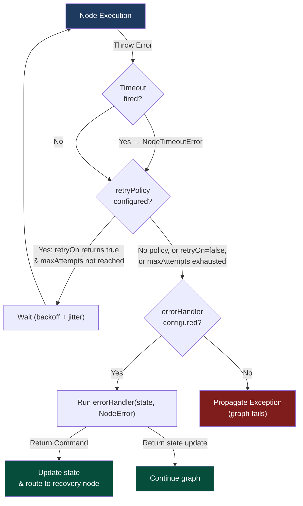
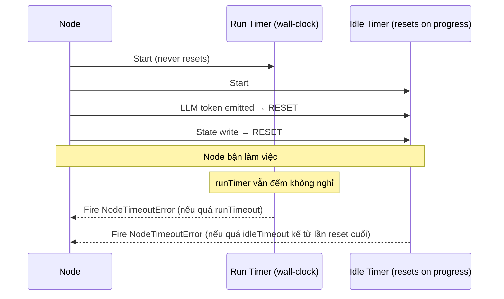

# 2.5. Fault Tolerance: Khả Năng Chịu Lỗi

## Agenda

**Thời gian đọc ước tính:** ~22 phút

### Learning outcome:

- Giải thích được tại sao agent production cần Fault Tolerance (*khả năng chịu lỗi*) và 3 cơ chế LangGraph cung cấp.
- Cấu hình được Retry Policy với backoff, custom `retryOn`, và `executionInfo` để switch fallback.
- Phân biệt được `runTimeout` và `idleTimeout` — biết khi nào dùng cái nào.
- Implement được Error Handler với `Command` để xây dựng Saga/compensation pattern.
- Dùng `setNodeDefaults` để cấu hình fault tolerance một lần cho toàn bộ graph.

---

## Glossary & Vocabulary

**1. Technical Terms (Thuật ngữ kỹ thuật):**

| Term | Vietnamese Meaning & Quick Explain |
| :--- | :--- |
| **Fault Tolerance** | Khả năng chịu lỗi — hệ thống tiếp tục hoạt động đúng đắn ngay cả khi một số thành phần bị lỗi. |
| **Retry Policy** | Chính sách thử lại — bộ quy tắc xác định khi nào và bao nhiêu lần thử lại một thao tác thất bại. |
| **Backoff** | Lui dần — chiến lược tăng dần thời gian chờ giữa các lần retry để tránh quá tải server. |
| **Jitter** | Nhiễu ngẫu nhiên — thêm thời gian ngẫu nhiên vào interval để tránh nhiều node cùng retry một lúc (thundering herd). |
| **Run Timeout** | Giới hạn thời gian chạy — wall-clock cap cứng, không bao giờ reset dù node có hoạt động hay không. |
| **Idle Timeout** | Giới hạn thời gian rảnh — reset mỗi khi node phát ra progress signal; chỉ fire khi không có hoạt động. |
| **Error Handler** | Trình xử lý lỗi — hàm chạy sau khi node thất bại và hết retry, nhận `NodeError` và có thể route sang node khác. |
| **NodeError** | Lỗi node — object chứa tên node thất bại và exception gốc, truyền vào error handler. |
| **NodeTimeoutError** | Lỗi timeout node — exception đặc biệt khi node vượt quá time limit; mặc định là retryable. |
| **Saga Pattern** | Pattern bù đắp — chuỗi transaction phân tán, mỗi bước có compensating transaction để rollback khi lỗi. |
| **`setNodeDefaults`** | Đặt giá trị mặc định — cấu hình retry, timeout, error handler một lần cho toàn bộ các node trong graph. |
| **Graceful Shutdown** | Tắt máy nhẹ nhàng — dừng graph sau khi superstep hiện tại hoàn tất, lưu checkpoint để resume sau. |
| **Superstep** | Bước siêu — một "tick" của graph nơi tất cả node được schedule cho bước đó thực thi xong. |
| **`GraphDrained`** | Graph đã rút — exception khi graceful shutdown hoàn tất, checkpoint đã được lưu, có thể resume. |

**2. Vocabulary Support (Từ vựng học thuật/B1+):**

| Word | Meaning in Context |
| :--- | :--- |
| **Transient (adj)** | Tạm thời, không kéo dài — transient error là lỗi nhất thời có thể tự hồi phục (VD: network flicker). |
| **Exhausted (v)** | Hết, cạn kiệt — "retries are exhausted" = đã thử hết số lần được phép. |
| **Idempotent (adj)** | Bất biến lũy thừa — thao tác có thể gọi nhiều lần mà kết quả vẫn giống như gọi một lần. |
| **Compensation (n)** | Bù đắp — hành động hoàn tác một bước đã thực thi khi bước sau bị lỗi. |
| **Cooperative (adj)** | Hợp tác — shutdown xảy ra khi node hiện tại đồng ý dừng, không bị cắt giữa chừng. |
| **Wall-clock (adj)** | Đồng hồ tường — thời gian thực ngoài đời, không phải CPU time. |

---

## 1. Vấn đề & Giải pháp

**Vấn đề (Problem Statement):**

Agent production gọi API bên ngoài thường xuyên — LLM, database, search service, payment gateway. Những dịch vụ này không 100% ổn định:

- Network flicker (*nhiễu mạng*) trong 200ms → request timeout dù server đang chạy tốt.
- LLM provider trả về `503 Service Unavailable` trong spike traffic.
- Node LLM chạy mãi không dừng vì model bị stuck (sinh token vô hạn).
- Payment service thất bại sau khi inventory đã được reserve → cần rollback.

Nếu không có fault tolerance, một lỗi nhỏ làm cả agent crash và mất toàn bộ công việc đã thực hiện.

**Giải pháp (Solution):**

LangGraph cung cấp 3 cơ chế composable (*có thể kết hợp*) để xử lý lỗi:

1. **Retries** — Tự động thử lại dựa trên loại exception và backoff settings.
2. **Timeouts** — Giới hạn thời gian một attempt được phép chạy.
3. **Error Handlers** — Chạy sau khi hết retry, có thể update state và route sang node recovery.

Thứ tự ưu tiên cố định: **Timeout → Retry → Error Handler**. Timeout fire → retry quyết định có thử lại không → khi hết retry, error handler mới chạy.

---

## 2. Fault Tolerance Là Gì?

**Định nghĩa kỹ thuật:**

> **Fault Tolerance** trong LangGraph là khả năng của graph tiếp tục thực thi đúng đắn khi một hoặc nhiều node thất bại, thông qua 3 cơ chế composable: **automatic retry** với configurable backoff, **timeout** để cap thời gian chạy, và **error handler** để compensation sau khi hết retry.

**Definition Anatomy — Giải phẫu định nghĩa:**

- **composable** (*có thể kết hợp*): Ba cơ chế làm việc cùng nhau theo thứ tự cố định. Không phải chọn một mà là stack (*xếp chồng*) chúng.
- **automatic retry** (*tự động thử lại*): Không cần viết try/catch thủ công — khai báo `retryPolicy` và LangGraph lo phần còn lại.
- **compensation** (*bù đắp*): Error handler không chỉ log lỗi — nó có thể rollback state và dẫn đến node cleanup.

**Luồng xử lý lỗi trong LangGraph:**



---

## 3. Retries — Tự Động Thử Lại

### 3.1. Cấu hình cơ bản

Pass `retryPolicy` trực tiếp vào `addNode`:

```typescript
// filename: agent/graph-with-retry.ts

import { StateGraph, StateSchema, START, END } from "@langchain/langgraph";
import { ChatGoogleGenerativeAI } from "@langchain/google-genai";
import * as z from "zod";

const model = new ChatGoogleGenerativeAI({ model: "gemini-2.5-flash" });

const State = new StateSchema({
  result: z.string(),
});

const callApi = async (state: typeof State.State) => {
  const response = await model.invoke([
    { role: "user", content: "Summarize this: " + state.result },
  ]);
  return { result: response.content as string };
};

const graph = new StateGraph(State)
  .addNode("callApi", callApi, {
    retryPolicy: {
      maxAttempts: 3,        // 1 lần chính + 2 lần retry
      initialInterval: 500,  // 500ms trước lần retry đầu tiên
      backoffFactor: 2.0,    // 500 → 1000 → 2000ms
      maxInterval: 128_000,  // Không bao giờ chờ quá 128 giây
      jitter: true,          // Thêm nhiễu ngẫu nhiên — tránh thundering herd
    },
  })
  .addEdge(START, "callApi")
  .addEdge("callApi", END)
  .compile();
```

### 3.2. Tham số Retry Policy

| Parameter | Default | Mô tả |
| :--- | :--- | :--- |
| `maxAttempts` | `3` | Số lần tối đa kể cả lần đầu (không phải số lần retry). |
| `initialInterval` | `500ms` | Thời gian chờ trước retry đầu tiên. |
| `backoffFactor` | `2.0` | Hệ số nhân interval sau mỗi lần retry. |
| `maxInterval` | `128000ms` | Giới hạn trên của interval — không chờ quá mức này. |
| `jitter` | `true` | Thêm nhiễu ngẫu nhiên vào interval. |
| `retryOn` | Built-in handler | Callable trả về `true` nếu error đó nên được retry. |

**Built-in handler KHÔNG retry những lỗi sau:**
- `AbortError` / cancellation errors
- HTTP 400, 401, 402, 403, 404, 405, 406, 407, 409 (client errors)
- `GraphValueError`
- OpenAI `insufficient_quota`

### 3.3. Custom `retryOn` — Kiểm Soát Chính Xác Lỗi Nào Được Retry

```typescript
// filename: agent/retry-custom.ts

import { StateGraph, StateSchema, START, END } from "@langchain/langgraph";
import * as z from "zod";

// Phân loại lỗi tường minh — tránh retry những lỗi không bao giờ tự hồi phục
class NetworkError extends Error {}
class ValidationError extends Error {}  // Không nên retry — input sai thì retry mãi cũng sai

const State = new StateSchema({ result: z.string() });

const graph = new StateGraph(State)
  .addNode("callApi", async () => ({ result: "" }), {
    retryPolicy: {
      maxAttempts: 5,
      retryOn: (error: unknown) => {
        // Chỉ retry lỗi mạng — ValidationError không nên retry
        if (error instanceof ValidationError) return false;
        if (error instanceof NetworkError) return true;
        // Default: retry các lỗi khác
        return true;
      },
    },
  })
  .addEdge(START, "callApi")
  .addEdge("callApi", END)
  .compile();
```

### 3.4. `executionInfo` — Switch Fallback Sau N Lần Thất Bại

`executionInfo` cho biết đang ở attempt thứ mấy — dùng để switch sang fallback API:

```typescript
// filename: agent/retry-with-fallback.ts

import {
  StateGraph,
  StateSchema,
  START,
  END,
  type Runtime,
} from "@langchain/langgraph";
import { ChatGoogleGenerativeAI } from "@langchain/google-genai";
import * as z from "zod";

const primaryModel = new ChatGoogleGenerativeAI({ model: "gemini-2.5-flash" });
const fallbackModel = new ChatGoogleGenerativeAI({ model: "gemini-2.0-flash" });

const State = new StateSchema({ result: z.string() });

const callWithFallback = async (
  state: typeof State.State,
  runtime: Runtime<typeof State>
) => {
  const attempt = runtime.executionInfo?.nodeAttempt ?? 1;

  // Lần thử đầu dùng primary, từ lần 2 trở đi chuyển sang fallback nhẹ hơn
  const model = attempt > 1 ? fallbackModel : primaryModel;

  const response = await model.invoke([
    { role: "user", content: "Process: " + state.result },
  ]);
  return { result: response.content as string };
};

const graph = new StateGraph(State)
  .addNode("callWithFallback", callWithFallback, {
    retryPolicy: { maxAttempts: 3 },
  })
  .addEdge(START, "callWithFallback")
  .addEdge("callWithFallback", END)
  .compile();
```

**`executionInfo` fields:**

| Field | Mô tả |
| :--- | :--- |
| `nodeAttempt` | Attempt number, 1-indexed. `1` = lần đầu, `2` = retry đầu tiên. |
| `nodeFirstAttemptTime` | Unix timestamp (ms) khi attempt đầu tiên bắt đầu. Không đổi qua các retry. |
| `threadId` | Thread ID hiện tại. `undefined` nếu không có checkpointer. |
| `taskId` | Task ID của execution hiện tại. |

---

## 4. Timeouts — Giới Hạn Thời Gian Chạy

### 4.1. Run Timeout vs Idle Timeout



**Run Timeout** — giới hạn cứng tuyệt đối:

```typescript
// filename: agent/timeout-run.ts

import { StateGraph, StateSchema, START, END } from "@langchain/langgraph";
import * as z from "zod";

const State = new StateSchema({ result: z.string() });

const graph = new StateGraph(State)
  .addNode("callModel", async () => ({ result: "" }), {
    // Node này PHẢI hoàn thành trong 60 giây — không ngoại lệ
    timeout: { runTimeout: 60_000 },
  })
  .addEdge(START, "callModel")
  .addEdge("callModel", END)
  .compile();
```

**Idle Timeout** — timeout khi không có tiến trình:

```typescript
// filename: agent/timeout-idle.ts

import { StateGraph, StateSchema, START, END, type Runtime } from "@langchain/langgraph";
import * as z from "zod";

const State = new StateSchema({ result: z.string() });

const longRunningNode = async (
  state: typeof State.State,
  runtime: Runtime<typeof State>
) => {
  // Giả lập xử lý batch dài — cần heartbeat thủ công để không bị timeout
  const batches = ["batch1", "batch2", "batch3"];
  for (const batch of batches) {
    await processBatch(batch);
    // Báo hiệu "tôi vẫn đang làm việc" — reset idle clock
    runtime.heartbeat?.();
  }
  return { result: "done" };
};

async function processBatch(batch: string): Promise<void> {
  // Simulate async work
  await new Promise((r) => setTimeout(r, 8000));
}

const graph = new StateGraph(State)
  .addNode("longRunning", longRunningNode, {
    timeout: {
      idleTimeout: 30_000,   // Fire nếu không có progress trong 30 giây
      refreshOn: "heartbeat", // Chỉ reset khi gọi runtime.heartbeat() thủ công
    },
  })
  .addEdge(START, "longRunning")
  .addEdge("longRunning", END)
  .compile();
```

### 4.2. Kết Hợp Timeout và Retry

`NodeTimeoutError` là retryable mặc định — kết hợp tự nhiên với retry policy:

```typescript
// filename: agent/timeout-with-retry.ts

import { StateGraph, StateSchema, START, END } from "@langchain/langgraph";
import * as z from "zod";

const State = new StateSchema({ result: z.string() });

const graph = new StateGraph(State)
  .addNode("callModel", async () => ({ result: "" }), {
    // Mỗi attempt chỉ được chạy 30 giây; nếu timeout → retry
    // Timeout clock reset sau mỗi lần retry mới
    timeout: { idleTimeout: 30_000 },
    retryPolicy: { maxAttempts: 3 },
  })
  .addEdge(START, "callModel")
  .addEdge("callModel", END)
  .compile();
```

---

## 5. Error Handlers — Xử Lý Sau Khi Hết Retry

Error handler chạy sau khi node thất bại và **hết tất cả retry**. Đây là nơi implement Saga/compensation pattern (*pattern bù đắp*):

### 5.1. Compensation Pattern (Saga)

```typescript
// filename: agent/saga-pattern.ts

import {
  StateGraph,
  StateSchema,
  START,
  END,
  Command,
  type NodeError,
} from "@langchain/langgraph";
import * as z from "zod";

const State = new StateSchema({
  status: z.string(),
  orderId: z.string().optional(),
});

// Giả lập lỗi payment gateway
const chargePayment = async () => {
  throw new Error("payment gateway timeout after 3 retries");
};

// Error handler nhận NodeError — biết chính xác node nào fail và lỗi gì
const paymentErrorHandler = (
  state: typeof State.State,
  error: NodeError
) => {
  console.error(`Node "${error.node}" failed: ${error.error.message}`);

  // Return Command để: (1) update state và (2) route sang compensate node
  return new Command({
    update: {
      status: `payment_failed: ${error.error.message}`,
    },
    goto: "compensate", // Dẫn sang node rollback inventory
  });
};

const reserveInventory = async () => ({ status: "inventory_reserved" });
const compensate = async (state: typeof State.State) => ({
  status: "inventory_released",
});
const finalize = async (state: typeof State.State) => state;

const graph = new StateGraph(State)
  .addNode("reserveInventory", reserveInventory)
  .addNode("chargePayment", chargePayment, {
    retryPolicy: { maxAttempts: 3 },   // Retry 3 lần trước
    errorHandler: paymentErrorHandler,  // Sau đó mới chạy handler
  })
  .addNode("compensate", compensate)
  .addNode("finalize", finalize)
  .addEdge(START, "reserveInventory")
  .addEdge("reserveInventory", "chargePayment")
  .addEdge("chargePayment", "finalize")
  .addEdge("compensate", END)
  .addEdge("finalize", END)
  .compile();
```

**`NodeError` fields:**

| Field | Type | Mô tả |
| :--- | :--- | :--- |
| `node` | `string` | Tên node thất bại. |
| `error` | `Error` | Exception gốc được throw từ node. |

---

## 6. `setNodeDefaults` — Cấu Hình Một Lần Cho Toàn Graph

Thay vì lặp lại `retryPolicy` và `timeout` trên mọi `addNode`, dùng `setNodeDefaults`:

```typescript
// filename: agent/node-defaults.ts

import {
  StateGraph,
  StateSchema,
  START,
  END,
  type NodeError,
} from "@langchain/langgraph";
import { ChatGoogleGenerativeAI } from "@langchain/google-genai";
import * as z from "zod";

const model = new ChatGoogleGenerativeAI({ model: "gemini-2.5-flash" });

const State = new StateSchema({
  status: z.string(),
  result: z.string(),
});

const defaultErrorHandler = (
  state: typeof State.State,
  error: NodeError
) => ({
  status: `handled: ${error.node} - ${error.error.message}`,
});

const graph = new StateGraph(State)
  .setNodeDefaults({
    // Mọi node đều nhận cùng retry/timeout/error config — DRY principle
    retryPolicy: { maxAttempts: 3, initialInterval: 500 },
    errorHandler: defaultErrorHandler,
    timeout: { runTimeout: 30_000 },
  })
  .addNode("stepA", async () => ({ result: "A done" }))
  .addNode("stepB", async () => ({ result: "B done" }))
  .addNode("stepC", async (state) => {
    const response = await model.invoke([{ role: "user", content: "Summarize: " + state.result }]);
    return { result: response.content as string };
  }, {
    // stepC override: cần thêm idleTimeout vì gọi LLM
    timeout: { runTimeout: 30_000, idleTimeout: 15_000 },
  })
  .addEdge(START, "stepA")
  .addEdge("stepA", "stepB")
  .addEdge("stepB", "stepC")
  .addEdge("stepC", END)
  .compile();
```

**Lưu ý về `setNodeDefaults`:**

| Behavior | Chi tiết |
| :--- | :--- |
| **Precedence** | Per-node values luôn override defaults. Defaults resolve ở `compile()` time. |
| **Scope** | Defaults không kế thừa sang subgraph — mỗi graph quản lý defaults riêng. |
| **Error handler nodes** | `errorHandler` default KHÔNG áp dụng cho error-handler nodes (tránh handler tự bắt lỗi của mình). |
| **cachePolicy** | KHÔNG áp dụng cho error-handler nodes (caching handler result là unsafe). |

---

## 7. Graceful Shutdown — Dừng An Toàn

Dừng graph sau khi superstep hiện tại hoàn tất và lưu checkpoint để resume sau:

```typescript
// filename: agent/graceful-shutdown.ts

import process from "node:process";
import {
  RunControl,
  GraphDrained,
  StateGraph,
  StateSchema,
  START,
  END,
} from "@langchain/langgraph";
import { MemorySaver } from "@langchain/langgraph";
import * as z from "zod";

const State = new StateSchema({ result: z.string() });

const graph = new StateGraph(State)
  .addNode("step1", async () => ({ result: "step1 done" }))
  .addNode("step2", async () => ({ result: "step2 done" }))
  .addEdge(START, "step1")
  .addEdge("step1", "step2")
  .addEdge("step2", END)
  .compile({ checkpointer: new MemorySaver() });

const control = new RunControl();
const config = { configurable: { thread_id: "my-thread" } };

// Lắng nghe SIGTERM — Docker/Kubernetes gửi signal này khi muốn dừng container
process.on("SIGTERM", () => {
  console.log("Received SIGTERM — requesting graceful drain...");
  control.requestDrain("sigterm");
});

try {
  const result = await graph.invoke(
    { result: "" },
    { ...config, control }
  );
  console.log("Graph completed normally:", result);
} catch (e) {
  if (e instanceof GraphDrained) {
    // Graph dừng an toàn sau superstep — checkpoint đã được lưu
    console.log(`Graph drained: reason="${e.reason}"`);
    console.log("Resume later with the same config...");
    // Sau: const resumed = await graph.invoke(null, config);
  } else {
    throw e;
  }
}
```

**Graceful Shutdown semantics:**

| Scenario | Behavior |
| :--- | :--- |
| Node đang chạy giữa chừng | Chạy đến hết. Drain effect ở superstep tiếp theo. |
| Node đang trong retry loop | Retry chạy hết (thành công hoặc fail). Drain sau đó. |
| Graph kết thúc tự nhiên cùng lúc drain | Return bình thường — kiểm tra `control.drainRequested`. |
| Còn superstep chưa chạy | Raise `GraphDrained(reason)`. Checkpoint được lưu, có thể resume. |

---

## 8. Best Practices & Trade-offs

**Nguyên tắc thiết kế:**

1. **Retry chỉ cho transient errors** — Lỗi validation (400) không bao giờ tự khỏi, retry chỉ lãng phí tài nguyên. Dùng custom `retryOn`.

2. **Kết hợp timeout + retry** — Idle timeout bắt node bị stuck; retry cho phép thử lại sau timeout. Cả hai cùng nhau mạnh hơn từng cái riêng lẻ.

3. **Đặt `errorHandler` ở node quan trọng** — Node làm side-effect (write DB, charge payment) cần handler để rollback khi lỗi.

4. **Dùng `setNodeDefaults` cho baseline** — Tránh lặp code. Override per-node chỉ khi cần điều chỉnh đặc biệt.

5. **Implement Graceful Shutdown trong production** — Container orchestration (Kubernetes, ECS) dùng SIGTERM. Không có drain → state bị mất giữa chừng.

**Trade-offs:**

| Cơ chế | Lợi ích | Chi phí |
| :--- | :--- | :--- |
| **Retry với backoff** | Tự phục hồi transient failures | Tăng latency tổng thể; tiêu tốn token LLM nếu retry LLM call |
| **Idle Timeout** | Phát hiện node stuck sớm | Có thể fire nhầm cho node hợp lệ đang xử lý batch lớn → cần tune |
| **Error Handler** | Compensation/saga pattern | Thêm complexity; handler fail → exception propagate không kiểm soát được |
| **`setNodeDefaults`** | DRY, dễ maintain | Defaults ẩn — người đọc code không thấy ngay node có retry hay không |

---

## Discussion Questions

1. **Retry và idempotency trong LLM calls:** LLM call không idempotent — mỗi lần gọi có thể trả về kết quả khác nhau. Khi retry một LLM node, bạn có thể nhận output không consistent. Trong use case nào điều này là acceptable, và trong use case nào bạn cần đặt node không retry?

2. **Saga pattern với distributed state:** Error handler route sang `compensate` node, nhưng `compensate` node cũng có thể fail. Làm thế nào bạn thiết kế compensating transaction để idempotent? Và nếu `compensate` node cũng thất bại, bạn cần cơ chế gì?

3. **`setNodeDefaults` và observability:** Khi debug production incident, bạn xem code và thấy một node không có `retryPolicy` tường minh. Làm thế nào bạn biết node đó có được retry hay không? Công cụ/convention nào giúp team tránh nhầm lẫn này?

4. **Idle Timeout trong streaming:** Nếu LLM đang stream response (phát từng token), mỗi token có được coi là "progress signal" không? Nếu LLM đột ngột dừng phát token giữa chừng (model bị stuck), idle timeout có bắt được tình huống này không?

---

## References

- [LangGraph — Fault Tolerance](https://docs.langchain.com/oss/javascript/langgraph/fault-tolerance) — **Nguồn chính** — Retries, Timeouts, Error Handlers, setNodeDefaults, Graceful Shutdown.
- [LangGraph — `NodeTimeoutError`](https://reference.langchain.com/javascript/langchain-langgraph/index/NodeTimeoutError) — API Reference cho timeout error.
- [LangGraph — `RunControl`](https://reference.langchain.com/javascript/langchain-langgraph/index/RunControl) — Graceful shutdown API.
- [LangGraph — Checkpointers](https://docs.langchain.com/oss/javascript/langgraph/checkpointers) — Persistence layer cần thiết cho resume sau drain.

---

*Made by Anh Tu - Share to be share*
