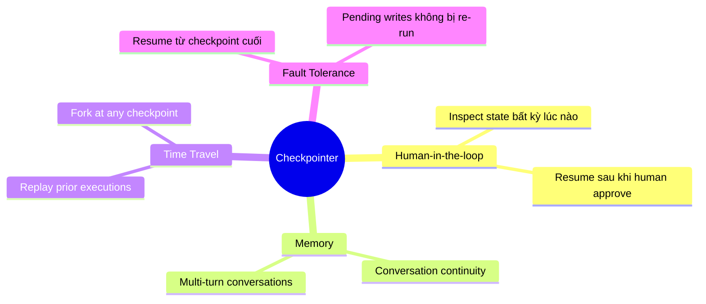
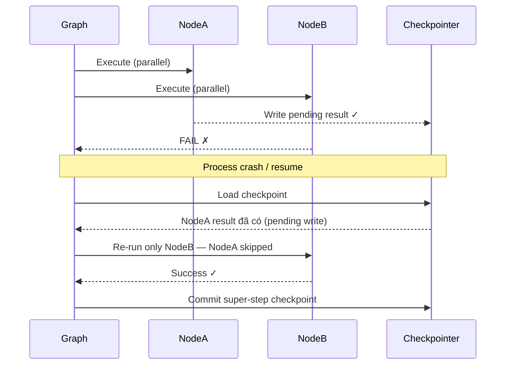

# 2.6. Checkpointing & Persistence: Lưu Trữ Trạng Thái Agent

## Agenda

**Thời gian đọc ước tính:** ~22 phút

### Learning outcome:

- Giải thích được sự khác biệt giữa **Checkpointer** (short-term) và **Store** (long-term) — và khi nào dùng từng loại.
- Cấu hình được `MemorySaver`, `SqliteSaver` vào graph và sử dụng `thread_id` đúng cách.
- Đọc được `StateSnapshot` và traverse lịch sử checkpoint bằng `getStateHistory`.
- Thực hiện được `updateState` để chỉnh sửa graph state mà không chạy lại toàn bộ graph.
- Phân biệt được 3 durability modes (`exit`, `async`, `sync`) và chọn đúng cho từng use case.

---

## Glossary & Vocabulary

**1. Technical Terms (Thuật ngữ kỹ thuật):**

| Term | Vietnamese Meaning & Quick Explain |
| :--- | :--- |
| **Checkpointer** | Công cụ lưu checkpoint — lưu snapshot của graph state tại mỗi super-step boundary. Short-term, thread-scoped. |
| **Store** | Kho lưu trữ — lưu dữ liệu application-defined ngoài graph state. Long-term, cross-thread. |
| **Checkpoint** | Điểm lưu — snapshot của graph state tại một thời điểm cụ thể, đại diện bởi `StateSnapshot` object. |
| **Thread** | Luồng — ID duy nhất gán cho mỗi chuỗi checkpoint. Giống như "session" của agent. |
| **Super-step** | Siêu bước — một "tick" của graph nơi tất cả node được schedule thực thi xong trước khi checkpoint được tạo. |
| **`StateSnapshot`** | Bản chụp trạng thái — object chứa `values`, `next`, `config`, `metadata`, `createdAt`, `tasks`. |
| **`thread_id`** | ID luồng — khóa chính để checkpointer lưu và nạp lại state của một conversation. |
| **`checkpoint_id`** | ID checkpoint — định danh checkpoint cụ thể trong một thread, dùng cho time travel. |
| **`getState`** | Lấy trạng thái — lấy checkpoint mới nhất của một thread. |
| **`getStateHistory`** | Lấy lịch sử trạng thái — lấy tất cả checkpoints của một thread, theo thứ tự thời gian ngược. |
| **`updateState`** | Cập nhật trạng thái — tạo checkpoint mới với values đã chỉnh sửa, không sửa checkpoint gốc. |
| **Pending Writes** | Ghi đang chờ — kết quả của các node thành công trong một super-step bị lỗi, được lưu để tránh re-run khi resume. |
| **Durability Mode** | Chế độ độ bền — cấu hình khi nào LangGraph persist checkpoint: `exit`, `async`, hoặc `sync`. |
| **Reducer** | Hàm rút gọn — hàm xác định cách merge value mới vào state channel (thay vì ghi đè). |

**2. Vocabulary Support (Từ vựng học thuật/B1+):**

| Word | Meaning in Context |
| :--- | :--- |
| **Durable (adj)** | Bền vững — dữ liệu tồn tại qua process crash, restart. |
| **Serializable (adj)** | Có thể tuần tự hóa — có thể chuyển đổi thành bytes để lưu vào file/DB. |
| **Traverse (v)** | Đi qua, duyệt — đi qua một chuỗi checkpoints từ mới đến cũ. |
| **Idempotent (adj)** | Bất biến lũy thừa — gọi nhiều lần cho kết quả giống gọi một lần. |
| **Namespace (n)** | Không gian tên — prefix xác định checkpoint thuộc graph nào (parent hay subgraph). |
| **Accumulated (adj)** | Tích lũy — channel dùng reducer tích lũy values thay vì ghi đè. |

---

## 1. Vấn đề & Giải pháp

**Vấn đề (Problem Statement):**

Agent trong thực tế gặp những bài toán mà một lần chạy không giải quyết được:

- **Conversational memory**: User hỏi "Thủ đô Việt Nam là gì?" rồi sau đó "Dân số ở đó bao nhiêu?" — agent cần nhớ câu trước.
- **Long-running workflows**: Pipeline phân tích dài 30 phút, server crash ở phút 25 — phải chạy lại từ đầu nếu không có checkpoint.
- **Human-in-the-loop**: Agent tạm dừng chờ human review, nhưng process có thể restart — cần lưu state để resume.
- **Debugging**: Muốn replay lại đúng tại bước nào đó để tìm lỗi, hoặc fork execution từ giữa chừng.

**Giải pháp (Solution):**

LangGraph cung cấp 2 persistence systems bổ sung nhau:

- **Checkpointers** — lưu graph state snapshot tại mỗi super-step. Thread-scoped, short-term.
- **Stores** — lưu dữ liệu key-value ngoài graph state. Cross-thread, long-term.

---

## 2. Checkpointing Là Gì?

**Định nghĩa kỹ thuật:**

> **Checkpointing** là cơ chế LangGraph tự động lưu một **snapshot** của toàn bộ graph state tại mỗi **super-step boundary**, tổ chức thành các **threads** với unique `thread_id`, cho phép resume, replay, và inspect execution tại bất kỳ điểm nào.

**Definition Anatomy — Giải phẫu định nghĩa:**

- **snapshot** (*bản chụp*): Không phải diff — là bản ghi đầy đủ toàn bộ state tại một thời điểm.
- **super-step boundary** (*ranh giới siêu bước*): Checkpoint tạo ra sau khi tất cả node trong một super-step hoàn tất, không phải sau mỗi lệnh.
- **threads** (*luồng*): Mỗi conversation/session độc lập là một thread với ID riêng — giống session trong web.

**Checkpointer là điều kiện tiên quyết cho:**




---

## 3. Checkpointers — Thiết Lập và Sử Dụng

### 3.1. MemorySaver — Phát triển và Testing

`MemorySaver` lưu state trong RAM — đủ nhanh cho development, mất dữ liệu khi process restart:

```typescript
// filename: agent/checkpointer-memory.ts

import {
  StateGraph,
  StateSchema,
  START,
  END,
  MemorySaver,
  MessagesValue,
} from "@langchain/langgraph";
import { ChatGoogleGenerativeAI } from "@langchain/google-genai";
import * as z from "zod";

const model = new ChatGoogleGenerativeAI({ model: "gemini-2.5-flash" });

const State = new StateSchema({
  messages: MessagesValue,
});

const callModel = async (state: typeof State.State) => {
  const response = await model.invoke(state.messages);
  return { messages: [response] };
};

const graph = new StateGraph(State)
  .addNode("agent", callModel)
  .addEdge(START, "agent")
  .addEdge("agent", END)
  // Compile với checkpointer để bật persistence
  .compile({ checkpointer: new MemorySaver() });

// thread_id là BẮT BUỘC khi dùng checkpointer
const config = { configurable: { thread_id: "conversation-abc" } };

// Lần 1: hỏi câu đầu tiên
const turn1 = await graph.invoke(
  { messages: [{ role: "user", content: "Thủ đô Việt Nam là gì?" }] },
  config
);

// Lần 2: cùng thread_id → agent nhớ lịch sử
// Agent biết "thủ đô" trong câu 2 là Hà Nội vì đã hỏi ở câu 1
const turn2 = await graph.invoke(
  { messages: [{ role: "user", content: "Dân số ở đó bao nhiêu?" }] },
  config
);
```

### 3.2. SqliteSaver — Local Development với Persistence

`SqliteSaver` lưu vào SQLite file — state tồn tại qua process restart:

```typescript
// filename: agent/checkpointer-sqlite.ts

// npm install @langchain/langgraph-checkpoint-sqlite
import { SqliteSaver } from "@langchain/langgraph-checkpoint-sqlite";
import {
  StateGraph,
  StateSchema,
  START,
  END,
  MessagesValue,
} from "@langchain/langgraph";
import { ChatGoogleGenerativeAI } from "@langchain/google-genai";
import * as z from "zod";

const model = new ChatGoogleGenerativeAI({ model: "gemini-2.5-flash" });

// File-based storage — tồn tại qua restart
const checkpointer = SqliteSaver.fromConnString("./agent_state.db");

const State = new StateSchema({ messages: MessagesValue });

const graph = new StateGraph(State)
  .addNode("agent", async (state) => ({
    messages: [await model.invoke(state.messages)],
  }))
  .addEdge(START, "agent")
  .addEdge("agent", END)
  .compile({ checkpointer });

// State được lưu vào agent_state.db — restart process vẫn nhớ
const config = { configurable: { thread_id: "persistent-thread-1" } };
```

### 3.3. Checkpointer Libraries

| Library | Class | Phù hợp |
| :--- | :--- | :--- |
| `@langchain/langgraph` (built-in) | `MemorySaver` | Development, testing |
| `@langchain/langgraph-checkpoint-sqlite` | `SqliteSaver` | Local workflows, prototyping |
| `@langchain/langgraph-checkpoint-postgres` | `PostgresSaver` | Production, scalable |
| `@langchain/langgraph-checkpoint-mongodb` | `MongoDBSaver` | Production + vector store |
| `@langchain/langgraph-checkpoint-redis` | `RedisSaver` | Production, high throughput |

---

## 4. StateSnapshot — Đọc Và Phân Tích Checkpoint

### 4.1. `getState` — Lấy Checkpoint Mới Nhất

```typescript
// filename: agent/read-state.ts

// Lấy state mới nhất của thread
const config = { configurable: { thread_id: "conversation-abc" } };
const latest = await graph.getState(config);

// StateSnapshot structure:
console.log(latest.values);       // { messages: [...] } — state tại checkpoint này
console.log(latest.next);         // [] — empty = graph hoàn tất; có tên = chưa xong
console.log(latest.metadata);     // { source, writes, step }
console.log(latest.createdAt);    // ISO 8601 timestamp

// Lấy state tại một checkpoint cụ thể (time travel)
const configWithCheckpoint = {
  configurable: {
    thread_id: "conversation-abc",
    checkpoint_id: "1ef663ba-28fe-6528-8002-5a559208592c",
  },
};
const historical = await graph.getState(configWithCheckpoint);
```

**StateSnapshot fields:**

| Field | Type | Mô tả |
| :--- | :--- | :--- |
| `values` | `object` | State channel values tại checkpoint này. |
| `next` | `string[]` | Node sẽ chạy tiếp. `[]` = graph hoàn tất. |
| `config` | `object` | `thread_id`, `checkpoint_ns`, `checkpoint_id`. |
| `metadata.source` | `string` | `"input"`, `"loop"`, hoặc `"update"`. |
| `metadata.writes` | `object` | Node outputs tạo ra checkpoint này. |
| `metadata.step` | `number` | Super-step counter (tăng dần). |
| `createdAt` | `string` | ISO 8601 timestamp. |
| `parentConfig` | `object \| null` | Config của checkpoint trước. `null` cho checkpoint đầu tiên. |
| `tasks` | `PregelTask[]` | Tasks tại bước này (có `interrupts` nếu bị interrupt). |

### 4.2. `getStateHistory` — Duyệt Toàn Bộ Lịch Sử

```typescript
// filename: agent/read-history.ts

const config = { configurable: { thread_id: "conversation-abc" } };

// Lấy TẤT CẢ checkpoints — mới nhất trước, cũ nhất sau
const allCheckpoints: any[] = [];
for await (const snapshot of graph.getStateHistory(config)) {
  allCheckpoints.push(snapshot);
  console.log(`Step ${snapshot.metadata.step}: next=[${snapshot.next}]`);
}

// Tìm checkpoint trước khi "reviewNode" chạy
const beforeReview = allCheckpoints.find((s) =>
  s.next.includes("reviewNode")
);

// Tìm checkpoint tại step cụ thể
const step2 = allCheckpoints.find((s) => s.metadata.step === 2);

// Tìm tất cả checkpoints được tạo bởi updateState (source = "update")
const manualUpdates = allCheckpoints.filter(
  (s) => s.metadata.source === "update"
);

// Tìm checkpoint nơi interrupt xảy ra
const interrupted = allCheckpoints.find(
  (s) => s.tasks.some((t: any) => t.interrupts?.length > 0)
);
```


### 4.3. `updateState` — Chỉnh Sửa State Mà Không Chạy Lại Graph

`updateState` tạo checkpoint mới với values đã chỉnh sửa — không modify checkpoint gốc:

```typescript
// filename: agent/update-state.ts

import { MemorySaver, StateGraph, StateSchema, START, END, MessagesValue } from "@langchain/langgraph";
import { HumanMessage } from "@langchain/core/messages";

const State = new StateSchema({ messages: MessagesValue });

const graph = new StateGraph(State)
  .addNode("agent", async (state) => ({ messages: [] }))
  .addEdge(START, "agent")
  .addEdge("agent", END)
  .compile({ checkpointer: new MemorySaver() });

const config = { configurable: { thread_id: "edit-thread" } };
await graph.invoke(
  { messages: [{ role: "user", content: "Hello" }] },
  config
);

// Chỉnh sửa state: thêm message vào history mà không chạy lại graph
await graph.updateState(config, {
  messages: [new HumanMessage("This is a manually injected message")],
});

// asNode: update này được coi là từ node nào → ảnh hưởng đến node nào chạy tiếp
await graph.updateState(
  config,
  { messages: [new HumanMessage("Inject as if from agent")] },
  "agent" // asNode
);
```


---

## 5. Checkpointer vs Store — Phân Biệt Hai Loại Persistence

```mermaid
graph LR
    subgraph ShortTerm["Short-term (Thread-scoped)"]
        CP["Checkpointer\nGraph State Snapshots\n- messages\n- auth status\n- tool results"]
    end

    subgraph LongTerm["Long-term (Cross-thread)"]
        ST["Store\nApplication-defined Data\n- user preferences\n- learned facts\n- historical insights"]
    end

    T1["Thread 1\n(Session A)"] --> CP
    T2["Thread 2\n(Session B)"] --> CP
    T1 --> ST
    T2 --> ST

    style ShortTerm fill:#1e3a5f,stroke:#3b82f6
    style LongTerm fill:#3b0764,stroke:#9333ea
```



| | Checkpointer | Store |
| :--- | :--- | :--- |
| **Lưu gì** | Graph state snapshots | Application-defined key-value data |
| **Scope** | Một thread duy nhất | Cross-thread |
| **Memory type** | Short-term, thread-scoped | Long-term, cross-thread |
| **Dùng cho** | Conversation continuity, HITL, time travel, fault tolerance | User preferences, facts, shared knowledge |
| **Access** | `thread_id` trong graph config | `store.get()` / `store.put()` trong nodes |

```typescript
// filename: agent/both-persistence.ts

import {
  MemorySaver,
  MemoryStore,
  StateGraph,
  StateSchema,
  MessagesValue,
  START,
  END,
} from "@langchain/langgraph";
import { ChatGoogleGenerativeAI } from "@langchain/google-genai";

const model = new ChatGoogleGenerativeAI({ model: "gemini-2.5-flash" });
const State = new StateSchema({ messages: MessagesValue });

// Dùng cả hai: checkpointer (short-term) + store (long-term)
const graph = new StateGraph(State)
  .addNode("agent", async (state) => ({
    messages: [await model.invoke(state.messages)],
  }))
  .addEdge(START, "agent")
  .addEdge("agent", END)
  .compile({
    checkpointer: new MemorySaver(), // lưu conversation state per thread
    store: new MemoryStore(),        // lưu cross-thread user data
  });
```

---

## 6. Durability Modes — Cân Bằng Hiệu Năng và An Toàn

LangGraph hỗ trợ 3 chế độ durability (*độ bền*):

```typescript
// filename: agent/durability-modes.ts

// Mode "exit" — chỉ persist khi graph exit (thành công, lỗi, hoặc interrupt)
// Performance cao nhất — không lưu intermediate state
await graph.stream(
  { messages: [{ role: "user", content: "Hello" }] },
  { configurable: { thread_id: "t1" }, durability: "exit" }
);

// Mode "async" — persist bất đồng bộ trong khi bước tiếp theo chạy
// Cân bằng giữa performance và durability — rủi ro nhỏ khi crash
await graph.stream(
  { messages: [{ role: "user", content: "Hello" }] },
  { configurable: { thread_id: "t2" }, durability: "async" }
);

// Mode "sync" — persist đồng bộ TRƯỚC khi bước tiếp chạy
// Durability cao nhất — mọi checkpoint đều được ghi trước khi tiếp tục
await graph.stream(
  { messages: [{ role: "user", content: "Hello" }] },
  { configurable: { thread_id: "t3" }, durability: "sync" }
);
```

| Mode | Khi nào persist | Performance | Durability | Dùng khi |
| :--- | :--- | :--- | :--- | :--- |
| `"exit"` | Khi graph kết thúc | Tốt nhất | Thấp nhất | Short runs, không cần mid-run recovery |
| `"async"` | Bất đồng bộ trong khi bước sau chạy | Tốt | Trung bình | Cân bằng mặc định cho hầu hết use cases |
| `"sync"` | Đồng bộ trước mỗi bước | Chậm nhất | Cao nhất | Critical workflows, không thể mất bất kỳ step nào |

---

## 7. Replay — Chạy Lại Từ Checkpoint Cụ Thể

Replay (*chạy lại*) re-execute các node từ một checkpoint cũ — node trước checkpoint bị skip:

```typescript
// filename: agent/replay.ts

// Lấy lịch sử
const config = { configurable: { thread_id: "replay-thread" } };
const history: any[] = [];
for await (const snap of graph.getStateHistory(config)) {
  history.push(snap);
}

// Tìm checkpoint trước khi "generateReport" chạy
const beforeReport = history.find((s) => s.next.includes("generateReport"));

if (beforeReport) {
  // Replay từ checkpoint này — các node trước đó không re-run
  // Chỉ "generateReport" và các node sau mới chạy lại
  const replayResult = await graph.invoke(null, beforeReport.config);
  console.log("Replay result:", replayResult);
}
```


**Lưu ý:** Replay re-execute LLM calls và interrupts — không phải chỉ load saved state.

---

## 8. Super-steps và Pending Writes

Khi một node trong super-step fail, các node thành công trong cùng super-step đó không bị re-run khi resume:



---

## Discussion Questions

1. **thread_id và multi-tenancy:** Nếu hai user khác nhau vô tình dùng cùng `thread_id`, họ sẽ chia sẻ conversation history. Làm thế nào bạn thiết kế naming convention cho `thread_id` trong hệ thống multi-tenant? (Gợi ý: `userId:sessionId`)

2. **Checkpointer vs Store — ranh giới mờ:** User hỏi "Nhớ tên tôi là Tú nhé" — thông tin này nên lưu vào Checkpointer hay Store? Nếu user mở session mới, agent có nhớ tên không? Đây là design decision ảnh hưởng đến UX như thế nào?

3. **Durability mode trong streaming UI:** Nếu bạn xây chat UI realtime và dùng `"exit"` mode, điều gì xảy ra nếu server crash khi đang stream response? User nhìn thấy gì? Bạn cần mode nào để đảm bảo user không mất context?

4. **Super-step boundaries và parallelism:** Khi 3 node chạy song song trong cùng super-step và 1 node fail, LangGraph không re-run 2 node thành công. Nhưng nếu 2 node đó đã ghi vào external database (side effects), bạn handle thế nào khi resume? Đây là vấn đề gì?

---

## References

- [LangGraph — Checkpointers](https://docs.langchain.com/oss/javascript/langgraph/checkpointers) — **Nguồn chính** — Threads, Super-steps, StateSnapshot, Get/Update State, Durability.
- [LangGraph — Persistence](https://docs.langchain.com/oss/javascript/langgraph/persistence) — Overview về Checkpointer vs Store.
- [LangGraph — Time Travel](https://docs.langchain.com/oss/javascript/langgraph/use-time-travel) — Replay và fork execution patterns.
- [LangGraph — Add Memory](https://docs.langchain.com/oss/javascript/langgraph/add-memory) — Thêm conversation memory vào agent.

---

*Made by Anh Tu - Share to be share*
