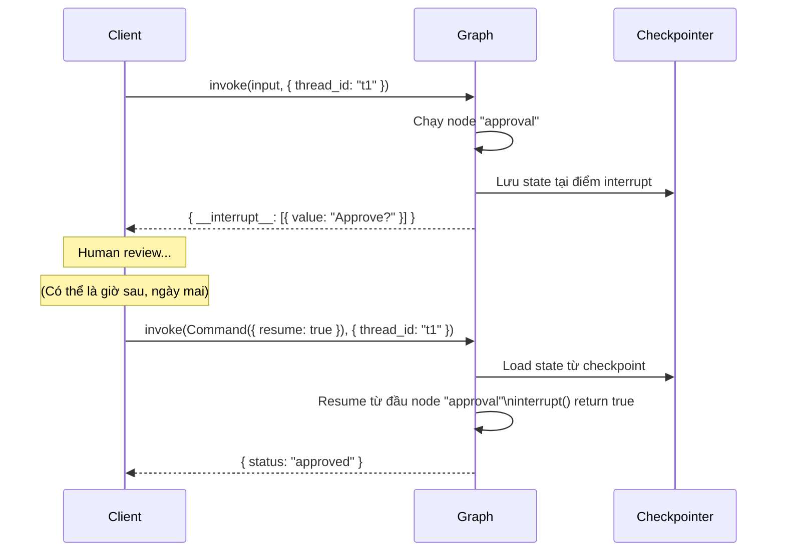

# 2.7. Interrupts: Human-in-the-Loop

## Agenda

**Thời gian đọc ước tính:** ~25 phút

### Learning outcome:

- Giải thích được cơ chế hoạt động của `interrupt()` — làm thế nào nó dừng graph và resume sau đó.
- Implement được 4 pattern phổ biến: Approve/Reject, Review & Edit State, Interrupt trong Tool, Validating Input.
- Nắm được 4 Rules of Interrupts — tránh các lỗi runtime khó debug.
- Phân biệt được Dynamic Interrupts (`interrupt()`) và Static Breakpoints (`interruptBefore`/`interruptAfter`).
- Xử lý được Multiple Parallel Interrupts bằng cách map interrupt ID với resume value.

---

## Glossary & Vocabulary

**1. Technical Terms (Thuật ngữ kỹ thuật):**

| Term | Vietnamese Meaning & Quick Explain |
| :--- | :--- |
| **Human-in-the-Loop (HITL)** | Con người trong vòng lặp — pattern để human review và approve/edit trước khi agent tiếp tục. |
| **`interrupt()`** | Hàm ngắt — gọi từ bên trong node để dừng graph execution và trả payload về caller. |
| **`Command({ resume })`** | Lệnh tiếp tục — object truyền vào `graph.invoke()` để resume graph với value cho `interrupt()`. |
| **`__interrupt__`** | Trường ngắt — key trong kết quả trả về chứa danh sách interrupt payloads. |
| **Dynamic Interrupt** | Ngắt động — `interrupt()` đặt trong code, có thể conditional dựa trên logic. |
| **Static Breakpoint** | Điểm dừng tĩnh — `interruptBefore`/`interruptAfter` khai báo tại compile time, luôn luôn dừng. |
| **Idempotent** | Bất biến lũy thừa — code trước `interrupt()` chạy lại khi resume → phải viết idempotent. |
| **Approval Gate** | Cổng phê duyệt — node chờ human approve trước khi thực thi action nguy hiểm. |
| **Resume Value** | Giá trị tiếp tục — value truyền qua `Command({ resume: ... })`, trở thành return value của `interrupt()`. |
| **`isInterrupted()`** | Hàm kiểm tra — check xem kết quả invoke có bị interrupt không. |
| **`INTERRUPT`** | Symbol đặc biệt — key trong result chứa mảng interrupt objects với `id` và `value`. |

**2. Vocabulary Support (Từ vựng học thuật/B1+):**

| Word | Meaning in Context |
| :--- | :--- |
| **Suspend (v)** | Tạm dừng — graph suspend execution tại điểm `interrupt()`. |
| **Payload (n)** | Dữ liệu đính kèm — value bạn pass vào `interrupt()` để hiển thị cho human. |
| **Indefinitely (adv)** | Vô thời hạn — graph wait indefinitely cho đến khi có resume value. |
| **Propagate (v)** | Lan truyền, nổi lên — exception propagate through call stack. |
| **Deterministic (adj)** | Tất định — cùng input luôn cho cùng output/behavior. |

---

## 1. Vấn đề & Giải pháp

**Vấn đề (Problem Statement):**

Agent có thể thực hiện những action nguy hiểm mà không cần confirmation:

- Transfer tiền ngân hàng mà không cần approval từ người dùng.
- Gửi email marketing đến toàn bộ danh sách khách hàng mà không qua review.
- Xóa records trong database production dựa trên LLM output.
- LLM generate nội dung sai → publish thẳng mà không qua editor review.

Một khi action đã thực hiện, rollback thường tốn kém hoặc bất khả thi.

**Giải pháp (Solution):**

`interrupt()` cho phép đặt "checkpoint chờ người" tại bất kỳ điểm nào trong code. Graph dừng lại, lưu state, và chờ vô thời hạn cho đến khi nhận được response — dù phải restart process.

---

## 2. `interrupt()` Là Gì?

**Định nghĩa kỹ thuật:**

> **`interrupt()`** là hàm LangGraph cho phép dừng graph execution tại bất kỳ điểm nào trong node, lưu toàn bộ graph state vào checkpointer, và trả về một **payload** cho caller — sau đó chờ vô thời hạn cho đến khi caller re-invoke graph với `Command({ resume: value })`.

**Definition Anatomy — Giải phẫu định nghĩa:**

- **tại bất kỳ điểm nào** (*anywhere in code*): Không giới hạn ở node boundary — có thể đặt giữa node, trong loop, trong conditional.
- **lưu toàn bộ graph state** (*saves graph state*): Tại đây checkpointer phát huy vai trò — interrupt không hoạt động nếu không có checkpointer.
- **chờ vô thời hạn** (*waits indefinitely*): Graph không có deadline — human có thể review 5 phút hay 5 ngày cũng được.

**Luồng interrupt-resume:**



---

## 3. Pattern 1 — Approve or Reject

Pattern phổ biến nhất: dừng trước action nguy hiểm và chờ quyết định:

```typescript
// filename: agent/hitl-approve-reject.ts

import {
  Command,
  MemorySaver,
  START,
  END,
  StateGraph,
  StateSchema,
  interrupt,
} from "@langchain/langgraph";
import * as z from "zod";

const State = new StateSchema({
  actionDetails: z.string(),
  status: z.enum(["pending", "approved", "rejected"]).nullable(),
});

const graphBuilder = new StateGraph(State)
  .addNode(
    "approval",
    async (state) => {
      // Truyền payload đủ thông tin để human quyết định
      const decision = interrupt({
        question: "Approve this action?",
        details: state.actionDetails,
      });

      // decision là return value từ Command({ resume: ... })
      // true → route sang "proceed", false → route sang "cancel"
      return new Command({ goto: decision ? "proceed" : "cancel" });
    },
    { ends: ["proceed", "cancel"] } // Khai báo tường minh các node có thể goto
  )
  .addNode("proceed", () => ({ status: "approved" }))
  .addNode("cancel", () => ({ status: "rejected" }))
  .addEdge(START, "approval")
  .addEdge("proceed", END)
  .addEdge("cancel", END);

const checkpointer = new MemorySaver();
const graph = graphBuilder.compile({ checkpointer });

const config = { configurable: { thread_id: "approval-123" } };

// Bước 1: Invoke → graph dừng tại interrupt
const initial = await graph.invoke(
  { actionDetails: "Transfer $500 to account #4242", status: "pending" },
  config
);
console.log(initial.__interrupt__);
// [{ value: { question: "Approve this action?", details: "Transfer $500..." } }]

// Bước 2: Human quyết định → resume graph
// Approve:
const approved = await graph.invoke(new Command({ resume: true }), config);
console.log(approved.status); // "approved"

// Hoặc Reject:
// const rejected = await graph.invoke(new Command({ resume: false }), config);
```

---

## 4. Pattern 2 — Review & Edit State

Human không chỉ approve/reject — còn có thể chỉnh sửa nội dung trước khi tiếp tục:

```typescript
// filename: agent/hitl-review-edit.ts

import {
  Command,
  MemorySaver,
  START,
  END,
  StateGraph,
  StateSchema,
  interrupt,
} from "@langchain/langgraph";
import { ChatGoogleGenerativeAI } from "@langchain/google-genai";
import * as z from "zod";

const model = new ChatGoogleGenerativeAI({ model: "gemini-2.5-flash" });

const State = new StateSchema({
  topic: z.string(),
  generatedText: z.string(),
});

const builder = new StateGraph(State)
  .addNode("generate", async (state) => {
    const response = await model.invoke([
      { role: "user", content: `Write a blog post about: ${state.topic}` },
    ]);
    return { generatedText: response.content as string };
  })
  .addNode("review", async (state) => {
    // Pause và hiện nội dung cho editor review
    // Editor có thể trả về text đã chỉnh sửa
    const editedContent = interrupt({
      instruction: "Review and edit this content before publishing",
      content: state.generatedText,
    });

    // editedContent là gì editor trả về — có thể là text sửa hoặc unchanged
    return { generatedText: editedContent as string };
  })
  .addNode("publish", async (state) => {
    console.log("Publishing:", state.generatedText.substring(0, 50) + "...");
    return state;
  })
  .addEdge(START, "generate")
  .addEdge("generate", "review")
  .addEdge("review", "publish")
  .addEdge("publish", END);

const graph = builder.compile({ checkpointer: new MemorySaver() });
const config = { configurable: { thread_id: "review-42" } };

// Bước 1: Invoke → LLM generate → graph dừng tại "review"
const initial = await graph.invoke({ topic: "AI Agents", generatedText: "" }, config);
console.log(initial.__interrupt__);
// [{ value: { instruction: "...", content: "Generated text..." } }]

// Bước 2: Editor trả về bản đã sửa
const finalState = await graph.invoke(
  new Command({ resume: "Improved and fact-checked version of the blog post..." }),
  config
);
// "review" node return editedContent → graph tiếp tục sang "publish"
```

---

## 5. Pattern 3 — Interrupt Trong Tool

Đặt `interrupt()` bên trong tool — approval logic đi cùng tool, reusable:

```typescript
// filename: agent/tools/send-email-with-approval.ts

import { tool } from "@langchain/core/tools";
import { ChatGoogleGenerativeAI } from "@langchain/google-genai";
import {
  Command,
  MemorySaver,
  START,
  END,
  StateGraph,
  StateSchema,
  MessagesValue,
  type GraphNode,
  interrupt,
} from "@langchain/langgraph";
import * as z from "zod";

// Tool có interrupt built-in — pause mỗi khi LLM gọi tool này
const sendEmailTool = tool(
  async ({ to, subject, body }) => {
    // Pause: show email preview cho user approve
    const response = interrupt({
      action: "send_email",
      to,
      subject,
      body,
      message: "Approve sending this email?",
    });

    if (response?.action === "approve") {
      // Resume value có thể override inputs — editor sửa subject
      const finalTo = (response as any).to ?? to;
      const finalSubject = (response as any).subject ?? subject;
      const finalBody = (response as any).body ?? body;
      return `Email sent to ${finalTo} with subject: "${finalSubject}"`;
    }
    return "Email cancelled by user";
  },
  {
    name: "send_email",
    description: "Send an email — requires human approval before sending",
    schema: z.object({
      to: z.string().describe("Recipient email address"),
      subject: z.string().describe("Email subject"),
      body: z.string().describe("Email body content"),
    }),
  }
);

const model = new ChatGoogleGenerativeAI({
  model: "gemini-2.5-flash",
}).bindTools([sendEmailTool]);

const State = new StateSchema({ messages: MessagesValue });

const agent: GraphNode<typeof State> = async (state) => {
  const response = await model.invoke(state.messages);
  return { messages: [response] };
};

const graphBuilder = new StateGraph(State)
  .addNode("agent", agent)
  .addEdge(START, "agent")
  .addEdge("agent", END);

const graph = graphBuilder.compile({ checkpointer: new MemorySaver() });
const config = { configurable: { thread_id: "email-workflow" } };

// Bước 1: User yêu cầu gửi email → LLM gọi sendEmailTool → interrupt
const initial = await graph.invoke(
  {
    messages: [
      { role: "user", content: "Send an email to alice@example.com about the Q1 report" },
    ],
  },
  config
);
console.log(initial.__interrupt__);
// [{ value: { action: "send_email", to: "alice@...", subject: "...", body: "..." } }]

// Bước 2: User approve (với subject được sửa)
const resumed = await graph.invoke(
  new Command({
    resume: { action: "approve", subject: "Q1 Report — Updated for Review" },
  }),
  config
);
console.log(resumed.messages.at(-1)); // Tool result: "Email sent to alice@example.com..."
```

---

## 6. Pattern 4 — Validating Human Input

Dùng `interrupt()` trong loop để validate input và hỏi lại khi không hợp lệ:

```typescript
// filename: agent/hitl-validate-input.ts

import {
  Command,
  MemorySaver,
  START,
  END,
  StateGraph,
  StateSchema,
  interrupt,
} from "@langchain/langgraph";
import * as z from "zod";

const State = new StateSchema({
  age: z.number().nullable(),
});

const builder = new StateGraph(State)
  .addNode("collectAge", (state) => {
    let prompt = "What is your age?";

    // Loop interrupt: hỏi lại cho đến khi nhận được input hợp lệ
    while (true) {
      const answer = interrupt(prompt);

      // Validate: phải là số nguyên dương
      if (typeof answer === "number" && answer > 0 && Number.isInteger(answer)) {
        return { age: answer }; // Valid → exit loop và continue graph
      }

      // Invalid → cập nhật prompt với thông báo lỗi cụ thể, interrupt lại
      prompt = `'${answer}' is not a valid age. Please enter a positive whole number.`;
    }
  })
  .addEdge(START, "collectAge")
  .addEdge("collectAge", END);

const graph = builder.compile({ checkpointer: new MemorySaver() });
const config = { configurable: { thread_id: "form-1" } };

// Lần 1: Hỏi lần đầu
const first = await graph.invoke({ age: null }, config);
console.log(first.__interrupt__); // [{ value: "What is your age?" }]

// Lần 2: Nhập sai → hỏi lại
const retry = await graph.invoke(new Command({ resume: "thirty" }), config);
console.log(retry.__interrupt__); // [{ value: "'thirty' is not a valid age..." }]

// Lần 3: Nhập đúng → graph hoàn tất
const final = await graph.invoke(new Command({ resume: 25 }), config);
console.log(final.age); // 25
```

---

## 7. Handling Multiple Parallel Interrupts

Khi nhiều node parallel cùng gọi `interrupt()`, phải map interrupt ID với resume value:

```typescript
// filename: agent/hitl-parallel-interrupts.ts

import {
  Annotation,
  Command,
  END,
  INTERRUPT,
  MemorySaver,
  START,
  StateGraph,
  interrupt,
  isInterrupted,
} from "@langchain/langgraph";

const State = Annotation.Root({
  vals: Annotation<string[]>({
    reducer: (left, right) => left.concat(Array.isArray(right) ? right : [right]),
    default: () => [],
  }),
});

function nodeA(_state: typeof State.State) {
  const answer = interrupt("question_a") as string;
  return { vals: [`a:${answer}`] };
}

function nodeB(_state: typeof State.State) {
  const answer = interrupt("question_b") as string;
  return { vals: [`b:${answer}`] };
}

const graph = new StateGraph(State)
  .addNode("a", nodeA)
  .addNode("b", nodeB)
  .addEdge(START, "a")
  .addEdge(START, "b") // a và b chạy song song
  .addEdge("a", END)
  .addEdge("b", END)
  .compile({ checkpointer: new MemorySaver() });

const config = { configurable: { thread_id: "parallel-1" } };

// Bước 1: cả hai node parallel đều interrupt
const result = await graph.invoke({ vals: [] }, config);
// result.__interrupt__ = [
//   { id: "uuid-a", value: "question_a" },
//   { id: "uuid-b", value: "question_b" }
// ]

// Bước 2: Resume tất cả interrupts trong một lần — map theo ID
const resumeMap: Record<string, string> = {};
if (isInterrupted(result)) {
  for (const i of result[INTERRUPT]) {
    if (i.id != null) {
      resumeMap[i.id] = `answer for ${i.value}`;
    }
  }
}

const final = await graph.invoke(new Command({ resume: resumeMap }), config);
// final.vals = ["a:answer for question_a", "b:answer for question_b"]
```

---

## 8. Stream với HITL — Xử Lý Interrupt Trong Streaming

Pattern để build chat UI với interrupt detection:

```typescript
// filename: agent/hitl-streaming.ts

import { Command } from "@langchain/langgraph";

let streamInput: Record<string, unknown> | Command = {
  messages: [{ role: "user", content: "Send approval email to the team" }],
};

// Loop stream cho đến khi không còn interrupt nào
while (true) {
  const stream = await graph.streamEvents(streamInput, {
    ...config,
    version: "v3",
  });

  // Stream LLM tokens ra UI
  for await (const message of stream.messages) {
    for await (const token of message.text) {
      process.stdout.write(token);
    }
  }

  // Sau khi stream kết thúc, kiểm tra interrupt
  if (!stream.interrupted) {
    // Graph hoàn tất — không còn interrupt
    const finalState = await stream.output;
    console.log("\nGraph completed:", finalState);
    break;
  }

  // Có interrupt — đọc payload và chờ user input
  const interruptInfo = stream.interrupts[0].value;
  console.log("\nInterrupt:", interruptInfo);

  // Giả lập user input (trong thực tế đây là UI input)
  const userResponse = await getUserDecision(interruptInfo);
  streamInput = new Command({ resume: userResponse });
}

async function getUserDecision(info: unknown): Promise<unknown> {
  // In real app: show to UI and wait for user
  return { action: "approve" };
}
```

---

## 9. 4 Rules of Interrupts — Không Được Vi Phạm

### Rule 1: Không bọc `interrupt()` trong try/catch

`interrupt()` hoạt động bằng cách **throw một exception đặc biệt**. Nếu bị catch → interrupt bị nuốt, graph không dừng:

```typescript
// filename: agent/rules/rule-1.ts

// SAI — catch nuốt interrupt exception
async function badNode(state: State) {
  try {
    const answer = interrupt("What is your name?"); // Exception bị catch!
  } catch (err) {
    console.error(err); // GraphInterrupt bị xử lý sai
  }
}

// ĐÚNG — tách code có thể lỗi ra khỏi interrupt
async function goodNode(state: State) {
  // Xử lý logic có thể lỗi riêng
  let processedData: string;
  try {
    processedData = await fetchData();
  } catch (err) {
    processedData = "default";
  }

  // interrupt() KHÔNG nằm trong try/catch
  const approval = interrupt({ data: processedData });
  return { approved: approval };
}
```

### Rule 2: Không thay đổi thứ tự `interrupt()` calls

LangGraph match resume values theo **index** — thứ tự thay đổi → resume value bị gán sai interrupt:

```typescript
// ĐÚNG — thứ tự nhất quán mọi lần node chạy
async function goodMultiInterrupt(state: State) {
  const name = interrupt("What is your name?");   // index 0
  const age = interrupt("What is your age?");     // index 1
  const city = interrupt("What is your city?");   // index 2
  return { name, age, city };
}

// SAI — interrupt thứ 2 biến mất trong điều kiện → mismatch khi resume
async function badConditional(state: State) {
  const name = interrupt("What is your name?");
  if (name.length > 5) {
    const age = interrupt("What is your age?"); // Không chạy khi name ngắn!
  }
  const city = interrupt("What is your city?"); // city giờ là index 1 (hoặc 2) tùy điều kiện
}
```

### Rule 3: Chỉ pass JSON-serializable values

Checkpointer cần serialize interrupt payload → không dùng functions, class instances:

```typescript
// SAI
interrupt({ callback: () => console.log("hi") }); // Function không serializable

// ĐÚNG
interrupt({
  question: "Approve?",
  details: { amount: 500, currency: "USD" }, // Plain objects và primitives
});
```

### Rule 4: Side effects trước `interrupt()` phải idempotent

Node restart từ đầu khi resume → code trước `interrupt()` chạy lại:

```typescript
// SAI — API call chạy lại mỗi lần resume
async function badSideEffect(state: State) {
  await createDatabaseRecord(state.data); // Chạy lần 1: tạo record
  const approval = interrupt("Approve?");
  // Resume: createDatabaseRecord chạy LẠI → duplicate record!
}

// ĐÚNG — side effect sau interrupt
async function goodSideEffect(state: State) {
  const approval = interrupt("Approve?"); // Dừng ở đây
  // Resume từ đây → code dưới chỉ chạy một lần
  if (approval) {
    await createDatabaseRecord(state.data);
  }
}

// ĐÚNG — hoặc dùng idempotent operation
async function idempotentSideEffect(state: State) {
  await upsertDatabaseRecord(state.data); // upsert = idempotent
  const approval = interrupt("Approve?");
}
```

---

## 10. Static Breakpoints — Debug Tool

Static breakpoints dừng graph trước hoặc sau node cụ thể — dùng cho testing và debug:

```typescript
// filename: agent/static-breakpoints.ts

// Compile-time breakpoints — luôn dừng ở những node này
const graph = builder.compile({
  interruptBefore: ["dangerousAction"], // Dừng TRƯỚC khi node này chạy
  interruptAfter: ["generateContent"],  // Dừng SAU khi node này chạy
  checkpointer: new MemorySaver(),
});

// Runtime breakpoints — linh hoạt hơn
const config = {
  configurable: { thread_id: "debug-session" },
};

// Step through từng node một
let result = await graph.invoke(inputs, {
  ...config,
  interruptBefore: ["node_a"],
});
// Inspect state tại đây...
result = await graph.invoke(null, config); // Resume đến breakpoint tiếp
result = await graph.invoke(null, config); // Resume tiếp...
```


**Dynamic vs Static Interrupts:**

| | Dynamic (`interrupt()`) | Static Breakpoints |
| :--- | :--- | :--- |
| **Đặt ở đâu** | Bất kỳ đâu trong code | Compile/run time configuration |
| **Điều kiện** | Có thể conditional | Luôn dừng ở node đó |
| **Mục đích** | HITL workflows trong production | Testing, debugging |
| **Payload** | Custom object | None — dừng trước/sau node |

---

## Discussion Questions

1. **Node restart và idempotency:** Khi graph resume, node chứa `interrupt()` **restart từ đầu**. Nếu node đó có 10 dòng code trước `interrupt()`, tất cả đều chạy lại. Làm thế nào bạn thiết kế node để tất cả side effects là idempotent? Có trade-off nào giữa idempotency và performance không?

2. **Multiple interrupts và UX:** Nếu agent có 3 `interrupt()` calls trong một node (name, age, city), user phải invoke graph 3 lần để complete workflow. Đây có phải UX tốt không? Khi nào nên tách thành 3 `interrupt()` riêng biệt, khi nào nên gộp thành một `interrupt()` nhận object?

3. **Interrupt trong distributed system:** User gửi request, graph interrupt và lưu checkpoint vào PostgreSQL. 30 phút sau user resume từ một server instance khác. Đây có hoạt động không? Điều gì cần được đảm bảo ở infrastructure level?

4. **`interrupt()` và security:** Nếu interrupt payload chứa sensitive data (email content, PII), data này được lưu vào checkpointer. Từ góc độ security, bạn cần cân nhắc gì khi thiết kế hệ thống HITL?

---

## References

- [LangGraph — Interrupts](https://docs.langchain.com/oss/javascript/langgraph/interrupts) — **Nguồn chính** — interrupt(), resume, patterns, Rules of Interrupts.
- [LangGraph — Checkpointers](https://docs.langchain.com/oss/javascript/langgraph/checkpointers) — Persistence layer cần thiết cho interrupts.
- [LangChain — Human-in-the-Loop Middleware](https://docs.langchain.com/oss/javascript/langchain/guardrails#human-in-the-loop) — HITL thông qua middleware (alternative approach).
- [LangSmith Studio](https://docs.langchain.com/langsmith/studio) — Visual debugger với static breakpoints.

---

*Made by Anh Tu - Share to be share*
