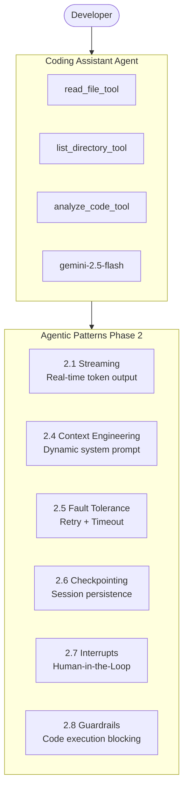

# 2.9. Project: Coding Assistant — Capstone Phase 2

## Agenda

**Thời gian đọc ước tính:** ~30 phút

### Learning outcome:

- Tích hợp được toàn bộ Agentic Patterns từ Phase 2 vào một agent hoàn chỉnh.
- Xây dựng được file system tools với fault tolerance (retry + timeout).
- Implement được streaming output để hiển thị phân tích code real-time.
- Áp dụng được Context Engineering để inject project context vào từng analysis.
- Sử dụng được Checkpointing để tiếp tục session phân tích sau khi dừng.
- Thêm được Guardrails để ngăn agent thực thi code nguy hiểm.

---

## Glossary & Vocabulary

**1. Technical Terms (Thuật ngữ kỹ thuật):**

| Term | Vietnamese Meaning & Quick Explain |
|:---|:---|
| **Coding Assistant** | Trợ lý lập trình — agent hiểu code, phát hiện lỗi, gợi ý cải thiện, giải thích pattern. |
| **Static Analysis** | Phân tích tĩnh — phân tích code mà không chạy nó. Phát hiện lỗi syntax, style, potential bugs. |
| **File System Tool** | Tool hệ thống file — tool cho phép agent đọc, liệt kê, và tương tác với files trên disk. |
| **Code Review** | Đánh giá code — quy trình kiểm tra chất lượng code trước khi merge vào codebase. |
| **Refactoring** | Tái cấu trúc — cải thiện cấu trúc code mà không thay đổi behavior bên ngoài. |
| **Security Audit** | Kiểm tra bảo mật — tìm kiếm vulnerabilities (lỗ hổng bảo mật) trong code. |
| **`MessagesValue`** | Channel tích hợp — reducer tự động append messages thay vì ghi đè toàn bộ list. |
| **Path Traversal** | Tấn công vượt path — user dùng `../` để đọc file ngoài phạm vi cho phép. |

**2. Vocabulary Support (Từ vựng học thuật/B1+):**

| Word | Meaning in Context |
|:---|:---|
| **Vulnerability (n)** | Lỗ hổng bảo mật — điểm yếu trong code có thể bị khai thác. |
| **Idiomatic (adj)** | Đặc trưng ngôn ngữ — code được viết theo cách tự nhiên nhất của một ngôn ngữ. |
| **Scaffold (v)** | Dựng khung — tạo cấu trúc cơ bản cho project. |
| **Deterministic (adj)** | Tất định — cùng input luôn cho cùng output. |
| **Sanitize (v)** | Làm sạch, vô hiệu hóa — loại bỏ nội dung nguy hiểm trước khi xử lý. |

---

## 1. Kiến Trúc Tổng Quan

Coding Assistant là capstone tích hợp toàn bộ kiến thức Phase 2:



**Tech stack:**

| Component | Technology | Lý do |
|:---|:---|:---|
| **LLM** | `gemini-2.5-flash` | Fast, cost-effective, hiểu nhiều ngôn ngữ |
| **Framework** | `@langchain/langgraph` | StateGraph, streaming, checkpointing |
| **Persistence** | `MemorySaver` (dev) | Conversation history trong session |
| **File I/O** | Node.js `fs/promises` | Đọc file an toàn với async/await |
| **Guardrails** | Custom `beforeAgent` hook | Block code execution requests |

---

## 2. Tools — File System Access

### 2.1. `read_file_tool` — Đọc Nội Dung File

```typescript
// filename: coding-assistant/tools/read-file.ts

import { tool } from "@langchain/core/tools";
import { z } from "zod";
import { promises as fs } from "fs";
import { resolve, extname } from "path";

// Chỉ đọc source code — không đọc binary hay sensitive files
const ALLOWED_EXTENSIONS = new Set([
  ".ts", ".tsx", ".js", ".jsx",
  ".py", ".go", ".java", ".rs", ".cpp",
  ".json", ".yaml", ".yml", ".toml",
  ".md", ".txt", ".css", ".html", ".sql",
]);

export const readFileTool = tool(
  async ({ filePath, startLine, endLine }) => {
    const resolved = resolve(filePath);

    // Security: chặn path traversal — chỉ đọc trong project directory
    if (!resolved.startsWith(process.cwd())) {
      return "Error: Access denied — can only read files within the project directory.";
    }

    const ext = extname(resolved).toLowerCase();
    if (!ALLOWED_EXTENSIONS.has(ext)) {
      return `Error: File type '${ext}' is not allowed for reading.`;
    }

    const content = await fs.readFile(resolved, "utf-8");
    const lines = content.split("\n");
    const totalLines = lines.length;

    // Giới hạn 100 dòng mỗi lần để tránh token overflow
    const start = startLine ?? 1;
    const end = endLine ?? Math.min(totalLines, start + 100);

    const selectedLines = lines
      .slice(start - 1, end)
      .map((line, i) => `${start + i}: ${line}`)
      .join("\n");

    return `File: ${filePath} (lines ${start}-${end} of ${totalLines})\n\`\`\`${ext.slice(1)}\n${selectedLines}\n\`\`\``;
  },
  {
    name: "read_file",
    description: `Read the contents of a source code file.
Use this to examine code before analyzing or suggesting fixes.
Specify startLine/endLine to read a specific range (max 100 lines per call).`,
    schema: z.object({
      filePath: z.string().describe("Relative path from project root"),
      startLine: z.number().optional().describe("Starting line (1-indexed)"),
      endLine: z.number().optional().describe("Ending line (inclusive)"),
    }),
  }
);
```

### 2.2. `list_directory_tool` — Khám Phá Cấu Trúc Project

```typescript
// filename: coding-assistant/tools/list-directory.ts

import { tool } from "@langchain/core/tools";
import { z } from "zod";
import { promises as fs } from "fs";
import { resolve, join, relative } from "path";

const IGNORED_DIRS = new Set([
  "node_modules", ".git", ".next", "dist", "build",
  ".cache", "coverage", "__pycache__",
]);

export const listDirectoryTool = tool(
  async ({ dirPath, maxDepth = 2 }) => {
    const resolved = resolve(dirPath);

    if (!resolved.startsWith(process.cwd())) {
      return "Error: Access denied.";
    }

    const tree: string[] = [];

    async function walk(dir: string, depth: number, prefix: string) {
      if (depth > maxDepth) return;

      const entries = await fs.readdir(dir, { withFileTypes: true });
      const sorted = entries.sort((a, b) => {
        if (a.isDirectory() && !b.isDirectory()) return -1;
        if (!a.isDirectory() && b.isDirectory()) return 1;
        return a.name.localeCompare(b.name);
      });

      for (let i = 0; i < sorted.length; i++) {
        const entry = sorted[i];
        if (IGNORED_DIRS.has(entry.name)) continue;

        const isLast = i === sorted.length - 1;
        const connector = isLast ? "└── " : "├── ";
        const childPrefix = isLast ? "    " : "│   ";

        tree.push(
          `${prefix}${connector}${entry.name}${entry.isDirectory() ? "/" : ""}`
        );

        if (entry.isDirectory()) {
          await walk(join(dir, entry.name), depth + 1, prefix + childPrefix);
        }
      }
    }

    tree.push(relative(process.cwd(), resolved) || ".");
    await walk(resolved, 1, "");
    return tree.join("\n");
  },
  {
    name: "list_directory",
    description: `List the directory structure of a folder.
Use this first to understand the project layout before reading specific files.
Automatically ignores node_modules, .git, build artifacts.`,
    schema: z.object({
      dirPath: z.string().describe("Directory path (relative to project root)"),
      maxDepth: z.number().optional().describe("Max traversal depth (default: 2)"),
    }),
  }
);
```

### 2.3. `analyze_code_tool` — Chuẩn Bị Analysis Request

```typescript
// filename: coding-assistant/tools/analyze-code.ts

import { tool } from "@langchain/core/tools";
import { z } from "zod";

export const analyzeCodeTool = tool(
  async ({ code, language, analysisType }) => {
    const prompts: Record<string, string> = {
      bugs: "Identify potential bugs, null pointer issues, race conditions, and logic errors.",
      security: "Find security vulnerabilities: injection, XSS, insecure dependencies, hardcoded secrets.",
      performance: "Identify bottlenecks: unnecessary loops, memory leaks, N+1 queries.",
      style: "Check style: naming conventions, code duplication, function length, complexity.",
      all: "Comprehensive analysis: bugs, security, performance, and style.",
    };

    return `Analysis Request:
Language: ${language}
Focus: ${prompts[analysisType] || prompts.all}

Code to analyze:
\`\`\`${language}
${code}
\`\`\`

Please provide:
1. Issues found (severity: critical/warning/info)
2. Specific line references
3. Concrete fix suggestions with code examples`;
  },
  {
    name: "analyze_code",
    description: "Prepare a structured analysis request for a code snippet.",
    schema: z.object({
      code: z.string().describe("The code snippet to analyze"),
      language: z.string().describe("Programming language"),
      analysisType: z
        .enum(["bugs", "security", "performance", "style", "all"])
        .describe("Type of analysis to perform"),
    }),
  }
);
```

---

## 3. Guardrail — Ngăn Thực Thi Code

```typescript
// filename: coding-assistant/middleware/code-safety.ts

import { createMiddleware, AIMessage } from "langchain";

// Coding assistant chỉ phân tích — không được phép thực thi code
export const codeExecutionBlocker = () =>
  createMiddleware({
    name: "CodeExecutionBlocker",
    beforeAgent: {
      hook: (state) => {
        if (!state.messages?.length) return;

        const lastMessage = state.messages[state.messages.length - 1];
        if (lastMessage._getType() !== "human") return;

        const content = lastMessage.content.toString();

        // Pattern phát hiện yêu cầu thực thi
        const executionPatterns = [
          /\brun\b.*\bcode\b/i,
          /\bexecute\b.*\bscript\b/i,
          /\bshell\b.*\bcommand\b/i,
          /rm\s+-rf/i,
          /sudo\s/i,
        ];

        const requestsExecution = executionPatterns.some((p) => p.test(content));

        if (requestsExecution) {
          return {
            messages: [
              new AIMessage(
                "I can analyze and review code, but I cannot execute code directly. " +
                "Please run the code in your terminal and share the output for debugging."
              ),
            ],
            jumpTo: "end",
          };
        }

        return;
      },
      canJumpTo: ["end"],
    },
  });
```

---

## 4. Graph — Kết Hợp Tất Cả

```typescript
// filename: coding-assistant/agent.ts

import {
  StateGraph,
  StateSchema,
  START,
  END,
  MemorySaver,
  MessagesValue,
  ToolNode,
} from "@langchain/langgraph";
import { ChatGoogleGenerativeAI } from "@langchain/google-genai";
import * as z from "zod";
import { readFileTool } from "./tools/read-file";
import { listDirectoryTool } from "./tools/list-directory";
import { analyzeCodeTool } from "./tools/analyze-code";

const tools = [readFileTool, listDirectoryTool, analyzeCodeTool];

// Dynamic system prompt: adapt theo conversation length
const buildSystemPrompt = (messageCount: number): string => {
  let prompt = `You are an expert Coding Assistant specialized in TypeScript/JavaScript.

Your capabilities:
- Read and analyze source code files using provided tools
- Identify bugs, security vulnerabilities, performance issues, and style problems
- Suggest concrete, actionable fixes with code examples
- Explain complex patterns in simple terms for junior developers

Your constraints:
- Do NOT execute code or run shell commands
- Only read files within the project directory
- Always reference specific line numbers in your analysis
- Provide fixes in the same language as the analyzed code`;

  // Context Engineering: ngắn gọn hơn khi conversation dài (token budget)
  if (messageCount > 10) {
    prompt += "\n\nNote: Be concise. Reference prior findings when relevant.";
  }

  return prompt;
};

const baseModel = new ChatGoogleGenerativeAI({
  model: "gemini-2.5-flash",
  temperature: 0.1, // Thấp — cần chính xác cho code analysis
});

const State = new StateSchema({ messages: MessagesValue });

// Node: inject dynamic system prompt + gọi LLM
const callModel = async (state: typeof State.State) => {
  const systemPrompt = buildSystemPrompt(state.messages.length);
  const model = baseModel.bindTools(tools);

  const response = await model.invoke([
    { role: "system", content: systemPrompt },
    ...state.messages,
  ]);
  return { messages: [response] };
};

// Node: thực thi tools
const toolNode = new ToolNode(tools);

// Routing: có tool_calls → tiếp tục; không → kết thúc
const shouldContinue = (state: typeof State.State) => {
  const lastMessage = state.messages[state.messages.length - 1];
  if ("tool_calls" in lastMessage && (lastMessage as any).tool_calls?.length > 0) {
    return "tools";
  }
  return END;
};

const builder = new StateGraph(State)
  .addNode("agent", callModel, {
    // Fault Tolerance: LLM call có retry với backoff
    retryPolicy: { maxAttempts: 3, initialInterval: 1000 },
    timeout: { idleTimeout: 30_000 }, // Dừng nếu LLM không stream trong 30s
  })
  .addNode("tools", toolNode, {
    // File I/O retry — không retry nếu permission denied
    retryPolicy: {
      maxAttempts: 2,
      retryOn: (error: unknown) => {
        if (error instanceof Error && error.message.includes("EACCES")) return false;
        return true;
      },
    },
    timeout: { runTimeout: 10_000 }, // File read không quá 10 giây
  })
  .addEdge(START, "agent")
  .addConditionalEdges("agent", shouldContinue)
  .addEdge("tools", "agent");

// Checkpointing: lưu conversation history
const checkpointer = new MemorySaver();

export const codingAssistant = builder.compile({ checkpointer });
```

---

## 5. Streaming CLI Interface

```typescript
// filename: coding-assistant/cli.ts

import { codingAssistant } from "./agent";
import * as readline from "readline";

const rl = readline.createInterface({ input: process.stdin, output: process.stdout });
const question = (p: string): Promise<string> => new Promise((r) => rl.question(p, r));

async function main() {
  console.log("=== Coding Assistant (gemini-2.5-flash) ===");
  console.log("Commands: 'exit' quit | 'new' new session | 'session' show ID\n");

  let sessionId = `session-${Date.now()}`;
  console.log(`Session: ${sessionId}\n`);

  while (true) {
    const input = await question("You: ");
    const trimmed = input.trim();

    if (trimmed === "exit") break;
    if (trimmed === "new") {
      sessionId = `session-${Date.now()}`;
      console.log(`\nNew session: ${sessionId}\n`);
      continue;
    }
    if (trimmed === "session") {
      console.log(`Current session: ${sessionId}\n`);
      continue;
    }

    const config = { configurable: { thread_id: sessionId } };

    process.stdout.write("\nAssistant: ");

    // Streaming: in từng token khi LLM generate
    for await (const [chunk, metadata] of await codingAssistant.stream(
      { messages: [{ role: "user", content: trimmed }] },
      { ...config, streamMode: "messages" }
    )) {
      // Chỉ print text chunks từ agent node (không print tool calls)
      if (
        chunk.content &&
        typeof chunk.content === "string" &&
        metadata.langgraph_node === "agent" &&
        !("tool_calls" in chunk)
      ) {
        process.stdout.write(chunk.content);
      }
    }

    console.log("\n");
  }

  rl.close();
}

main().catch(console.error);
```

---

## 6. Demo Session — Ví Dụ Sử Dụng

```
=== Coding Assistant (gemini-2.5-flash) ===
Session: session-1719446400000

You: list the structure of ./src
