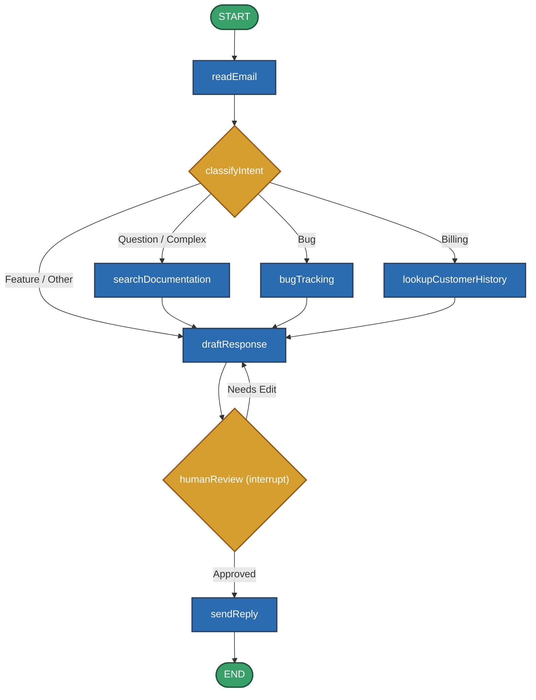
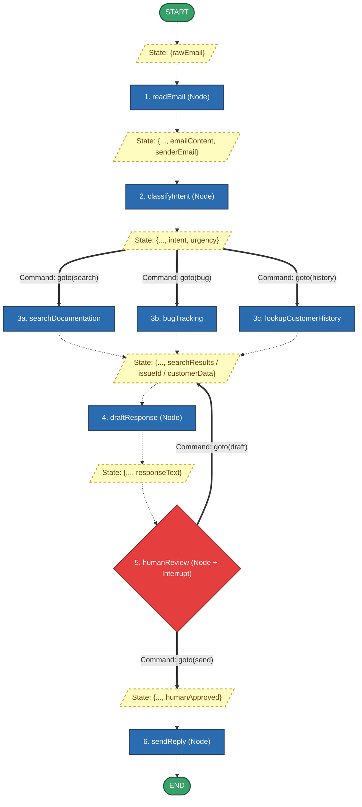
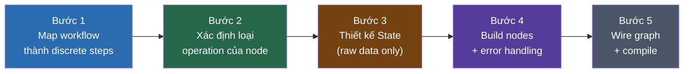

# Đọc thêm: Thinking in LangGraph

> **Nguồn:** Dịch và chú thích từ tài liệu chính thức [Thinking in LangGraph](https://docs.langchain.com/oss/javascript/langgraph/thinking-in-langgraph)

Khi xây dựng agent với LangGraph, bạn sẽ:

1. Chia bài toán thành các bước rời rạc — gọi là **nodes**.
2. Mô tả các quyết định và luồng chuyển tiếp giữa các nodes — gọi là **edges**.
3. Kết nối chúng qua một **state** dùng chung mà mọi node đều có thể đọc và ghi.

---

## Bài toán ví dụ: Agent xử lý email khách hàng

Giả sử bạn nhận được yêu cầu từ product team:

```
Agent phải:
- Đọc email đến từ khách hàng
- Phân loại theo mức độ khẩn cấp và chủ đề
- Tìm kiếm tài liệu liên quan để trả lời câu hỏi
- Soạn thảo phản hồi phù hợp
- Chuyển lên human agent nếu vấn đề phức tạp
- Lên lịch follow-up khi cần thiết

Các tình huống cần xử lý:
1. Câu hỏi đơn giản: "Làm sao reset mật khẩu?"
2. Bug report: "Tính năng export bị crash khi chọn PDF"
3. Vấn đề billing: "Tôi bị charge 2 lần!"
4. Feature request: "Cho tôi xin dark mode"
5. Vấn đề kỹ thuật phức tạp: "API tích hợp của chúng tôi bị lỗi 504 không liên tục"
```

---

## Bước 1: Map out your workflow as discrete steps

Bắt đầu bằng cách xác định các bước rời rạc trong quy trình. Mỗi bước sẽ trở thành một **node** (một function làm một việc cụ thể). Sau đó phác thảo cách các bước kết nối với nhau.

Các nodes cần có:

- `readEmail` — Trích xuất và parse nội dung email.
- `classifyIntent` — Dùng LLM phân loại mức độ khẩn cấp và chủ đề, sau đó route đến action phù hợp.
- `searchDocumentation` — Query knowledge base để tìm thông tin liên quan.
- `lookupCustomerHistory` — Lấy thông tin lịch sử của khách hàng (dành cho vấn đề billing/account).
- `bugTracking` — Tạo hoặc cập nhật issue trong hệ thống tracking.
- `draftResponse` — Sinh ra phản hồi phù hợp.
- `humanReview` — Chuyển lên human agent để phê duyệt hoặc xử lý trực tiếp.
- `sendReply` — Gửi email phản hồi.

<div className="row">
<div className="col col--6">

**Flowchart (Agent Architecture):**



</div>
<div className="col col--6">

**Execution Graph (State Transfer):**



</div>
</div>

> **💡 Note - Giải phẫu Execution Graph:** 
> - **State Mutation:** `State` (khối màu vàng) không bao giờ bị xóa đi mà chỉ được "nhồi thêm" dữ liệu. Các đường nét đứt đại diện cho việc truyền State vào Node.
> - **Dynamic Routing:** Các mũi tên nét đôi (`===`) đại diện cho việc Node tự động định tuyến rẽ nhánh (Decision) bằng cách trả về `Command`, thay vì dùng Conditional Edge cứng nhắc từ bên ngoài.
> - **Interrupt:** `humanReview` là một trạm dừng chân. State được lưu an toàn xuống Checkpointer và luồng sẽ tạm ngưng tại đây cho đến khi có can thiệp của con người.

---

## Bước 2: Xác định loại operation của từng node

Với mỗi node, xác định nó thuộc loại nào để biết cách xử lý lỗi phù hợp:

**LLM steps** — Khi bước cần hiểu, phân tích, sinh text, hoặc ra quyết định:
- `classifyIntent`, `draftResponse`

**Data steps** — Khi bước cần lấy thông tin từ nguồn bên ngoài:
- `searchDocumentation`, `lookupCustomerHistory`

**Action steps** — Khi bước cần thực hiện hành động có side-effect:
- `sendReply`, `bugTracking`

**User input steps** — Khi bước cần sự can thiệp của con người:
- `humanReview`

---

## Bước 3: Thiết kế State

State là bộ nhớ dùng chung (*shared memory*) mà tất cả nodes đều có thể truy cập. Hãy nghĩ về nó như "cuốn sổ tay" mà agent dùng để ghi nhớ mọi thứ đã học và đã quyết định trong quá trình xử lý.

**Câu hỏi để xác định dữ liệu nào cần vào State:**

- Có node nào sau này cần dữ liệu này không?
- Dữ liệu này có tốn kém để tính toán lại không?
- Có thể tái tạo lại từ thông tin khác không?

Với email agent, cần track:

- Email gốc và thông tin người gửi (không thể tái tạo).
- Kết quả phân loại (nhiều node downstream cần dùng).
- Search results và customer data (tốn kém để re-fetch).
- Nội dung phản hồi đã soạn (cần persist qua bước review).

**Nguyên tắc quan trọng: Keep state raw, format prompts on-demand.**

```typescript
// filename: agent/state.ts

import { StateSchema } from "@langchain/langgraph";
import * as z from "zod";

const EmailClassificationSchema = z.object({
  intent: z.enum(["question", "bug", "billing", "feature", "complex"]),
  urgency: z.enum(["low", "medium", "high", "critical"]),
  topic: z.string(),
  summary: z.string(),
});

// State chỉ chứa raw data — không có prompt template, không có formatted string
// Mỗi node sẽ tự format dữ liệu theo nhu cầu của mình
const EmailAgentState = new StateSchema({
  emailContent: z.string(),
  senderEmail: z.string(),
  emailId: z.string(),

  classification: EmailClassificationSchema.optional(),

  // Raw results — lưu thẳng từ API, không pre-format
  searchResults: z.array(z.string()).optional(),
  customerHistory: z.record(z.string(), z.any()).optional(),

  responseText: z.string().optional(),
});

type EmailClassificationType = z.infer<typeof EmailClassificationSchema>;
```

Lý do tách biệt này:

- Mỗi node có thể format cùng một dữ liệu theo cách khác nhau cho nhu cầu riêng của nó.
- Thay đổi prompt template không ảnh hưởng đến State schema.
- Debug rõ ràng hơn — bạn thấy chính xác data gì đi vào từng node.
- Agent có thể phát triển mà không phá vỡ state hiện có.

---

## Bước 4: Build nodes với xử lý lỗi phù hợp

Node trong LangGraph là một JavaScript function nhận state hiện tại và trả về updates. Điểm khác biệt cốt lõi: **mỗi loại lỗi cần chiến lược xử lý khác nhau**.

### Transient errors — Tự động retry

Network issues, rate limits: thêm retry policy vào node.

```typescript
// filename: agent/graph.ts

import type { RetryPolicy } from "@langchain/langgraph";

// retryPolicy tự động retry khi gặp lỗi mạng hoặc rate limit
// Không cần viết retry logic thủ công trong code của node
workflow.addNode(
  "searchDocumentation",
  searchDocumentation,
  {
    retryPolicy: { maxAttempts: 3, initialInterval: 1.0 },
  },
);
```

### LLM-recoverable errors — Cho LLM thấy lỗi và tự điều chỉnh

Khi tool fail hoặc parse lỗi: lưu error vào state và loop về LLM để nó thử lại.

```typescript
// filename: agent/nodes/execute-tool.ts

import { Command, type GraphNode } from "@langchain/langgraph";

const executeTool: GraphNode<typeof EmailAgentState> = async (state) => {
  try {
    const result = await runTool(state.toolCall);
    return new Command({
      update: { toolResult: result },
      goto: "agent",
    });
  } catch (error) {
    // LLM sẽ đọc được error message này và biết cần thử approach khác
    return new Command({
      update: { toolResult: `Tool error: ${error}` },
      goto: "agent",
    });
  }
};
```

### User-fixable errors — Dừng chờ human input

Khi thiếu thông tin (account ID, order number, clarification): dùng `interrupt()`.

```typescript
// filename: agent/nodes/lookup-customer.ts

import { Command, type GraphNode, interrupt } from "@langchain/langgraph";

const lookupCustomerHistory: GraphNode<typeof EmailAgentState> = async (state) => {
  if (!state.customerId) {
    // Graph dừng tại đây, state được lưu vào checkpointer
    // Có thể resume sau nhiều ngày — đúng từ điểm này
    const userInput = interrupt({
      message: "Customer ID needed",
      request: "Please provide the customer's account ID to look up their subscription history",
    });
    return new Command({
      update: { customerId: userInput.customerId },
      goto: "lookupCustomerHistory", // quay lại node này sau khi có thông tin
    });
  }

  const customerData = await fetchCustomerHistory(state.customerId);
  return new Command({
    update: { customerHistory: customerData },
    goto: "draftResponse",
  });
};
```

### Unexpected errors — Để bubble up

Lỗi không biết cách xử lý: đừng catch, để nó nổi lên để developer debug.

```typescript
// filename: agent/nodes/send-reply.ts

import { type GraphNode } from "@langchain/langgraph";

const sendReply: GraphNode<typeof EmailAgentState> = async (state) => {
  try {
    await emailService.send(state.responseText);
  } catch (error) {
    // Đừng catch những gì bạn không biết cách fix
    throw error;
  }
};
```

---

## Bước 5: Wire it together

Kết nối nodes thành graph hoàn chỉnh. Vì routing đã nằm trong `Command` bên trong từng node, phần wire chỉ cần khai báo những edges cố định.

Để `interrupt()` hoạt động, cần compile với **checkpointer** để lưu state giữa các lần chạy.

```typescript
// filename: agent/graph.ts

import { MemorySaver } from "@langchain/langgraph";

const workflow = new StateGraph(EmailAgentState)
  .addNode("readEmail", readEmail)
  .addNode("classifyIntent", classifyIntent)
  .addNode("searchDocumentation", searchDocumentation, {
    retryPolicy: { maxAttempts: 3 },
  })
  .addNode("bugTracking", bugTracking)
  .addNode("draftResponse", draftResponse)
  .addNode("humanReview", humanReview)
  .addNode("sendReply", sendReply)
  // Chỉ khai báo edges cố định — routing động nằm trong Command
  .addEdge(START, "readEmail")
  .addEdge("readEmail", "classifyIntent")
  .addEdge("sendReply", END);

const memory = new MemorySaver();
const app = workflow.compile({ checkpointer: memory });
```

**Chạy thử và resume sau interrupt:**

```typescript
// filename: agent/run.ts

import { Command } from "@langchain/langgraph";

const initialState = {
  emailContent: "I was charged twice for my subscription! This is urgent!",
  senderEmail: "customer@example.com",
  emailId: "email_123",
};

// thread_id giúp nhóm toàn bộ state của một conversation lại với nhau
const config = { configurable: { thread_id: "customer_123" } };
const result = await app.invoke(initialState, config);
// Graph dừng tại humanReview, state được lưu vào MemorySaver
console.log(`Draft ready for review: ${result.responseText?.substring(0, 100)}...`);

// Human phê duyệt — resume với cùng thread_id
const humanResponse = new Command({
  resume: {
    approved: true,
    editedResponse: "We sincerely apologize for the double charge. I've initiated an immediate refund...",
  },
});

const finalResult = await app.invoke(humanResponse, config);
console.log("Email sent successfully!");
```

Graph dừng khi gặp `interrupt()`, lưu toàn bộ state vào checkpointer và chờ. Có thể resume sau nhiều ngày, tiếp tục chính xác từ điểm đã dừng. `thread_id` đảm bảo tất cả state của conversation này được group lại.

---

## Điểm quan trọng: Node Granularity

**Tại sao tách `readEmail` và `classifyIntent` thành 2 node riêng, không gộp lại?**

LangGraph tạo checkpoint tại ranh giới node. Khi workflow resume sau gián đoạn hoặc failure, nó bắt đầu từ **đầu node** nơi execution bị dừng. Node nhỏ hơn = checkpoint thường xuyên hơn = ít phải làm lại hơn khi có lỗi.

Nếu gộp 2 operation vào 1 node lớn, failure ở cuối node buộc phải re-execute toàn bộ — kể cả phần đã thành công.

**Bốn lý do cụ thể để tách node:**

1. **Isolation của external services**: `searchDocumentation` và `bugTracking` gọi external API — tách riêng giúp apply retry policy độc lập mà không ảnh hưởng đến LLM calls.
2. **Intermediate visibility**: `classifyIntent` là node độc lập → inspect được quyết định của LLM trước khi bất kỳ action nào xảy ra. Giá trị cao cho debugging và monitoring.
3. **Different failure modes**: LLM call, database query, email sending có failure pattern khác nhau → cần retry strategy khác nhau.
4. **Reusability & testing**: Node nhỏ dễ unit test hơn và có thể reuse trong graph khác.

**Lưu ý về performance**: Node nhiều không có nghĩa là chậm hơn. LangGraph mặc định dùng **async durability mode** — checkpoints được ghi vào background, graph tiếp tục chạy mà không cần đợi checkpoint hoàn tất.

---

## Tổng kết 5 bước



---

## References

- [LangChain — Thinking in LangGraph](https://docs.langchain.com/oss/javascript/langgraph/thinking-in-langgraph) — Nguồn gốc bài dịch
- [LangGraph — Persistence](https://docs.langchain.com/oss/javascript/langgraph/persistence) — Checkpointer và durability modes
- [LangGraph — Interrupts](https://docs.langchain.com/oss/javascript/langgraph/interrupts) — `interrupt()` và resume pattern
- [LangGraph — Fault Tolerance](https://docs.langchain.com/oss/javascript/langgraph/fault-tolerance) — RetryPolicy và error strategies

---

*Made by Anh Tu - Share to be share*
