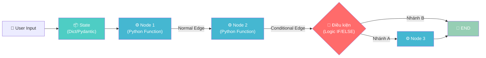
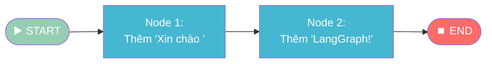
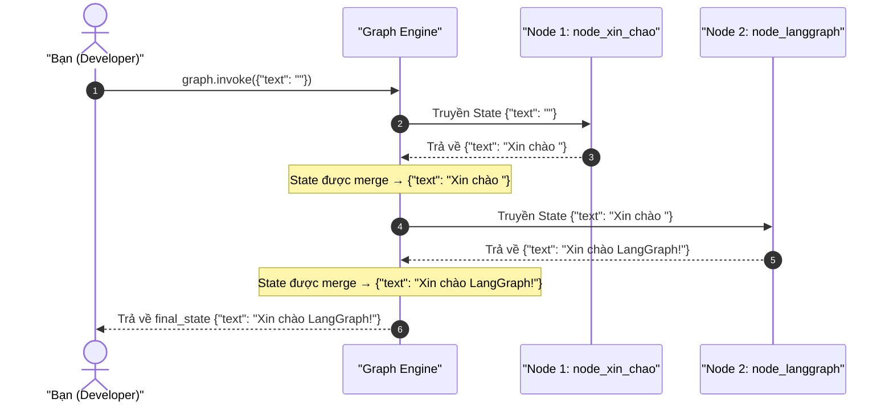
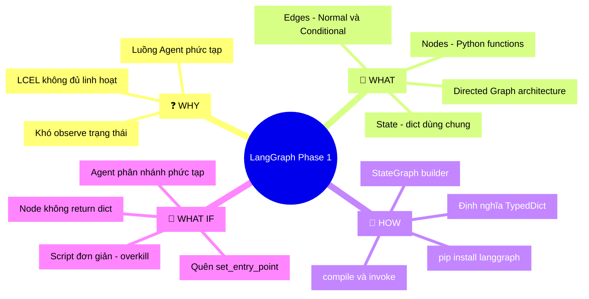

# Giai đoạn 1: Hiểu bản chất LangGraph & Bắt đầu nhanh

## 📋 Agenda

**Thời gian đọc ước tính:** ~15 phút

### Sau bài này, bạn sẽ:
- ✅ **Giải thích** được tại sao LangGraph lại dùng "Đồ thị" (Graph) thay vì chuỗi lệnh tuần tự
- ✅ **Phân biệt** được 3 thành phần cốt lõi: **State**, **Nodes**, và **Edges**
- ✅ **Tự tay code** được một "Hello World" Graph hoàn chỉnh từ đầu (không cần LLM)
- ✅ **Quan sát** được cách luồng dữ liệu di chuyển qua từng Node

### Yêu cầu đầu vào (Prerequisites):
- 🔹 Biết Python cơ bản (function, dict, type hint)
- 🔹 Đã cài Python 3.10+ và `pip`

---

## ❓ Vấn đề & Giải pháp

**Vấn đề (Problem Statement):**
- Khi xây dựng AI Agent phức tạp, code bằng `if/else` thuần hoặc chuỗi LangChain LCEL trở nên khó kiểm soát: bước nào chạy, bước nào bị skip, luồng đi đâu — không rõ ràng.
- Agent cần ra quyết định phân nhánh động (ví dụ: "có cần gọi Tool không?") — chuỗi tuần tự không đủ linh hoạt để mô hình hóa điều này.
- Debug và quan sát trạng thái của Agent giữa chừng gần như không khả thi với LangChain thuần.

**Giải pháp (Solution):**
LangGraph mô hình hóa Agent dưới dạng **Directed Graph** (Đồ thị có hướng). Mỗi bước xử lý là một **Node**, quyết định rẽ nhánh là một **Edge**, và dữ liệu được chia sẻ qua một **State** duy nhất. Cách tiếp cận này giúp luồng thực thi **tường minh, có thể quan sát và kiểm soát được** ở từng điểm.

---

## 📖 3 Concept Cốt Lõi

### Kiến trúc tổng quan



### 1. State — "Cục dữ liệu dùng chung"

**Định nghĩa:** State là một `TypedDict` (hoặc Pydantic model) chứa toàn bộ dữ liệu của Graph tại một thời điểm. Nó được truyền vào mỗi Node, Node đọc rồi trả về phần cập nhật.

```python
from typing import TypedDict

# State chỉ là một TypedDict bình thường
class MyState(TypedDict):
    text: str
    count: int
```

> 💡 **Quy tắc vàng:** Mỗi Node **không nhận** tham số riêng lẻ. Nó chỉ nhận **toàn bộ State** và trả về **dict chứa phần thay đổi** — LangGraph sẽ tự merge.

### 2. Nodes — "Các công nhân trong dây chuyền"

**Định nghĩa:** Node là một Python function nhận `state: MyState` làm đầu vào và trả về `dict` chứa các key cần cập nhật.

```python
# ✅ Đúng: Nhận state, trả về dict chứa phần cập nhật
def node_them_xin_chao(state: MyState) -> dict:
    # Đọc giá trị cũ từ state
    text_cu = state["text"]
    return {"text": "Xin chào " + text_cu}
```

### 3. Edges — "Đường ray quyết định hướng đi"

Có 2 loại Edge:

| Loại | Khi nào dùng | Ví dụ |
|------|-------------|-------|
| **Normal Edge** | Luồng cố định A → B | Sau khi xử lý xong, luôn đến bước tiếp theo |
| **Conditional Edge** | Rẽ nhánh dựa trên logic | "Nếu LLM cần Tool thì gọi Tool, không thì kết thúc" |

```python
# Normal Edge: luôn đi thẳng
graph.add_edge("node_1", "node_2")

# Conditional Edge: gọi hàm router để quyết định
def router(state: MyState) -> str:
    if "cần Search" in state["text"]:
        return "node_search"   # Tên Node sẽ chạy tiếp
    return "END"

graph.add_conditional_edges("node_llm", router)
```

---

## 🔨 Thực hành: "Hello World" Graph

> **Mục tiêu:** Viết một Graph đơn giản bằng Python tĩnh, **không gọi LLM** — để thấy rõ luồng dữ liệu di chuyển qua từng Node như thế nào.

### Luồng của ứng dụng



### Cài đặt thư viện

```bash
pip install langgraph
```

### Code đầy đủ

```python
# filename: hello_langgraph.py
from typing import TypedDict
from langgraph.graph import StateGraph, END

# ─── 1. ĐỊNH NGHĨA STATE ────────────────────────────────────────────────────
# State chỉ có một trường duy nhất. Đủ đơn giản để tập trung vào luồng.
class HelloState(TypedDict):
    text: str

# ─── 2. ĐỊNH NGHĨA NODES ────────────────────────────────────────────────────
def node_xin_chao(state: HelloState) -> dict:
    # WHY return dict thay vì HelloState?
    # LangGraph dùng kỹ thuật "partial update" — chỉ merge phần thay đổi,
    # giúp State không bị ghi đè toàn bộ khi Node chỉ sửa 1 trường.
    current_text = state["text"]
    print(f"[Node 1] Nhận: '{current_text}'")
    return {"text": "Xin chào " + current_text}

def node_langgraph(state: HelloState) -> dict:
    current_text = state["text"]
    print(f"[Node 2] Nhận: '{current_text}'")
    return {"text": current_text + "LangGraph!"}

# ─── 3. XÂY DỰNG GRAPH ─────────────────────────────────────────────────────
builder = StateGraph(HelloState)

# Thêm các Node vào Graph
builder.add_node("node_xin_chao", node_xin_chao)
builder.add_node("node_langgraph", node_langgraph)

# Khai báo điểm bắt đầu
builder.set_entry_point("node_xin_chao")

# Thêm Normal Edge: Sau node_xin_chao → chạy node_langgraph
builder.add_edge("node_xin_chao", "node_langgraph")

# Khai báo điểm kết thúc
builder.add_edge("node_langgraph", END)

# Biên dịch Graph thành đối tượng có thể thực thi
graph = builder.compile()

# ─── 4. CHẠY GRAPH ──────────────────────────────────────────────────────────
print("=" * 40)
initial_state = {"text": ""}
final_state = graph.invoke(initial_state)

print("=" * 40)
print(f"Kết quả cuối cùng: '{final_state['text']}'")
```

### Output mong đợi

```
========================================
[Node 1] Nhận: ''
[Node 2] Nhận: 'Xin chào '
========================================
Kết quả cuối cùng: 'Xin chào LangGraph!'
```

### Giải thích luồng thực thi



---

## 🚀 WHAT IF — Mở rộng & Trade-off

### Khi nào LangGraph phát huy sức mạnh?

| ✅ NÊN dùng | ❌ KHÔNG nên dùng |
|-------------|------------------|
| Agent cần ra quyết định phân nhánh phức tạp | Script xử lý tuần tự đơn giản, không phân nhánh |
| Cần quan sát (observe) từng bước trung gian | Prototype thử nghiệm nhanh, ưu tiên tốc độ code |
| Cần dừng giữa chừng (Human-in-the-Loop) | Team chưa quen lý thuyết Graph |
| Multi-agent với nhiều Agent phối hợp | Overhead không xứng với độ phức tạp của bài toán |

### ⚠️ Pitfalls hay gặp với Người Mới

**1. Node trả về `None` thay vì `dict`**

```python
# ❌ Sai: Không có return → LangGraph sẽ báo lỗi hoặc State không cập nhật
def bad_node(state: HelloState):
    state["text"] = "Xin chào"  # Sửa trực tiếp — KHÔNG hoạt động

# ✅ Đúng: Luôn return dict chứa phần thay đổi
def good_node(state: HelloState) -> dict:
    return {"text": "Xin chào"}
```

**2. Quên `set_entry_point` → Graph không biết bắt đầu từ đâu**

```python
# ✅ Bắt buộc phải có dòng này
builder.set_entry_point("tên_node_đầu_tiên")
```

**3. Quên `builder.compile()` → `graph` chỉ là blueprint, chưa thể chạy**

```python
# ✅ Phải compile trước khi invoke
graph = builder.compile()
result = graph.invoke(initial_state)
```

### 💡 Thách thức tiếp theo

Thử thêm **Conditional Edge** vào Graph vừa xây dựng:
- Nếu `state["text"]` rỗng → chạy `node_xin_chao`
- Nếu đã có chữ → nhảy thẳng đến `node_langgraph`

Đây chính là nền tảng để hiểu Agent tự quyết định "có cần gọi Tool không?" ở Giai đoạn 2.

---

## 🧠 MECE Mindmap — Tổng kết Giai đoạn 1



---

*Made by Anh Tu - Share to be share*
