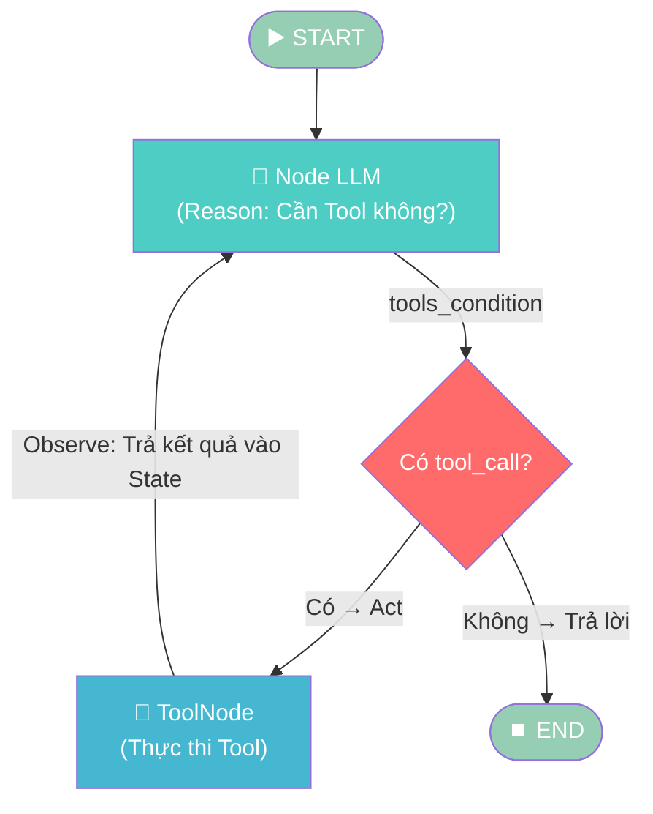
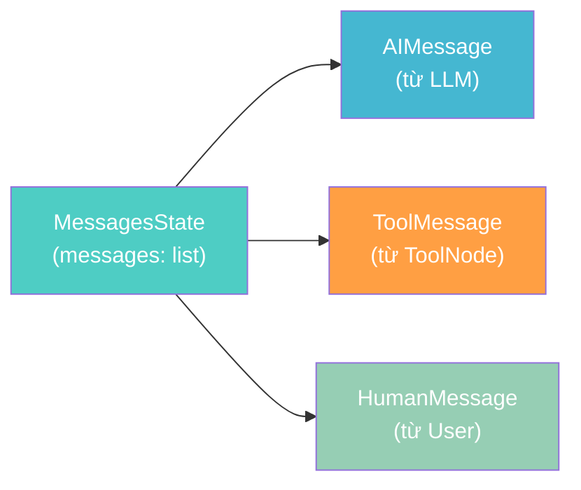
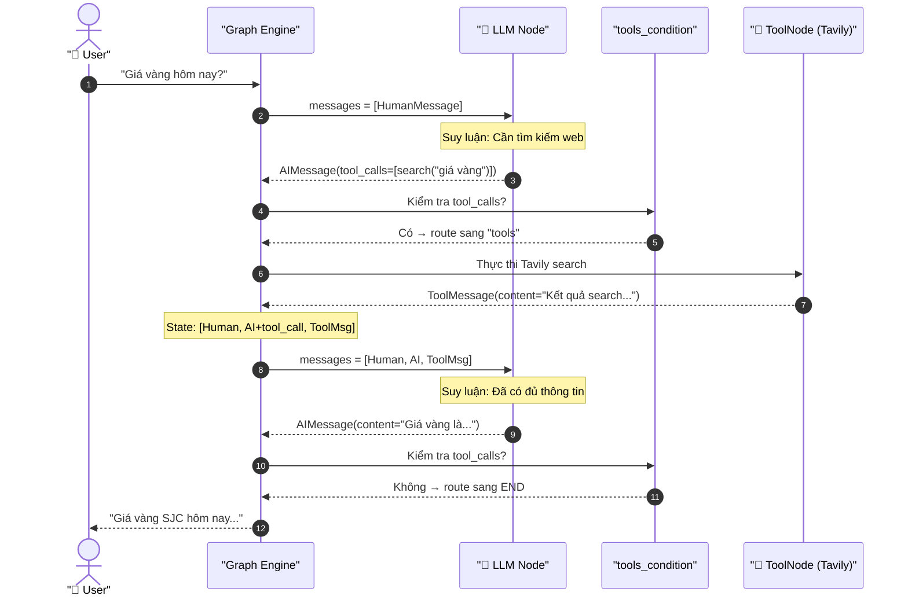
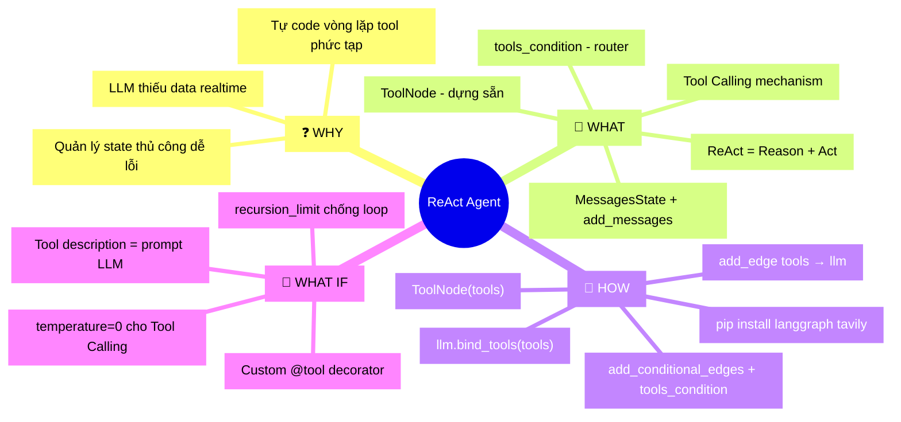

# Giai đoạn 2: Xây dựng ReAct Agent cơ bản

## 📋 Agenda

**Thời gian đọc ước tính:** ~20 phút

### Sau bài này, bạn sẽ:
- ✅ **Giải thích** được pattern ReAct (Reason → Act → Observe) là gì và tại sao nó hiệu quả
- ✅ **Hiểu** cơ chế Tool Calling — cách LLM "quyết định" khi nào cần dùng Tool
- ✅ **Tự tay code** Agent tìm kiếm thông tin thời sự realtime bằng Tavily + OpenAI
- ✅ **Phân biệt** `ToolNode` và `tools_condition` — 2 vũ khí dựng sẵn tiết kiệm 80% thời gian

### Yêu cầu đầu vào (Prerequisites):
- 🔹 Đã hoàn thành Giai đoạn 1 (hiểu State, Nodes, Edges)
- 🔹 Có API Key của OpenAI (hoặc Anthropic)
- 🔹 Có API Key của Tavily (đăng ký miễn phí tại [tavily.com](https://tavily.com))

---

## ❓ Vấn đề & Giải pháp

**Vấn đề (Problem Statement):**
- LLM như GPT-4 bị cắt off knowledge ở một thời điểm — không biết tin tức hôm nay.
- Khi muốn AI tự tìm kiếm web, bạn phải tự code vòng lặp: "LLM gọi tool → tool chạy → kết quả trả về → LLM xử lý tiếp" — phức tạp và dễ lỗi.
- Quản lý trạng thái "LLM đang làm gì" trong vòng lặp đó không có cơ chế chuẩn.

**Giải pháp (Solution):**
LangGraph giải quyết bằng pattern **ReAct** (Reason + Act): LLM được gắn Tool, tự quyết định "có cần dùng Tool không", và Graph tự động điều phối vòng lặp đó qua `ToolNode` + `tools_condition`. Bạn chỉ cần khai báo Graph — không cần tự viết vòng lặp.

---

## 📖 Các Concept Cốt Lõi

### Pattern ReAct hoạt động thế nào?

**Định nghĩa:** ReAct = **Re**ason (Suy luận) + **Act** (Hành động). LLM xen kẽ giữa việc suy nghĩ "cần làm gì" và thực hiện hành động đó (gọi Tool), rồi quan sát kết quả để tiếp tục.



> 💡 **Chú ý vòng lặp:** Mũi tên từ `ToolNode` quay ngược về `LLM` — đây là điểm khác biệt so với Giai đoạn 1. Graph có thể **chạy vòng lặp nhiều lần** cho đến khi LLM thấy đủ thông tin.

---

### 1. Tool Calling — "LLM ra lệnh, Tool thực thi"

**Định nghĩa:** Tool Calling là cơ chế LLM "mô tả" hành động cần thực hiện (tên tool + tham số) thay vì tự thực thi. Phần code của bạn nhận mô tả đó và chạy function tương ứng.

```python
from langchain_tavily import TavilySearch

# Định nghĩa Tool bằng cách tạo object — không phải tự viết function phức tạp
search_tool = TavilySearch(max_results=3)

# Bind tool vào LLM — LLM giờ "biết" nó có thể dùng tool này
llm_with_tools = llm.bind_tools([search_tool])
```

| Bước | Ai làm | Output |
|------|--------|--------|
| 1. LLM nhận câu hỏi | LLM | Quyết định "cần search" |
| 2. LLM tạo `tool_call` | LLM | `{"name": "tavily_search", "args": {"query": "giá vàng hôm nay"}}` |
| 3. Code thực thi tool | `ToolNode` | Kết quả search thực tế từ web |
| 4. Kết quả vào State | Graph Engine | `ToolMessage` được append vào `messages` |
| 5. LLM đọc kết quả | LLM | Tổng hợp → Trả lời người dùng |

---

### 2. `ToolNode` — "Công nhân thực thi Tool tự động"

**Định nghĩa:** `ToolNode` là một Node dựng sẵn của LangGraph. Nó đọc `tool_calls` trong `AIMessage` mới nhất của State, tự động chạy đúng tool tương ứng, và ghi kết quả vào State dưới dạng `ToolMessage`.

```python
from langgraph.prebuilt import ToolNode

# Tạo ToolNode từ danh sách tools — 1 dòng thay vì tự viết loop
tool_node = ToolNode([search_tool])
```

> ✅ **Tại sao dùng `ToolNode`?** Nó xử lý tự động: parse `tool_calls`, map đúng function, xử lý lỗi, format output — tiết kiệm ~50 dòng code.

---

### 3. `tools_condition` — "Người gác cửa quyết định rẽ nhánh"

**Định nghĩa:** `tools_condition` là một hàm Conditional Edge dựng sẵn. Nó kiểm tra `AIMessage` cuối cùng trong State: nếu có `tool_calls` thì chuyển sang `ToolNode`, nếu không thì kết thúc.

```python
from langgraph.prebuilt import tools_condition

# Thay vì tự viết hàm router phức tạp:
# def my_router(state):
#     if state["messages"][-1].tool_calls:
#         return "tool_node"
#     return END

# Dùng tools_condition — 1 dòng, cùng kết quả:
graph.add_conditional_edges("llm_node", tools_condition)
```

---

### Kiến trúc State cho Agent có Tool



**Điểm mấu chốt:** Agent dùng `MessagesState` thay vì `TypedDict` custom. `MessagesState` có sẵn trường `messages: list` với **reducer tự động append** — nghĩa là mỗi Node thêm message mới vào list thay vì ghi đè. Đây là lý do tại sao lịch sử hội thoại được giữ nguyên xuyên suốt các vòng lặp.

---

## 🔨 Thực hành: "Trợ lý Nghiên cứu Thời sự"

> **Mục tiêu:** Agent nhận câu hỏi về tin tức thời sự → tự search web bằng Tavily → tổng hợp → trả lời với data realtime.

### Bước 0: Cài đặt & Cấu hình

```bash
pip install langgraph langchain-openai langchain-tavily python-dotenv
```

```bash
# filename: .env
OPENAI_API_KEY=sk-...
TAVILY_API_KEY=tvly-...
```

### Code đầy đủ

```python
# filename: react_agent.py
import os
from dotenv import load_dotenv
from typing import Annotated
from langchain_openai import ChatOpenAI
from langchain_tavily import TavilySearch
from langgraph.graph import StateGraph, END
from langgraph.graph.message import add_messages
from langgraph.prebuilt import ToolNode, tools_condition
from typing_extensions import TypedDict

load_dotenv()

# ─── 1. ĐỊNH NGHĨA STATE ────────────────────────────────────────────────────
# Annotated[list, add_messages] = dùng reducer add_messages thay vì ghi đè list
# WHY: Mỗi Node chỉ thêm message mới, không xóa lịch sử cũ
class AgentState(TypedDict):
    messages: Annotated[list, add_messages]

# ─── 2. KHỞI TẠO LLM VÀ TOOLS ──────────────────────────────────────────────
llm = ChatOpenAI(model="gpt-4o-mini", temperature=0)

# Tavily chuyên biệt cho AI Search — trả về kết quả đã được format sẵn
search_tool = TavilySearch(max_results=3)
tools = [search_tool]

# bind_tools = nói với LLM "mày có thể dùng những tools này"
llm_with_tools = llm.bind_tools(tools)

# ─── 3. ĐỊNH NGHĨA NODES ────────────────────────────────────────────────────
def llm_node(state: AgentState) -> dict:
    # Truyền toàn bộ lịch sử messages vào LLM để nó có đủ context
    response = llm_with_tools.invoke(state["messages"])
    # WHY return list? add_messages reducer sẽ append vào list hiện có
    return {"messages": [response]}

# ToolNode dựng sẵn — tự đọc tool_calls và thực thi đúng tool
tool_node = ToolNode(tools)

# ─── 4. XÂY DỰNG GRAPH ─────────────────────────────────────────────────────
builder = StateGraph(AgentState)

builder.add_node("llm", llm_node)
builder.add_node("tools", tool_node)

builder.set_entry_point("llm")

# tools_condition: kiểm tra AIMessage cuối có tool_calls không?
# → Có: chạy "tools" | Không: kết thúc
builder.add_conditional_edges("llm", tools_condition)

# Sau khi ToolNode chạy xong, luôn quay lại LLM để xử lý kết quả
builder.add_edge("tools", "llm")

graph = builder.compile()

# ─── 5. CHẠY AGENT ──────────────────────────────────────────────────────────
def chat(user_input: str):
    print(f"\n👤 User: {user_input}")
    print("-" * 50)

    result = graph.invoke({
        "messages": [{"role": "user", "content": user_input}]
    })

    # Lấy message cuối cùng — đây là câu trả lời tổng hợp của LLM
    final_message = result["messages"][-1]
    print(f"🤖 Agent: {final_message.content}")

if __name__ == "__main__":
    chat("Giá vàng SJC hôm nay bao nhiêu?")
    chat("Thời tiết Hà Nội hôm nay thế nào?")
```

### Output mong đợi

```
👤 User: Giá vàng SJC hôm nay bao nhiêu?
--------------------------------------------------
🤖 Agent: Theo thông tin mới nhất, giá vàng SJC hôm nay (01/04/2026) như sau:
- Mua vào: 120.5 triệu đồng/lượng
- Bán ra: 122.5 triệu đồng/lượng
(Nguồn: Công ty Vàng bạc Đá quý Sài Gòn - SJC)
```

### Giải thích luồng thực thi chi tiết



---

## 🚀 WHAT IF — Mở rộng & Trade-off

### Thêm nhiều Tool hơn cho Agent

```python
from langchain_core.tools import tool

# Tự định nghĩa Tool bằng decorator @tool — rất đơn giản
@tool
def tinh_toan(bieu_thuc: str) -> str:
    """Tính toán biểu thức toán học. Dùng khi user hỏi tính toán."""
    # WHY try/except: eval() có thể gây lỗi với biểu thức không hợp lệ
    try:
        return str(eval(bieu_thuc))
    except Exception as e:
        return f"Lỗi tính toán: {e}"

# Gắn thêm tool vào danh sách — Graph không cần sửa gì thêm
tools = [search_tool, tinh_toan]
llm_with_tools = llm.bind_tools(tools)
```

### Khi nào DÙNG vs KHÔNG DÙNG ReAct Agent?

| ✅ NÊN dùng | ❌ KHÔNG nên dùng |
|-------------|------------------|
| Câu hỏi cần data realtime (tin tức, giá cả) | Câu hỏi LLM đã biết sẵn — gọi Tool lãng phí token |
| Tác vụ cần nhiều bước (search → tính toán → tóm tắt) | Tác vụ 1 bước đơn giản |
| Cần Agent tự quyết định tool nào phù hợp | Tool quá nhiều → LLM bị confused, chọn sai tool |
| Prototype demo nhanh | Production cần kiểm soát chặt từng bước |

### ⚠️ Pitfalls hay gặp

**1. Vòng lặp vô tận (Infinite Loop)**

```python
# ❌ Nguy hiểm: Nếu LLM luôn muốn gọi Tool, Graph sẽ chạy mãi
# ✅ Cách phòng: Thêm giới hạn recursion khi compile
graph = builder.compile(
    # Giới hạn tối đa 10 bước — bảo vệ khỏi vòng lặp vô tận
    recursion_limit=10
)
```

**2. Tool description mơ hồ → LLM gọi sai Tool**

```python
# ❌ Sai: Description quá ngắn, LLM không biết khi nào dùng
@tool
def search(q: str) -> str:
    """Search"""  # Quá mơ hồ!
    ...

# ✅ Đúng: Description rõ ràng — đây là "prompt" hướng dẫn LLM
@tool
def search(q: str) -> str:
    """Tìm kiếm thông tin thời sự, giá cả, sự kiện mới nhất trên internet.
    Dùng khi câu hỏi liên quan đến thông tin realtime hoặc sau 2024."""
    ...
```

**3. Quên `temperature=0` cho Agent Tool Calling**

```python
# WHY temperature=0?
# Tool Calling cần output JSON chính xác — temperature cao gây format lỗi
llm = ChatOpenAI(model="gpt-4o-mini", temperature=0)
```

### 💡 Thách thức tiếp theo

Thử thêm **LangSmith** để quan sát từng bước Agent chạy:
```python
import os
os.environ["LANGCHAIN_TRACING_V2"] = "true"
os.environ["LANGCHAIN_API_KEY"] = "ls__..."
```
Đây là cơ sở để debug Agent phức tạp ở Giai đoạn 3 và 4.

---

## 🧠 MECE Mindmap — Tổng kết Giai đoạn 2



---

*Made by Anh Tu - Share to be share*
