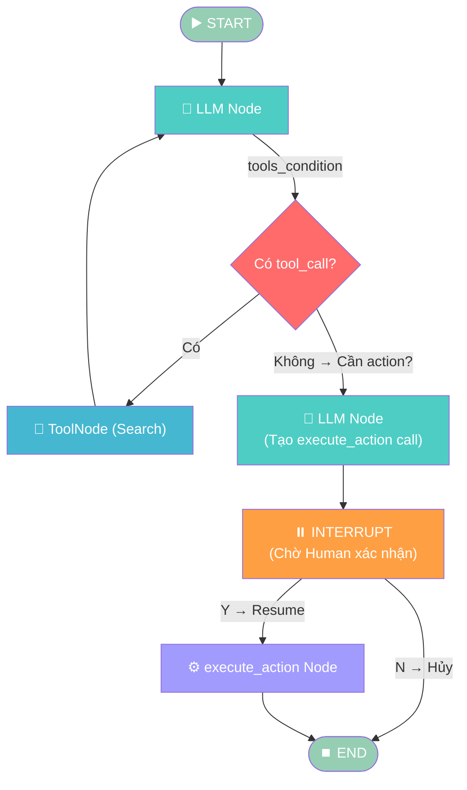
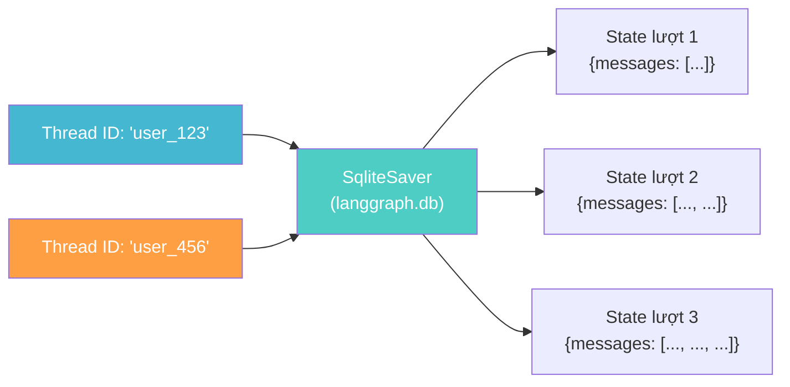
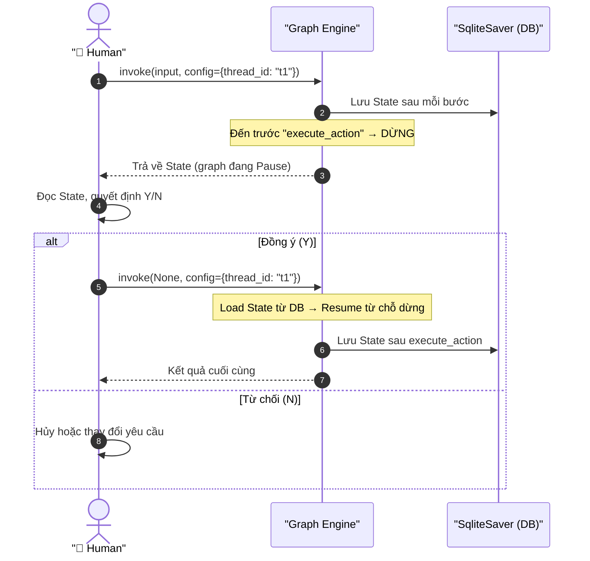
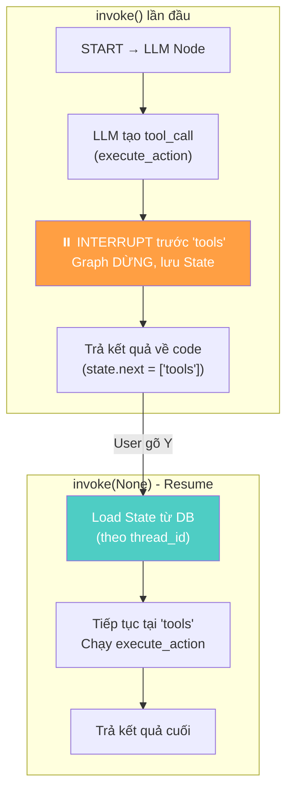
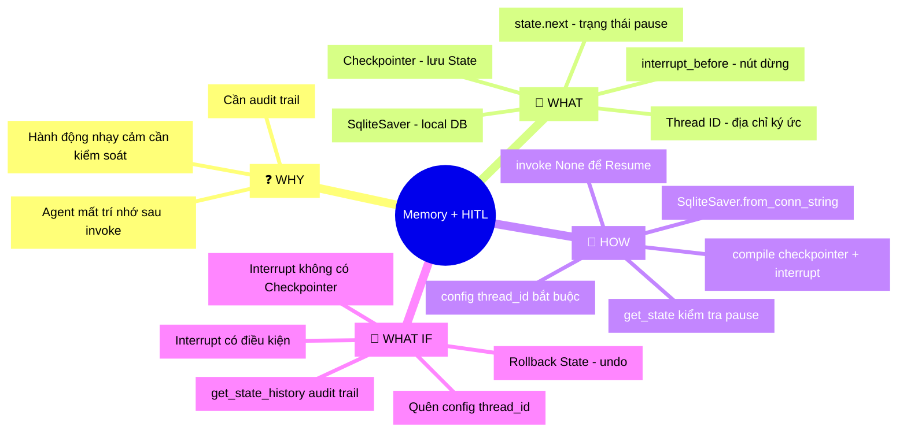

# Giai đoạn 3: Thêm Memory & Human-in-the-Loop

## 📋 Agenda

**Thời gian đọc ước tính:** ~25 phút

### Sau bài này, bạn sẽ:
- ✅ **Giải thích** được Checkpointer là gì và tại sao nó tạo ra "trí nhớ" cho Agent
- ✅ **Tự tay** thêm `SqliteSaver` vào Agent để nhớ hội thoại qua nhiều lượt
- ✅ **Hiểu** cơ chế `interrupt_before` — cách Graph tự dừng chờ người dùng xác nhận
- ✅ **Phân biệt** `Thread ID` và `Checkpointer` — 2 khái niệm hay bị nhầm lẫn

### Yêu cầu đầu vào (Prerequisites):
- 🔹 Đã hoàn thành Giai đoạn 2 (hiểu ReAct Agent, `ToolNode`, `tools_condition`)
- 🔹 `langgraph >= 0.2` đã cài
- 🔹 Dùng **Google Colab** thì cần mount Google Drive (xem note bên dưới)

---

## ❓ Vấn đề & Giải pháp

**Vấn đề (Problem Statement):**
- Agent ở Giai đoạn 2 **mất trí nhớ hoàn toàn** sau mỗi lần `graph.invoke()` — không nhớ cuộc trò chuyện trước.
- Khi Agent được trao quyền thực hiện hành động nhạy cảm (gửi email, xóa file, chuyển tiền), không có cơ chế nào để con người **dừng lại và kiểm tra** trước khi Agent làm.
- Với framework khác (LangChain LCEL, CrewAI), 2 tính năng này phải tự implement — rất phức tạp.

**Giải pháp (Solution):**
LangGraph giải quyết bằng 2 cơ chế tích hợp sẵn:
- **Checkpointer** — lưu toàn bộ State sau mỗi bước vào database. Gọi lại đúng `thread_id` là Agent nhớ lại hội thoại.
- **`interrupt_before`** — khai báo tại `compile()` để Graph tự dừng trước một Node cụ thể, chờ lệnh `resume` từ con người.

---

## 📖 Các Concept Cốt Lõi

### Kiến trúc tổng quan Giai đoạn 3



---

### 1. Checkpointer & Thread ID — "Não bộ và Địa chỉ ký ức"

**Định nghĩa:**
- **Checkpointer**: Thành phần lưu trữ **toàn bộ State** của Graph sau mỗi bước vào database. Mặc định LangGraph không lưu gì — Checkpointer là tùy chọn phải khai báo thêm.
- **Thread ID**: Mã định danh (string tùy ý) phân biệt các **phiên hội thoại** khác nhau. Giống như "địa chỉ" để tìm đúng cuốn nhật ký.



> 💡 **Analogy:** Checkpointer giống như chiếc máy chụp ảnh — sau mỗi bước, nó chụp lại toàn bộ State. Thread ID là tên album ảnh. Muốn xem lại lịch sử của `user_123`, chỉ cần mở đúng album đó.

| | Không có Checkpointer | Có Checkpointer |
|--|----------------------|-----------------|
| Sau `invoke()` lần 1 | State bị xóa | Lưu vào DB với thread_id |
| `invoke()` lần 2 | Bắt đầu lại từ đầu | Load State cũ + append mới |
| Colab timeout | Mất hết | Mount Drive → vẫn còn |

---

### 2. `SqliteSaver` — Checkpointer đơn giản nhất

**Định nghĩa:** `SqliteSaver` lưu State vào file SQLite (`.db`) trên local. Phù hợp cho học tập và prototype — production dùng `PostgresSaver`.

```python
from langgraph.checkpoint.sqlite import SqliteSaver

# Kết nối tới file SQLite — tự tạo nếu chưa có
checkpointer = SqliteSaver.from_conn_string("langgraph.db")

# Truyền vào compile() — Graph giờ có trí nhớ
graph = builder.compile(checkpointer=checkpointer)
```

> ⚠️ **Lưu ý Google Colab:** Session Colab bị timeout → file `.db` mất. Giải pháp: mount Google Drive và lưu DB vào Drive.
>
> ```python
> from google.colab import drive
> drive.mount('/content/drive')
> checkpointer = SqliteSaver.from_conn_string(
>     "/content/drive/MyDrive/langgraph.db"
> )
> ```

---

### 3. Human-in-the-Loop (HITL) — "Nút dừng khẩn cấp"

**Định nghĩa:** HITL là cơ chế cho phép Graph **tự dừng** (Pause) tại một Node cụ thể để chờ con người can thiệp — xem xét, sửa đổi, hoặc xác nhận trước khi tiếp tục.

Khai báo bằng `interrupt_before` trong `compile()`:

```python
graph = builder.compile(
    checkpointer=checkpointer,
    # Graph sẽ DỪNG ngay trước khi chạy "execute_action"
    interrupt_before=["execute_action"]
)
```

**Vòng đời của một HITL Graph:**



> 💡 **Điểm then chốt:** Khi `invoke(None, ...)` (truyền `None` thay vì input mới), Graph **không bắt đầu lại** — nó **load State từ DB** theo `thread_id` và **tiếp tục từ điểm dừng**. Đây là lý do Checkpointer bắt buộc phải có khi dùng HITL.

---

## 🔨 Thực hành: "Trợ lý Hành động có Kiểm duyệt"

> **Mục tiêu:** Nâng cấp Agent Giai đoạn 2 thêm: (1) Nhớ lịch sử nhiều lượt hỏi, (2) Tự động DỪNG trước khi thực hiện hành động nhạy cảm để chờ người dùng xác nhận.

### Bước 0: Cài đặt

```bash
pip install langgraph langchain-openai langchain-tavily python-dotenv
```

### Code đầy đủ

```python
# filename: hitl_agent.py
import os
from dotenv import load_dotenv
from typing import Annotated
from langchain_openai import ChatOpenAI
from langchain_tavily import TavilySearch
from langchain_core.tools import tool
from langgraph.graph import StateGraph, END
from langgraph.graph.message import add_messages
from langgraph.prebuilt import ToolNode, tools_condition
from langgraph.checkpoint.sqlite import SqliteSaver
from typing_extensions import TypedDict

load_dotenv()

# ─── 1. STATE ───────────────────────────────────────────────────────────────
class AgentState(TypedDict):
    messages: Annotated[list, add_messages]

# ─── 2. TOOLS ───────────────────────────────────────────────────────────────
search_tool = TavilySearch(max_results=2)

@tool
def execute_action(action_description: str) -> str:
    """Thực hiện một hành động nhạy cảm (gửi email, tạo file, v.v.).
    Dùng khi user yêu cầu thực hiện hành động cụ thể — không chỉ tra cứu.
    """
    # Mock tool: trong thực tế, đây là nơi gọi SMTP, API bên ngoài, v.v.
    # WHY mock? Để tập trung học HITL pattern, không bị phân tâm bởi config email
    return f"[MOCK] Đã thực hiện: {action_description}"

tools = [search_tool, execute_action]
llm = ChatOpenAI(model="gpt-4o-mini", temperature=0)
llm_with_tools = llm.bind_tools(tools)

# ─── 3. NODES ───────────────────────────────────────────────────────────────
def llm_node(state: AgentState) -> dict:
    response = llm_with_tools.invoke(state["messages"])
    return {"messages": [response]}

tool_node = ToolNode(tools)

# ─── 4. XÂY DỰNG GRAPH ─────────────────────────────────────────────────────
builder = StateGraph(AgentState)
builder.add_node("llm", llm_node)
builder.add_node("tools", tool_node)
builder.set_entry_point("llm")
builder.add_conditional_edges("llm", tools_condition)
builder.add_edge("tools", "llm")

# ─── 5. COMPILE VỚI CHECKPOINTER + INTERRUPT_BEFORE ─────────────────────────
checkpointer = SqliteSaver.from_conn_string("langgraph.db")

graph = builder.compile(
    checkpointer=checkpointer,
    # Dừng TRƯỚC khi chạy "tools" nếu tool được gọi là execute_action
    # WHY interrupt "tools" chứ không phải "execute_action"?
    # Vì execute_action chạy BÊN TRONG ToolNode — ta interrupt ToolNode
    interrupt_before=["tools"],
)

# ─── 6. VÒNG LẶP CHAT VỚI HITL ─────────────────────────────────────────────
def run_with_hitl(user_input: str, thread_id: str = "default"):
    """Chạy Agent với Human-in-the-Loop cho các hành động nhạy cảm."""
    config = {"configurable": {"thread_id": thread_id}}

    print(f"\n{'='*50}")
    print(f"👤 User: {user_input}")
    print(f"🧵 Thread ID: {thread_id}")
    print(f"{'='*50}")

    # Lần invoke đầu tiên với input của user
    result = graph.invoke(
        {"messages": [{"role": "user", "content": user_input}]},
        config=config
    )

    # Kiểm tra Graph có đang bị PAUSE không
    state = graph.get_state(config)

    if state.next:
        # Graph đang pause tại một Node — hỏi người dùng
        last_message = result["messages"][-1]
        print(f"\n⏸️  DỪNG! Agent muốn thực hiện hành động sau:")

        if hasattr(last_message, "tool_calls") and last_message.tool_calls:
            for tc in last_message.tool_calls:
                print(f"   🔧 Tool: {tc['name']}")
                print(f"   📝 Tham số: {tc['args']}")

        confirm = input("\n❓ Bạn có muốn tiếp tục không? (Y/N): ").strip().upper()

        if confirm == "Y":
            # Resume: invoke với None input — Graph tự load State từ DB
            final = graph.invoke(None, config=config)
            print(f"\n✅ Hoàn thành!")
            print(f"🤖 Agent: {final['messages'][-1].content}")
        else:
            print("\n❌ Hành động đã bị hủy bởi người dùng.")
    else:
        # Graph hoàn thành bình thường (không có hành động nhạy cảm)
        print(f"\n🤖 Agent: {result['messages'][-1].content}")


# ─── 7. TEST MULTI-TURN MEMORY ───────────────────────────────────────────────
def chat_multi_turn():
    thread_id = "session_demo_01"

    # Lượt 1: Câu hỏi bình thường — không trigger HITL
    run_with_hitl("Thời tiết Hà Nội hôm nay thế nào?", thread_id)

    # Lượt 2: Câu hỏi kế tiếp — Agent nhớ context lượt 1 nhờ thread_id
    run_with_hitl("Với thời tiết đó, tôi nên mặc gì khi ra ngoài?", thread_id)

    # Lượt 3: Yêu cầu hành động nhạy cảm → HITL kích hoạt
    run_with_hitl("Hãy ghi lại lời khuyên này vào file cho tôi.", thread_id)


if __name__ == "__main__":
    chat_multi_turn()
```

### Output mong đợi (kịch bản đồng ý)

```
==================================================
👤 User: Hãy ghi lại lời khuyên này vào file cho tôi.
🧵 Thread ID: session_demo_01
==================================================

⏸️  DỪNG! Agent muốn thực hiện hành động sau:
   🔧 Tool: execute_action
   📝 Tham số: {'action_description': 'Ghi lời khuyên mặc đồ vào file notes.txt'}

❓ Bạn có muốn tiếp tục không? (Y/N): Y

✅ Hoàn thành!
🤖 Agent: [MOCK] Đã thực hiện: Ghi lời khuyên mặc đồ vào file notes.txt
```

---

### Hiểu sâu: Cách `interrupt_before` hoạt động thực sự



**3 trạng thái của Graph bạn cần biết:**

```python
state = graph.get_state(config)

# state.next: Tuple các Node SẼ chạy tiếp (rỗng nếu graph đã xong)
print(state.next)      # ('tools',) nếu đang pause trước tools

# state.values: Snapshot State hiện tại
print(state.values)    # {'messages': [...]}

# state.created_at: Thời điểm snapshot này được tạo
print(state.created_at)
```

---

## 🚀 WHAT IF — Mở rộng & Trade-off

### Interrupt có điều kiện — Chỉ dừng với tool nguy hiểm

```python
# Vấn đề với interrupt_before=["tools"]:
# Agent dừng cả khi dùng search_tool (không nguy hiểm) — gây khó chịu

# ✅ Giải pháp: Custom Conditional Edge để chỉ dừng với execute_action
def should_interrupt(state: AgentState) -> str:
    last_msg = state["messages"][-1]
    if hasattr(last_msg, "tool_calls") and last_msg.tool_calls:
        # Chỉ interrupt nếu tool là execute_action
        for tc in last_msg.tool_calls:
            if tc["name"] == "execute_action":
                return "need_approval"  # Route sang node chờ duyệt
    return "tools"  # Các tool khác chạy bình thường

builder.add_conditional_edges("llm", should_interrupt)
```

### Xem toàn bộ lịch sử Checkpoint

```python
# Xem lại tất cả các checkpoint của một thread
for checkpoint in graph.get_state_history(config):
    print(f"Step: {checkpoint.metadata.get('step')}")
    print(f"Created: {checkpoint.created_at}")
    print(f"Messages: {len(checkpoint.values['messages'])}")
    print("---")
```

### Khi nào DÙNG vs KHÔNG DÙNG Memory + HITL?

| ✅ NÊN dùng | ❌ KHÔNG nên dùng |
|-------------|------------------|
| Agent chat đa lượt (bot tư vấn, trợ lý cá nhân) | Xử lý batch 1 lần, không cần nhớ |
| Tác vụ có hành động nhạy cảm (gửi mail, API write) | Tác vụ đọc-only, không biến đổi dữ liệu |
| Cần audit trail (ai làm gì, lúc nào) | Prototype nhanh — Checkpointer thêm overhead |
| Multi-user với session riêng biệt | Ứng dụng đơn người dùng đơn giản |

### ⚠️ Pitfalls hay gặp

**1. Quên truyền `config` khi `invoke()` → Checkpointer không hoạt động**

```python
# ❌ Sai: Không có config → graph không biết lưu vào thread nào
graph.invoke({"messages": [...]})

# ✅ Đúng: Luôn truyền config với thread_id
config = {"configurable": {"thread_id": "user_001"}}
graph.invoke({"messages": [...]}, config=config)
```

**2. Interrupt nhưng không có Checkpointer → Resume không thể hoạt động**

```python
# ❌ Sẽ báo lỗi khi invoke(None):
graph = builder.compile(interrupt_before=["tools"])  # Thiếu checkpointer!

# ✅ Bắt buộc phải đi kèm:
graph = builder.compile(
    checkpointer=checkpointer,  # BẮT BUỘC
    interrupt_before=["tools"]
)
```

**3. Dùng cùng `thread_id` cho nhiều user → Lẫn lộn dữ liệu**

```python
# ❌ Sai: Tất cả user dùng chung thread — đọc được state của nhau
config = {"configurable": {"thread_id": "shared"}}

# ✅ Đúng: Mỗi user/session có thread_id riêng
import uuid
user_thread = f"user_{user_id}_{uuid.uuid4().hex[:8]}"
config = {"configurable": {"thread_id": user_thread}}
```

### 💡 Thách thức tiếp theo

Thử **Rollback State** — quay lại checkpoint trước đó nếu người dùng muốn "hoàn tác":
```python
# Lấy checkpoint cũ hơn
history = list(graph.get_state_history(config))
old_checkpoint = history[2]  # Checkpoint 2 bước trước

# Rollback về State đó
graph.update_state(config, old_checkpoint.values)
```

Đây là nền tảng để xây dựng tính năng "undo" trong các Agent phức tạp.

---

## 🧠 MECE Mindmap — Tổng kết Giai đoạn 3



---

*Made by Anh Tu - Share to be share*
