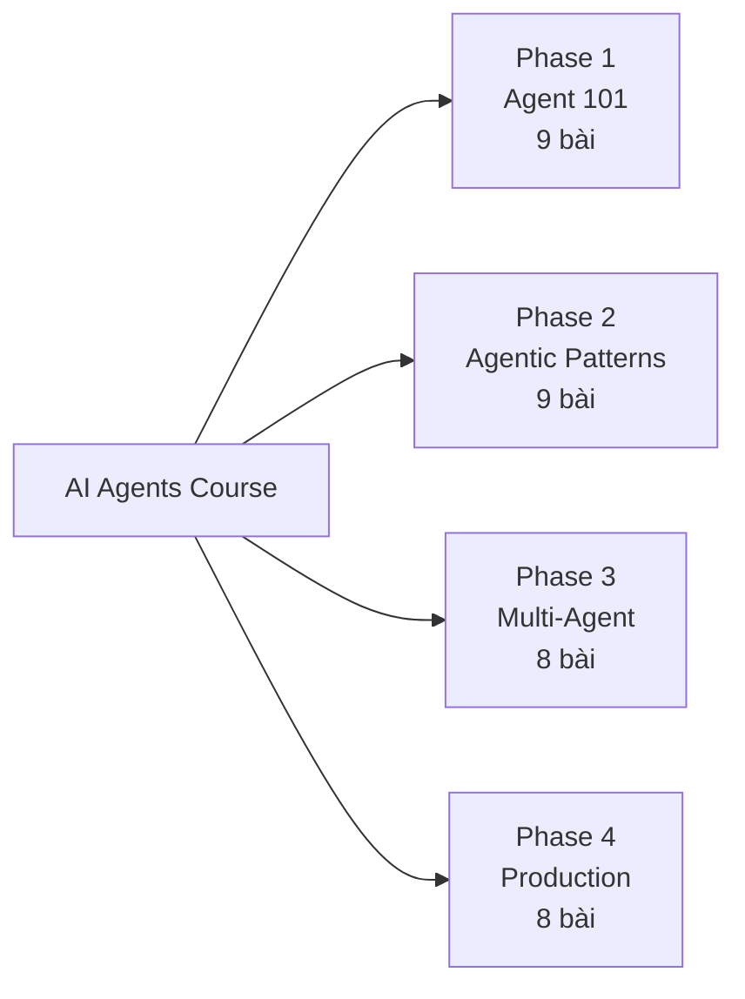

# Kế Hoạch Xây Dựng Khoá Học AI Agents

> **Target:** Junior JS/TS Developer | **Tool:** LangChain.js + LangGraph.js | **LLM:** `gemini-2.5-flash`

---

## Thông Số Cốt Lõi

| Thông số                     | Giá trị                                       |
| ------------------------------ | ----------------------------------------------- |
| **Đối tượng**        | Junior Dev có kinh nghiệm JS/TS web           |
| **Công cụ demo**       | LangChain.js + LangGraph.js (JS/TS native)      |
| **LLM backend**          | `gemini-2.5-flash` — tiết kiệm, đủ mạnh |
| **Approach**             | Full Course, build tuần tự                    |
| **Format**               | Docs reference trên Docusaurus                 |
| **Tổng bài dự kiến** | ~34 bài (Phase 0 đã có nội dung riêng)    |
| **Timeline ước tính** | 4–5 tháng (2 bài/tuần)                      |

---

## Quy Tắc Bám Sát Tài Liệu

> Mỗi bài học **PHẢI** được viết dựa trực tiếp vào file nguồn trong:
> `sources/documentations/docs.langchain.com/oss/javascript/`
>
> - `langchain/` — LangChain.js core (tools, models, memory, structured output...)
> - `langgraph/` — LangGraph.js (agents, workflows, multi-agent, persistence...)
>
> Demo code **BẮT BUỘC** dùng `gemini-2.5-flash` (thay `ChatAnthropic` trong nguồn gốc).

---

## Kiến Trúc Khoá Học

---

## Phase 1: AI Agents 101

> **Thời gian:** 5 tuần | **Số bài:** 9

### Bài 1.1 — Chatbot vs AI Agent

- **Concept:** Workflow (cố định) vs Agent (động), 5 Agentic Patterns
- **LLM Augmentations:** Tool calling, Structured output, Memory
- **Nguồn tài liệu:**
  - `langgraph/workflows-agents.md` — định nghĩa chính thức, sơ đồ patterns
  - `langchain/agents.md` — agent architecture tổng quan
- **Đã tạo:** `docs/langgraph/agents-101/01-chatbot-vs-agent.md`
- **Độ ưu tiên:** Critical

---

### Bài 1.2 — Agent Loop Trong Code

- **Concept:** StateGraph, Node, Edge, MessagesValue, ReducedValue
- **Demo JS:** Graph API + Functional API với `gemini-2.5-flash`
- **Nguồn tài liệu:**
  - `langgraph/quickstart.md` — **NGUỒN CHÍNH** (Graph API + Functional API step-by-step)
  - `langgraph/thinking-in-langgraph.md` — mental model Node/State/Edge
  - `langgraph/workflows-agents.md` — ToolNode pattern
- **Đã tạo:** 
  - `docs/langgraph/agents-101/02-agent-loop-in-code.md`
  - `docs/langgraph/agents-101/02b-thinking-in-langgraph.md`
- **Độ ưu tiên:** Critical

---

### Bài 1.3 — Tools: Công Cụ Của Agent

- **Concept:** Tool schema (Zod), tool binding, tool routing
- **Demo JS:** Custom tool, built-in tools (search, calculator)
- **Nguồn tài liệu:**
  - `langchain/tools.md` — **NGUỒN CHÍNH** (tool() API, schema, ToolNode)
  - `langgraph/workflows-agents.md` — ToolNode prebuilt
- **Đã tạo:** `docs/langgraph/agents-101/03-tools.md`
- **Độ ưu tiên:** Critical

---

### Bài 1.4 — Messages: Ngôn Ngữ Của Agent

- **Concept:** HumanMessage, AIMessage, ToolMessage, SystemMessage, message roles
- **Demo JS:** Message types, trimming, filtering
- **Nguồn tài liệu:**
  - `langchain/messages.md` — **NGUỒN CHÍNH** (toàn bộ message types và usage)
- **Đã tạo:** `docs/langgraph/agents-101/04-messages.md`
- **Độ ưu tiên:** Critical

---

### Bài 1.5 — Models: Chọn Và Cấu Hình LLM

- **Concept:** Chat models, model parameters (temperature, max_tokens), provider switching
- **Demo JS:** `ChatGoogleGenerativeAI` với `gemini-2.5-flash`, so sánh providers
- **Nguồn tài liệu:**
  - `langchain/models.md` — **NGUỒN CHÍNH** (providers, parameters, streaming, structured output)
  - `langchain/install.md` — package dependencies
- **Đã tạo:** `docs/langgraph/agents-101/05-models.md`
- **Độ ưu tiên:** Critical

---

### Bài 1.6 — Structured Output: Trả Lời Đúng Format

- **Concept:** `withStructuredOutput()`, Zod schema, JSON mode, tool-based extraction
- **Demo JS:** TypeScript type-safe output từ LLM
- **Nguồn tài liệu:**
  - `langchain/structured-output.md` — **NGUỒN CHÍNH** (withStructuredOutput, schema binding)
- **Đã tạo:** `docs/langgraph/agents-101/06-structured-output.md`
- **Độ ưu tiên:** Critical

---

### Bài 1.7 — Short-term Memory: Bộ Nhớ Trong Một Session

- **Concept:** In-context memory, message history, trimming, summarization
- **Demo JS:** ConversationChain với message history
- **Nguồn tài liệu:**
  - `langchain/short-term-memory.md` — **NGUỒN CHÍNH** (buffer, summary, token limit strategies)
  - `langgraph/add-memory.md` — memory trong LangGraph graph
- **Đã tạo:** `docs/langgraph/agents-101/07-short-term-memory.md`
- **Độ ưu tiên:** Important

---

### Bài 1.8 — Long-term Memory: Bộ Nhớ Cho Nhiều Session

- **Concept:** External storage, semantic memory, episodic memory, stores
- **Demo JS:** LangGraph Stores + vector memory
- **Nguồn tài liệu:**
  - `langchain/long-term-memory.md` — **NGUỒN CHÍNH** (overview long-term memory types)
  - `langgraph/stores.md` — LangGraph Store API
  - `langgraph/add-memory.md` — thêm memory vào agent
- **Đã tạo:** `docs/langgraph/agents-101/08-long-term-memory.md`
- **Độ ưu tiên:** Important

---

### Bài 1.9 — Project: Research Assistant

- **Project:** Agent search web + summarize + trả lời câu hỏi
- **Stack:** LangChain.js + `gemini-2.5-flash` + Tavily search tool
- **Nguồn tài liệu:**
  - `langchain/tools.md` — search tool integration
  - `langgraph/quickstart.md` — agent setup
  - `langchain/streaming.md` — streaming response
- **Đã tạo:** `docs/langgraph/agents-101/09-project-research-assistant.md`
- **Độ ưu tiên:** Critical (Capstone Phase 1)

---

## Phase 2: Agentic Patterns

> **Thời gian:** 5 tuần | **Số bài:** 9

### Bài 2.1 — Streaming: Real-time Agent Response

- **Concept:** Token streaming, event streaming, StreamingTextResponse
- **Demo JS:** Agent phát stream từng token ra giao diện
- **Nguồn tài liệu:**
  - `langchain/streaming.md` — **NGUỒN CHÍNH** (stream, streamEvents)
  - `langgraph/streaming.md` — streaming trong LangGraph
  - `langgraph/event-streaming.md` — event types chi tiết
- **Đã tạo:** `docs/langgraph/agentic-patterns/01-streaming.md`
- **Độ ưu tiên:** Critical

---

### Bài 2.2 — Retrieval-Augmented Generation (RAG)

- **Concept:** Retrieval-Augmented Generation, indexing pipeline, retrieval strategies
- **Demo JS:** RAG pipeline đầy đủ từ document đến answer
- **Nguồn tài liệu:**
  - `langchain/rag.md` — **NGUỒN CHÍNH** (naive RAG, advanced retrieval, re-ranking)
  - `langchain/retrieval.md` — retriever types
  - `langchain/knowledge-base.md` — knowledge base management
- **Đã tạo:** `docs/langgraph/agentic-patterns/02-rag.md`
- **Độ ưu tiên:** Critical

---

### Bài 2.3 — Agentic RAG: Agent Chủ Động Tìm Kiếm

- **Concept:** Agent quyết định khi nào cần retrieve, self-corrective RAG
- **Demo JS:** Agent với retrieval tool, iterative search
- **Nguồn tài liệu:**
  - `langgraph/agentic-rag.md` — **NGUỒN CHÍNH** (agentic RAG patterns)
- **Đã tạo:** `docs/langgraph/agentic-patterns/03-agentic-rag.md`
- **Độ ưu tiên:** Important

---

### Bài 2.4 — Context Engineering: Tối Ưu Prompt

- **Concept:** Context window management, prompt compression, few-shot selection
- **Demo JS:** Dynamic prompt assembly, context trimming
- **Nguồn tài liệu:**
  - `langchain/context-engineering.md` — **NGUỒN CHÍNH** (38KB — rất đầy đủ)
- **Đã tạo:** `docs/langgraph/agentic-patterns/04-context-engineering.md`
- **Độ ưu tiên:** Important

---

### Bài 2.5 — Fault Tolerance: Khả Năng Chịu Lỗi

- **Concept:** Retry policies, error handling, graceful degradation
- **Demo JS:** Node với retry config, fallback branches
- **Nguồn tài liệu:**
  - `langgraph/fault-tolerance.md` — **NGUỒN CHÍNH** (retry, error handling trong LangGraph)
- **Độ ưu tiên:** Critical

---

### Bài 2.6 — Checkpointing & Persistence

- **Concept:** Save/restore state, resume interrupted workflows
- **Demo JS:** MemorySaver, SQLite checkpointer
- **Nguồn tài liệu:**
  - `langgraph/checkpointers.md` — **NGUỒN CHÍNH** (checkpointer types, durability modes)
  - `langgraph/persistence.md` — persistence overview
- **Độ ưu tiên:** Important

---

### Bài 2.7 — Interrupts: Human-in-the-Loop

- **Concept:** `interrupt()`, approval gates, resume execution
- **Demo JS:** Agent dừng chờ user confirm trước khi thực thi
- **Nguồn tài liệu:**
  - `langgraph/interrupts.md` — **NGUỒN CHÍNH** (interrupt(), Command, resume)
  - `langchain/human-in-the-loop.md` — HITL patterns
- **Độ ưu tiên:** Critical

---

### Bài 2.8 — Middleware & Guardrails

- **Concept:** Input/output validation, prompt injection defense, PII detection
- **Demo JS:** Middleware chain bao quanh agent
- **Nguồn tài liệu:**
  - `langchain/guardrails.md` — **NGUỒN CHÍNH** (guardrail patterns, validation)
  - `langchain/middleware.md` — middleware architecture
- **Độ ưu tiên:** Critical

---

### Bài 2.9 — Project: Coding Assistant

- **Project:** Agent đọc file, phân tích code, suggest fix
- **Stack:** LangChain.js + `gemini-2.5-flash` + file system tools
- **Nguồn tài liệu:**
  - `langchain/tools.md` — file tools
  - `langgraph/use-graph-api.md` — advanced graph patterns
  - `langchain/streaming.md` — streaming output
- **Độ ưu tiên:** Critical (Capstone Phase 2)

---

## Phase 3: Multi-Agent Systems

> **Thời gian:** 4 tuần | **Số bài:** 8

### Bài 3.1 — Multi-Agent Architecture

- **Concept:** Tại sao multi-agent? Context limit, specialization, parallelism
- **So sánh:** Single agent vs Multi-agent trade-offs
- **Nguồn tài liệu:**
  - `langchain/multi-agent.md` — **NGUỒN CHÍNH** (architecture overview)
- **Độ ưu tiên:** Critical

---

### Bài 3.2 — Subgraphs: Agent Trong Agent

- **Concept:** Subgraph isolation, state scoping, nested workflows
- **Demo JS:** Agent gọi một sub-agent chuyên biệt
- **Nguồn tài liệu:**
  - `langgraph/use-subgraphs.md` — **NGUỒN CHÍNH** (subgraph patterns)
- **Độ ưu tiên:** Important

---

### Bài 3.3 — Supervisor Pattern

- **Concept:** Orchestrator điều phối nhiều worker agents
- **Demo JS:** Supervisor → Research Agent + Writer Agent
- **Nguồn tài liệu:**
  - `langchain/multi-agent.md` — supervisor pattern
  - `langgraph/workflows-agents.md` — orchestrator-worker diagram
  - `langgraph/use-graph-api.md` — Send API cho parallel workers
- **Độ ưu tiên:** Critical

---

### Bài 3.4 — Functional API: Agent Linh Hoạt Hơn

- **Concept:** `task`, `entrypoint`, vs Graph API trade-offs
- **Demo JS:** Rewrite agent từ Graph API sang Functional API
- **Nguồn tài liệu:**
  - `langgraph/functional-api.md` — **NGUỒN CHÍNH** (task, entrypoint)
  - `langgraph/use-functional-api.md` — how-to guide
- **Độ ưu tiên:** Important

---

### Bài 3.5 — Model Context Protocol (MCP)

- **Concept:** MCP standard, tool interoperability, connect external services
- **Demo JS:** LangChain agent kết nối MCP server
- **Nguồn tài liệu:**
  - `langchain/mcp.md` — **NGUỒN CHÍNH** (MCP integration với LangChain.js)
- **Độ ưu tiên:** Critical (Trend 2025-2026)

---

### Bài 3.6 — Time Travel: Debug Và Replay

- **Concept:** Graph replay, state inspection, fork execution
- **Demo JS:** Replay agent từ checkpoint cụ thể để debug
- **Nguồn tài liệu:**
  - `langgraph/use-time-travel.md` — **NGUỒN CHÍNH** (time travel API)
- **Độ ưu tiên:** Nice-to-have

---

### Bài 3.7 — SQL Agent: Agent Truy Vấn Database

- **Concept:** NL to SQL, schema introspection, safe query execution
- **Demo JS:** Agent trả lời câu hỏi bằng cách query SQL
- **Nguồn tài liệu:**
  - `langchain/sql-agent.md` — **NGUỒN CHÍNH** (SQL agent full example)
- **Độ ưu tiên:** Important

---

### Bài 3.8 — Project: Content Creation Pipeline

- **Project:** Multi-agent pipeline research → outline → write → review → publish
- **Stack:** LangGraph.js + `gemini-2.5-flash` + 4 specialized agents
- **Nguồn tài liệu:**
  - `langgraph/use-graph-api.md` — advanced graph (56KB)
  - `langchain/multi-agent.md` — multi-agent coordination
  - `langgraph/interrupts.md` — human review gate
- **Độ ưu tiên:** Critical (Capstone Phase 3)

---

## Phase 4: Production & Evaluation

> **Thời gian:** 4 tuần | **Số bài:** 8

### Bài 4.1 — Observability: Theo Dõi Agent

- **Concept:** Tracing, logging, debugging với LangSmith
- **Demo JS:** Setup LangSmith trong LangChain.js project
- **Nguồn tài liệu:**
  - `langchain/observability.md` — **NGUỒN CHÍNH** (LangSmith setup)
  - `langgraph/observability.md` — tracing trong LangGraph
- **Độ ưu tiên:** Critical

---

### Bài 4.2 — Testing Agents

- **Concept:** Unit testing tools/nodes, mock LLM, integration tests
- **Demo JS:** Jest + mock responses
- **Nguồn tài liệu:**
  - `langgraph/test.md` — **NGUỒN CHÍNH** (testing strategies trong LangGraph)
  - `langchain/test/` (thư mục) — test utilities
- **Độ ưu tiên:** Important

---

### Bài 4.3 — Streaming In Production

- **Concept:** Server-Sent Events, WebSocket streaming, backpressure
- **Demo JS:** Express.js + LangGraph streaming endpoint
- **Nguồn tài liệu:**
  - `langchain/streaming.md` — streaming patterns
  - `langgraph/streaming.md` — LangGraph stream modes
  - `langchain/event-streaming.md` — streamEvents API
- **Độ ưu tiên:** Critical

---

### Bài 4.4 — Voice Agent

- **Concept:** Speech-to-text → LLM → Text-to-speech pipeline
- **Demo JS:** Voice interface cho agent
- **Nguồn tài liệu:**
  - `langchain/voice-agent.md` — **NGUỒN CHÍNH** (voice agent architecture)
- **Độ ưu tiên:** Nice-to-have

---

### Bài 4.5 — Frontend Integration

- **Concept:** CopilotKit, Vercel AI SDK, useChat hook
- **Demo JS:** Next.js chat UI kết nối LangGraph agent
- **Nguồn tài liệu:**
  - `langchain/ui.md` — frontend integration overview
  - `langgraph/ui.md` — LangGraph UI patterns
  - `langgraph/frontend/` (thư mục) — frontend-specific guides
- **Độ ưu tiên:** Important

---

### Bài 4.6 — Deployment

- **Concept:** LangGraph Platform, self-hosted, Docker
- **Demo JS:** Deploy agent lên production
- **Nguồn tài liệu:**
  - `langchain/deploy.md` — deployment options
  - `langgraph/deploy.md` — LangGraph Platform
- **Độ ưu tiên:** Important

---

### Bài 4.7 — Runtime Configuration

- **Concept:** Dynamic config per request, RunnableConfig, thread management
- **Demo JS:** Multi-tenant agent với per-request config
- **Nguồn tài liệu:**
  - `langchain/runtime.md` — **NGUỒN CHÍNH** (RunnableConfig, config injection)
- **Độ ưu tiên:** Important

---

### Bài 4.8 — Final Project: Personal AI Assistant

- **Project:** Full-stack agent app — Chat UI, memory, tools, streaming, deploy
- **Stack:** LangGraph.js + `gemini-2.5-flash` + Next.js + LangGraph Platform
- **Nguồn tài liệu:**
  - `langgraph/use-graph-api.md` — advanced agent
  - `langchain/ui.md` + `langgraph/ui.md` — frontend
  - `langgraph/add-memory.md` — persistent memory
  - `langchain/streaming.md` — real-time output
  - `langgraph/deploy.md` — production deployment
- **Độ ưu tiên:** Critical (Capstone Final)

---

## Timeline Tổng Thể

| Tháng      | Phase                       | Số bài |
| ----------- | --------------------------- | -------- |
| Tháng 1–2 | Phase 1 — Agent 101        | 9 bài   |
| Tháng 2–3 | Phase 2 — Agentic Patterns | 9 bài   |
| Tháng 3–4 | Phase 3 — Multi-Agent      | 8 bài   |
| Tháng 4–5 | Phase 4 — Production       | 8 bài   |

**Tổng:** ~34 bài trong 4–5 tháng (2 bài/tuần)

---

## Tech Stack Chuẩn

| Layer                   | Công nghệ                                    | Lý do                        |
| ----------------------- | ---------------------------------------------- | ----------------------------- |
| **LLM**           | `gemini-2.5-flash`                           | Tiết kiệm, fast, multimodal |
| **Framework JS**  | `@langchain/langgraph` + `@langchain/core` | Native TS, type-safe          |
| **Tool**          | `@langchain/community` tools                 | Search, SQL, file system      |
| **Vector DB**     | Chroma (local)                                 | Dễ setup, không cần cloud  |
| **Observability** | LangSmith                                      | Tích hợp native LangChain   |
| **Frontend**      | Next.js + Vercel AI SDK                        | Quen thuộc với JS/TS dev    |

---

## Map Nguồn Tài Liệu → Bài Học

| File nguồn                            | Bài học sử dụng |
| -------------------------------------- | ------------------- |
| `langchain/tools.md`                 | 1.3, 1.9, 2.9       |
| `langchain/messages.md`              | 1.4                 |
| `langchain/models.md`                | 1.5                 |
| `langchain/structured-output.md`     | 1.6                 |
| `langchain/short-term-memory.md`     | 1.7                 |
| `langchain/long-term-memory.md`      | 1.8                 |
| `langchain/streaming.md`             | 2.1, 4.3            |
| `langchain/rag.md`                   | 2.2                 |
| `langchain/context-engineering.md`   | 2.4                 |
| `langchain/guardrails.md`            | 2.8                 |
| `langchain/multi-agent.md`           | 3.1, 3.3            |
| `langchain/mcp.md`                   | 3.5                 |
| `langchain/sql-agent.md`             | 3.7                 |
| `langchain/observability.md`         | 4.1                 |
| `langchain/voice-agent.md`           | 4.4                 |
| `langchain/runtime.md`               | 4.7                 |
| `langgraph/quickstart.md`            | 1.2, 1.9            |
| `langgraph/workflows-agents.md`      | 1.1, 1.3            |
| `langgraph/thinking-in-langgraph.md` | 1.2                 |
| `langgraph/agentic-rag.md`           | 2.3                 |
| `langgraph/fault-tolerance.md`       | 2.5                 |
| `langgraph/checkpointers.md`         | 2.6                 |
| `langgraph/interrupts.md`            | 2.7, 3.8            |
| `langgraph/use-subgraphs.md`         | 3.2                 |
| `langgraph/functional-api.md`        | 3.4                 |
| `langgraph/use-time-travel.md`       | 3.6                 |
| `langgraph/use-graph-api.md`         | 3.3, 3.8, 4.8       |
| `langgraph/add-memory.md`            | 1.7, 1.8, 4.8       |
| `langgraph/stores.md`                | 1.8                 |
| `langgraph/test.md`                  | 4.2                 |
| `langgraph/streaming.md`             | 2.1, 4.3            |
| `langgraph/deploy.md`                | 4.6, 4.8            |

---

## Rủi Ro & Mitigation

| Rủi ro                                 | Xác suất  | Mitigation                                          |
| --------------------------------------- | ----------- | --------------------------------------------------- |
| LangChain API thay đổi                | Cao         | Ghi `Last Updated`, dùng stable LCEL API         |
| `gemini-2.5-flash` pricing thay đổi | Thấp       | Abstraction qua LangChain — đổi provider 1 dòng |
| Bài quá lý thuyết                   | Trung bình | Mỗi bài BẮT BUỘC có working code demo          |
| Burnout (full course)                   | Cao         | Milestone checkpoint sau mỗi phase                 |

---

*Made by Anh Tu - Share to be share*
