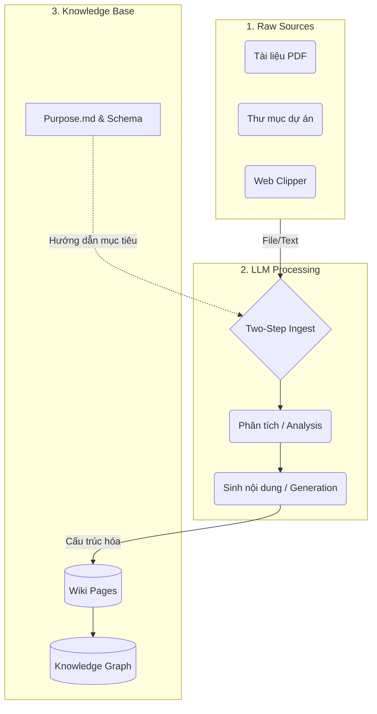

# L1. Kiến trúc cốt lõi và cơ chế nạp dữ liệu (Ingestion)

## 1. Agenda

**Thời gian đọc ước tính:** ~10 phút

### Learning outcome:
- **Hiểu** được bản chất vấn đề của RAG truyền thống và lý do hệ thống LLM Wiki ra đời.
- **Giải thích** được cơ chế Two-Step Chain-of-Thought Ingest bằng ngôn ngữ đại chúng.
- **Phân biệt** được sự khác nhau giữa rules (schema) và intent (purpose) trong quản trị tri thức.
- **Áp dụng** quy trình thiết lập nền tảng để tự xây dựng một hệ thống Second Brain cá nhân.

## 2. Glossary & Vocabulary

**Technical Terms (Thuật ngữ kỹ thuật):**

| Term | Vietnamese Meaning & Quick Explain |
| :--- | :--- |
| **Retrieval-Augmented Generation (RAG)** | Kỹ thuật tìm kiếm dữ liệu có sẵn rồi đưa cho AI đọc để trả lời. Điểm yếu là AI quên ngay sau đó và phải làm lại từ đầu ở câu hỏi sau. |
| **Ingestion** | Nạp dữ liệu. Quá trình hệ thống đọc, phân tích và biến tài liệu thô thành kiến thức có cấu trúc. |
| **Knowledge Graph** | Biểu đồ tri thức. Mạng lưới các khái niệm được liên kết với nhau bằng các mối quan hệ cụ thể. |

## 3. Vấn đề của RAG và Giải pháp của LLM Wiki (WHY)

**Thực trạng kỹ thuật hiện nay:**
1. Các hệ thống hỏi đáp tài liệu truyền thống (RAG) thường hoạt động theo mô hình *retrieve-and-answer from scratch* (tìm kiếm và trả lời lại từ đầu). Nghĩa là, mỗi khi người dùng đặt câu hỏi, hệ thống phải lặp lại quá trình tìm kiếm đoạn văn bản liên quan, ghép vào prompt, và yêu cầu LLM đọc lại từ đầu để sinh câu trả lời.
2. Vấn đề phát sinh khi quy mô dữ liệu lớn: việc nạp lại hàng nghìn token văn bản thô cho mỗi câu hỏi không chỉ tốn kém tài nguyên (token) mà còn khiến hệ thống thiếu đi bức tranh toàn cảnh. LLM không nhìn thấy các mối liên kết tiềm ẩn giữa các tài liệu khác nhau.

**Giải pháp cốt lõi:**
LLM Wiki giải quyết triệt để bài toán này bằng cách chuyển đổi quá trình phân tích sang giai đoạn tĩnh. Thay vì phân tích lại từ đầu ở mỗi câu hỏi, hệ thống sẽ tự động đọc, biên dịch, và liên kết các tài liệu thô thành một trang Wiki vĩnh viễn (incrementally builds). Kiến thức được "biên dịch" một lần và tái sử dụng mãi mãi.

## 4. Giải phẫu khái niệm LLM Wiki (WHAT)

**Định nghĩa:** LLM Wiki là một ứng dụng Desktop đa nền tảng, tự động biến các tài liệu thô thành một cơ sở tri thức có cấu trúc và liên kết đồ thị (Knowledge Base).

**Definition Anatomy (Giải phẫu định nghĩa):**
- **Cross-platform desktop application (Ứng dụng Desktop đa nền tảng):** Hệ thống chạy độc lập trên máy cá nhân (macOS, Windows, Linux) thay vì trên trình duyệt hay máy chủ đám mây, đảm bảo quyền riêng tư tuyệt đối (Privacy) cho các tài liệu nội bộ.
- **Interlinked knowledge base (Cơ sở tri thức liên kết):** Không chỉ là các file văn bản rời rạc, hệ thống tạo ra một mạng lưới tri thức (Knowledge Graph) liên kết các khái niệm với nhau dựa trên độ liên quan thực tế.
- **Automatically (Tự động):** Quá trình đọc, tóm tắt, trích xuất thực thể (entity) và liên kết được LLM thực hiện hoàn toàn tự động ở chế độ nền.

**Kiến trúc ba tầng (Three-layer Architecture):**



## 5. Cấu hình và Cơ chế nạp dữ liệu (HOW)

### 5.1. Khởi tạo "Linh hồn" của hệ thống (purpose.md)

Trước khi nạp bất kỳ tài liệu nào, hệ thống cần biết mục đích tồn tại của nó. Khác với `schema` (quy định cấu trúc dữ liệu), `purpose.md` định nghĩa *Intent* (ý định) của Wiki. LLM sẽ đọc file này ở mỗi lần nạp dữ liệu để quyết định xem thông tin nào là quan trọng cần giữ lại.

**Ví dụ một file purpose.md hiệu quả:**
```markdown
# Mục đích của Wiki này
Hệ thống này được xây dựng để nghiên cứu về các mô hình ngôn ngữ lớn (LLM) và ứng dụng thực tiễn trong công việc của Business Analyst.

# Câu hỏi trọng tâm
- Làm thế nào để tự động hóa luồng nghiệp vụ bằng AI?
- Những rào cản bảo mật (Privacy) nào cần lưu ý?
```

### 5.2. Cơ chế Two-Step Chain-of-Thought Ingest

Đây là trái tim của hệ thống LLM Wiki. Quá trình biến tài liệu thô thành kiến thức được chia làm hai bước tuần tự (Two-step) nhằm giảm thiểu ảo giác (Hallucination) và tăng tính liên kết.

1. **Bước 1 (Analysis - Phân tích):** LLM đọc tài liệu thô và cấu trúc hóa các ý chính. Nó phân tích các thực thể, khái niệm quan trọng, đối chiếu với kiến thức hiện có trong Wiki để tìm ra điểm tương đồng hoặc mâu thuẫn.
2. **Bước 2 (Generation - Sinh nội dung):** Từ bản phân tích ở Bước 1, LLM bắt đầu viết các trang Wiki mới, tạo file tóm tắt, bổ sung liên kết (cross-references) và gắn thẻ nguồn (source traceability).

Việc tách biệt Analysis và Generation cho phép LLM "suy nghĩ" thấu đáo trước khi đặt bút viết, giống như cách con người lập dàn ý trước khi viết bài.

## 6. Thảo luận và Đánh đổi (WHAT IF)

**Local Embeddings vs Cloud LLM API**

Việc sử dụng LLM Wiki đòi hỏi sự đánh đổi rõ ràng về tài nguyên phần cứng và bảo mật:
- Nếu thiết lập *Local Embeddings* (tạo vector hoàn toàn trên máy tính cá nhân): Hệ thống đảm bảo tính bảo mật tuyệt đối (100% Privacy) vì dữ liệu nội bộ không bao giờ rời khỏi thiết bị. Tuy nhiên, đánh đổi lại là tốc độ xử lý chậm hơn và yêu cầu máy tính cấu hình mạnh.
- Nếu sử dụng *Cloud API* (như OpenAI, Anthropic): Tốc độ nạp dữ liệu rất nhanh và kết quả phân tích sắc bén, nhưng người dùng phải chấp nhận gửi văn bản thô qua mạng internet và trả phí theo dung lượng token.

**Thời gian nạp dữ liệu (Ingestion Time)**

Quy trình Two-Step Ingest tốn thời gian tính toán hơn rất nhiều so với RAG thông thường khi đưa tài liệu vào hệ thống lần đầu. Tuy nhiên, lợi ích thu lại là độ trễ (latency) khi truy vấn sau này gần như bằng không, và chất lượng câu trả lời cao hơn hẳn nhờ kiến thức đã được "biên dịch" sẵn.

## 7. Tài liệu tham khảo

- [Repository gốc LLM Wiki (Nashsu)](https://github.com/nashsu/llm_wiki)
- [LLM Wiki Pattern của Andrej Karpathy](https://gist.github.com/karpathy/442a6bf555914893e9891c11519de94f)

---
*Made by Anh Tu - Share to be share*
