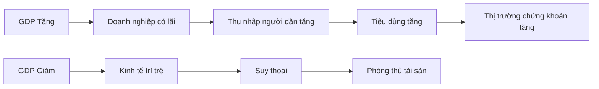
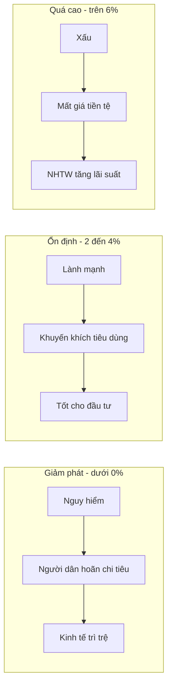
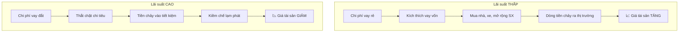
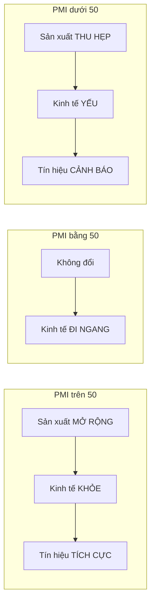
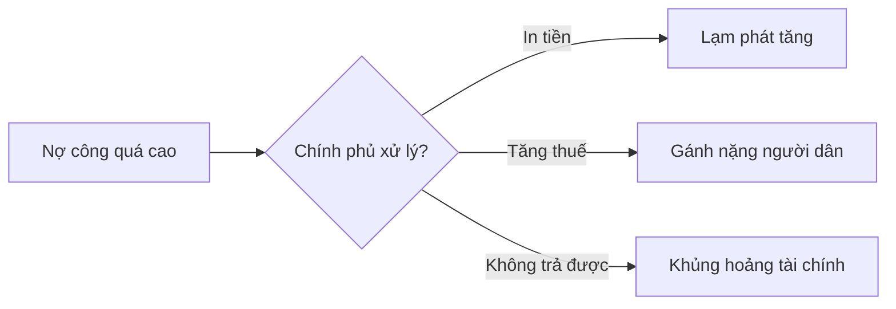
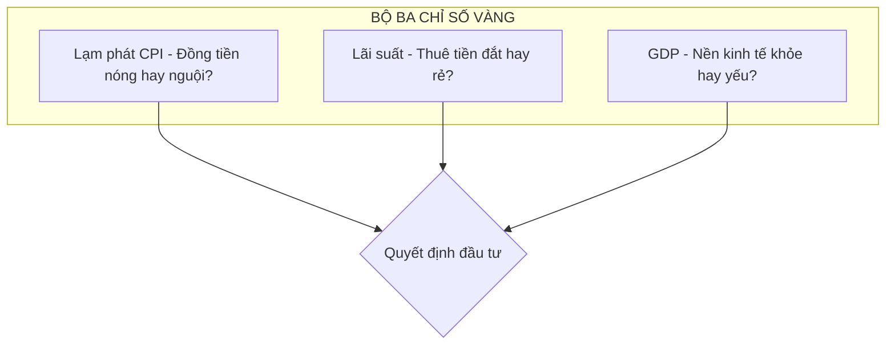

# Tổng Quan Các Chỉ Số Kinh Tế Vĩ Mô Quan Trọng

Các chỉ số kinh tế vĩ mô là những công cụ đo lường giúp chúng ta nắm bắt được **"sức khỏe" tổng thể của một nền kinh tế**, thay vì đi sâu vào từng cá nhân hay doanh nghiệp cụ thể.

Những chỉ số này đóng vai trò như **tấm bản đồ** hoặc **bảng điều khiển (dashboard)** giúp nhà đầu tư và người làm kinh doanh xác định thời điểm **"gieo hạt" (đầu tư)** hay **phòng thủ**.

---

## Bảng Tổng Quan 7 Chỉ Số Cốt Lõi

| Chỉ số | Ý nghĩa | Tín hiệu tốt | Tín hiệu xấu |
|--------|---------|--------------|--------------|
| **GDP** | Sức khỏe tổng thể nền kinh tế | Tăng trưởng ổn định | Suy giảm liên tục |
| **CPI/Lạm phát** | Tốc độ mất giá đồng tiền | 2-4%/năm | Trên 10% hoặc dưới 0% |
| **Lãi suất** | Chi phí thuê tiền | Thấp (kích thích) | Cao (thắt chặt) |
| **Thất nghiệp** | "Nỗi đau" nền kinh tế | 3-5% | Trên 8% |
| **Tỷ giá** | Sức mạnh đồng nội tệ | Ổn định | Biến động mạnh |
| **PMI** | Chỉ báo sớm sản xuất | Trên 50 | Dưới 50 |
| **Cán cân TM** | Xuất - Nhập khẩu | Xuất siêu | Nhập siêu lớn |

---

## 1. GDP (Tổng Sản Phẩm Quốc Nội)

> 💡 Đây là chỉ số **quan trọng nhất** phản ánh sức khỏe tổng thể của nền kinh tế.

### Định nghĩa

**GDP** (Gross Domestic Product) là tổng giá trị thị trường của tất cả hàng hóa và dịch vụ cuối cùng được sản xuất ra trong phạm vi lãnh thổ quốc gia trong một thời kỳ nhất định (thường là quý hoặc năm).

### Công thức tính

```
GDP = C + I + G + NX
```

| Ký hiệu | Tên gọi | Giải thích |
|---------|---------|------------|
| **C** | Consumption | Chi tiêu hộ gia đình |
| **I** | Investment | Đầu tư của doanh nghiệp |
| **G** | Government Spending | Chi tiêu chính phủ |
| **NX** | Net Exports | Xuất khẩu ròng (Xuất khẩu - Nhập khẩu) |

### Ý nghĩa đối với nhà đầu tư



- **GDP tăng trưởng ổn định**: Nền kinh tế phát triển, doanh nghiệp làm ăn có lãi, người dân có thu nhập tốt → Thời điểm tốt để đầu tư
- **GDP suy giảm**: Kinh tế trì trệ hoặc suy thoái → Thời điểm phòng thủ, tích lũy tiền mặt

---

## 2. Lạm Phát (CPI - Chỉ Số Giá Tiêu Dùng)

> 🌡️ Lạm phát được ví như **"nhiệt kế"** đo độ nóng của nền kinh tế và tốc độ mất giá của đồng tiền.

### Định nghĩa

**Lạm phát** là sự tăng mức giá chung của hàng hóa và dịch vụ theo thời gian, làm **giảm sức mua** của đồng tiền.

### Cách đo lường

| Chỉ số | Tên đầy đủ | Đặc điểm |
|--------|-----------|----------|
| **CPI** | Consumer Price Index | Dựa trên giỏ hàng hóa thiết yếu cố định |
| **PCE** | Personal Consumption Expenditures | Phản ánh hành vi thay đổi giỏ hàng của người tiêu dùng |

**Giỏ hàng CPI bao gồm:** Lương thực, xăng dầu, y tế, giáo dục, nhà ở...

### Mức độ lạm phát và ý nghĩa



| Mức độ | Tỷ lệ | Tác động |
|--------|-------|----------|
| **Ổn định** | 2-4%/năm | Tốt cho kinh tế, khuyến khích tiêu dùng và đầu tư |
| **Quá cao** | Trên 6% | Mất giá tiền tệ, khó lập kế hoạch kinh doanh, NHTW buộc phải tăng lãi suất |
| **Giảm phát** | Dưới 0% | Nguy hiểm, người dân hoãn chi tiêu gây trì trệ |

---

## 3. Lãi Suất (Interest Rates)

> ⚙️ Đây là **"cái phanh"** và **"chân ga"** của nền kinh tế, thường do Ngân hàng Trung ương điều tiết.

### Bản chất

**Lãi suất** là **chi phí của việc thuê (vay) tiền**.

### Cơ chế tác động



| Lãi suất | Tác động | Ảnh hưởng đến tài sản |
|----------|----------|----------------------|
| **Thấp** | Kích thích vay vốn để mua nhà, xe và mở rộng sản xuất | Chứng khoán, BĐS **tăng giá** |
| **Cao** | Người dân và doanh nghiệp thắt chặt chi tiêu | Chứng khoán, BĐS **giảm giá** |

---

## 4. Tỷ Lệ Thất Nghiệp

> 😰 Chỉ số này phản ánh **"nỗi đau"** của nền kinh tế và tác động trực tiếp đến sức tiêu thụ.

### Định nghĩa

**Tỷ lệ thất nghiệp** là tỷ lệ phần trăm lực lượng lao động **muốn làm việc** nhưng **không tìm được việc làm**.

### Ý nghĩa

| Mức độ | Ý nghĩa | Tác động |
|--------|---------|----------|
| **Cao - trên 8%** | Kinh tế khó khăn | Sức mua giảm, doanh nghiệp khó bán hàng |
| **Tự nhiên - 4-5%** | Cân bằng | Nền kinh tế hoạt động bình thường |
| **Quá thấp - dưới 3%** | Thị trường lao động nóng | Áp lực tăng lương → Lạm phát tăng |

### Vòng xoáy Tiền lương - Giá cả


---

## 5. Tỷ Giá Hối Đoái

> 💱 Chỉ số này cho biết **sức mạnh của đồng nội tệ** so với ngoại tệ (thường là USD).

### Tác động của biến động tỷ giá

| Tình huống | Xuất khẩu | Nhập khẩu | Lạm phát |
|------------|-----------|-----------|----------|
| **Đồng tiền YẾU (mất giá)** | ✅ Có lợi (hàng rẻ hơn với nước ngoài) | ❌ Bất lợi (hàng nhập đắt hơn) | ⬆️ Tăng |
| **Đồng tiền MẠNH (tăng giá)** | ❌ Bất lợi (hàng đắt hơn với nước ngoài) | ✅ Có lợi (hàng nhập rẻ hơn) | ⬇️ Giảm |

### Ví dụ thực tế

- **VND mất giá so với USD**: Gạo Việt Nam rẻ hơn trong mắt người Mỹ → Xuất khẩu gạo tăng
- **VND tăng giá so với USD**: iPhone nhập từ Mỹ rẻ hơn → Nhập khẩu tăng

---

## 6. Chỉ Số PMI (Purchasing Managers' Index)

> 🔮 Đây là một **chỉ số sớm (leading indicator)** báo hiệu xu hướng kinh tế **TRƯỚC KHI** GDP được công bố.

### Ý nghĩa

PMI đo lường **sức khỏe của ngành sản xuất và dịch vụ** dựa trên:
- Đơn hàng mới
- Mức tồn kho
- Tình hình tuyển dụng
- Thời gian giao hàng

### Cách đọc chỉ số



| Giá trị | Ý nghĩa | Hành động |
|---------|---------|-----------|
| **Trên 50** | Sản xuất đang **mở rộng** | Kinh tế khỏe, có thể mạo hiểm đầu tư |
| **Bằng 50** | Không đổi | Quan sát thêm |
| **Dưới 50** | Sản xuất đang **thu hẹp** | Kinh tế yếu, cân nhắc phòng thủ |

---

## 7. Cán Cân Thương Mại và Nợ Công

### Cán cân thương mại

**Định nghĩa:** Chênh lệch giữa **Xuất khẩu** và **Nhập khẩu**.

| Tình trạng | Ý nghĩa | Tác động |
|------------|---------|----------|
| **Xuất siêu** | Xuất lớn hơn Nhập | Tăng dự trữ ngoại hối, đồng tiền mạnh lên |
| **Nhập siêu** | Nhập lớn hơn Xuất | Giảm dự trữ ngoại hối, đồng tiền có thể yếu đi |

### Thâm hụt ngân sách & Nợ công

Khi chính phủ **chi nhiều hơn thu**, họ phải vay nợ.



**Rủi ro nợ công cao:**
- Khủng hoảng tài chính
- Lạm phát nếu chính phủ in tiền để trả nợ
- Mất niềm tin vào đồng tiền

---

## 💡 Công Thức "Ba Con Số" Cho Nhà Đầu Tư

Để đơn giản hóa việc theo dõi chu kỳ kinh tế, hãy tập trung vào **3 chỉ số cốt lõi** để xác định "thời tiết" thị trường:



| Chỉ số | Câu hỏi trả lời | Nguồn theo dõi |
|--------|-----------------|----------------|
| **1. Lạm phát (CPI)** | Đồng tiền đang nóng hay nguội? | Tổng cục Thống kê, Fed, ECB |
| **2. Lãi suất** | Giá thuê tiền đang đắt hay rẻ? | Ngân hàng Nhà nước, Fed |
| **3. GDP** | Nền kinh tế đang khỏe mạnh hay yếu ớt? | World Bank, GSO |

---

## Kết Luận

Hiểu rõ **7 chỉ số kinh tế vĩ mô** này giúp bạn:

1. ✅ Đọc được "bảng điều khiển" của nền kinh tế
2. ✅ Xác định thời điểm "gieo hạt" hay "thu hoạch"
3. ✅ Đưa ra quyết định đầu tư dựa trên dữ liệu, không phải cảm tính

> 📌 **Bài tiếp theo:** Chúng ta sẽ đi sâu vào từng chỉ số, bắt đầu với **GDP - Cách đọc và những điểm mù cần lưu ý**.
