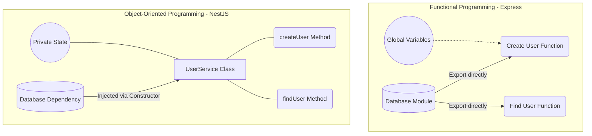

# OOP trong NestJS (Phần 1): Từ Function đến Class

## Agenda

**Thời gian đọc ước tính:** ~15 phút

### Learning outcome:
- **Hiểu** được bản chất của Object-Oriented Programming (*Lập trình hướng đối tượng*) trong môi trường NodeJS và nguyên nhân NestJS chọn kiến trúc này thay vì Functional Programming (*Lập trình hàm*).
- **Giải thích** được sự khác biệt cốt lõi giữa Function và Class về mặt quản lý trạng thái (State management).
- **Tự tay** chuyển đổi được một logic nghiệp vụ từ Express (Functional) sang cấu trúc NestJS (OOP).
- **Phân biệt** được cách thức hoạt động của từ khóa `this` trong Class và giải quyết triệt để lỗi mất Context khi truyền callback.

---

## Glossary & Vocabulary

**1. Technical Terms (Thuật ngữ kỹ thuật):**
| Term | Vietnamese Meaning & Quick Explain |
| :--- | :--- |
| **Functional Programming (FP)** | Lập trình hàm. Phương pháp lập trình dựa trên việc đánh giá các hàm toán học và tránh sự thay đổi trạng thái (state) và dữ liệu đột biến (mutable data). |
| **Object-Oriented Programming (OOP)** | Lập trình hướng đối tượng. Phương pháp lập trình dựa trên khái niệm về các "đối tượng" (objects), chứa cả dữ liệu (dưới dạng trường/thuộc tính) và mã (dưới dạng thủ tục/phương thức). |
| **Dependency Injection (DI)** | Tiêm phụ thuộc. Một kỹ thuật trong đó một đối tượng nhận các đối tượng khác mà nó phụ thuộc vào, thay vì tự tạo ra chúng. |
| **State** | Trạng thái. Tập hợp các giá trị của các biến trong một ứng dụng tại một thời điểm cụ thể. |
| **Context** | Ngữ cảnh thực thi. Thường liên quan đến giá trị của từ khóa `this` tại thời điểm một hàm được gọi. |

**2. Vocabulary Support (Từ vựng học thuật/B1+):**
| Word | Meaning in Context (Nghĩa trong ngữ cảnh) |
| :--- | :--- |
| **Encapsulated (adj)** | Được đóng gói, che giấu chi tiết bên trong. |
| **Explicitly (adv)** | Một cách tường minh, rõ ràng, không ngầm định. |
| **Boilerplate (n)** | Các đoạn code mang tính thủ tục, phải lặp đi lặp lại nhiều lần mà không thay đổi nhiều. |
| **Overhead (n)** | Chi phí phát sinh (về tài nguyên phần cứng hoặc thời gian bảo trì). |

---

## 1. WHY — Bài Toán Kỹ Thuật Khi Scale Ứng Dụng NodeJS

Đối với phần lớn lập trình viên xuất thân từ ReactJS hoặc ExpressJS, Functional Programming (*Lập trình hàm*) là cách tiếp cận mặc định. Tuy nhiên, khi hệ thống phát triển lớn hơn (Enterprise level), cấu trúc Functional trong Express bộc lộ nhiều điểm nghẽn kỹ thuật nghiêm trọng.

1. **State Management phân tán:** Trong Express, trạng thái (state) thường được lưu trữ ở cấp độ Module (module-level variables) hoặc bị rò rỉ qua các Closures. Điều này làm cho việc theo dõi sự thay đổi của dữ liệu trong một vòng đời Request trở nên rất khó lường.
2. **Hard-coded Dependencies:** Các modules trong Express thường `require()` hoặc `import` trực tiếp các dependencies của chúng (ví dụ: import thẳng instance của Database vào Controller). Việc này tạo ra sự kết dính chặt chẽ (Tight coupling), khiến cho việc viết Unit Test (mock database) trở thành một cực hình.
3. **Thiếu chuẩn mực cấu trúc (Lack of conventions):** Express không quy định cách tổ chức thư mục hay luồng dữ liệu. Một team 5 người có thể có 5 cách viết Controller khác nhau, dẫn đến chi phí bảo trì (Overhead) cực kỳ lớn khi onboarding người mới.

NestJS giải quyết các bài toán trên bằng cách áp dụng triệt để Object-Oriented Programming (*Lập trình hướng đối tượng*), kết hợp với Dependency Injection (*Tiêm phụ thuộc*). Cấu trúc này ép buộc lập trình viên phải tuân thủ một chuẩn mực duy nhất, tách biệt rõ ràng trách nhiệm của từng thành phần.

---

## 2. WHAT — Lập Trình Hướng Đối Tượng (OOP) Là Gì?

### 2.1. Định nghĩa kỹ thuật

Class (*Lớp*) là một bản thiết kế (blueprint) dùng để khởi tạo các đối tượng (objects), trong đó đóng gói (encapsulate) cả dữ liệu (State) và các hành vi (Behavior) xử lý dữ liệu đó thành một thực thể duy nhất.

### 2.2. Definition Anatomy (Giải phẫu định nghĩa)

- **Bản thiết kế (blueprint)**: Class không phải là dữ liệu thực tế đang chạy. Nó chỉ là khuôn mẫu. Khi bạn dùng từ khóa `new`, khuôn mẫu này mới tạo ra một thực thể sống trên bộ nhớ (được gọi là Instance).
- **Đóng gói (encapsulate)**: Tính năng giấu kín dữ liệu. Các biến bên trong Class có thể được bảo vệ khỏi sự can thiệp từ bên ngoài, chỉ cho phép thay đổi thông qua các hàm cụ thể.
- **Dữ liệu (State) và hành vi (Behavior)**: Trong Functional Programming, dữ liệu và hàm nằm rời rạc. Trong OOP, biến (dữ liệu) và hàm xử lý biến đó được gộp chung vào một Class.

### 2.3. Trực quan hóa Kiến trúc (Visual First)

Để hiểu rõ sự khác biệt giữa Functional và OOP, hãy xem sơ đồ luồng dữ liệu dưới đây:



Trong mô hình Functional, các hàm hoạt động độc lập và phụ thuộc trực tiếp vào các global variables hoặc các module bên ngoài. Trong mô hình OOP, mọi thứ (bao gồm State và Dependencies) đều được đóng gói gọn gàng bên trong Class, các hàm (Methods) chỉ giao tiếp nội bộ với Class của chúng.

---

## 3. HOW — Từ Function Đến Class Thực Chiến

### 3.1. Phân tích Functional Approach (Express)

Hãy xem một ví dụ thực tế về cách quản lý User trong Express:

```typescript
// filename: src/services/user.service.ts
import { database } from '../config/db'; // Hard-coded dependency

// Module-level state (Global đối với file này)
let userCount = 0;
const users = [];

export const createUser = (name: string, email: string) => {
  // Thay đổi global state
  userCount++;
  
  const user = { 
    id: userCount, 
    name, 
    email,
    createdAt: new Date()
  };
  
  users.push(user);
  
  // Gọi trực tiếp đến dependency
  database.save(user);
  
  return user;
};

export const getUserCount = () => {
  return userCount;
};
```

**Nhược điểm chết người:**
- Nếu bạn cần viết Unit Test cho hàm `createUser`, làm sao bạn ngăn chặn nó ghi dữ liệu vào Database thật? Rất khó, vì `database` được import trực tiếp.
- `userCount` chia sẻ chung cho mọi luồng (Request).

### 3.2. Xây dựng Class-based Approach (NestJS)

Bây giờ, chúng ta chuyển đổi logic trên sang cấu trúc OOP được sử dụng trong NestJS.

```typescript
// filename: src/users/user.service.ts
import { Injectable } from '@nestjs/common';

@Injectable()
export class UserService {
  // 1. Encapsulated State: Trạng thái chỉ tồn tại bên trong đối tượng này
  private userCount = 0;
  private users: any[] = [];

  // 2. Dependency Injection: Phụ thuộc được truyền vào từ bên ngoài
  constructor(private readonly database: DatabaseService) {}

  // 3. Behavior: Phương thức tương tác với state thông qua từ khóa 'this'
  public createUser(name: string, email: string) {
    this.userCount++;
    
    const user = { 
      id: this.userCount, 
      name, 
      email,
      createdAt: new Date()
    };
    
    this.users.push(user);
    
    // Gọi dependency thông qua context của class
    this.database.save(user);
    
    return user;
  }

  public getUserCount() {
    return this.userCount;
  }
}
```

Trong ví dụ trên:
- `userCount` không còn là biến toàn cục. Mỗi khi bạn khởi tạo `new UserService()`, nó sẽ có một `userCount` độc lập. (Lưu ý: Trong NestJS, Service thường là Singleton, chúng ta sẽ phân tích ở phần Design Patterns).
- `DatabaseService` không bị hard-code. Khi viết test, chúng ta chỉ cần truyền vào một Mock Database qua Constructor.

### 3.3. Xử lý Context với từ khóa `this`

Đây là rào cản lớn nhất đối với các lập trình viên chuyển từ Functional sang OOP. Trong Functional, bạn không cần quan tâm đến `this`. Nhưng trong Class, `this` là trái tim của sự đóng gói.

**Vấn đề mất Context:**

Hãy xem đoạn code sau:

```typescript
// filename: src/demo/context.demo.ts
class Logger {
  private prefix = '[APP]';

  printLog(message: string) {
    console.log(`${this.prefix} ${message}`);
  }
}

const myLogger = new Logger();

// Gọi trực tiếp: Hoạt động hoàn hảo
myLogger.printLog('System started'); // Output: [APP] System started

// Truyền method như một callback: MẤT CONTEXT
setTimeout(myLogger.printLog, 1000, 'Delayed log'); 
// Output: TypeError: Cannot read properties of undefined (reading 'prefix')
```

**Nguyên nhân (WHY):**
Từ khóa `this` trong JavaScript/TypeScript không được xác định tại thời điểm viết code, mà được xác định tại **thời điểm hàm được gọi** (Runtime binding).
Quy tắc vàng: `this` chính là **đối tượng đứng ngay trước dấu chấm** khi hàm được gọi.
- Ở `myLogger.printLog()`, đối tượng trước dấu chấm là `myLogger`. Nên `this` = `myLogger`.
- Khi truyền `myLogger.printLog` vào `setTimeout`, `setTimeout` sẽ tự gọi hàm đó dạng `printLog('Delayed log')` (không có dấu chấm). Trong Strict Mode, `this` trở thành `undefined`.

**Giải pháp (Arrow Functions):**

Để ép buộc `this` luôn trỏ về Class instance hiện tại, chúng ta sử dụng Arrow Function cho phương thức. Arrow Function không có `this` riêng của nó, mà nó kế thừa `this` từ phạm vi bao quanh nó (lexical scoping).

```typescript
// filename: src/demo/context.demo.ts
class Logger {
  private prefix = '[APP]';

  // Chuyển thành Arrow Function
  printLog = (message: string) => {
    console.log(`${this.prefix} ${message}`);
  }
}

const myLogger = new Logger();
setTimeout(myLogger.printLog, 1000, 'Delayed log'); 
// Output: [APP] Delayed log (Thành công!)
```

### 3.4. Quản lý Dependencies bằng Constructor

Trong kiến trúc của NestJS, việc khởi tạo các Class phụ thuộc lẫn nhau được thực hiện thông qua Constructor. Điều này tạo nền tảng cho Dependency Injection.

```typescript
// filename: src/users/user.controller.ts
import { Controller, Post, Body } from '@nestjs/common';

@Controller('users')
export class UserController {
  // Thay vì: private userService = new UserService(new DatabaseService());
  // Chúng ta yêu cầu NestJS cung cấp instance thông qua constructor:
  constructor(private readonly userService: UserService) {}

  @Post()
  create(@Body() body: any) {
    return this.userService.createUser(body.name, body.email);
  }
}
```

Cú pháp `constructor(private readonly userService: UserService)` là một Shorthand của TypeScript. Việc khai báo `private` hoặc `readonly` ngay trong tham số của constructor sẽ tự động tạo ra một thuộc tính tương ứng cho Class và gán giá trị cho nó, giúp giảm thiểu Boilerplate code.

---

## 4. Discussion Questions

1. **Về Memory Allocation:** Khi chúng ta tạo 100 instance của một Class, thì phương thức (method) được viết bằng Arrow Function (như `printLog = () => {}`) và phương thức thông thường (`printLog() {}`) sẽ tiêu tốn bộ nhớ khác nhau như thế nào? (Gợi ý: Prototype chain).
2. **Về Testing:** Việc sử dụng Constructor để truyền `DatabaseService` giúp cho quá trình viết Unit Test cho `UserService` trở nên dễ dàng ra sao so với việc import trực tiếp module? Hãy thử viết một đoạn code ngắn bằng Jest để minh họa.
3. **Trade-offs:** Mặc dù OOP giải quyết được vấn đề kết dính mã và dễ mở rộng, nhưng việc sử dụng OOP trong JavaScript (một ngôn ngữ vốn linh hoạt và thiên về hàm) có mang lại chi phí phát sinh (overhead) nào không?

---

*Made by Anh Tu - Share to be share*
