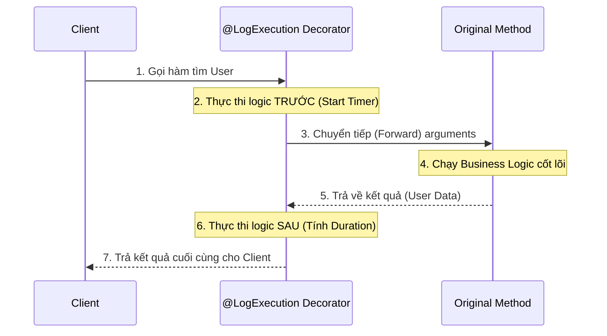

# OOP trong NestJS (Phần 2): Encapsulation & Decorators

## Agenda

**Thời gian đọc ước tính:** ~20 phút

### Learning outcome:
- **Hiểu** được nguyên lý Đóng gói (Encapsulation) trong OOP và vai trò sống còn của nó trong việc bảo vệ tính toàn vẹn dữ liệu.
- **Giải thích** được cơ chế hoạt động thực sự của Decorator dưới góc độ JavaScript/TypeScript thay vì chỉ coi nó là "phép thuật của framework".
- **Tự tay** tạo được Custom Decorator để giải quyết các bài toán Cross-cutting concerns (như Logging, Authentication).
- **Phân biệt** được vai trò của Metadata Reflection (*Phản chiếu siêu dữ liệu*) trong cách NestJS tự động hóa hệ thống Dependency Injection.

---

## Glossary & Vocabulary

**1. Technical Terms (Thuật ngữ kỹ thuật):**
| Term | Vietnamese Meaning & Quick Explain |
| :--- | :--- |
| **Encapsulation** | Đóng gói. Khái niệm giấu kín chi tiết triển khai bên trong một đối tượng và chỉ cung cấp các giao diện cần thiết ra bên ngoài. |
| **Decorator** | Hàm bổ trợ (Thường giữ nguyên từ tiếng Anh). Một tính năng của TypeScript cho phép đính kèm hành vi hoặc siêu dữ liệu vào Class, Method, Property hoặc Parameter mà không làm thay đổi logic lõi. |
| **Metadata Reflection** | Khả năng truy xuất siêu dữ liệu. Khả năng của chương trình có thể phân tích và sửa đổi cấu trúc (types, properties) của chính nó tại thời điểm chạy (Runtime). |
| **Cross-cutting concerns** | Mối quan tâm chéo. Các logic nghiệp vụ chung lặp lại ở nhiều nơi (Ví dụ: Ghi log, kiểm tra quyền hạn, xử lý lỗi) độc lập với logic lõi. |

**2. Vocabulary Support (Từ vựng học thuật/B1+):**
| Word | Meaning in Context (Nghĩa trong ngữ cảnh) |
| :--- | :--- |
| **Annotate (v)** | Chú thích. Đánh dấu một đoạn code bằng các thẻ (như `@Injectable`) để cung cấp thông tin phụ trợ. |
| **Mutate (v)** | Đột biến / Sửa đổi trạng thái của dữ liệu. Trái nghĩa với Immutable (Bất biến). |
| **Syntactic sugar (n)** | Cú pháp "kẹo ngọt". Các tính năng cú pháp được thiết kế để code dễ đọc và dễ viết hơn, nhưng bản chất bên dưới vẫn sử dụng cơ chế cũ. |

---

## 1. WHY — Tại Sao Cần Đóng Gói Và Decorator?

Trong quá trình xây dựng ứng dụng Enterprise với NodeJS, lập trình viên thường đối mặt với các vấn đề về quản lý trạng thái và mã nguồn lặp lại:

1. **Rủi ro đột biến dữ liệu trái phép:** Nếu một Service quản lý danh sách Users hoặc chứa các khóa bí mật (Secret keys) mà không có cơ chế bảo vệ, bất kỳ module nào khác cũng có thể can thiệp và ghi đè dữ liệu này (Mutate), gây ra các lỗi tiềm ẩn cực kỳ khó debug.
2. **Boilerplate Code lặp lại khắp nơi:** Mọi API Endpoint đều cần kiểm tra Authentication, đo thời gian thực thi (Performance timing), hoặc ghi Log. Nếu viết trực tiếp vào trong hàm xử lý logic, mã nguồn sẽ phình to và che lấp đi business logic cốt lõi.
3. **Cấu hình thủ công phức tạp (Imperative configuration):** Việc phải tự tay khởi tạo từng Controller, truyền từng Dependency vào các Services là một quá trình dài dòng và dễ sai sót. Các Framework hiện đại cần một cơ chế khai báo (Declarative) gọn gàng hơn.

Khái niệm Encapsulation giải quyết bài toán số 1. Và Decorator kết hợp với Metadata Reflection chính là giải pháp hoàn hảo của NestJS cho bài toán số 2 và số 3.

---

## 2. WHAT — Giải Phẫu Encapsulation & Decorators

### 2.1. Encapsulation (Đóng Gói) Là Gì?

Encapsulation là quá trình giới hạn quyền truy cập trực tiếp vào một số thành phần của đối tượng. 

**Definition Anatomy (Giải phẫu định nghĩa):**
- **Information Hiding** (*Che giấu thông tin*): Bảo vệ State (trạng thái) bên trong của đối tượng khỏi sự can thiệp từ bên ngoài.
- **Public Interface** (*Giao diện công khai*): Cung cấp các phương thức (Methods) có kiểm soát để bên ngoài có thể tương tác với State một cách an toàn.

### 2.2. Decorator Là Gì?

Nhiều người nghĩ Decorator là một tính năng độc quyền của NestJS, thực chất đây là một đề xuất của ECMAScript (JavaScript) và đã được TypeScript hỗ trợ từ lâu. 

**Definition Anatomy:**
- **Higher-order function** (*Hàm bậc cao*): Bản chất Decorator chỉ là một function nhận đầu vào là một function/class khác.
- **Wrapping** (*Bao bọc*): Nó bao bọc mục tiêu (Target) bên trong nó để thực thi thêm các logic phụ trợ (như Log, Validate) trước hoặc sau khi logic chính chạy.
- **Non-invasive** (*Không xâm lấn*): Code bên trong hàm chính không cần biết sự tồn tại của Decorator.

### 2.3. Metadata Reflection Là Gì?

Khi biên dịch từ TypeScript sang JavaScript, toàn bộ thông tin về kiểu dữ liệu (`String`, `Number`, `CustomClass`) sẽ bị xóa sạch (Type Erasure). Metadata Reflection giải quyết vấn đề này.

**Definition Anatomy:**
- **Meta-programming** (*Siêu lập trình*): Code viết ra code, hoặc code có khả năng đọc cấu trúc của chính nó.
- **Reflection** (*Phản chiếu*): Tính năng cho phép ứng dụng NestJS "nhìn" vào một tham số trong Constructor và biết được chính xác kiểu dữ liệu của nó là gì ở thời điểm chạy (Runtime) thông qua thư viện `reflect-metadata`.

### 2.4. Trực Quan Hóa Hoạt Động Của Method Decorator



---

## 3. HOW — Ứng Dụng Đóng Gói Và Tự Tạo Decorator

### 3.1. Thiết Lập Encapsulation Bằng Access Modifiers

TypeScript cung cấp các Access Modifiers (*Chỉ định truy cập*) để thực hiện việc đóng gói.

```typescript
// filename: src/users/user.service.ts
import { Injectable, ConflictException } from '@nestjs/common';
import * as bcrypt from 'bcrypt';

@Injectable()
export class UserService {
  // 1. private: Tuyệt đối không cho bên ngoài truy cập (Information Hiding)
  // 2. readonly: Đảm bảo biến chỉ được gán giá trị 1 lần
  private readonly users = new Map<string, any>();
  private readonly SALT_ROUNDS = 10;

  // 3. public (mặc định): Giao diện giao tiếp an toàn (Public Interface)
  public async createUser(email: string, password: string) {
    if (this.users.has(email)) {
      throw new ConflictException('Email đã tồn tại');
    }

    // Delegate công việc cho các private helpers
    const hashedPassword = await this.hashPassword(password);
    
    const user = { id: Date.now(), email, password: hashedPassword };
    this.users.set(email, user);
    
    return this.toPublicUser(user);
  }

  // Helper methods bị che giấu, controller không thể gọi hàm hashPassword()
  private async hashPassword(password: string): Promise<string> {
    return bcrypt.hash(password, this.SALT_ROUNDS);
  }

  private toPublicUser(user: any) {
    const { password, ...publicUser } = user; // Loại bỏ password trước khi trả về
    return publicUser;
  }
}
```

### 3.2. Hiểu Bản Chất Method Decorator Bằng Cách Tự Viết

Để ghi log thời gian thực thi của hàm `createUser` mà không phải chèn code `Date.now()` vào trong hàm đó, chúng ta sẽ viết một Custom Method Decorator.

```typescript
// filename: src/common/decorators/log-execution.decorator.ts

// Factory Pattern: Hàm trả về một Decorator function
export function LogExecution(customPrefix: string = 'EXEC'): MethodDecorator {
  
  // Trả về hàm Decorator thực sự
  return (
    target: any, 
    propertyKey: string | symbol, 
    descriptor: PropertyDescriptor
  ) => {
    // 1. Lưu lại tham chiếu của hàm gốc (Original method)
    const originalMethod = descriptor.value;

    // 2. Ghi đè (Mutate) hàm gốc bằng một hàm bọc (Wrapper)
    descriptor.value = async function (...args: any[]) {
      const className = target.constructor.name;
      const methodName = String(propertyKey);
      
      const start = Date.now();
      console.log(`[${customPrefix}] Bắt đầu chạy ${className}.${methodName}...`);
      
      try {
        // 3. Gọi hàm gốc thông qua .apply() và giữ nguyên 'this' context
        const result = await originalMethod.apply(this, args);
        
        // 4. Logic chạy SAU KHI hàm gốc hoàn thành
        const duration = Date.now() - start;
        console.log(`[${customPrefix}] Hoàn thành ${methodName} trong ${duration}ms`);
        
        return result;
      } catch (error) {
        console.error(`[${customPrefix}] Lỗi tại ${methodName}:`, error.message);
        throw error;
      }
    };

    return descriptor;
  };
}
```

**Sử dụng Decorator:**

```typescript
// filename: src/users/user.service.ts
import { LogExecution } from '../common/decorators/log-execution.decorator';

@Injectable()
export class UserService {
  // Chỉ cần annotate, business logic vẫn sạch sẽ
  @LogExecution('USER_SVC')
  public async createUser(email: string, password: string) {
    // ... business logic ...
  }
}
```

### 3.3. Tạo Parameter Decorator: `@CurrentUser`

Đây là một use-case cực kỳ phổ biến trong NestJS. Trong Controller, dữ liệu User thường được nhét vào đối tượng `request.user` bởi các Authentication Guard. Thay vì gọi `req.user` lặp đi lặp lại, ta làm một Decorator.

```typescript
// filename: src/common/decorators/current-user.decorator.ts
import { createParamDecorator, ExecutionContext } from '@nestjs/common';

// NestJS cung cấp sẵn hàm createParamDecorator
export const CurrentUser = createParamDecorator(
  (data: string, ctx: ExecutionContext) => {
    // switchToHttp() giúp lấy được Express Request object một cách an toàn
    const request = ctx.switchToHttp().getRequest();
    const user = request.user;

    // Nếu có truyền vào data (ví dụ: @CurrentUser('email')), trả về property đó
    // Nếu không, trả về toàn bộ object user
    return data ? user?.[data] : user;
  },
);
```

Sử dụng trong Controller:

```typescript
// filename: src/users/user.controller.ts
import { Controller, Get, UseGuards } from '@nestjs/common';

@Controller('users')
export class UserController {
  
  @Get('profile')
  @UseGuards(JwtAuthGuard)
  // Lấy toàn bộ User
  getProfile(@CurrentUser() user: any) {
    return user;
  }

  @Get('my-email')
  @UseGuards(JwtAuthGuard)
  // Chỉ lấy đúng email thông qua tham số 'data'
  getEmail(@CurrentUser('email') email: string) {
    return { email };
  }
}
```

### 3.4. Cắt Lớp Sự Thật Phía Sau `@Injectable()` và Metadata

Bạn đã bao giờ thắc mắc: Làm thế nào NestJS biết `UserController` cần truyền một bản sao của `UserService` vào constructor?

```typescript
// filename: src/users/user.controller.ts
@Controller('users')
export class UserController {
  // NestJS đọc từ đâu để biết tham số này có kiểu là UserService?
  constructor(private readonly userService: UserService) {}
}
```

Bí mật nằm ở `@Controller()` và `@Injectable()`. Chúng sử dụng thư viện `reflect-metadata` để ghi lại Type (Kiểu dữ liệu) của tham số trong quá trình biên dịch (Compilation).

Chúng ta có thể tự mình đọc metadata này:

```typescript
// filename: src/demo/reflection.demo.ts
import 'reflect-metadata';

// Nếu xóa decorator này, Reflect sẽ không lưu metadata cho class!
@Injectable() 
export class UserController {
  constructor(private readonly userService: UserService) {}
}

// Hàm này chính là cách NestJS Container hoạt động dưới hood:
function inspectDependencies(targetClass: any) {
  // Đọc danh sách các tham số trong Constructor
  const dependencies = Reflect.getMetadata('design:paramtypes', targetClass);
  
  console.log(`Class ${targetClass.name} phụ thuộc vào:`);
  dependencies.forEach(dep => console.log('- ', dep.name));
}

inspectDependencies(UserController);
// Kết quả trả về ở Runtime: 
// Class UserController phụ thuộc vào:
// - UserService
```

Khi NestJS khởi động, nó lặp qua tất cả các Controllers, dùng `Reflect.getMetadata('design:paramtypes')` để lấy danh sách Dependencies, tự động khởi tạo (tạo instance qua `new UserService()`), và tiêm vào Constructor.

### 3.5. Decorator Composition với `applyDecorators`

Trong các dự án thực tế, một Endpoint (API) thường bị gắn quá nhiều Decorators (Kiểm tra quyền, Gắn docs Swagger, Xác thực Token). NestJS cung cấp hàm `applyDecorators` để gom nhóm chúng lại thành một.

```typescript
// filename: src/common/decorators/auth.decorator.ts
import { applyDecorators, SetMetadata, UseGuards } from '@nestjs/common';
import { ApiBearerAuth, ApiUnauthorizedResponse } from '@nestjs/swagger';

export function Auth(...roles: string[]) {
  // Gom 4 decorators thành 1
  return applyDecorators(
    SetMetadata('roles', roles),
    UseGuards(JwtAuthGuard, RolesGuard),
    ApiBearerAuth(),
    ApiUnauthorizedResponse({ description: 'Không có quyền truy cập (Unauthorized)' }),
  );
}
```

Lúc này Controller sẽ cực kỳ gọn gàng:

```typescript
// filename: src/users/user.controller.ts
@Controller('admin')
export class AdminController {
  
  @Get('dashboard')
  @Auth('admin', 'super_admin') // Áp dụng 4 decorators cùng lúc
  getDashboard() {
    return "Secret Dashboard";
  }
}
```

*Lưu ý kỹ thuật*: `@ApiHideProperty()` từ thư viện `@nestjs/swagger` không tương thích với `applyDecorators` vì nó hoạt động ở cấp độ Property thay vì Method/Class.

---

## 4. Discussion Questions

1. **Về Performance:** Cơ chế Reflection và việc đọc metadata trong lúc ứng dụng đang chạy (Runtime) có gây ảnh hưởng tiêu cực đến hiệu suất (Latency) của ứng dụng không? Tại sao quá trình Dependency Injection của NestJS chỉ bị chậm ở giai đoạn khởi động (Bootstrap)?
2. **Về Design Pattern:** Decorator pattern được sử dụng trong TypeScript khác biệt như thế nào so với mẫu thiết kế Decorator truyền thống được định nghĩa trong bộ sách GOF (Gang of Four) vốn dùng tính kế thừa (Inheritance) hoặc giao diện (Interface)?
3. **Về Memory Limit:** Nếu chúng ta sử dụng Decorator `@CacheResult` để lưu kết quả của một hàm xử lý dữ liệu lớn trên RAM (In-memory), rủi ro lớn nhất về mặt vận hành là gì và làm thế nào để xử lý nó (Gợi ý: LRU Cache / Redis)?

---

*Made by Anh Tu - Share to be share*
