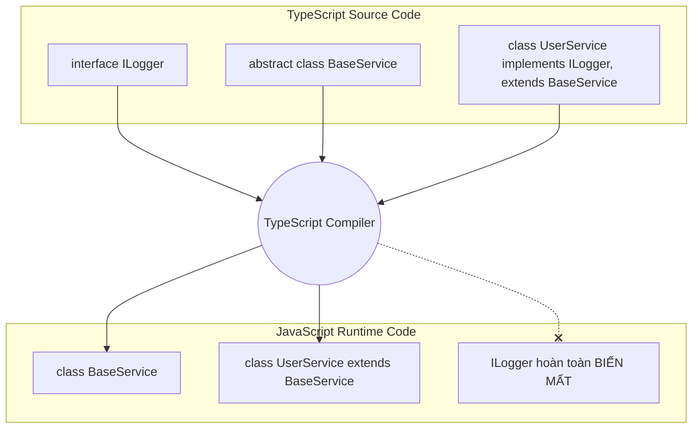

# OOP trong NestJS (Phần 3): Interface vs Abstract Class

## Agenda

**Thời gian đọc ước tính:** ~15 phút

### Learning outcome:
- **Hiểu** được sự khác biệt cốt lõi giữa Interface và Abstract Class trong hệ sinh thái TypeScript, đặc biệt là tính chất tồn tại ở thời gian thực thi (Runtime).
- **Giải thích** được nguyên nhân gốc rễ gây ra lỗi không thể dùng Interface làm Dependency Injection (DI) token trong NestJS và cách khắc phục.
- **Tự tay** thiết kế được một cấu trúc Repository Pattern cơ bản kết hợp giữa Abstract Class (để chia sẻ logic) và triển khai thực tế.
- **Phân biệt** được khi nào nên dùng `implements` (để ký kết hợp đồng dữ liệu) và khi nào nên dùng `extends` (để tái sử dụng logic chung).

---

## Glossary & Vocabulary

**1. Technical Terms (Thuật ngữ kỹ thuật):**
| Term | Vietnamese Meaning & Quick Explain |
| :--- | :--- |
| **Interface** | Giao diện / Hợp đồng. Định nghĩa hình dáng của đối tượng (các thuộc tính và phương thức bắt buộc phải có) nhưng không chứa logic thực thi. |
| **Abstract Class** | Lớp trừu tượng. Một lớp chưa hoàn chỉnh, không thể khởi tạo trực tiếp bằng từ khóa `new`, thường chứa cả phương thức trừu tượng và phương thức đã có logic (dùng chung). |
| **Type Erasure** | Xóa bỏ kiểu dữ liệu. Cơ chế của trình biên dịch TypeScript khi xóa bỏ hoàn toàn các thông tin về kiểu (như Interface, Type alias) lúc chuyển đổi mã sang JavaScript. |
| **Compile-time** | Thời gian biên dịch. Quá trình chuyển đổi từ mã nguồn TypeScript sang JavaScript. |
| **Runtime** | Thời gian chạy thực thi. Khi mã JavaScript đang được Node.js xử lý. |

**2. Vocabulary Support (Từ vựng học thuật/B1+):**
| Word | Meaning in Context (Nghĩa trong ngữ cảnh) |
| :--- | :--- |
| **Contract (n)** | Hợp đồng. Sự cam kết ràng buộc một Lớp (Class) phải triển khai đầy đủ các phương thức đã được định nghĩa. |
| **Vanish (v)** | Biến mất. Tình trạng của Interface sau khi đoạn code được biên dịch sang JavaScript. |
| **Workaround (n)** | Cách xử lý đường vòng. Một giải pháp thay thế khi cách làm thông thường không mang lại kết quả do giới hạn của ngôn ngữ hoặc framework. |

---

## 1. WHY — Vấn Đề Khi Sử Dụng Cấu Trúc Trừu Tượng

Đối với các lập trình viên chuyển từ Java hoặc C# sang TypeScript/NestJS, một trong những cú sốc lớn nhất là việc hệ thống Dependency Injection (DI) báo lỗi khi sử dụng Interface. 

Thực trạng phát triển ứng dụng gặp phải 3 vấn đề lớn xoay quanh tính trừu tượng:

1. **Lỗi DI với Interface:** Lập trình viên cố gắng áp dụng nguyên lý Dependency Inversion (thuộc SOLID) bằng cách inject một Interface vào Constructor. Kết quả là NestJS throw một lỗi đỏ lòm: `Nest can't resolve dependencies of the UserService (?). Please make sure that the argument is available...`
2. **Code lặp lại (Boilerplate):** Các Services (Ví dụ: `UserService`, `ProductService`, `OrderService`) thường lặp đi lặp lại các thao tác CRUD cơ bản (`findAll`, `findById`, `create`, `update`, `delete`). Nếu chỉ dùng Interface để ép kiểu, mỗi Service đều phải viết lại hàng chục dòng code giống hệt nhau.
3. **Sự nhầm lẫn vai trò:** Thiếu sự rạch ròi trong việc quyết định khi nào dùng `Type`, khi nào dùng `Interface`, và khi nào nên nâng cấp lên `Abstract Class`. 

Bài viết này sẽ giải phẫu bản chất của TypeScript Compile-time để giải quyết triệt để các rắc rối trên.

---

## 2. WHAT — Giải Phẫu Interface Và Abstract Class

### 2.1. Bản Chất Của Interface

Trong TypeScript, Interface đóng vai trò là một "Hợp đồng thiết kế". 

**Definition Anatomy (Giải phẫu định nghĩa):**
- **Contract** (*Hợp đồng cam kết*): Bất kỳ Class nào ký kết (`implements`) hợp đồng này, nó bắt buộc phải cung cấp logic thực thi cho toàn bộ các phương thức đã khai báo trong Interface.
- **Compile-time only** (*Chỉ tồn tại khi biên dịch*): Đây là đặc tính sống còn. Trình biên dịch TypeScript chỉ dùng Interface để kiểm tra lỗi cú pháp (Type checking). Khi dịch sang file `.js`, Interface hoàn toàn bốc hơi khỏi mã nguồn.
- **No implementation** (*Không có logic thực thi*): Interface tuyệt đối không được phép chứa bất kỳ một đoạn code logic nào. Nó chỉ chứa phần "vỏ" (Signature).

### 2.2. Bản Chất Của Abstract Class

Abstract Class sinh ra để lấp đầy khoảng trống giữa Interface (không có logic) và Class thông thường (logic hoàn chỉnh).

**Definition Anatomy:**
- **Incomplete Class** (*Lớp chưa hoàn chỉnh*): Lớp này bị gắn cờ "trừu tượng", nghĩa là bạn không thể gọi `new AbstractClass()`. Nó sinh ra chỉ để làm cha cho các lớp khác kế thừa (`extends`).
- **Shared logic** (*Chia sẻ logic*): Điểm ăn tiền của Abstract Class là nó cho phép bạn viết sẵn các hàm có logic thực thi hoàn chỉnh để các lớp con dùng chung, đồng thời vẫn có thể định nghĩa các hàm trừu tượng bắt lớp con tự viết.
- **Runtime presence** (*Tồn tại ở Runtime*): Sau khi biên dịch, Abstract Class biến thành một Class tiêu chuẩn trong JavaScript. Do đó, nó vẫn sống sót trên bộ nhớ khi Node.js chạy.

### 2.3. Trực Quan Hóa Quá Trình Biên Dịch (Type Erasure)

Sơ đồ dưới đây minh họa sự khác biệt chí mạng giữa hai khái niệm này khi đi qua màng lọc của TypeScript Compiler (tsc).



---

## 3. HOW — Ứng Dụng Trong Thực Tế Với NestJS

### 3.1. Bí Ẩn Về Lỗi DI Khi Dùng Interface

Trong bài trước, chúng ta đã biết NestJS dùng `Reflect.getMetadata('design:paramtypes')` để tự động đọc thông tin tham số trong Constructor.

Hãy xem điều gì xảy ra nếu bạn cố inject một Interface:

```typescript
// filename: src/users/interfaces/user-repository.interface.ts
export interface IUserRepository {
  findUsers(): Promise<any[]>;
}

// filename: src/users/user.service.ts
import { Injectable } from '@nestjs/common';
import { IUserRepository } from './interfaces/user-repository.interface';

@Injectable()
export class UserService {
  // ❌ LỖI: NestJS sẽ không thể Inject đoạn code này
  constructor(private readonly userRepository: IUserRepository) {}
}
```

**Nguyên nhân (WHY):**
Khi biên dịch sang JavaScript, `IUserRepository` bốc hơi (Type Erasure). Lệnh `Reflect.getMetadata` của NestJS sẽ nhận về giá trị là `Object` thay vì kiểu dữ liệu cụ thể. NestJS không biết phải tìm Provider nào có tên là `Object` để inject vào, do đó ứng dụng bị Crash ngay khi khởi động.

**Cách khắc phục 1 (Workaround với String Token):**
Sử dụng một chuỗi (String) hoặc Symbol làm Token thay cho Class.

```typescript
// Định nghĩa một hằng số chuỗi
export const USER_REPO_TOKEN = 'USER_REPOSITORY';

@Injectable()
export class UserService {
  constructor(
    // Dùng @Inject để báo cho NestJS biết cần tìm Token dạng chuỗi
    @Inject(USER_REPO_TOKEN) 
    private readonly userRepository: IUserRepository
  ) {}
}
```

Mặc dù cách này giải quyết được vấn đề, nhưng nó làm phát sinh thêm các biến hằng số (Constants) rải rác khắp nơi, làm mất đi sự thanh lịch vốn có của Constructor Injection.

### 3.2. Giải Pháp Toàn Diện: Dùng Abstract Class Làm DI Token

NestJS Docs chính thức khuyến nghị sử dụng Abstract Class như một giải pháp thay thế hoàn hảo cho Interface trong hệ thống DI. Vì Abstract Class sống sót qua quá trình biên dịch, NestJS có thể đọc được tên của nó ở Runtime.

```typescript
// filename: src/users/repositories/user-repository.abstract.ts

// 1. Định nghĩa Abstract Class (Đóng vai trò như một Interface)
export abstract class AbstractUserRepository {
  // Định nghĩa hàm trừu tượng, bắt buộc lớp con phải triển khai
  abstract findUsers(): Promise<any[]>;
  abstract findById(id: string): Promise<any>;
}
```

Bây giờ, trong Controller hoặc Service, bạn có thể inject trực tiếp một cách "sạch sẽ":

```typescript
// filename: src/users/user.service.ts
import { Injectable } from '@nestjs/common';
import { AbstractUserRepository } from './repositories/user-repository.abstract';

@Injectable()
export class UserService {
  // ✅ HOẠT ĐỘNG HOÀN HẢO: Không cần dùng @Inject('STRING_TOKEN')
  constructor(private readonly userRepository: AbstractUserRepository) {}

  async getUsers() {
    return this.userRepository.findUsers();
  }
}
```

Cuối cùng, trong Module, bạn chỉ cho NestJS biết lớp thực tế nào sẽ đảm nhận vị trí của Abstract Class này:

```typescript
// filename: src/users/user.module.ts
import { Module } from '@nestjs/common';
import { MongoUserRepository } from './repositories/mongo-user.repository';

@Module({
  providers: [
    {
      provide: AbstractUserRepository, // Khi ai đó cần AbstractUserRepository
      useClass: MongoUserRepository,   // Hãy giao cho họ MongoUserRepository (đã có logic thật)
    }
  ]
})
export class UserModule {}
```

### 3.3. Xây Dựng Base Repository Pattern (Kế Thừa Logic)

Nếu bạn có nhiều Collections/Tables trong cơ sở dữ liệu, việc tạo Abstract Class cho từng Repository là chưa đủ tối ưu. Thay vào đó, chúng ta có thể lợi dụng đặc tính "Shared logic" của Abstract Class để viết CRUD chung (Base Repository).

```typescript
// filename: src/common/repositories/base.repository.ts

// Chứa logic chung cho mọi entity
export abstract class BaseRepository<T> {
  // Lớp con bắt buộc phải truyền model/collection vào qua constructor của lớp cha
  constructor(protected readonly databaseModel: any) {}

  // Logic chung, viết 1 lần dùng mãi mãi
  async findAll(): Promise<T[]> {
    return this.databaseModel.find();
  }

  async findById(id: string): Promise<T> {
    return this.databaseModel.findOne({ id });
  }

  // Phương thức trừu tượng, tùy từng Entity sẽ có nghiệp vụ riêng
  abstract doSomethingSpecial(): void;
}
```

Implement cho User:

```typescript
// filename: src/users/repositories/user.repository.ts
import { Injectable } from '@nestjs/common';
import { BaseRepository } from '../../common/repositories/base.repository';

@Injectable()
// Extends để nhận miễn phí hàm findAll và findById
export class UserRepository extends BaseRepository<UserEntity> {
  constructor(private readonly userModel: UserModel) {
    // Gọi super() để truyền model lên cho lớp Base xử lý
    super(userModel);
  }

  // Bắt buộc phải triển khai hàm này do đã ký hợp đồng với BaseRepository
  doSomethingSpecial(): void {
    console.log('Sending welcome email to new user...');
  }
  
  // Có thể tự do thêm các method đặc thù
  async findByEmail(email: string) {
    return this.databaseModel.findOne({ email });
  }
}
```

---

## 4. Discussion Questions

1. **Về Performance & Bundle Size:** Việc lạm dụng Abstract Class (bị biên dịch ra mã JavaScript rác nếu không chứa logic dùng chung) thay vì dùng Interface (hoàn toàn biến mất khi biên dịch) có làm tăng đáng kể dung lượng file bundle (Kích thước file cuối) của ứng dụng Node.js không? Có đáng bận tâm không?
2. **Về Tính Linh Hoạt (Multiple Inheritance):** Trong TypeScript, một Class có thể `implements` (ký hợp đồng) với nhiều Interface cùng lúc (VD: `class User implements ILogger, IAuditable`). Tuy nhiên, nó chỉ có thể `extends` (kế thừa) duy nhất MỘT Abstract Class. Nếu bạn có một `UserRepository` vừa cần thừa kế logic CRUD từ `BaseRepository`, vừa cần thừa kế logic ghi log từ `BaseLogger`, bạn sẽ giải quyết rào cản đơn kế thừa này như thế nào? (Gợi ý: Mixins Pattern hoặc Composition over Inheritance).

---

*Made by Anh Tu - Share to be share*
