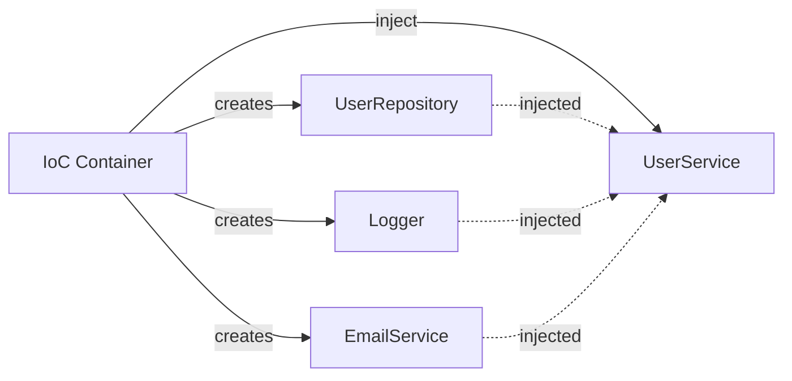

# 💉 OOP trong NestJS (Phần 4): Dependency Injection

> 🎯 **Mục tiêu**: Hiểu bản chất DI, IoC Container, và hoàn thiện inject `IUserRepository` vào `UserService`.

<!--truncate-->

---

## 📌 Recap từ Phần 1-3

| Phần | Đã học | UserService evolution |
|------|--------|----------------------|
| 1 | Class vs Function | Functional → Class-based |
| 2 | Encapsulation, Decorators | Thêm @Injectable(), private methods |
| 3 | Interface, Abstract Class | Tạo IUserRepository, BaseRepository |

**Vấn đề cuối Phần 3**: Làm sao inject `IUserRepository` vào `UserService`?

```typescript
@Injectable()
export class UserService {
  constructor(
    private readonly userRepository: IUserRepository  // ← Làm sao inject?
  ) {}
}
```

---

## 1. TẠI SAO CẦN DEPENDENCY INJECTION?

### 1.1 Vấn đề với Manual Instantiation

```typescript
// ❌ Không có DI - Hard dependencies
class UserService {
  private userRepository: InMemoryUserRepository;
  private logger: ConsoleLogger;
  private emailService: SendGridEmailService;

  constructor() {
    // Tự tạo dependencies
    this.userRepository = new InMemoryUserRepository();
    this.logger = new ConsoleLogger();
    this.emailService = new SendGridEmailService('api-key-hardcoded');
  }

  async create(dto: CreateUserDto) {
    this.logger.log('Creating user...');
    const user = await this.userRepository.create(dto);
    await this.emailService.send(user.email, 'Welcome!');
    return user;
  }
}

// Khi test:
const service = new UserService();
// ❌ Không thể mock userRepository
// ❌ Không thể mock emailService (thực sự gửi email!)
// ❌ Muốn đổi sang PostgreSQL? Phải sửa code!
```

### 1.2 Với Dependency Injection

```typescript
// ✅ Có DI - Dependencies được inject
class UserService {
  constructor(
    private userRepository: IUserRepository,
    private logger: ILogger,
    private emailService: IEmailService
  ) {}

  async create(dto: CreateUserDto) {
    this.logger.log('Creating user...');
    const user = await this.userRepository.create(dto);
    await this.emailService.send(user.email, 'Welcome!');
    return user;
  }
}

// Production:
const service = new UserService(
  new PostgresUserRepository(db),
  new CloudWatchLogger(),
  new SendGridEmailService(process.env.SENDGRID_KEY)
);

// Testing:
const service = new UserService(
  new MockUserRepository(),
  new MockLogger(),
  new MockEmailService()  // Không gửi email thật!
);
```

### 1.3 Lợi ích của DI

| Lợi ích | Giải thích |
|---------|-----------|
| **Loose Coupling** | UserService không biết về implementation cụ thể |
| **Testability** | Dễ dàng inject mocks |
| **Flexibility** | Đổi implementation không sửa code |
| **Single Responsibility** | Tạo dependencies không phải việc của UserService |

---

## 2. IOC CONTAINER - NGƯỜI QUẢN LÝ

### 2.1 IoC là gì?

**Inversion of Control**: Đảo ngược quyền kiểm soát việc tạo dependencies.

```
Không IoC:
  UserService tự tạo dependencies

Có IoC:
  Container tạo dependencies → inject vào UserService
```



### 2.2 NestJS IoC Container hoạt động thế nào?

```typescript
// 1. Khai báo providers trong Module
@Module({
  providers: [
    UserService,           // Class được quản lý
    UserRepository,        // Dependency
    Logger,                // Dependency
  ],
  controllers: [UserController]
})
export class UserModule {}

// 2. NestJS đọc metadata từ @Injectable()
@Injectable()
export class UserService {
  constructor(
    private userRepository: UserRepository,
    private logger: Logger
  ) {}
}

// 3. Khi cần UserService, NestJS:
//    a. Tìm UserRepository trong providers
//    b. Tìm Logger trong providers
//    c. Tạo instance của cả hai
//    d. Inject vào UserService constructor
//    e. Trả về UserService instance
```

### 2.3 Token - Chìa Khóa Của DI

```typescript
// Token = ID để NestJS tìm provider

// Token kiểu 1: Class reference (default)
@Injectable()
class UserRepository {}

providers: [UserRepository]  // Token là UserRepository class

// Token kiểu 2: String
providers: [
  {
    provide: 'USER_REPOSITORY',  // String token
    useClass: UserRepository
  }
]

// Token kiểu 3: Symbol (unique)
const USER_REPO = Symbol('USER_REPOSITORY');

providers: [
  {
    provide: USER_REPO,
    useClass: UserRepository
  }
]
```

---

## 3. CÁC LOẠI PROVIDERS

### 3.1 Standard Provider (useClass)

```typescript
// Cách ngắn
providers: [UserService]

// Tương đương với
providers: [
  {
    provide: UserService,    // Token
    useClass: UserService    // Implementation
  }
]
```

### 3.2 Value Provider (useValue)

```typescript
// Inject giá trị cố định
providers: [
  {
    provide: 'CONFIG',
    useValue: {
      database: 'postgres',
      port: 5432,
      debug: process.env.NODE_ENV !== 'production'
    }
  }
]

// Sử dụng
@Injectable()
class DatabaseService {
  constructor(@Inject('CONFIG') private config: DatabaseConfig) {
    console.log(this.config.database);  // 'postgres'
  }
}
```

### 3.3 Factory Provider (useFactory)

```typescript
// Tạo provider với logic phức tạp
providers: [
  {
    provide: 'DATABASE_CONNECTION',
    useFactory: async (config: ConfigService) => {
      const connection = await createConnection({
        host: config.get('DB_HOST'),
        port: config.get('DB_PORT'),
        username: config.get('DB_USER'),
        password: config.get('DB_PASS'),
        database: config.get('DB_NAME'),
      });
      return connection;
    },
    inject: [ConfigService]  // Dependencies của factory
  }
]
```

### 3.4 Alias Provider (useExisting)

```typescript
// Alias cho provider khác
providers: [
  UserRepository,
  {
    provide: 'AliasRepo',
    useExisting: UserRepository  // Trỏ đến cùng instance
  }
]
```

### 3.5 Bảng So Sánh

| Provider Type | Dùng khi | Ví dụ |
|---------------|----------|-------|
| `useClass` | Inject class implementation | Service, Repository |
| `useValue` | Inject giá trị tĩnh | Config, constants |
| `useFactory` | Cần logic khởi tạo | DB connection, async init |
| `useExisting` | Alias cho provider có sẵn | Backward compatibility |

---

## 4. INJECT INTERFACE - VẤN ĐỀ VÀ GIẢI PHÁP

### 4.1 Vấn đề: Interface không tồn tại ở Runtime

```typescript
// ❌ Không hoạt động - Interface biến mất sau compile
@Injectable()
export class UserService {
  constructor(private userRepository: IUserRepository) {}
}

// Error: Nest can't resolve dependencies of UserService
// IUserRepository không còn ở runtime!
```

### 4.2 Giải pháp 1: String Token

```typescript
// interfaces/user-repository.interface.ts
export const USER_REPOSITORY = 'USER_REPOSITORY';

export interface IUserRepository {
  create(user: CreateUserData): Promise<User>;
  findByEmail(email: string): Promise<User | null>;
  // ...
}

// user.module.ts
@Module({
  providers: [
    UserService,
    {
      provide: USER_REPOSITORY,
      useClass: InMemoryUserRepository
    }
  ]
})
export class UserModule {}

// user.service.ts
@Injectable()
export class UserService {
  constructor(
    @Inject(USER_REPOSITORY) 
    private readonly userRepository: IUserRepository
  ) {}
}
```

### 4.3 Giải pháp 2: Abstract Class as Token

```typescript
// Abstract class TỒN TẠI ở runtime → có thể dùng làm token
export abstract class UserRepository {
  abstract create(user: CreateUserData): Promise<User>;
  abstract findByEmail(email: string): Promise<User | null>;
  abstract findById(id: string): Promise<User | null>;
  abstract update(id: string, data: Partial<User>): Promise<User>;
  abstract delete(id: string): Promise<void>;
}

// Implementation
@Injectable()
export class InMemoryUserRepository extends UserRepository {
  private users = new Map<string, User>();

  async create(user: CreateUserData): Promise<User> {
    // implementation
  }
  // ... other methods
}

// Module
@Module({
  providers: [
    UserService,
    {
      provide: UserRepository,  // Abstract class as token
      useClass: InMemoryUserRepository
    }
  ]
})
export class UserModule {}

// UserService - Không cần @Inject!
@Injectable()
export class UserService {
  constructor(private readonly userRepository: UserRepository) {}
}
```

### 4.4 So sánh 2 Giải pháp

| Approach | Ưu điểm | Nhược điểm |
|----------|---------|------------|
| String Token | Rõ ràng, flexible | Cần @Inject decorator |
| Abstract Class | Không cần @Inject | Ít flexible hơn |

---

## 5. HOÀN THIỆN USERSERVICE

### 5.1 Folder Structure

```
src/
├── users/
│   ├── interfaces/
│   │   └── user-repository.interface.ts
│   ├── repositories/
│   │   ├── base.repository.ts
│   │   ├── in-memory-user.repository.ts
│   │   └── typeorm-user.repository.ts
│   ├── dto/
│   │   ├── create-user.dto.ts
│   │   └── update-user.dto.ts
│   ├── entities/
│   │   └── user.entity.ts
│   ├── user.service.ts
│   ├── user.controller.ts
│   └── user.module.ts
```

### 5.2 Interface và Token

```typescript
// interfaces/user-repository.interface.ts
export const USER_REPOSITORY = 'USER_REPOSITORY';

export interface IUserRepository {
  create(data: CreateUserData): Promise<User>;
  findByEmail(email: string): Promise<User | null>;
  findById(id: string): Promise<User | null>;
  update(id: string, data: UpdateUserData): Promise<User>;
  delete(id: string): Promise<void>;
}

export interface CreateUserData {
  email: string;
  password: string;
  name: string;
}

export interface UpdateUserData {
  name?: string;
  password?: string;
}

export interface User {
  id: string;
  email: string;
  password: string;
  name: string;
  createdAt: Date;
  updatedAt: Date;
}
```

### 5.3 Base Repository

```typescript
// repositories/base.repository.ts
export abstract class BaseRepository<T> {
  protected abstract entityName: string;

  protected generateId(): string {
    return `${this.entityName}_${Date.now()}_${Math.random().toString(36).substr(2, 9)}`;
  }

  protected log(operation: string, details?: any): void {
    console.log(`[${this.entityName}Repository] ${operation}`, details || '');
  }

  protected now(): Date {
    return new Date();
  }
}
```

### 5.4 In-Memory Implementation

```typescript
// repositories/in-memory-user.repository.ts
import { Injectable } from '@nestjs/common';
import { BaseRepository } from './base.repository';
import { IUserRepository, User, CreateUserData, UpdateUserData } from '../interfaces/user-repository.interface';

@Injectable()
export class InMemoryUserRepository 
  extends BaseRepository<User> 
  implements IUserRepository {
  
  protected entityName = 'User';
  private users = new Map<string, User>();

  async create(data: CreateUserData): Promise<User> {
    const now = this.now();
    const user: User = {
      id: this.generateId(),
      ...data,
      createdAt: now,
      updatedAt: now
    };
    this.users.set(user.id, user);
    this.log('CREATE', { id: user.id, email: user.email });
    return user;
  }

  async findByEmail(email: string): Promise<User | null> {
    const user = [...this.users.values()].find(u => u.email === email);
    this.log('FIND_BY_EMAIL', { email, found: !!user });
    return user || null;
  }

  async findById(id: string): Promise<User | null> {
    const user = this.users.get(id);
    this.log('FIND_BY_ID', { id, found: !!user });
    return user || null;
  }

  async update(id: string, data: UpdateUserData): Promise<User> {
    const user = this.users.get(id);
    if (!user) throw new Error('User not found');
    
    const updated: User = { 
      ...user, 
      ...data, 
      updatedAt: this.now() 
    };
    this.users.set(id, updated);
    this.log('UPDATE', { id });
    return updated;
  }

  async delete(id: string): Promise<void> {
    const deleted = this.users.delete(id);
    this.log('DELETE', { id, success: deleted });
  }
}
```

### 5.5 UserService Hoàn Chỉnh

```typescript
// user.service.ts
import { Injectable, Inject, ConflictException, NotFoundException } from '@nestjs/common';
import * as bcrypt from 'bcrypt';
import { USER_REPOSITORY, IUserRepository, User, CreateUserData } from './interfaces/user-repository.interface';
import { CreateUserDto } from './dto/create-user.dto';
import { UpdateUserDto } from './dto/update-user.dto';

export interface UserResponse {
  id: string;
  email: string;
  name: string;
  createdAt: Date;
}

@Injectable()
export class UserService {
  private readonly SALT_ROUNDS = 10;

  constructor(
    @Inject(USER_REPOSITORY)
    private readonly userRepository: IUserRepository
  ) {}

  async create(dto: CreateUserDto): Promise<UserResponse> {
    // Check duplicate email
    const existing = await this.userRepository.findByEmail(dto.email);
    if (existing) {
      throw new ConflictException('Email already exists');
    }

    // Hash password
    const hashedPassword = await bcrypt.hash(dto.password, this.SALT_ROUNDS);

    // Create user
    const user = await this.userRepository.create({
      email: dto.email,
      password: hashedPassword,
      name: dto.name
    });

    return this.toPublicUser(user);
  }

  async findById(id: string): Promise<UserResponse> {
    const user = await this.userRepository.findById(id);
    if (!user) {
      throw new NotFoundException('User not found');
    }
    return this.toPublicUser(user);
  }

  async findByEmail(email: string): Promise<User | null> {
    return this.userRepository.findByEmail(email);
  }

  async validatePassword(email: string, password: string): Promise<User | null> {
    const user = await this.userRepository.findByEmail(email);
    if (!user) return null;
    
    const isValid = await bcrypt.compare(password, user.password);
    return isValid ? user : null;
  }

  async update(id: string, dto: UpdateUserDto): Promise<UserResponse> {
    const updates: any = { ...dto };
    
    if (dto.password) {
      updates.password = await bcrypt.hash(dto.password, this.SALT_ROUNDS);
    }

    const user = await this.userRepository.update(id, updates);
    return this.toPublicUser(user);
  }

  async delete(id: string): Promise<void> {
    await this.userRepository.delete(id);
  }

  private toPublicUser(user: User): UserResponse {
    return {
      id: user.id,
      email: user.email,
      name: user.name,
      createdAt: user.createdAt
    };
  }
}
```

### 5.6 Module Configuration

```typescript
// user.module.ts
import { Module } from '@nestjs/common';
import { UserService } from './user.service';
import { UserController } from './user.controller';
import { USER_REPOSITORY } from './interfaces/user-repository.interface';
import { InMemoryUserRepository } from './repositories/in-memory-user.repository';

@Module({
  controllers: [UserController],
  providers: [
    UserService,
    {
      provide: USER_REPOSITORY,
      useClass: InMemoryUserRepository
    }
  ],
  exports: [UserService]  // Export để modules khác dùng
})
export class UserModule {}
```

### 5.7 Switching to TypeORM (Bonus)

```typescript
// repositories/typeorm-user.repository.ts
import { Injectable } from '@nestjs/common';
import { InjectRepository } from '@nestjs/typeorm';
import { Repository } from 'typeorm';
import { UserEntity } from '../entities/user.entity';
import { IUserRepository, User, CreateUserData, UpdateUserData } from '../interfaces/user-repository.interface';

@Injectable()
export class TypeOrmUserRepository implements IUserRepository {
  constructor(
    @InjectRepository(UserEntity)
    private readonly repo: Repository<UserEntity>
  ) {}

  async create(data: CreateUserData): Promise<User> {
    const entity = this.repo.create(data);
    return this.repo.save(entity);
  }

  async findByEmail(email: string): Promise<User | null> {
    return this.repo.findOne({ where: { email } });
  }

  async findById(id: string): Promise<User | null> {
    return this.repo.findOne({ where: { id } });
  }

  async update(id: string, data: UpdateUserData): Promise<User> {
    await this.repo.update(id, data);
    return this.findById(id);
  }

  async delete(id: string): Promise<void> {
    await this.repo.delete(id);
  }
}

// Đổi provider - UserService KHÔNG CẦN SỬA!
@Module({
  imports: [TypeOrmModule.forFeature([UserEntity])],
  providers: [
    UserService,
    {
      provide: USER_REPOSITORY,
      useClass: TypeOrmUserRepository  // Chỉ đổi dòng này!
    }
  ]
})
export class UserModule {}
```

---

## 6. TESTING VỚI DI

```typescript
// user.service.spec.ts
import { Test, TestingModule } from '@nestjs/testing';
import { UserService } from './user.service';
import { USER_REPOSITORY, IUserRepository } from './interfaces/user-repository.interface';

describe('UserService', () => {
  let service: UserService;
  let mockRepository: jest.Mocked<IUserRepository>;

  beforeEach(async () => {
    // Tạo mock repository
    mockRepository = {
      create: jest.fn(),
      findByEmail: jest.fn(),
      findById: jest.fn(),
      update: jest.fn(),
      delete: jest.fn(),
    };

    const module: TestingModule = await Test.createTestingModule({
      providers: [
        UserService,
        {
          provide: USER_REPOSITORY,
          useValue: mockRepository  // Inject mock
        }
      ],
    }).compile();

    service = module.get<UserService>(UserService);
  });

  describe('create', () => {
    it('should create user successfully', async () => {
      // Arrange
      const dto = { email: 'test@example.com', password: 'password123', name: 'Test User' };
      const expectedUser = { id: '1', email: dto.email, name: dto.name, password: 'hashed', createdAt: new Date(), updatedAt: new Date() };
      
      mockRepository.findByEmail.mockResolvedValue(null);
      mockRepository.create.mockResolvedValue(expectedUser);

      // Act
      const result = await service.create(dto);

      // Assert
      expect(result.email).toBe(dto.email);
      expect(result.name).toBe(dto.name);
      expect(mockRepository.findByEmail).toHaveBeenCalledWith(dto.email);
      expect(mockRepository.create).toHaveBeenCalled();
    });

    it('should throw conflict if email exists', async () => {
      const dto = { email: 'existing@example.com', password: 'password123', name: 'Test' };
      mockRepository.findByEmail.mockResolvedValue({ id: '1' } as any);

      await expect(service.create(dto)).rejects.toThrow('Email already exists');
    });
  });
});
```

---

## 7. BÀI TẬP THỰC HÀNH

### 📝 Câu hỏi Lý thuyết

| # | Câu hỏi | Gợi ý đáp án |
|---|---------|--------------|
| 1 | DI giúp gì cho testing? | Có thể inject mock thay vì real dependencies |
| 2 | IoC Container là gì? | Quản lý việc tạo và inject dependencies |
| 3 | Tại sao không thể inject interface trực tiếp? | Interface không tồn tại ở runtime |
| 4 | useFactory khác useClass thế nào? | useFactory cho phép logic khởi tạo phức tạp |

### 💻 Bài tập Code

**Tạo provider với useFactory:**

```typescript
// Yêu cầu: Tạo DatabaseConnection provider
// - Đọc config từ ConfigService
// - Nếu NODE_ENV=test → return MockConnection
// - Nếu NODE_ENV=production → return RealConnection
// - Log connection status

providers: [
  {
    provide: 'DATABASE_CONNECTION',
    useFactory: (config: ConfigService) => {
      // TODO: Implement
    },
    inject: [ConfigService]
  }
]
```

---

## 🔗 Tiếp theo

**[Phần 5: SOLID Principles →](./05-solid.md)**

Trong phần tiếp theo, chúng ta sẽ:
- Hiểu 5 nguyên tắc SOLID
- Áp dụng DIP (Dependency Inversion) đã học
- Refactor UserService theo SRP
- Ví dụ Strategy Pattern cho NotificationService

---

## 📚 Tóm tắt Phần 4

| Concept | Giải thích |
|---------|------------|
| **DI** | Inject dependencies thay vì tự tạo |
| **IoC** | Container quản lý việc tạo và inject |
| **Token** | ID để tìm provider (class, string, symbol) |
| **useClass** | Inject class implementation |
| **useValue** | Inject giá trị tĩnh |
| **useFactory** | Logic khởi tạo phức tạp |
| **@Inject()** | Chỉ định token khi inject |

> 💡 **Takeaway**: DI là core của NestJS. Hiểu DI = Hiểu cách NestJS hoạt động.
