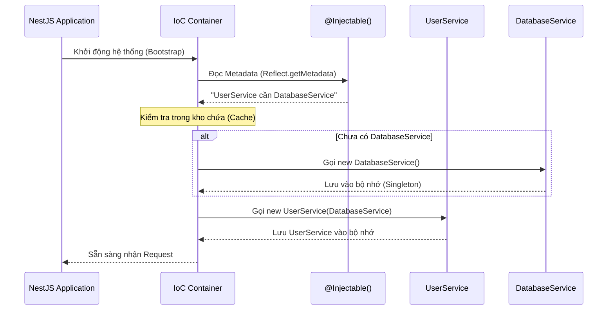

# OOP trong NestJS (Phần 4): Dependency Injection & IoC Container

## Agenda

**Thời gian đọc ước tính:** ~20 phút

### Learning outcome:
- **Hiểu** được nguyên lý Inversion of Control (IoC) và cách Dependency Injection (DI) giải quyết bài toán kết dính mã (Tight coupling).
- **Giải thích** được cơ chế hoạt động của IoC Container trong NestJS dưới góc độ đồ thị phụ thuộc (Dependency Graph).
- **Tự tay** cấu hình được các loại Custom Providers nâng cao như `useValue`, `useFactory`, `useClass`.
- **Phân biệt** được khi nào nên dùng Constructor Injection tiêu chuẩn, khi nào dùng Property-based Injection và cách xử lý Optional Dependency.

---

## Glossary & Vocabulary

**1. Technical Terms (Thuật ngữ kỹ thuật):**
| Term | Vietnamese Meaning & Quick Explain |
| :--- | :--- |
| **Inversion of Control (IoC)** | Đảo ngược quyền điều khiển. Nguyên lý thiết kế trong đó quy trình quản lý luồng điều khiển của ứng dụng được chuyển giao cho một Framework thay vì do lập trình viên tự viết code thủ tục. |
| **Dependency Injection (DI)** | Tiêm phụ thuộc. Kỹ thuật lập trình (một dạng của IoC) trong đó một đối tượng cung cấp các phụ thuộc của một đối tượng khác thông qua hàm tạo (Constructor) hoặc thuộc tính (Property). |
| **IoC Container** | Bộ chứa IoC. Bộ máy cốt lõi của NestJS chịu trách nhiệm khởi tạo, quản lý vòng đời và kết nối các Providers lại với nhau. |
| **Provider** | Nhà cung cấp. Bất kỳ thực thể nào (Class, Value, Factory) được đăng ký với NestJS để có thể được "inject" vào nơi khác. |
| **Circular Dependency** | Phụ thuộc vòng tròn. Lỗi kiến trúc khi Service A cần Service B, và Service B lại cần Service A. |

**2. Vocabulary Support (Từ vựng học thuật/B1+):**
| Word | Meaning in Context (Nghĩa trong ngữ cảnh) |
| :--- | :--- |
| **Tight coupling (n)** | Kết dính chặt chẽ. Trạng thái mà hai đoạn code phụ thuộc lẫn nhau đến mức không thể thay đổi một cái mà không làm hỏng cái kia. |
| **Mocking (n)** | Giả lập. Kỹ thuật tạo ra một đối tượng giả với hành vi có thể kiểm soát được để phục vụ cho việc viết Unit Test. |
| **Opaque (adj)** | Đục, mờ đục. Dùng để chỉ các đoạn mã mà các phần phụ thuộc của nó bị giấu kín bên trong, người ngoài không nhìn thấy được. |

---

## 1. WHY — Bài Toán Kết Dính (Tight Coupling)

Hãy tưởng tượng bạn đang viết một `UserService` cần kết nối với cơ sở dữ liệu để lưu người dùng. Cách tiếp cận truyền thống (không dùng DI) thường sẽ là tự khởi tạo (Instantiate) đối tượng bên trong Class:

```typescript
// filename: src/users/user.service.ts
import { PostgresDatabase } from '../database/postgres.db';

export class UserService {
  private database: PostgresDatabase;

  constructor() {
    // ❌ LỖI THIẾT KẾ: Tự tay khởi tạo dependency
    this.database = new PostgresDatabase('localhost:5432');
  }

  saveUser(user: any) {
    this.database.save(user);
  }
}
```

Cách viết này tạo ra 3 vấn đề kỹ thuật nghiêm trọng:

1. **Tight Coupling (Kết dính chặt chẽ):** `UserService` bị "trói chặt" với `PostgresDatabase`. Nếu ngày mai công ty chuyển sang dùng MongoDB, bạn bắt buộc phải sửa trực tiếp mã nguồn của `UserService`.
2. **Opaque Dependencies (Phụ thuộc bị giấu kín):** Nhìn vào giao diện public của class, lập trình viên khác không thể biết được `UserService` cần `PostgresDatabase` để hoạt động, cho đến khi họ đọc dòng code bên trong Constructor.
3. **Unit Test bất khả thi:** Khi viết test cho `UserService`, bạn không thể ngăn nó kết nối đến Database thật, vì dòng `new PostgresDatabase()` đã bị đóng cứng bên trong. Việc truyền một "Database giả" (Mocking) vào là không thể.

Nguyên lý Inversion of Control (IoC) kết hợp với Dependency Injection (DI) ra đời để "cởi trói" cho các Class. Thay vì Class tự tìm và tự tạo đồ nghề (Dependencies) cho mình, Framework sẽ đảm nhận việc chuẩn bị sẵn đồ nghề và "tiêm" (Inject) chúng vào Class.

---

## 2. WHAT — Giải Phẫu Cơ Chế Tiêm Phụ Thuộc

### 2.1. Inversion of Control (IoC) Là Gì?

**Definition Anatomy (Giải phẫu định nghĩa):**
- **Inversion** (*Đảo ngược*): Chuyển giao trách nhiệm từ Class sang Framework.
- **Control** (*Quyền điều khiển*): Quyền khởi tạo và quản lý vòng đời đối tượng.

Trong NestJS, IoC Container chính là người "nhạc trưởng". Nó biết mọi Class cần gì và sẽ cung cấp đúng thứ đó lúc ứng dụng khởi động.

### 2.2. Dependency Injection (DI) Là Gì?

DI là cách thực hành cụ thể của IoC.

**Definition Anatomy:**
- **Dependency** (*Phụ thuộc*): Đối tượng mà Class đang cần (Ví dụ: DatabaseService, LoggerService).
- **Injection** (*Tiêm vào*): Hành động truyền đối tượng đó từ bên ngoài vào bên trong Class, thường là thông qua các tham số của hàm tạo (Constructor).

### 2.3. Trực Quan Hóa Luồng Hoạt Động Của IoC Container

Sơ đồ dưới đây mô tả cách bộ máy NestJS phân tích và giải quyết các phụ thuộc ở thời điểm khởi động (Bootstrap).



---

## 3. HOW — Ứng Dụng Dependency Injection Trong NestJS

### 3.1. Cấu Hình Chuẩn Bằng `@Injectable()`

Cách cơ bản nhất (Standard Provider) là đánh dấu Class bằng `@Injectable()` và truyền nó vào mảng `providers` của Module. NestJS sẽ tự động dùng tên Class làm Token định danh (Identity Token) và tạo instance.

```typescript
// filename: src/users/user.service.ts
import { Injectable } from '@nestjs/common';
import { DatabaseService } from '../database/database.service';

@Injectable() // Báo cho IoC Container quản lý Class này
export class UserService {
  // 1. Dependency được khai báo rõ ràng ở Constructor
  // 2. Chuyển quyền khởi tạo cho NestJS
  constructor(private readonly database: DatabaseService) {}
}
```

```typescript
// filename: src/users/user.module.ts
import { Module } from '@nestjs/common';
import { UserService } from './user.service';
import { DatabaseService } from '../database/database.service';

@Module({
  // Tương đương với: [{ provide: UserService, useClass: UserService }]
  providers: [UserService, DatabaseService],
})
export class UserModule {}
```

### 3.2. Sức Mạnh Của Custom Providers

Sức mạnh thực sự của DI không nằm ở Constructor Injection, mà nằm ở khả năng tùy biến Providers tại cấp độ Module.

#### A. Value Provider (`useValue`)

Rất hữu ích khi bạn muốn inject một hằng số cấu hình, hoặc truyền Mock Object khi viết Unit Test.

```typescript
// filename: src/users/user.module.spec.ts
const mockDatabaseService = {
  save: (user) => console.log('Mock saved user:', user),
};

@Module({
  providers: [
    UserService,
    {
      provide: DatabaseService,      // Khi một class yêu cầu DatabaseService
      useValue: mockDatabaseService, // Đừng khởi tạo cái thật, hãy tiêm giá trị Mock này vào
    },
  ],
})
export class UserTestModule {}
```

#### B. Factory Provider (`useFactory`)

Dùng khi việc khởi tạo một Provider đòi hỏi logic phức tạp, hoặc phải tải các thông tin bất đồng bộ (như kết nối đến Database, gọi API lấy Config).

```typescript
// filename: src/database/database.module.ts
import { Module } from '@nestjs/common';

@Module({
  providers: [
    {
      provide: 'DATABASE_CONNECTION',
      // Factory có thể nhận các dependencies khác thông qua mảng 'inject'
      useFactory: async (configService: ConfigService) => {
        // Logic khởi tạo phức tạp
        const host = configService.get('DB_HOST');
        const connection = await createConnection(host);
        return connection;
      },
      // NestJS sẽ resolve ConfigService và truyền vào useFactory
      inject: [ConfigService], 
    },
  ],
})
export class DatabaseModule {}
```

#### C. Class Provider (`useClass`)

Giúp ghi đè (Override) implementation mà không ảnh hưởng đến các class đang sử dụng. Rất hữu ích khi kết hợp với Abstract Class (đã thảo luận ở Phần 3).

```typescript
// filename: src/logging/logger.module.ts
const environment = process.env.NODE_ENV;

@Module({
  providers: [
    {
      provide: BaseLogger,
      // Tính đa hình: Tùy môi trường mà dùng Logger khác nhau
      useClass: environment === 'production' ? CloudWatchLogger : ConsoleLogger,
    },
  ],
})
export class LoggerModule {}
```

### 3.3. Các Kỹ Thuật Injection Nâng Cao

#### A. Optional Providers (`@Optional`)

Đôi khi một class phụ thuộc vào một Service có cũng được, không có cũng không sao. Nếu không tìm thấy, NestJS thường sẽ báo lỗi Crash ứng dụng. Để ngăn lỗi này, dùng `@Optional()`.

```typescript
// filename: src/analytics/analytics.service.ts
import { Injectable, Optional, Inject } from '@nestjs/common';

@Injectable()
export class AnalyticsService {
  constructor(
    // Nếu Module không cung cấp 'HTTP_OPTIONS', httpClient sẽ là undefined
    @Optional() 
    @Inject('HTTP_OPTIONS') 
    private readonly httpClient: any
  ) {}

  trackEvent(event: string) {
    if (this.httpClient) {
      this.httpClient.send(event);
    } else {
      console.log('Chạy local, bỏ qua tracking event:', event);
    }
  }
}
```

#### B. Property-based Injection

Đây là một kỹ thuật dùng để thay thế Constructor Injection. Theo chuẩn, bạn **LUÔN NÊN** dùng Constructor Injection để dependencies được hiển thị rõ ràng. Tuy nhiên, nếu một Class kế thừa (extends) một Class khác và gọi `super()` với quá nhiều tham số, việc này sẽ trở nên cồng kềnh.

```typescript
// filename: src/common/services/base.service.ts
@Injectable()
export class BaseService {
  // Thay vì truyền qua constructor bắt lớp con phải gọi super(logger)
  // Hãy tiêm thẳng vào thuộc tính (Property)
  @Inject(LoggerService)
  protected readonly logger: LoggerService;
}

// filename: src/users/user.service.ts
@Injectable()
export class UserService extends BaseService {
  // Không cần khai báo constructor rườm rà
  
  doSomething() {
    // Có thể sử dụng ngay
    this.logger.log('Action performed');
  }
}
```

> ⚠️ **Official Warning**: *"If your class doesn't extend another class, it's generally better to use constructor-based injection."* Constructor injection rõ ràng hơn, không bị giấu kín (Opaque) và dễ mock hơn khi test.

---

## 4. Discussion Questions

1. **Về Circular Dependency:** Giả sử bạn có `UserService` inject `AuthService`, và `AuthService` lại inject `UserService`. IoC Container sẽ bị treo (Crash) vì không biết khởi tạo ai trước. NestJS cung cấp hàm `forwardRef()` để giải quyết vòng lặp này. Theo bạn, dưới góc nhìn kiến trúc phần mềm, việc dùng `forwardRef()` là một "phép thuật" hay là một dấu hiệu (Code smell) cho thấy thiết kế hệ thống đang có vấn đề về sự phân tách trách nhiệm (Separation of Concerns)?
2. **Về Singleton Scope vs Memory Limit:** Mặc định mọi Provider trong NestJS đều là Singleton (Khởi tạo 1 lần và dùng chung cho mọi Request). Nếu bạn lưu một mảng dữ liệu tạm thời vào một private property của `UserService`, điều gì sẽ xảy ra sau 1 triệu lượt Request từ người dùng (Memory Leak)? Làm thế nào để giải quyết vấn đề này nếu bắt buộc phải lưu trạng thái của từng Request riêng biệt?

---

*Made by Anh Tu - Share to be share*
