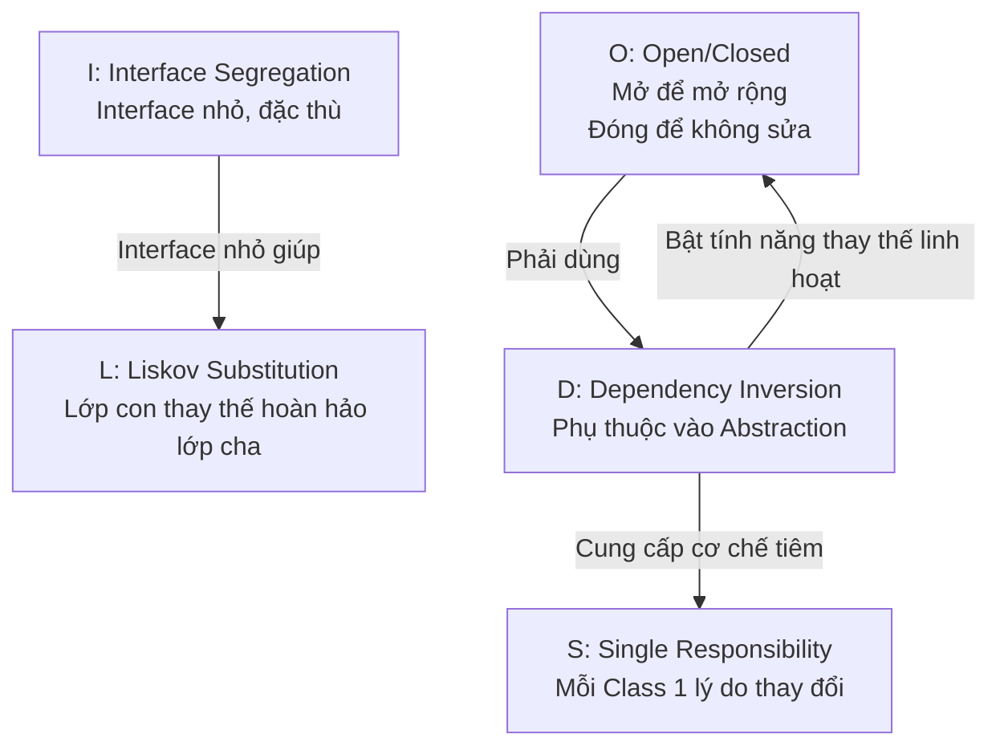

# OOP trong NestJS (Phần 5): SOLID Principles

## Agenda

**Thời gian đọc ước tính:** ~20 phút

### Learning outcome:

- **Hiểu** được lý do tại sao 5 nguyên tắc SOLID xuất hiện và bài toán thực tế mà chúng giải quyết trong các dự án Enterprise.
- **Giải thích** được từng nguyên tắc bằng ngôn ngữ đơn giản, kèm theo ví dụ vi phạm (Before) và ví dụ tuân thủ (After) trong NestJS.
- **Tự tay** refactor được một Class vi phạm nhiều nguyên tắc SOLID thành một cấu trúc chuẩn mực.
- **Phân biệt** được sự khác nhau giữa Dependency Inversion Principle (DIP) và Dependency Injection (DI) — hai khái niệm thường bị nhầm lẫn với nhau.

---

## Glossary & Vocabulary

**1. Technical Terms (Thuật ngữ kỹ thuật):**

| Term                                            | Vietnamese Meaning & Quick Explain                                                                                                                                                  |
| :---------------------------------------------- | :---------------------------------------------------------------------------------------------------------------------------------------------------------------------------------- |
| **Single Responsibility Principle (SRP)** | Nguyên tắc Đơn Trách Nhiệm. Một Class chỉ nên có một lý do duy nhất để thay đổi.                                                                                   |
| **Open/Closed Principle (OCP)**           | Nguyên tắc Đóng/Mở. Mã nguồn nên mở để mở rộng thêm tính năng mới, nhưng đóng để tránh sửa đổi mã hiện có.                                             |
| **Liskov Substitution Principle (LSP)**   | Nguyên tắc Thay Thế Liskov. Các lớp con phải có thể thay thế hoàn toàn lớp cha mà không làm hỏng hành vi của chương trình.                                     |
| **Interface Segregation Principle (ISP)** | Nguyên tắc Phân Tách Giao Diện. Không nên ép một Class phải triển khai các hàm mà nó không cần dùng đến.                                                        |
| **Dependency Inversion Principle (DIP)**  | Nguyên tắc Đảo Ngược Phụ Thuộc. Module cấp cao không nên phụ thuộc trực tiếp vào Module cấp thấp, cả hai nên phụ thuộc vào Abstraction (Trừu tượng hóa). |

**2. Vocabulary Support (Từ vựng học thuật/B1+):**

| Word                          | Meaning in Context (Nghĩa trong ngữ cảnh)                                                                                        |
| :---------------------------- | :---------------------------------------------------------------------------------------------------------------------------------- |
| **Cohesion (n)**        | Tính gắn kết. Mức độ mà các phần trong một Class hoặc Module liên quan chặt chẽ với nhau về cùng một mục đích. |
| **Refactor (v)**        | Tái cấu trúc. Cải thiện cấu trúc nội bộ của mã nguồn mà không thay đổi hành vi ra ngoài.                          |
| **Substitutable (adj)** | Có thể thay thế được. Một đối tượng có thể được sử dụng ở bất kỳ vị trí nào yêu cầu kiểu cha của nó.   |

---

## 1. WHY — Nguồn Gốc Của SOLID

Năm 2003, Robert C. Martin (biệt danh "Uncle Bob") tổng hợp 5 nguyên tắc thiết kế hướng đối tượng thành bộ quy tắc SOLID. Đây không phải là các quy tắc lý thuyết xa vời, mà được đúc kết từ thực tiễn đau thương khi làm việc với các hệ thống Enterprise quy mô lớn.

Codebase vi phạm SOLID thường bộc lộ 3 vấn đề kỹ thuật tiêu biểu:

1. **Hiệu ứng cánh bướm (Butterfly Effect):** Sửa một tính năng nhỏ trong một Class gây ra hàng loạt lỗi ở những Class hoàn toàn không liên quan. Nguyên nhân: Class đang ôm đồm quá nhiều trách nhiệm.
2. **Sửa mã để thêm tính năng:** Thêm một loại thanh toán mới (ví dụ: ZaloPay) đòi hỏi phải chui vào sửa Class `PaymentService` gốc. Nguyên nhân: Class chưa được thiết kế để "mở rộng mà không phải sửa đổi".
3. **Test kéo theo cả thế giới:** Muốn test hàm gửi email lại phải khởi động cả database. Nguyên nhân: Phụ thuộc giữa các Module quá dày đặc và không qua tầng Abstraction.

NestJS chính thức khuyến nghị tuân thủ SOLID (xem `providers.md`): *"We strongly recommend following the SOLID principles."*

---

## 2. WHAT — Giải Phẫu 5 Nguyên Tắc SOLID

### 2.1. Tổng Quan Kiến Trúc

Sơ đồ sau thể hiện cách 5 nguyên tắc SOLID bổ trợ lẫn nhau để tạo ra một hệ thống NestJS sạch, bền vững.



---

## 3. HOW — Áp Dụng SOLID Trong NestJS

### 3.1. S — Single Responsibility Principle (SRP)

**Nguyên tắc:** Một class (lớp) chỉ nên đảm nhận một trách nhiệm duy nhất, và chỉ có một lý do duy nhất để thay đổi class đó.

**Vi phạm — "God Class" ôm đồm mọi thứ:**

```typescript
// filename: src/users/user.service.ts
@Injectable()
export class UserService {
  // Vi phạm: Một Class vừa xử lý nghiệp vụ User, vừa gửi Email, vừa ghi Log
  
  async createUser(email: string, password: string) {
    const user = { id: 1, email, password };
  
    // Nghiệp vụ 1: Lưu vào DB
    this.database.save(user);

    // Nghiệp vụ 2: Gửi email chào mừng
    const emailBody = `<h1>Chào mừng ${email}!</h1>`;
    this.smtpClient.send({ to: email, body: emailBody });

    // Nghiệp vụ 3: Ghi Log
    const log = `[${new Date().toISOString()}] User created: ${email}`;
    fs.appendFileSync('/var/log/app.log', log);
  
    return user;
  }
}
```

Hậu quả: Khi cần thay đổi template email hoặc cách ghi log, lập trình viên phải đụng vào `UserService` — một Class không liên quan đến email hay logging. Mỗi lần sửa là một lần rủi ro làm hỏng logic tạo User.

**Tuân thủ — Phân tách thành các Class chuyên biệt:**

```typescript
// filename: src/users/user.service.ts
@Injectable()
export class UserService {
  constructor(
    private readonly databaseService: DatabaseService,
    private readonly emailService: EmailService,
    private readonly loggerService: LoggerService,
  ) {}

  // Chỉ còn 1 trách nhiệm duy nhất: Điều phối việc tạo User
  async createUser(email: string, password: string) {
    const user = await this.databaseService.save({ email, password });
    // Ủy thác hoàn toàn cho các Service chuyên biệt
    await this.emailService.sendWelcome(email);
    this.loggerService.log(`User created: ${email}`);
    return user;
  }
}
```

### 3.2. O — Open/Closed Principle (OCP)

**Nguyên tắc:** Mã nguồn nên mở để mở rộng tính năng mới, nhưng đóng với việc sửa đổi mã hiện có.

**Vi phạm — Chuỗi `if/else` không có điểm dừng:**

```typescript
// filename: src/payment/payment.service.ts
@Injectable()
export class PaymentService {
  // Mỗi lần thêm cổng thanh toán mới, phải sửa trực tiếp hàm này
  processPayment(method: string, amount: number) {
    if (method === 'stripe') {
      // Logic gọi Stripe API
    } else if (method === 'paypal') {
      // Logic gọi PayPal API
    } else if (method === 'zalopay') {
      // Mới thêm: Logic gọi ZaloPay API
    }
    // ...thêm mãi không dừng
  }
}
```

**Tuân thủ — Dùng Abstract Class + Strategy Pattern:**

```typescript
// filename: src/payment/processors/payment-processor.abstract.ts
// Định nghĩa hợp đồng, đóng để sửa đổi
export abstract class PaymentProcessor {
  abstract process(amount: number): Promise<void>;
}

// filename: src/payment/processors/stripe.processor.ts
// Thêm tính năng mới bằng cách tạo file mới, không chạm file cũ
@Injectable()
export class StripeProcessor extends PaymentProcessor {
  async process(amount: number) {
    console.log(`Thanh toán ${amount} qua Stripe`);
  }
}

// filename: src/payment/processors/zalopay.processor.ts
@Injectable()
export class ZaloPayProcessor extends PaymentProcessor {
  async process(amount: number) {
    console.log(`Thanh toán ${amount} qua ZaloPay`);
  }
}
```

```typescript
// filename: src/payment/payment.service.ts
@Injectable()
export class PaymentService {
  constructor(
    // Phụ thuộc vào Abstraction, không biết đang xài Stripe hay ZaloPay
    private readonly processor: PaymentProcessor
  ) {}

  async pay(amount: number) {
    return this.processor.process(amount);
  }
}
```

Để chuyển đổi cổng thanh toán, chỉ cần sửa `useClass` trong Module — không cần đụng vào `PaymentService`.

### 3.3. L — Liskov Substitution Principle (LSP)

**Nguyên tắc:** Ở bất kỳ nơi nào sử dụng lớp cha, lớp con phải có thể thay thế hoàn toàn mà không làm hỏng chương trình.

**Vi phạm — Lớp con thay đổi ngữ nghĩa (Semantic) của phương thức:**

```typescript
// filename: src/storage/storage.abstract.ts
export abstract class StorageService {
  // Hợp đồng: hàm này lưu file và TRẢ VỀ đường dẫn (URL) của file đó
  abstract save(file: Buffer): Promise<string>;
}

// filename: src/storage/temp-storage.service.ts
@Injectable()
export class TempStorageService extends StorageService {
  // Vi phạm LSP: Lớp con không trả về URL, phá vỡ hợp đồng của lớp cha
  async save(file: Buffer): Promise<string> {
    const tempPath = `/tmp/${Date.now()}`;
    fs.writeFileSync(tempPath, file);
    return ''; // Trả về chuỗi rỗng thay vì URL thực sự
  }
}
```

Hậu quả: Bất kỳ đoạn code nào dùng `StorageService` và mong đợi nhận về URL sẽ bị hỏng khi được thay bằng `TempStorageService`.

**Tuân thủ — Lớp con giữ nguyên ngữ nghĩa của lớp cha:**

```typescript
// filename: src/storage/temp-storage.service.ts
@Injectable()
export class TempStorageService extends StorageService {
  async save(file: Buffer): Promise<string> {
    const tempPath = `/tmp/${Date.now()}.bin`;
    fs.writeFileSync(tempPath, file);
    // Trả về đường dẫn thực tế để đúng với hợp đồng của lớp cha
    return `file://${tempPath}`;
  }
}
```

### 3.4. I — Interface Segregation Principle (ISP)

**Nguyên tắc:** Không ép một Class phải triển khai các phương thức mà nó không dùng đến.

**Vi phạm — Interface "béo phì" áp đặt quá nhiều:**

```typescript
// filename: src/notifications/notifier.interface.ts
export interface INotifier {
  sendEmail(to: string, body: string): void;
  sendSms(to: string, message: string): void;
  sendPushNotification(deviceToken: string, payload: object): void;
}

// filename: src/notifications/email-notifier.ts
export class EmailNotifier implements INotifier {
  sendEmail(to: string, body: string) { /* OK */ }
  
  // Vi phạm ISP: Bị ép phải triển khai hai hàm không liên quan đến Email
  sendSms() { throw new Error('Not implemented'); }
  sendPushNotification() { throw new Error('Not implemented'); }
}
```

**Tuân thủ — Chia nhỏ Interface theo chức năng:**

```typescript
// filename: src/notifications/interfaces/notifier.interfaces.ts
export interface IEmailNotifier {
  sendEmail(to: string, body: string): Promise<void>;
}

export interface ISmsNotifier {
  sendSms(to: string, message: string): Promise<void>;
}

// filename: src/notifications/email-notifier.ts
// Chỉ ký hợp đồng với những gì mình thực sự cung cấp được
@Injectable()
export class EmailNotifier implements IEmailNotifier {
  async sendEmail(to: string, body: string) {
    console.log(`Gửi email tới ${to}`);
  }
}
```

### 3.5. D — Dependency Inversion Principle (DIP)

**Nguyên tắc:** Module cấp cao không được phụ thuộc trực tiếp vào Module cấp thấp. Cả hai nên phụ thuộc vào Abstraction (Trừu tượng).

Đây là nguyên tắc nền tảng nhất trong SOLID và là lý do tại sao NestJS được xây dựng quanh hệ thống DI (Dependency Injection).

**Phân biệt DIP vs DI:**

- **DIP (Dependency Inversion Principle)** là một nguyên tắc thiết kế (Design principle). Nó chỉ ra rằng các lớp không nên phụ thuộc trực tiếp, mà phải thông qua Abstraction.
- **DI (Dependency Injection)** là một kỹ thuật (Technique) giúp thực thi nguyên tắc DIP. NestJS sử dụng DI để tự động truyền các Abstraction vào.

```typescript
// filename: src/notifications/user-notification.service.ts

// Vi phạm DIP: Module cấp cao (UserNotificationService)
// phụ thuộc trực tiếp vào Module cấp thấp (EmailNotifier - một class cụ thể)
@Injectable()
export class UserNotificationService {
  constructor(private readonly emailNotifier: EmailNotifier) {}
}

// -----

// Tuân thủ DIP: Cả hai cùng phụ thuộc vào Abstraction (IEmailNotifier)
@Injectable()
export class UserNotificationService {
  // Phụ thuộc vào Interface/Abstract Class, không quan tâm là Email hay SMS
  constructor(
    @Inject('NOTIFIER')
    private readonly notifier: IEmailNotifier
  ) {}

  async notifyUser(userEmail: string, message: string) {
    await this.notifier.sendEmail(userEmail, message);
  }
}
```

Trong Module, bạn có thể tự do thay đổi implementation mà không làm hỏng `UserNotificationService`:

```typescript
// filename: src/users/user.module.ts
@Module({
  providers: [
    UserNotificationService,
    {
      provide: 'NOTIFIER',
      useClass: EmailNotifier, // Hoặc SmsNotifier, tùy môi trường
    },
  ],
})
export class UserModule {}
```

---

## 4. Discussion Questions

1. **Về Trade-off của SRP:** Áp dụng SRP triệt để tạo ra rất nhiều Class nhỏ, mỗi Class chỉ làm một việc. Điều này cải thiện khả năng bảo trì nhưng lại làm tăng số lượng file và cấu trúc thư mục phức tạp hơn. Bạn sẽ cân bằng hai yếu tố này ra sao trong một team 3-5 người? Granularity (Độ hạt nhỏ) ở mức nào là phù hợp?
2. **Về LSP và Duck Typing:** JavaScript là ngôn ngữ Dynamic Typing (Kiểu động), không có cơ chế ép kiểu nghiêm ngặt như Java. Vậy, ai sẽ "giám sát" và đảm bảo rằng các lập trình viên trong team tuân thủ LSP khi không có trình biên dịch cứng rắn? TypeScript và Unit Test đóng vai trò như thế nào trong việc bảo vệ nguyên tắc này?
3. **Về "Cần" vs "Có thể":** Có ý kiến cho rằng việc áp dụng cứng nhắc 100% SOLID vào mọi dự án (kể cả startup nhỏ mới bắt đầu) là "over-engineering" (Thiết kế quá mức cần thiết) và làm chậm tốc độ phát triển sản phẩm. Bạn đồng ý hay không đồng ý với quan điểm này? Cần thêm những điều kiện nào (scale, team size, timeline) để quyết định mức độ áp dụng SOLID?

---

*Made by Anh Tu - Share to be share*
