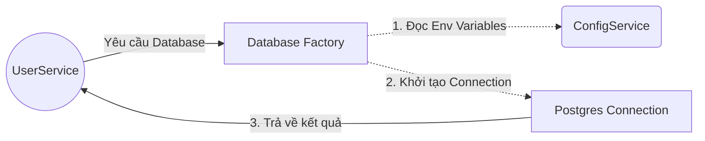

# OOP trong NestJS (Phần 6): Design Patterns

## Agenda

**Thời gian đọc ước tính:** ~20 phút

### Learning outcome:

- **Hiểu** được khái niệm Design Patterns và tại sao kiến trúc của NestJS lại được xây dựng chặt chẽ trên các mẫu chuẩn mực này thay vì cho phép lập trình viên tự do sáng tạo cấu trúc.
- **Giải thích** được cơ chế hoạt động của 4 Design Patterns cốt lõi làm nên sức mạnh của framework: Factory, Repository, Singleton và Decorator.
- **Tự tay** áp dụng Factory Pattern để thiết lập kết nối cơ sở dữ liệu động (Dynamic configuration) thông qua Dynamic Module.
- **Phân biệt** được các loại Scope (DEFAULT, REQUEST, TRANSIENT) trong Singleton Pattern và đánh giá được tác động của chúng đến hiệu suất (Performance) của ứng dụng.

---

## Glossary & Vocabulary

**1. Technical Terms (Thuật ngữ kỹ thuật):**

| Term                         | Vietnamese Meaning & Quick Explain                                                                                                                                                                                       |
| :--------------------------- | :----------------------------------------------------------------------------------------------------------------------------------------------------------------------------------------------------------------------- |
| **Design Pattern**     | Mẫu thiết kế phần mềm. Các giải pháp tổng quát, có thể tái sử dụng cho các vấn đề thường xuyên xảy ra trong thiết kế phần mềm.                                                                |
| **Factory Pattern**    | Mẫu thiết kế chuyên xử lý việc khởi tạo đối tượng. Thuộc nhóm Khởi tạo (Creational), dùng để tạo ra các đối tượng mà không cần chỉ định rõ lớp (Class) cụ thể nào sẽ được tạo. |
| **Repository Pattern** | Mẫu thiết kế quản lý truy cập dữ liệu. Thuộc nhóm Kiến trúc, đóng vai trò làm cầu nối giữa tầng logic nghiệp vụ và tầng truy cập dữ liệu (Database).                                          |
| **Singleton Pattern**  | Mẫu thiết kế đảm bảo một thực thể duy nhất. Thuộc nhóm Khởi tạo, đảm bảo một Class chỉ có duy nhất một phiên bản (Instance) được tạo ra trong toàn bộ vòng đời ứng dụng.              |

**2. Vocabulary Support (Từ vựng học thuật/B1+):**

| Word                         | Meaning in Context (Nghĩa trong ngữ cảnh)                                                                                                                     |
| :--------------------------- | :--------------------------------------------------------------------------------------------------------------------------------------------------------------- |
| **Dynamic Module (n)** | Mô-đun động. Cấu trúc trong NestJS cho phép cấu hình Module tại thời điểm chạy (Runtime) thông qua các phương thức tĩnh như `register()`. |
| **Overhead (n)**       | Chi phí phát sinh. Sự tiêu tốn thêm tài nguyên (bộ nhớ, CPU) hoặc thời gian xử lý do một cơ chế nào đó mang lại.                            |
| **Scope (n)**          | Phạm vi vòng đời. Xác định một đối tượng sẽ tồn tại bao lâu và được chia sẻ như thế nào trong hệ thống.                                |

---

## 1. WHY — Tại Sao Cần Design Patterns?

Khi xây dựng các ứng dụng phía máy chủ (Backend), lập trình viên Node.js (đặc biệt là người dùng Express.js) thường phải đối mặt với các "bài toán lặp lại" (Common problems):

- Làm sao để quản lý hàng tá kết nối đến Database mà không bị rò rỉ bộ nhớ (Memory leak)?
- Làm sao để tách biệt logic xử lý nghiệp vụ (Business logic) khỏi các câu lệnh truy vấn SQL thô cứng?
- Làm sao để cấu hình các module của bên thứ ba (như Redis, Stripe) tùy theo môi trường (Dev/Stag/Prod)?

Express.js cung cấp sự tự do tuyệt đối, dẫn đến việc mỗi dự án, mỗi công ty lại có một cách giải quyết khác nhau. Khi một thành viên mới tham gia vào dự án, họ phải tốn rất nhiều thời gian để hiểu được kiến trúc tự chế của team (Custom architecture).

NestJS giải quyết triệt để sự hỗn loạn này bằng cách **ép buộc** (Opinionated) ứng dụng phải tuân theo các Design Patterns chuẩn mực của ngành kỹ nghệ phần mềm. Bằng cách sử dụng một "ngôn ngữ chung" (Common vocabulary) như Factory hay Repository, mọi lập trình viên trên thế giới đều có thể đọc hiểu mã nguồn NestJS của nhau một cách dễ dàng.

---

## 2. WHAT & HOW — 4 Patterns Cốt Lõi Trong NestJS

### 2.1. Factory Pattern

**Definition Anatomy (Giải phẫu định nghĩa):**

- **Creational** (*Khởi tạo*): Mục đích chính của nó là tạo ra đối tượng.
- **Hide Logic** (*Che giấu logic*): Ẩn đi quá trình khởi tạo phức tạp (ví dụ: cần đọc file config, gọi API lấy khóa bí mật) để Client không cần bận tâm.

**Trực quan hóa:**



**Cách NestJS áp dụng (Dynamic Module & `useFactory`):**

Trong NestJS, Factory Pattern thường xuất hiện thông qua các mô-đun động (Dynamic Modules). Hãy xem cách chúng ta cấu hình cơ sở dữ liệu tùy thuộc vào biến môi trường:

```typescript
// filename: src/database/database.module.ts
import { Module, DynamicModule, Global } from '@nestjs/common';
import { ConfigService } from '@nestjs/config';
import { DataSource } from 'typeorm';

@Global()
@Module({})
export class DatabaseModule {
  // Phương thức tĩnh đóng vai trò như một Factory Method
  static register(): DynamicModule {
    return {
      module: DatabaseModule,
      providers: [
        {
          provide: 'DATA_SOURCE',
          // Sử dụng useFactory để ẩn giấu logic khởi tạo phức tạp
          useFactory: async (configService: ConfigService) => {
            const dataSource = new DataSource({
              type: 'postgres',
              host: configService.get<string>('DB_HOST'),
              port: configService.get<number>('DB_PORT'),
              // ... các cấu hình khác
            });
      
            // Xử lý bất đồng bộ trước khi trả về đối tượng
            return dataSource.initialize();
          },
          inject: [ConfigService], // Tiêm các phụ thuộc cần thiết cho Factory
        },
      ],
      exports: ['DATA_SOURCE'],
    };
  }
}
```

Việc sử dụng phương thức `register()` hoặc `forRoot()` chính là cách NestJS triển khai Factory Pattern ở cấp độ Module.

### 2.2. Repository Pattern

**Definition Anatomy:**

- **Data Access** (*Truy cập dữ liệu*): Đóng gói toàn bộ logic tương tác với cơ sở dữ liệu.
- **Abstraction** (*Trừu tượng hóa*): Đóng vai trò là một bộ sưu tập (Collection) các đối tượng trong bộ nhớ, giúp che giấu đi sự khác biệt của các loại DB (SQL vs NoSQL).

**Cách NestJS áp dụng (TypeORM/Mongoose):**

Nếu bạn nhúng trực tiếp SQL vào Controller hoặc Service, hệ thống của bạn đã vi phạm Single Responsibility Principle (SRP). Repository Pattern tách phần này ra.

```typescript
// filename: src/users/user.service.ts
import { Injectable } from '@nestjs/common';
import { InjectRepository } from '@nestjs/typeorm';
import { Repository } from 'typeorm';
import { UserEntity } from './user.entity';

@Injectable()
export class UserService {
  constructor(
    // InjectRepository chính là việc gọi lấy một kho chứa đã được khởi tạo sẵn
    @InjectRepository(UserEntity)
    private readonly userRepository: Repository<UserEntity>,
  ) {}

  async findActiveUsers() {
    // Service chỉ quan tâm đến logic nghiệp vụ, không cần viết câu lệnh SQL
    return this.userRepository.find({ where: { isActive: true } });
  }
}
```

Bằng cách dùng Repository, ngày mai nếu bạn chuyển từ Postgres sang MySQL, hàm `findActiveUsers()` hoàn toàn không cần phải sửa một dòng code nào.

### 2.3. Singleton Pattern

**Definition Anatomy:**

- **Single Instance** (*Thực thể duy nhất*): Đảm bảo rằng chỉ có đúng 1 đối tượng được tạo ra từ Class.
- **Global Access** (*Truy cập toàn cục*): Cung cấp một điểm truy cập duy nhất đến đối tượng đó từ mọi nơi.

**Cách NestJS áp dụng (Scopes):**

Theo mặc định, **tất cả** các Provider trong NestJS (bao gồm Controllers, Services, Repositories) đều là Singleton. NestJS IoC Container sẽ khởi tạo chúng một lần duy nhất lúc ứng dụng bắt đầu (Bootstrap), lưu vào bộ nhớ đệm (Cache), và chia sẻ (Share) đối tượng đó cho mọi Request.

Tuy nhiên, có những trường hợp bạn cần một vòng đời (Lifecycle) khác. NestJS cung cấp 3 loại Scope:

| Scope               | Ký hiệu           | Cơ chế hoạt động                                                                                                                                                                                                            |
| ------------------- | ------------------- | -------------------------------------------------------------------------------------------------------------------------------------------------------------------------------------------------------------------------------- |
| **DEFAULT**   | `Scope.DEFAULT`   | (Mặc định). Một đối tượng duy nhất dùng chung cho toàn bộ ứng dụng. Tối ưu nhất về hiệu năng.                                                                                                                |
| **REQUEST**   | `Scope.REQUEST`   | Tạo một đối tượng**mới hoàn toàn** cho mỗi lượt yêu cầu (HTTP Request) đến. Bị hủy bỏ sau khi Request xử lý xong. Dùng khi cần lưu trữ thông tin nhạy cảm theo từng user (ví dụ: tenantId). |
| **TRANSIENT** | `Scope.TRANSIENT` | Tạo một đối tượng mới mỗi khi có một class khác yêu cầu inject nó. Không chia sẻ đối tượng. Rất ít khi được sử dụng.                                                                                  |

**Cách khai báo Scope:**

```typescript
// filename: src/analytics/analytics.service.ts
import { Injectable, Scope, Inject } from '@nestjs/common';
import { REQUEST } from '@nestjs/core';
import { Request } from 'express';

// Chuyển sang REQUEST scope
@Injectable({ scope: Scope.REQUEST })
export class AnalyticsService {
  constructor(@Inject(REQUEST) private request: Request) {}

  logAction() {
    // Mỗi request sẽ có một AnalyticsService riêng với Request object riêng
    console.log(`Action called by IP: ${this.request.ip}`);
  }
}
```

> ⚠️ **[QUAN TRỌNG] Performance Warning từ Official Docs:**
> *"Using request-scoped providers will have an impact on application performance... it is strongly recommended that you use the default singleton scope."*
> → Cơ chế `REQUEST` scope buộc NestJS phải sử dụng bộ thu gom rác (Garbage Collector) liên tục vì hàng ngàn đối tượng mới được sinh ra rồi chết đi mỗi giây. Theo tài liệu chính thức, việc lạm dụng REQUEST scope có thể làm giảm ~5% hiệu năng (Latency) của ứng dụng.
>
> **Tuyệt đối KHÔNG DÙNG REQUEST scope cho**: WebSocket Gateways, Passport Strategies, Cron controllers — vì các cơ chế này không hoạt động theo mô hình Request/Response truyền thống và bắt buộc phải là Singleton. (Chi tiết xem tại [Injection Scopes](https://docs.nestjs.com/fundamentals/injection-scopes) và tính năng Durable Providers cho multi-tenant).

### 2.4. Decorator Pattern

**Definition Anatomy:**

- **Structural** (*Kiểu cấu trúc*): Cung cấp cách lắp ráp các đối tượng.
- **Extend Behavior** (*Mở rộng hành vi*): Cho phép thêm các chức năng mới (Logging, Validation, Auth) vào một đối tượng mà không thay đổi cấu trúc mã nguồn bên trong của đối tượng đó.

NestJS "sống sót" dựa trên Decorator. Khi bạn viết `@Controller('users')` hay `@Injectable()`, bạn đang áp dụng Decorator Pattern để cung cấp thêm siêu dữ liệu (Metadata) cho Class, giúp IoC Container biết cách kết nối chúng lại với nhau (Đã trình bày rất chi tiết ở Phần 2).

---

## 4. Discussion Questions

1. **Về Anti-Pattern của Singleton:** Singleton giải quyết được vấn đề rò rỉ bộ nhớ (Memory leak) vì nó chỉ tạo 1 đối tượng. Tuy nhiên, nếu bạn khai báo một mảng `private cachedData = []` bên trong một Service (vốn là Singleton) và liên tục `push` dữ liệu vào đó qua mỗi Request mà không dọn dẹp, điều gì sẽ xảy ra với RAM của máy chủ? Đây có phải là một Anti-Pattern không?
2. **Về Factory vs Constructor:** Thay vì viết hàm `useFactory` cực kỳ rườm rà trong Module, tại sao chúng ta không nhét tất cả logic đọc biến môi trường (Config) vào luôn bên trong hàm `constructor()` của Class? Trade-off (sự đánh đổi) giữa hai cách làm này liên quan gì đến nguyên tắc Single Responsibility Principle (SRP) đã học ở phần trước?
3. **Về Khả năng Thay thế (Substitutability):** Repository Pattern giúp chúng ta dễ dàng thay đổi Database. Theo bạn, trong thực tế các dự án Enterprise, tỷ lệ một công ty đang chạy quyết định đổi từ MySQL sang MongoDB (hoặc ngược lại) là bao nhiêu phần trăm? Nếu tỷ lệ này cực thấp (gần bằng 0), tại sao người ta vẫn khuyên nên dùng Repository Pattern?

---

*Made by Anh Tu - Share to be share*
