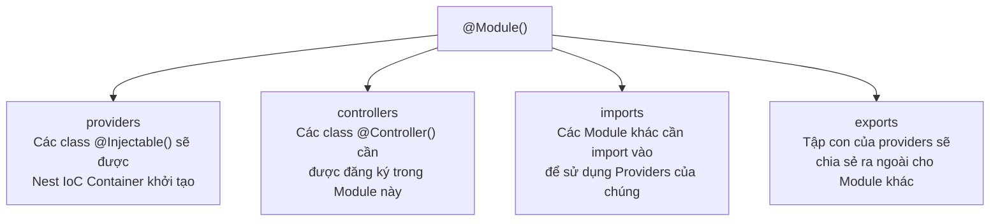

# [NestJS] Modules: Kiến Trúc Mô-đun Hóa (Feature, Shared & Global)

<!--truncate-->

## Agenda

**Thời gian đọc ước tính:** ~12 phút

### Learning outcome:
- **Hiểu** được tại sao NestJS yêu cầu mọi thành phần phải thuộc về một Module và vai trò của "Application Graph".
- **Giải phẫu** được 4 thuộc tính cốt lõi của `@Module()` decorator: `providers`, `controllers`, `imports`, `exports`.
- **Tự tay** tổ chức codebase thành các Feature Modules và Shared Modules để tái sử dụng Providers.
- **Phân biệt** được khi nào nên dùng Global Module (`@Global()`) và khi nào không nên.

---

## Glossary & Vocabulary

**1. Technical Terms (Thuật ngữ kỹ thuật):**
| Term | Vietnamese Meaning & Quick Explain |
| :--- | :--- |
| **Module** | Mô-đun. Một đơn vị tổ chức code, nhóm các Controllers, Providers có liên quan đến cùng một tính năng (feature). |
| **Application Graph** | Đồ thị ứng dụng. Cấu trúc nội bộ NestJS dùng để phân tích và giải quyết các quan hệ phụ thuộc giữa Modules và Providers. |
| **Feature Module** | Module tính năng. Một Module đóng gói một tập hợp logic nghiệp vụ riêng biệt (ví dụ: `UsersModule`, `CatsModule`). |
| **Shared Module** | Module dùng chung. Một Module export Providers của mình để các Module khác có thể import và tái sử dụng. |

**2. Vocabulary Support (Từ vựng học thuật/B1+):**
| Word | Meaning in Context (Nghĩa trong ngữ cảnh) |
| :--- | :--- |
| **Encapsulate (v)** | Đóng gói. Giữ kín các chi tiết bên trong, chỉ để lộ những gì cần thiết ra ngoài. |
| **Ubiquitous (adj)** | Có mặt khắp nơi, vô sở bất tại. Dùng để mô tả một thứ có thể truy cập từ bất kỳ đâu. |
| **Boilerplate (n)** | Code mẫu lặp đi lặp lại, không đóng góp nhiều vào logic nghiệp vụ chính. |

---

## 1. WHY — Tại sao cần Module?

Trong Express.js thuần túy, không có khái niệm tổ chức code bắt buộc. Kết quả là khi ứng dụng phình to, mọi thứ dễ dàng biến thành một đống hỗn độn — gọi là "Spaghetti Architecture".

**Vấn đề cụ thể khi thiếu Module hóa:**
1. **Không có ranh giới rõ ràng:** Logic xử lý User, Products, Orders bị lẫn lộn trong cùng một folder. Khi cần sửa tính năng Orders, developer phải dò tìm qua hàng trăm file không liên quan.
2. **Khó tái sử dụng:** Nếu `AuthService` cần dùng ở nhiều chỗ, bạn phải tự `require` nó ở mọi nơi và tự quản lý instance — rất dễ dẫn đến nhiều instance của cùng một Service, gây ra state inconsistency (*không nhất quán về trạng thái*).
3. **Khó kiểm thử (Unit Test):** Không có ranh giới Module, khó biết được phạm vi (scope) của một tính năng là bao nhiêu để mock đúng.

**Giải pháp của NestJS:** Hệ thống Module bắt buộc. Mỗi `@Module()` là một hợp đồng rõ ràng: "Tôi cung cấp (providers) những gì, tôi cần nhập (imports) những gì từ bên ngoài, và tôi chia sẻ (exports) những gì cho người khác". NestJS dùng thông tin này để xây dựng **Application Graph** — một bản đồ phụ thuộc nội bộ để khởi tạo và wire up toàn bộ ứng dụng một cách chính xác.

---

## 2. WHAT — Module là gì?

### 2.1. Định nghĩa kỹ thuật

Module (*Mô-đun*) là một class được gắn decorator `@Module()`, cung cấp metadata để Nest tổ chức và quản lý cấu trúc ứng dụng hiệu quả.


### 2.2. Definition Anatomy — Giải phẫu `@Module()` decorator

`@Module()` nhận vào một object với 4 thuộc tính:



| Thuộc tính | Mô tả |
| :--- | :--- |
| **`providers`** | Các class `@Injectable()` được Nest IoC Container quản lý, có thể được inject trong phạm vi Module này. |
| **`controllers`** | Các Controller cần được đăng ký trong Module để Nest mount các Route. |
| **`imports`** | Danh sách các Module khác mà Module này phụ thuộc vào (để dùng Providers từ chúng). |
| **`exports`** | Tập con của `providers` được "public hóa" — chỉ những Provider được export mới có thể dùng được ở Module khác. |

---

## 3. HOW — Làm chủ các kiểu Module

### 3.1. Feature Module (Tổ chức theo tính năng)

Nguyên tắc: Mỗi domain nghiệp vụ có một Module riêng. Đây là cấu trúc chuẩn theo SOLID — mỗi Module có Trách nhiệm duy nhất (Single Responsibility).

```
src/
├── cats/
│   ├── cats.controller.ts
│   ├── cats.service.ts
│   └── cats.module.ts      <-- Feature Module
└── app.module.ts           <-- Root Module
```

```typescript
// filename: src/cats/cats.module.ts
import { Module } from '@nestjs/common';
import { CatsController } from './cats.controller';
import { CatsService } from './cats.service';

@Module({
  controllers: [CatsController],
  providers: [CatsService],
  // Không có exports → CatsService chỉ dùng được trong Module này
})
export class CatsModule {}
```

Sau khi tạo Feature Module, phải đăng ký nó vào Root Module để Nest nhận diện:

```typescript
// filename: src/app.module.ts
import { Module } from '@nestjs/common';
import { CatsModule } from './cats/cats.module';

@Module({
  imports: [CatsModule], // Khai báo để NestJS biết CatsModule tồn tại
})
export class AppModule {}
```

### 3.2. Shared Module (Dùng chung Providers)

Mặc định, Modules là Singleton (*thực thể đơn*) — NestJS chỉ tạo một instance duy nhất cho mỗi Module và chia sẻ nó. Nhưng để một Provider từ Module này được dùng ở Module khác, bạn phải **export** nó.


Ví dụ: Nhiều Module (Orders, Products) đều cần `CatsService`:

```typescript
// filename: src/cats/cats.module.ts
import { Module } from '@nestjs/common';
import { CatsController } from './cats.controller';
import { CatsService } from './cats.service';

@Module({
  controllers: [CatsController],
  providers: [CatsService],
  exports: [CatsService], // Bước bắt buộc: Public hóa CatsService
})
export class CatsModule {}
```

Giờ đây, bất kỳ Module nào import `CatsModule` đều có thể inject `CatsService`:

```typescript
// filename: src/orders/orders.module.ts
import { Module } from '@nestjs/common';
import { CatsModule } from '../cats/cats.module';
import { OrdersService } from './orders.service';

@Module({
  imports: [CatsModule], // Import toàn bộ CatsModule để lấy CatsService đã được export
  providers: [OrdersService],
})
export class OrdersModule {}
```

**Lợi ích quan trọng:** Vì Module là Singleton, cả `OrdersModule` và `ProductsModule` đều import `CatsModule` nhưng sẽ **dùng chung một instance** `CatsService` duy nhất. Điều này tiết kiệm bộ nhớ và đảm bảo tính nhất quán về trạng thái (state consistency).

### 3.3. Module Re-exporting (Tái xuất Module)

Một Module có thể re-export (*tái xuất*) một Module mà nó đã import — cơ chế này hữu ích khi xây dựng một `CoreModule` hoặc `SharedModule` tập trung:

```typescript
// filename: src/core/core.module.ts
@Module({
  imports: [CommonModule],
  exports: [CommonModule], // Re-export: Ai import CoreModule là có CommonModule luôn
})
export class CoreModule {}
```

### 3.4. Global Module — và khi nào KHÔNG nên dùng

`@Global()` decorator biến một Module thành global (*toàn cục*) — các Providers được export từ nó sẽ có sẵn trong toàn bộ ứng dụng mà không cần phải import lại.

```typescript
// filename: src/database/database.module.ts
import { Module, Global } from '@nestjs/common';

@Global() // Khai báo trước @Module()
@Module({
  providers: [DatabaseService],
  exports: [DatabaseService],
})
export class DatabaseModule {}
```

**Sau khi đăng ký một lần ở Root Module, mọi Module khác đều có thể inject `DatabaseService` mà không cần import `DatabaseModule`.**

**Trade-off quan trọng:**

| Lợi ích | Đánh đổi |
| :--- | :--- |
| Loại bỏ boilerplate code (không phải import ở khắp nơi) | Làm mờ đi sự phụ thuộc — đọc code không biết Provider đến từ đâu |
| Tiện lợi cho các Infrastructure Service (DB, Config, Logger) | Tăng coupling (*sự phụ thuộc*) giữa các Module — khó test độc lập |

> Nguyên tắc vàng: Chỉ dùng `@Global()` cho những Provider mang tính **Infrastructure** (Database Connection, Configuration, Logger toàn cục). Tuyệt đối không dùng cho Business Service.

### 3.5. Dynamic Module (Giới thiệu)

Dynamic Modules (*Module động*) cho phép tạo Module có thể cấu hình tại Runtime — thường được dùng cho các thư viện như `ConfigModule`, `TypeOrmModule`. Ví dụ điển hình:

```typescript
// Cách dùng Dynamic Module
@Module({
  imports: [DatabaseModule.forRoot([UserEntity, ProductEntity])],
})
export class AppModule {}
```

Cơ chế này phức tạp và cần một bài riêng để phân tích sâu. Toàn bộ kiến trúc Dynamic Module sẽ được trình bày chi tiết trong module **03-core-fundamentals**.

---

## 4. Discussion Questions

Hãy thử suy luận và trả lời các câu hỏi sau để kiểm tra mức độ nắm bắt kiến thức:

1. **Encapsulation Rule:** Nếu `CatsModule` khai báo `CatsService` trong `providers` nhưng **không** khai báo nó trong `exports`, và `OrdersModule` import `CatsModule`, thì `OrdersService` có inject được `CatsService` không? Điều gì sẽ xảy ra khi bạn thử?
2. **Singleton & State:** Hai Module A và B cùng import `SharedModule`. `SharedModule` export `CounterService` có một thuộc tính `count = 0`. Nếu Module A tăng `count` lên 5, thì Module B đọc `count` sẽ ra giá trị bao nhiêu? Tại sao? Kết quả này phản ánh điều gì về kiến trúc NestJS?
3. **Global vs Import:** Khi nào bạn sẽ chọn cách đăng ký Global Module (`@Global()`) thay vì yêu cầu mỗi Module tự import? Liệt kê 2-3 ví dụ thực tế từ các dự án Node.js bạn biết.

---

## References

- Tài liệu chính thức NestJS - [Modules](https://docs.nestjs.com/modules)
- Bài tiếp theo: Controllers — Cổng tiếp nhận Request

---

*Made by Anh Tu - Share to be share*
